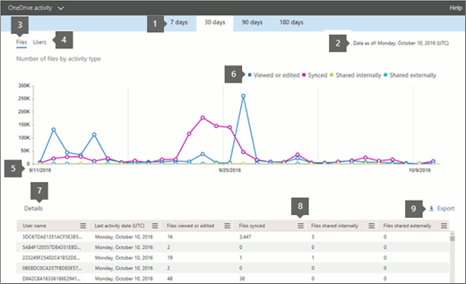

# 管理センターの Microsoft 365 レポート-OneDrive for Business アクティビティ

Microsoft 365 **Reports** dashboard には、組織内の製品全体にわたるアクティビティの概要が表示されます。 これにより、個別の製品レベルのレポートを詳細に確認して、各製品内のアクティビティについてより詳しく知ることができます。 [レポートの概要トピック](activity-reports.md)を参照してください。
  
たとえば、OneDrive でのファイルの操作を調べることで、OneDrive を使用するライセンスを持つすべてのユーザーのアクティビティを把握できます。また、共有されているファイルの数を調べると、行われているコラボレーションのレベルを把握できます。
  
> [!NOTE]
> 一部の機能は徐々に導入されます。つまり、この機能はまだ表示されない場合があります。または、このヘルプ記事で説明されている機能とは異なって見える場合があります。ただし、ご心配はいりません。まもなくご利用になれます。 
  
各 OneDrive アカウントに対するアクティビティの量と記憶域の使用率を把握する場合は、[OneDrive 利用状況レポート](onedrive-for-business-usage.md)を使用できます。
  
> [!NOTE]
> レポートを表示するには、Microsoft 365 または Exchange、SharePoint、Teams サービス、Teams 通信、または Skype for Business 管理者のグローバル管理者、グローバル閲覧者またはレポート閲覧者である必要があります。  
 
## OneDrive アクティビティ レポートの作成方法

1. 管理センターで、[**レポート**] \> [<a href="https://go.microsoft.com/fwlink/p/?linkid=2074756" target="_blank">使用状況</a>] ページの順に移動します。

    
2. **[レポートの選択**] ドロップダウンから [ **OneDrive** \> **アクティビティ**] を選択します。
  
## OneDrive for Business アクティビティ レポートの解釈

OneDrive for Business のアクティビティは、[ **ファイル** ] ビューと [ **ユーザー** ] ビューを見るとわかります。 
  

  
|||
|:-----|:-----|
|1.    |**OneDrive for Business アクティビティ** レポートでは、過去 7 日間、30 日間、90 日間、または 180 日間の傾向を確認できます。 ただし、レポートで特定の日を選択すると、表 (7) には、(レポートが生成された日付ではなく) 現在の日付から最大 28 日間のデータが表示されます。    |
|2.    |各レポートのデータは、通常、過去 24 - 48 時間まで表示されます。  |
|3.    |[ **ファイル**] ビューを見ると、OneDrive アカウントでファイル操作を実行したライセンス ユーザーの数がわかります。    |
|4.    |[ **ユーザー**] ビューを見ると、アクティブな OneDrive ユーザーの数の傾向がわかります。アクティブなユーザーとは、特定の期間内にファイル アクティビティ (保存、同期、変更、共有) を実行したユーザーです。    注: ファイルアクティビティは1つのファイルに対して複数回発生することがありますが、1つのアクティブなファイルとしてカウントされます。 たとえば、一定の期間に複数回、同じファイルを保存して同期することができますが、データには単独のアクティブなファイルと、単独の同期されたファイルとしてカウントされます。           |
|5.    | [ **ファイル**] グラフの Y 軸は、ユーザーが保存、同期、変更、または共有した個別のファイルの数です。     [ **ユーザー**] グラフの Y 軸は、OneDrive アカウントでファイルの操作 (保存、同期、変更、共有) を実行した個別のユーザーの数です。     すべてのグラフで、X 軸はこの特定のレポートに対して選択した日付範囲です。    |
|6.    |凡例の項目を選択して、グラフに表示する系列をフィルター処理できます。 たとえば、[**ファイル**] グラフで [**表示または編集**または**同期**] を選択すると、それぞれに関連する情報のみが表示されます。 この選択を変更しても、グリッド テーブルの情報は変更されません。    |
|7.    | テーブルには、ユーザー レベルでのデータの内訳が表示されます。 テーブルの列は追加または削除できます。      **Username**は、OneDrive アカウントの所有者のユーザー名です。    [ **最後のアクティビティの日付 (UTC)**] は、選択した期間内で、ファイル アクティビティが OneDrive アカウントで最後に実行された日付です。特定の日付に発生したアクティビティを表示するには、直接グラフ内の日付を選択します。         これにより、特定の日にアクティビティを実行したユーザーのファイルアクティビティデータのみを表示するようにテーブルがフィルター処理されます。    [ **表示または編集されたファイル** ] は、ユーザーがアップロード、ダウンロード、変更、または表示したファイルの数です。    [ **同期されたファイル**] は、ユーザーのローカル デバイスから OneDrive アカウントに同期されたファイルの数です。    [**内部共有ファイル**] は、組織内のユーザーによって共有されているファイル、またはグループ内のユーザー (外部ユーザーが含まれる可能性があります) によって共有されているファイルの数です。    [ **外部共有ファイル**] は、組織外のユーザーとの間で共有されているファイルの数です。    [ **削除済み**] は、ユーザーのライセンスが削除されたことを示します。    注: 削除されたユーザーのアクティビティは、選択した期間中にライセンスされていた場合に限り、レポートに表示されたままになります。 [ **削除済み** ] 列は、アクティブではない状態になったユーザーが引き続きレポート内のデータに影響している可能性に注意するのに役立ちます。 [ **削除済みの日付**] は、ユーザーのライセンスが削除された日付です。    **割り当てら**れている製品は、ユーザーにライセンスされている Microsoft 365 製品です。     ユーザー情報を特定できるレポートの閲覧が組織のポリシーで禁止されている場合は、これらすべてのレポートのプライバシー設定を変更できます。 「**Microsoft 365 管理センターのアクティビティ レポート**」の「[ユーザー レベルの詳細を非表示にする方法](activity-reports.md)」セクションを参照してください。    |
|8.    |[列の**管理**] 選択して、レポートの列を追加または削除します。    |
|9.    |**エクスポート**リンクを選択して、レポートデータを Excel の .csv ファイルにエクスポートすることもできます。 これにより、すべてのユーザーのデータがエクスポートされ、単純な並べ替えとフィルター処理を行ってさらに分析することができます。 ユーザー数が 2000 未満である場合は、レポート自体のテーブル内で並べ替えとフィルター処理を行うことができます。 ユーザー数が 2000 を超える場合は、フィルター処理と並べ替えを行うために、データをエクスポートする必要があります。    |
|||
   

