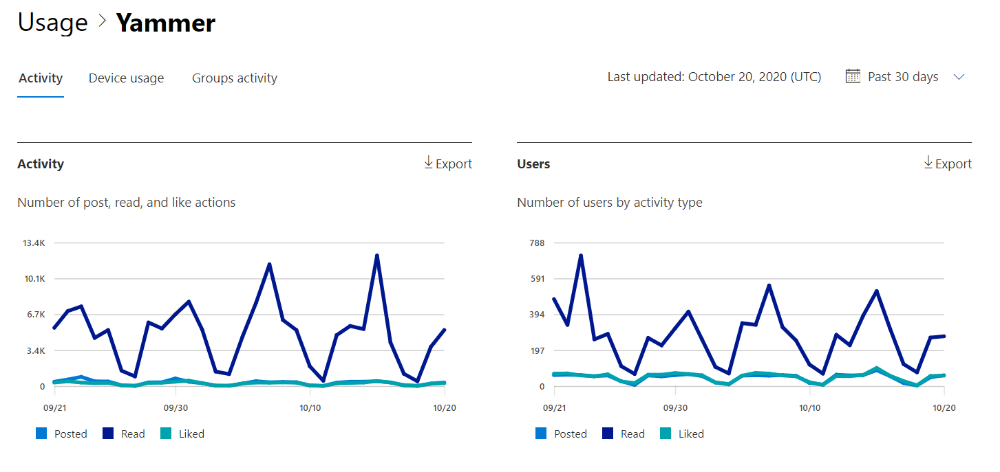

# 管理センターでの Microsoft 365 レポート-Yammer アクティビティレポート

Microsoft 365 admin として、 **レポート** ダッシュボードには、組織内の製品の使用状況に関するデータが表示されます。 [管理センターのアクティビティレポートを](activity-reports.md)チェックアウトします。 **Yammer アクティビティ レポート** では、Yammer を使用してメッセージの投稿、「いいね!」の評価、または閲覧を行った一意のユーザー数や、組織全体で生成されたアクティビティの量を確認することで、Yammer に対する組織の関与レベルを把握することができます。 
  
> [!NOTE]
> レポートを表示するには、Microsoft 365 または Exchange、SharePoint、Teams サービス、Teams 通信、または Skype for Business 管理者のグローバル管理者、グローバル閲覧者またはレポート閲覧者である必要があります。  
 
## Yammer アクティビティレポートを取得するにはどうすればよいですか?

1. 管理センターで、[ **レポート** ] \> [ <a href="https://go.microsoft.com/fwlink/p/?linkid=2074756" target="_blank">使用状況</a>] ページの順に移動します。 
2. ダッシュボードのホームページから、Yammer カードの [ **詳細表示** ] ボタンをクリックします。

  
## Yammer のアクティビティ レポートの内容を理解する

[ **アクティビティ** ] タブを選択すると、Yammer レポートでアクティビティを表示できます。 

レポートに列を追加または削除するには、[ **列の選択** ] を選択します。    

また、[ **エクスポート** ] リンクを選択して、レポート データを Excel の .csv ファイルにエクスポートすることもできます。 これにより、すべてのユーザーのデータがエクスポートされ、単純な並べ替えとフィルター処理を行ってさらに分析することができます。 ユーザー数が 2000 未満である場合は、レポート自体のテーブル内で並べ替えとフィルター処理を行うことができます。 ユーザー数が 2000 を超える場合は、フィルター処理と並べ替えを行うために、データをエクスポートする必要があります。 
  
|アイテム|説明|
|:-----|:-----|
|**測定基準**|**定義**|
|ユーザー名    |ユーザーの電子メール アドレス。 実際のメール アドレスを表示することも、このフィールドを匿名にすることもできます。 このグリッドには、Microsoft 365 アカウントを使用して Yammer にログインしたユーザー、またはシングルサインオンを使用してネットワークにログインしたユーザーが表示されます。   |
|表示名    |ユーザーの完全な名前。 実際のメール アドレスを表示することも、このフィールドを匿名にすることもできます。    |
|ユーザーの状態    |アクティブ、削除済み、または中断の3つの値のいずれか。 これらのレポートには、アクティブ、中断、および削除されたユーザーのデータが表示されます。 保留中のユーザーは、メッセージの投稿、開封、またはそのような操作ができないため、保留中のユーザーは反映されません。    |
|状態変更日付 (UTC)    |Yammer でユーザーの都道府県が変更された日付。    |
|最後のアクティビティの日付 (UTC)    | ユーザーがメッセージを投稿、閲覧、または好評とした最後の日付。    |
|投稿    |指定した期間中にユーザーが投稿したメッセージの数。  |
|読み取り    |指定した期間中にユーザーが読んだ会話の数。    |
|いいね!    |指定した期間中にユーザーが賛同したメッセージの数。   |
|割り当てられた製品    |このユーザーに割り当てられている製品。|
|||