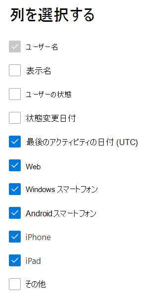

# 管理センターの Microsoft 365 レポート-Yammer デバイスの使用状況レポート

Microsoft 365 **Reports** dashboard には、組織内の製品全体にわたるアクティビティの概要が表示されます。 これにより、個別の製品レベルのレポートを詳細に確認して、各製品内のアクティビティについてより詳しく知ることができます。 [レポートの概要に関するトピック](activity-reports.md)を参照してください。
  
Yammer デバイスの使用状況レポートでは、ユーザーが Yammer を使用しているデバイスについての情報を示します。デバイスの種類別に毎日使用するユーザー数を表示したり、デバイスの種類別にユーザー数を表示したりします。どちらも選択した期間で表示できます。また、ユーザーごとの詳細を表示することもできます。
  
> [!NOTE]
> レポートを表示するには、Microsoft 365 または Exchange、SharePoint、Teams サービス、Teams 通信、または Skype for Business 管理者のグローバル管理者、グローバル閲覧者またはレポート閲覧者である必要があります。  
 
## Yammer デバイスの使用状況レポートの作成方法

1. 管理センターで、[ **レポート** ] \> [ <a href="https://go.microsoft.com/fwlink/p/?linkid=2074756" target="_blank">使用状況</a>] ページの順に移動します。 
2. ダッシュボードのホームページから、Yammer カードの [ **詳細表示** ] ボタンをクリックします。
  
## Yammer デバイスの使用状況レポートを解釈する

OneDrive レポートでの使用状況を表示するには、[ **デバイスの使用状況** ] タブを選択します。 

レポートに列を追加または削除するには、[ **列の選択** ] を選択します。    

また、[ **エクスポート** ] リンクを選択して、レポート データを Excel の .csv ファイルにエクスポートすることもできます。 これにより、すべてのユーザーのデータがエクスポートされ、単純な並べ替えとフィルター処理を行ってさらに分析することができます。 ユーザー数が 2000 未満である場合は、レポート自体のテーブル内で並べ替えとフィルター処理を行うことができます。 ユーザー数が 2000 を超える場合は、フィルター処理と並べ替えを行うために、データをエクスポートする必要があります。 
  
|アイテム|説明|
|:-----|:-----|
|**測定基準**|**定義**|
|ユーザー名    |ユーザーの電子メール アドレス。 実際のメール アドレスを表示することも、このフィールドを匿名にすることもできます。 このグリッドには、Microsoft 365 アカウントを使用して Yammer にログインしたユーザー、またはシングルサインオンを使用してネットワークにログインしたユーザーが表示されます。   |
|表示名    |ユーザーの完全な名前。 実際のメール アドレスを表示することも、このフィールドを匿名にすることもできます。    |
|ユーザーの状態    |アクティブ、削除済み、または中断の3つの値のいずれか。 これらのレポートには、アクティブ、中断、および削除されたユーザーのデータが表示されます。 保留中のユーザーは、メッセージの投稿、開封、またはそのような操作ができないため、保留中のユーザーは反映されません。     |
|状態変更日付 (UTC)    |Yammer でユーザーの都道府県が変更された日付。    |
|最後のアクティビティの日付 (UTC)    |ユーザーが Yammer アクティビティに参加した最後の日付 (UTC)。    |
|Web    |ユーザーが web 上で Yammer を使用したかどうかを示します。    |
|Windows phone    | ユーザーが Windows phone で Yammer を使用したかどうかを示します。    |
|Android スマートフォン    |ユーザーが Android 電話で Yammer を使用したかどうかを示します。  |
|iphone   | ユーザーが iPhone で Yammer を使用したかどうかを示します。    |
|ipad    |ユーザーが iPad で Yammer を使用したかどうかを示します。  |
|も    |ユーザーが別のデバイスで Yammer を使用しているかどうかを示します (前述のリストには含まれていません)。  |
|||