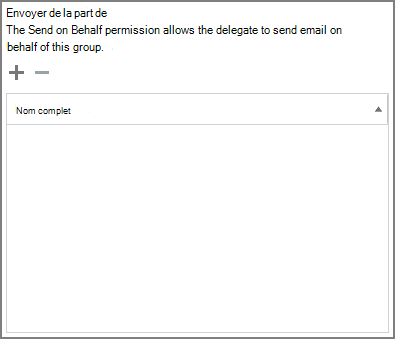

# メンバーがグループに代わって送信または送信できるようにする

送信者または**代理人****と**して送信するアクセス許可が付与されている Office 365 グループのメンバーは、グループとして、またはグループの代わりにメールを送信できます。 このトピックでは、管理者がこれらのアクセス許可を設定する方法について説明します。
  
たとえば、Megan Bowen が**トレーニング**Office 365 グループの一部であり、グループに対して**送信**者アクセス許可を持っている場合、グループとしてメールを送信すると、その電子メールを送信した**トレーニング**グループのように表示されます。 
  
**[代理送信**] アクセス許可を使用すると、ユーザーは Office 365 グループに代わって電子メールを送信できます。 たとえば、Alex が**マーケティング**Office 365 グループに含まれていて、**代理人**として送信するアクセス許可を持ち、グループとして電子メールを送信する場合、電子メールは、**マーケティングの代理**として Alex によって送信されたように見えます。

> [!IMPORTANT]
> 特定のユーザーに対し**て [送信**] または **[代理送信**] を構成できますが、両方を構成することはできません。 両方を構成した場合、既定では**として送信**されます。

> [!TIP]
> Outlook および Outlook on the Web を使用してグループからメールを送信する方法について[は、「Office 365 グループの代理でメールを送信](https://support.office.com/article/0f4964af-aec6-484b-a65c-0434df8cdb6b.aspx)する」を参照してください。
    
## メンバーがグループとしてメールを送信できるようにする

このセクションでは、exchange Online の[exchange 管理センター](https://go.microsoft.com/fwlink/p/?linkid=2059104) (EAC) でユーザーがグループとしてメールを送信できるようにする方法について説明します。
  
1. <a href="https://go.microsoft.com/fwlink/p/?linkid=2059104" target="_blank">Exchange 管理センター</a> で、[**受信者**]、[**グループ**] の順に移動します。
    
2. ユーザーが送信者とし](../../media/0cfcb590-dc51-4b4f-9276-bb2ce300d87e.png)て送信できるようにするグループの [編集グループの編集] アイコンを選択します。 **Edit**![   
    
3. [ **グループ委任**] を選びます。
    
4. [**送信**] セクションで、グループと**+** して送信するユーザーを追加するための署名を選択します。 
    
    
  
5. ユーザーを入力して検索するか、一覧からユーザーを選択します。 [ **OK]** を選択して、**保存**します。
    
    
  
## メンバーがグループに代わって電子メールを送信することを許可する

このセクションでは、exchange Online の Exchange 管理センター (EAC) で、ユーザーがグループに代わって電子メールを送信できるようにする方法について説明します。
  
1. <a href="https://go.microsoft.com/fwlink/p/?linkid=2059104" target="_blank">Exchange 管理センター</a> で、[**受信者**]、[**グループ**] の順に移動します。
    
2. ユーザーが送信者とし](../../media/0cfcb590-dc51-4b4f-9276-bb2ce300d87e.png)て送信できるようにするグループの [編集グループ**の編集] アイコンを選択し**ます。 ![ 
    
3. [ **グループ委任**] を選びます。
    
4. [代理人として送信する] **+** セクションで、グループとして送信するユーザーを追加するための署名を選択します。 
    
    
  
5. ユーザーを入力して検索するか、一覧からユーザーを選択します。 [ **OK]** を選択して、**保存**します。
    
    

## 関連記事

[Office 365 グループの詳細について](https://support.office.com/article/3f780e8e-61aa-4287-830d-ff6209cbc192.aspx)

[[受信者の追加] アクセス許可](https://go.microsoft.com/fwlink/p/?LinkId=723960)

[Set-UnifiedGroup](https://go.microsoft.com/fwlink/p/?LinkId=616189)
