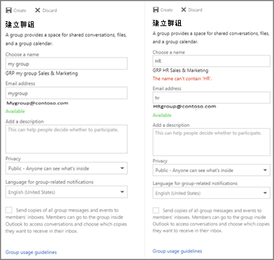
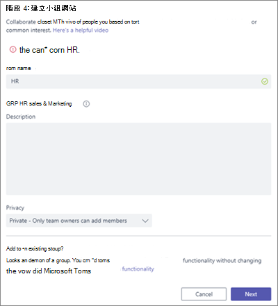
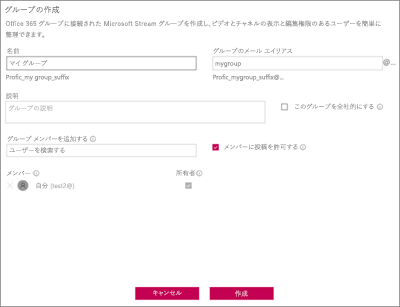

# Office 365 グループの名前付けポリシーOffice 365 Groups naming policy

グループの名前付けポリシーを使用して、組織内のユーザーによって作成されたグループに一貫した名前付け戦略を適用します。You use a group naming policy to enforce a consistent naming strategy for groups created by users in your organization. 名前付けポリシーにより、お客様とユーザーがグループの機能、メンバーシップ、地域、グループの作成者を特定できるようになります。A naming policy can help you and your users identify the function of the group, membership, geographic region, or who created the group. 名前付けポリシーは、アドレス帳のグループの分類にも役立ちます。The naming policy can also help categorize groups in the address book. ポリシーを使用して、特定の単語をグループの名前やエイリアスで使われないようにブロックすることができます。You can use the policy to block specific words from being used in group names and aliases.

名前付けポリシーは、すべてのグループのワークロード (Outlook、Microsoft Teams、SharePoint、Planner、Yammer など) で作成されたグループに適用されます。グループ名とグループのエイリアスのどちらにも適用されます。名前付けポリシーは、ユーザーによるグループの作成時、または既存のグループのグループ名やエイリアスの編集時に適用されます。The naming policy is applied to groups that are created across all groups workloads (like Outlook, Microsoft Teams, SharePoint, Planner, Yammer, etc). It gets applied to both the group name and group alias. It gets applied when a user creates a group and when group name or alias is edited for an existing group.

> [!TIP]
> Office 365 グループの名前付けポリシーは Office 365 グループにのみ適用されます。An Office 365 group naming policy only applies to Office 365 Groups. Exchange Online で作成された配布グループには適用されません。It doesn't apply to distribution groups created in Exchange Online. 配布グループの名前付けポリシーを作成するには、「[配布グループ名前付けポリシーを作成](https://docs.microsoft.com/exchange/recipients-in-exchange-online/manage-distribution-groups/create-group-naming-policy)する」を参照してください。To create a naming policy for distribution groups, see [Create a distribution group naming policy](https://docs.microsoft.com/exchange/recipients-in-exchange-online/manage-distribution-groups/create-group-naming-policy).

グループの名前付けポリシーは、次の機能で構成されています。The group naming policy consists of the following features:

- **プレフィックス/サフィックスの名前付けポリシー**: グループの名前付け規則を定義するには、プレフィックスまたはサフィックスを使用\_でき\_ます (\_例: "GRP US My Group Engineering")。**Prefix-Suffix naming policy**: You can use prefixes or suffixes to define the naming convention of groups (for example: "GRP\_US\_My Group\_Engineering"). プレフィックス/サフィックスは、固定文字列、またはグループを作成しているユーザーに基づいて置換される [Department] などのユーザー属性のいずれかにすることができます。The prefixes/suffixes can either be fixed strings or user attributes like [Department] that will get substituted based on the user who is creating the group.

- ユーザー**設定のブロック**された単語: 組織に固有で、ユーザーが作成したグループでブロックされるブロックされる単語のセットをアップロードできます。**Custom Blocked Words**: You can upload a set of blocked words specific to their organization that would be blocked in groups created by users. (例: "CEO, Payroll, HR")。(For example: "CEO, Payroll, HR").

## ライセンス要件Licensing requirements

Office 365 グループに Azure AD の名前付けポリシーを使用するには、1つ以上の Office 365 グループのメンバーである一意のユーザー (ゲストを含む) ごとに、Azure Active Directory Premium P1 ライセンスまたは Azure AD Basic EDU ライセンスが割り当てられている必要はありません。Using Azure AD naming policy for Office 365 groups requires that you possess but not necessarily assign an Azure Active Directory Premium P1 license or Azure AD Basic EDU license for each unique user (including guests) that is a member of one or more Office 365 groups.
これは、グループの名前付けポリシーを作成する管理者にも必要になります。This is also required for the administrator that creates the Groups naming policy.

## プレフィックスサフィックスの名前付けポリシーPrefix-Suffix naming policy

プレフィックスとサフィックスは、固定文字列またはユーザー属性のいずれかにすることができます。Prefixes and suffixes can either be fixed strings or user attributes.

### 固定文字列Fixed strings

短い文字列を使って、GAL およびグループのワークロードの左のナビゲーションでグループを区別するのに役立てることができます。You can use short strings that can help you differentiate groups in the GAL and Left nav of the group workloads. 一般的なプレフィックスのサフィックスには、' Grp\_Name '、'\#name '、'\_name ' などのキーワードがあります。Some of the common prefixes suffixes are Keywords like 'Grp\_Name' , '\#Name', '\_Name'

### 属性Attributes

属性を使って、[Department] のようにグループを作成したユーザー、および [Country] のように作成された場所を識別するのに役立てることができます。You can use attributes that can help identify who created the group like [Department] and where it was created from like [Country].

|||
|:-----|:-----|
|**例****Examples**|Policy = "GRP [GroupName] [Department]"Policy = "GRP [GroupName] [Department]"|
||User's department = EngineeringUser's department = Engineering|
||Created group name = "GRP My Group Engineering"Created group name = "GRP My Group Engineering"|

サポートされている Azure Active Directory (Azure AD) 属性は [部署]、[会社]、[Office]、[StateOrProvince]、[CountryOrRegion]、[Title]Supported Azure Active Directory (Azure AD) attributes are [Department], [Company], [Office], [StateOrProvince], [CountryOrRegion], [Title]

- サポートされていないユーザー属性は、固定文字列と見なされます。例: "[postalCode]"Unsupported user attributes are considered as fixed strings. E.g. "[postalCode]"

- 拡張属性とカスタム属性はサポートされません。Extension attributes and custom attributes aren't supported.

組織のすべてのユーザーに対して、値が設定された属性を使用することをお勧めします。長い値が設定された属性は使用しないでください。It's recommended that you use attributes that have values filled in for all users in your organization and don't use attributes that have longer values.

### 次の項目を参照してください。Things to look out for

- ポリシーを作成するときは、プレフィックスとサフィックスの合計文字数は 53 文字に制限されます。During policy creation, the total prefixes and suffixes string length is restricted to 53 characters.

- プレフィックスとサフィックスには、グループ名とグループのエイリアスでサポートされている特殊文字を含めることができます。プレフィックスとサフィックスに、グループのエイリアスで許可されていない特殊文字が含まれている場合は、それらは削除されてグループのエイリアスに適用されます。そのため、この場合は、グループ名に適用されているプレフィックスとサフィックスは、グループのエイリアスに適用されているものとは異なります。Prefixes and suffixes can contain special characters supported in group name and group alias. When the prefixes and suffixes contain special characters that are not allowed in the group alias, they are removed and applied to the group alias. So in this case, the prefixes and suffixes applied to group name would be different from the ones applied to the group alias.

- Yammer Office 365 に接続されたグループを使用している場合は、名前付けポリシーで、 \#@ \[、 \]、 \<、、 \>、およびの文字を使用しないでください。If you are using Yammer Office 365 connected groups, avoid using the following characters in your naming policy: @, \#, \[, \], \<, and \>. これらの文字が名前付けポリシーに含まれている場合、正規の Yammer ユーザーはグループを作成できません。If these characters are in the naming policy, regular Yammer users will not be able to create groups.

## ユーザー設定のブロックされた単語Custom blocked words

ブロックされた単語のリストをコンマ区切りで入力できます。これは、グループの名前とエイリアスでブロックされます。You can enter a comma separated list of blocked words that will be blocked in group names and aliases.

ブロックされた単語チェックは、ユーザーが入力したグループ名に対して実行されます。The blocked words check is done on the user entered group name. このため、ユーザーが ' darnit ' と '\_prefix ' を入力すると、名前\_付けポリシーになります。 ' prefix darnit ' は失敗します。So if user enters 'darnit' and 'Prefix\_' is the naming policy, 'Prefix\_darnit' will fail.

サブ文字列検索は実行されません。具体的には、エラーを発生させるには、ユーザーが入力した名前とカスタムのブロックされた単語が完全に一致している必要があります。No sub-string searches are carried out; specifically, an exact match between the user entered name and the custom blocked words is required to trigger a failure. サブ文字列の検索は行われないので、ユーザーは ' 「をブロックする」の単語であっても、' Class ' のような一般的な単語を使用することができます。Sub-string search isn't done so that users can use some of the common words like 'Class' even if 'ass' is a blocked word.

次**の点に注目して**ください。**Things to look out for**:

- ブロックする単語は、大文字と小文字を区別します。The blocked words are case-insensitive.

- ユーザーがブロックする単語を入力すると、グループ クライアントによって、ブロックされた単語を含むエラー メッセージが表示されます。When a user enters a blocked word, the group client will show an error message with the blocked word.

- ブロックする単語で使用する文字に制限はありません。There are no character restrictions in the blocked words used.

- ブロックする単語として設定できる、上限は5000単語に制限されています。There is an upper limit of 5000 words that can be set as blocked words.

## 管理者による上書きAdmin override

管理者はブロックする単語と必要な名前付け規則を使ってグループを作成できるように、選択された管理者は、これらのポリシー、すべてのグループのワークロードおよびエンドポイントの適用から除外されます。グループの名前付けポリシーの適用から除外される管理者の役割リストは次のとおりです。Selective administrators are exempted from these policies, across all group workloads and endpoints, so that they can create groups with these blocked words and with their desired naming conventions. The following are the list of administrator roles exempted from the group naming policy.

- 全体管理者Global admin

- パートナー レベル 1 のサポートPartner Tier 1 Support

- パートナー レベル 2 のサポートPartner Tier 2 Support

- ユーザー アカウント管理者User account admin

- ディレクトリ製作者Directory writers

## 名前付けポリシーをセットアップする方法How to set up the naming policy

名前付けポリシーをセットアップするには、次のようにします。To set up a naming policy:

1. [Azure Active Directory](https://aad.portal.azure.com)の [**管理**] で、[**グループ**] をクリックします。In [Azure Active Directory](https://aad.portal.azure.com), under **Manage**, click **Groups**.
2. [**設定**] の [**名前付けポリシー**] をクリックします。Under **Settings**, click **Naming policy**.
3. [**グループの名前付けポリシー** ] タブを選択します。Choose the **Group naming policy** tab.
4. [**現在のポリシー**] で、プレフィックスかサフィックス、あるいはその両方を要求するかどうかを選択し、適切なチェックボックスをオンにします。Under **Current policy**, choose if you want to require a prefix or suffix or both, and select the appropriate check boxes.
5. 各行の**属性**と**文字列**を選択してから、属性または文字列を指定します。Choose between **Attribute** and **String** for each line and then specify the attribute or string.
6. 必要なプレフィックスとサフィックスを追加したら、[**保存**] をクリックします。When you have added the prefixes and suffixes that you need, click **Save**.

## Office 365 アプリ全体の名前付けポリシーの操作環境Naming policy experiences across Office 365 apps

ユーザーがグループの名前とエイリアスを入力すると、Office 365 アプリが更新され、(プレフィックスとサフィックスと共に) 名前付けポリシーのグループ名のプレビューが表示されます。ユーザーがブロックされた単語を入力すると、ブロックされた単語を削除できるように、エラー メッセージが表示されます。The Office 365 apps have been updated to show a preview of the naming policy group name (with prefixes and suffixes) when the user types in the group name and alias. When the user enters blocked words, they'll see an error message so they can remove the blocked words.

## Outlook on the webOutlook on the web

Web 上の outlook (旧称: Outlook Web App または OWA) は、ユーザーがグループ名またはグループエイリアスを入力したときに表示される名前付けポリシーの装飾名を示しています。Outlook on the web (formerly known as Outlook Web App or OWA) shows the naming policy decorated name when the user types a group name or group alias. ユーザーがカスタムのブロックする単語を入力すると、ユーザーがその単語を削除できるように、エラー メッセージがブロックされた単語と共に UI に表示されます。When an user enters a custom blocked word, an error message is shown in the UI along with the blocked word so that the user can remove it. Outlook on the web experience のスナップショットを次に示します。Outlook on the web experience snapshots are shown below.

## Outlook デスクトップOutlook Desktop

Outlook デスクトップで作成されたグループは、名前付けポリシーに準拠しています。Groups created in Outlook desktop are compliant with naming policy. Outlook デスクトップアプリは、まだ名前付けポリシーのプレビューを表示せず、ユーザーがグループ名を入力したときに、ユーザー設定のブロックされた word エラーを返しません。Outlook desktop app doesn't yet show the preview of the naming policy and doesn't return the custom blocked word errors, when the user enters the group name. ただし、グループ名またはエイリアスにユーザー設定のブロックされた単語がある場合、[作成/編集] を選択すると名前付けポリシーが自動的に適用され、ユーザーにエラーが表示されます。However, naming policy will be automatically applied on selecting create/edit and users will be presented with errors if there are custom blocked words in the group name or alias.

## Microsoft TeamsMicrosoft Teams

ユーザーがチーム名を入力すると、Microsoft Teams に名前付けポリシーを修飾した名前が表示されます。ユーザーがカスタムのブロックする単語を入力すると、ユーザーがその単語を削除できるように、エラー メッセージがブロックされた単語と共に表示されます。Microsoft Teams shows the naming policy decorated name when the user types a team name. When a user enters a custom blocked word, an error message is shown along with the blocked word so that the user can remove it.

## SharePointSharePoint

ユーザーがサイト名またはグループの電子メールアドレスを入力すると、SharePoint によって名前付けポリシー名が表示されます。SharePoint shows the naming policy name when the user types a site name or group email address. ユーザーがカスタムのブロックする単語を入力すると、ユーザーがその単語を削除できるように、エラー メッセージがブロックされた単語と共に表示されます。When an user enters a custom blocked word, an error message is shown, along with the blocked word so that the user can remove it.

## Microsoft StreamMicrosoft Stream

ユーザーがグループ名またはグループのエイリアスを入力すると、Microsoft Stream で名前付けポリシーを修飾した名前が表示されます。ユーザーがカスタムのブロックする単語を入力すると、ユーザーがその単語を削除できるように、エラー メッセージがブロックされた単語と共に表示されます。Microsoft Stream shows the naming policy decorated name when the user types a group name or group email alias. When an user enters a custom blocked word, an error message is shown with the blocked word so the user can remove it.

## iOS と Android の Outlook アプリOutlook iOS and Android App

Outlook アプリで作成されたグループは、名前付けポリシーに準拠しています。Groups created in Outlook apps are compliant with naming policy. Outlook mobile では、グループ名を入力するときに名前付けポリシーのプレビューが表示されます。Outlook mobile shows the naming policy preview when entering the Group name. ユーザーがカスタムのブロックされた単語を入力すると、グループの作成時にエラーメッセージが表示され、ユーザーはブロックされた単語を削除できるようになります。When a user enters a custom blocked word, an error message is shown on creating the group, so the user can remove the blocked word.

## PlannerPlanner

Planner は、名前付けポリシーに準拠します。Planner is compliant with naming policy. Planner には、プラン名を入力するときの名前付けポリシーのプレビューが表示されます。Planner shows the naming policy preview when entering the Plan name. ユーザーがカスタムのブロックされた単語を入力すると、プランを作成するときにエラーメッセージが表示されるので、ユーザーはブロックされた単語を削除できます。When a user enters a custom blocked word, an error message is shown on creating the plan, so the user can remove the blocked word.

## 顧客契約のための Dynamics 365Dynamics 365 for Customer Engagement

顧客契約の Dynamics 365 は、名前付けポリシーに準拠しています。Dynamics 365 for Customer Engagement is compliant with naming policy. Dynamics 365 は、ユーザーがグループ名またはグループの電子メールエイリアスを入力したときに表示される名前付けポリシーの装飾名を示しています。Dynamics 365 shows the naming policy decorated name when the user types a group name or group email alias. ユーザーがカスタムのブロックされた単語を入力すると、ユーザーが削除できるように、エラーメッセージがブロックされた単語と共に表示されます。When the user enters a custom blocked word, an error message is shown with the blocked word so the user can remove it.

## School Data Sync (SDS)School Data Sync (SDS)

SDS を使って作成されたグループは名前付けポリシーに準拠しますが、名前付けポリシーは自動的に適用されません。SDS 管理者は、グループを作成する必要があるクラス名にプレフィックスとサフィックスを追加し、SDS にアップロードする必要があります。それ以外の場合は、グループの作成または編集は失敗します。Groups created through SDS comply with naming policy, but the naming policy isn't applied automatically. SDS administrators have to append the prefixes and suffixes to class names for which groups need to be created and then upload to SDS. Groups creation/edit would fail otherwise.

## Outlook カスタマーマネージャー (OCM)Outlook Customer Manager (OCM)

Outlook カスタマーマネージャーは、名前付けポリシーに準拠しています。Outlook Customer Manager is compliant with naming policy. 名前付けポリシーは、Outlook カスタマーマネージャーで作成したグループに自動的に適用されます。The naming policy gets automatically applied to the group created in Outlook Customer Manager. 「すべての営業チーム」内の単語のいずれかがカスタムのブロックされた単語として定義されている場合、OCM でのグループの作成はブロックされます。If any of the words within "All Sales Team" is defined as a custom blocked word, the group creation in OCM will be blocked. ユーザーは OCM グループを作成できなくなり、OCM アプリの使用が禁止されます。 "The user will not be able to create the OCM group and will be blocked from using the OCM app."

## Classroom アプリClassroom App

Classroom アプリで作成されたグループは、名前付けポリシーに準拠しますが、名前付けポリシーが自動的に適用されるわけではありません。また、名前付けポリシーのプレビューは、教室グループの名前を入力するときにユーザーに表示されません。そのため、ユーザーはプレフィックスとサフィックスで修飾された教室グループ名を入力する必要があります。それ以外の場合、教室グループの作成または編集は失敗し、エラーが表示されます。Groups created in classroom app comply with naming policy, but the naming policy isn't applied automatically, and the naming policy preview isn't shown to the users while entering a classroom group name. So users would have to enter the decorated classroom group name with prefixes and suffixes. Otherwise the classroom group create or edit will fail with errors.

## Power BIPower BI

Power BI ワークスペースで作成されたグループは、名前付けポリシーに準拠していますが、名前付けポリシーは自動的には適用されません。Groups created in Power BI workspaces comply with the naming policy, but the naming policy isn't applied automatically. また、ユーザーが Power BI ワークスペース名を入力するときに、名前付けポリシーのプレビューは表示されません。And, the naming policy preview isn't shown to users when they enter a Power BI workspace name.

推奨される名前 (名前付けポリシーを適用済み) は、「create or edit workspace」のエラーの詳細に示されています。The recommended name - with the naming policy applied - is shown in the error details on create or edit workspaces. これは、ユーザーが、修飾されたワークスペース名にプレフィックスとサフィックスを入力する必要があることを意味します。This means users have to enter the decorated workspace name with prefixes and suffixes. それ以外の場合、ワークスペースの作成または編集はエラーが発生して失敗します。Otherwise the workspace create or edit will fail with errors.

## YammerYammer

ユーザーが Azure Active Directory アカウントを使用して Yammer にサインインすると、グループが作成されるか、グループ名が編集されると、グループ名は名前付けポリシーに準拠します。When a user signed in to Yammer with their Azure Active Directory account creates a group or edits a group name, the group name will comply with naming policy. これは、Office 365 接続グループとその他すべての Yammer グループに適用されます。This applies both to Office 365 connected groups and all other Yammer groups.

名前付けポリシーが設定される前に Office 365 接続グループを作成した場合、グループ名は自動的に命名ポリシーに従いません。If an Office 365 connected group was created before the naming policy is in place, the group name will not automatically follow the naming policies. ユーザーがグループ名を編集すると、プレフィックスとサフィックスを追加するように求めるメッセージが表示されます。When a user edits the group name, they will be prompted to add the prefix and suffix.

名前付けポリシーに Yammer グループ名にできない文字が含まれている場合、管理者のみが Yammer に接続されたグループを作成できます。If the naming policy includes characters that can't be in Yammer group names, only admins will be able to create a connected group in Yammer.

## StaffHubStaffHub

StaffHub teams は、名前付けポリシーに従いませんが、基礎となる Office 365 グループになります。StaffHub teams do not follow the naming policy, but the underlying Office 365 group does. StaffHub チーム名は、プレフィックスとサフィックスを適用せず、カスタムのブロックされた単語をチェックしません。StaffHub team name does not apply the prefixes and suffixes and does not check for custom blocked words. ただし、StaffHub はプレフィックスとサフィックスを適用し、基になる Office 365 グループからブロックされた単語を削除します。But StaffHub does apply the prefixes and suffixes and removes blocked words from the underlying Office 365 group.

## Exchange PowerShellExchange PowerShell

Exchange PowerShell コマンドレットは、名前付けポリシーに準拠します。名前付け規則がグループの名前とグループのエイリアスで使用されない場合、ユーザーは候補のプレフィックスとサフィックスを含む、カスタムのブロックする単語に対する適切なエラー メッセージを受け取ります。Exchange PowerShell cmdlets are compliant with naming policy. Users will get appropriate error messages with suggested prefixes and suffixes and for custom blocked words if naming convention isn't used in the group names and group alias.

## Azure Active Directory PowerShell コマンドレットAzure Active Directory PowerShell cmdlets

Azure Active Directory PowerShell コマンドレットは、名前付けポリシーに準拠しています。Azure Active Directory PowerShell cmdlets are compliant with naming policy. 名前付け規則がグループの名前とグループのエイリアスで使用されない場合、ユーザーは候補のプレフィックスとサフィックスを含む、カスタムのブロックする単語に対する適切なエラー メッセージを受け取ります。Users will get appropriate error messages with suggested prefixes and suffixes and for custom blocked words if naming convention isn't used in the group names and group alias.

## Exchange 管理センターExchange admin center

Exchange 管理センター (EAC) は、名前付けポリシーに準拠しています。The Exchange admin center (EAC) is compliant with naming policy. 作成または編集のアクションでは、名前付け規則がグループの名前とグループのエイリアスで使用されない場合、ユーザーは候補のプレフィックスとサフィックスを含む、カスタムのブロックする単語に対する適切なエラー メッセージを受け取ります。On create or edit actions, users will get appropriate error messages with suggested prefixes and suffixes and for custom blocked words if naming convention isn't used in the group names and group alias.

## Microsoft 365 管理センターMicrosoft 365 admin center

Microsoft 365 管理センターは、名前付けポリシーに準拠しています。The Microsoft 365 admin center is compliant with naming policy. [アクションの作成または編集] では、名前付けポリシーが自動的に適用されます。On create or edit actions, naming policy will automatically get applied. ユーザーがカスタムのブロックする単語を入力すると、適切なエラーが表示されます。Users will get appropriate errors when they enter custom blocked words. Microsoft 365 管理センターでは、名前付けポリシーのプレビューは表示されず、ユーザーがグループ名を入力したときに、ユーザー設定のブロックされた word エラーは返されません。The Microsoft 365 admin center doesn't yet show the preview of the naming policy and doesn't return the custom blocked word errors, when the user enters the group name.

## Azure Active Directory ポータルAzure Active Directory portal

Azure Active Directory ポータルは、名前付けポリシーに準拠しています。The Azure Active Directory portal is compliant with naming policy. Azure Active Directory ポータルには、グループ名を入力するときの名前付けポリシーのプレビューが表示されます。Azure Active Directory portal shows the naming policy preview when entering the Group name. ユーザーがカスタムのブロックされた単語を入力すると、グループの作成時にエラーメッセージが表示され、ユーザーはブロックされた単語を削除できるようになります。When a user enters a custom blocked word, an error message is shown on creating the group, so the user can remove the blocked word.

## 名前付けポリシーに関するその他の記事More articles on naming policy

[Azure Active Directory での Office 365 グループの名前付けポリシーの強制Enforce a naming policy for Office 365 groups in Azure Active Directory](https://go.microsoft.com/fwlink/?linkid=868340)

[グループ設定を構成するための Azure Active Directory コマンドレットAzure Active Directory cmdlets for configuring group settings](https://go.microsoft.com/fwlink/?linkid=868341)
