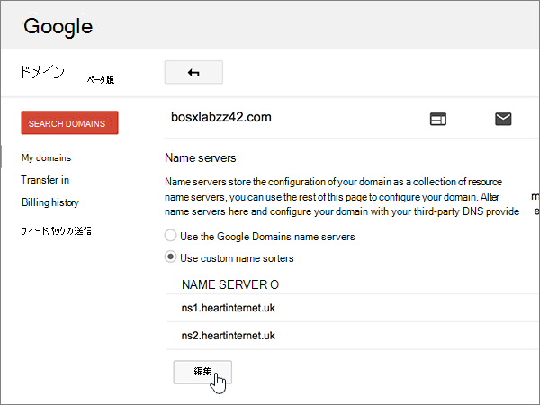

# Google Domains で Office 365 をセットアップするためにネームサーバーを変更する

 **探している内容が見つからない場合は、[ドメインに関する FAQ を確認](../setup/domains-faq.md)** してください。 
  
Office 365 に Office 365 DNS レコードを管理させる場合は、次の手順に従います ([Google Domains で Office 365 のすべての DNS レコードを管理することもできます](create-dns-records-at-google-domains.md))。
  
    
## 確認のための TXT レコードを追加する

Office 365 でドメインを使うには、ドメインを所有していることを確認する必要があります。自分のドメイン レジストラーで自分のアカウントにログインし、DNS レコードを作成することができれば、Office 365 に対してドメインを所有していることを確認することができます。
  
> [!NOTE]
>  このレコードは、ドメインを所有していることを確認するためだけに使用されます。その他には影響しません。 必要に応じて、後で削除することができます。 
  
1. 開始するには、[このリンク](https://domains.google.com/registrar)を使用して Google domains のドメインページにアクセスしてください。 You'll be prompted to sign in. To do so:
    
1. [**サインイン**] を選択します。
    
2. ログイン資格情報を入力して、もう一度 [**サインイン**] を選択します。
    
2. [ドメイン **] ページの**[**ドメイン**] セクションで、編集するドメインの [ **DNS の構成**] を選択します。 
    
3. In the **Custom resource records** section, in the boxes for the new record, type or copy and paste the values from the following table. 
    
    (You may have to scroll down.)
    
    (Choose the **Type** value from the drop-down list.) 
    
|||||
|:-----|:-----|:-----|:-----|
|**名前**   |**Type**   |**TTL**   |**Data**   |
|@    |TXT    |1H    |MS=ms *XXXXXXXX*   **注:** これは例です。 Office 365 の表から [**宛先またはポイント先のアドレス**] の値を指定してください。 [確認する方法](../get-help-with-domains/information-for-dns-records.md)          |
   
4. [**追加**] を選択します。
    
5. 数分待つと、続行できます。この間、作成したレコードがインターネット全体で更新されます。
    
これで、ドメイン レジストラーのサイトでレコードが追加されました。Office 365 に戻り、Office 365 にレコードの検索をリクエストします。
  
Office 365 で正しい TXT レコードが見つかった場合、ドメインは確認済みとなります。
  
1. 管理センターで、**[設定]** \> <a href="https://go.microsoft.com/fwlink/p/?linkid=834818" target="_blank">[ドメイン]</a> ページの順に移動します。

    
2. **[ドメイン]** ページで、確認するドメインを選択します。 
    
3. **[セットアップ]** ページで、**[セットアップの開始]** を選択します。
    
4. [**ドメインの確認**] ページで、[**確認**] を選択します。
    
> [!NOTE]
> 通常、DNS の変更が反映されるまでの時間は約 15 分です。ただし、インターネットの DNS システム全体を更新する変更の場合、さらに長くかかることもあります。DNS レコードの追加後にメール フローなどに問題が発生した場合は、「[Office 365 でドメインまたは DNS レコードを追加後に問題を特定して解決する](../get-help-with-domains/find-and-fix-issues.md)」を参照してください。 
  
## ドメインのネーム サーバー (NS) レコードを変更する

Office 365 でドメインをセットアップするには、Office 365 のプライマリ ネーム サーバーとセカンダリ ネーム サーバーを参照するように、ドメインの NS レコードをドメイン レジストラーで変更します。これで、ドメインの DNS レコードを更新するように Office 365 で設定されます。メール、Skype for Business Online、一般向け Web サイトをドメインで利用できるようにすべてのレコードを追加し、すべての設定を完了します。
  
> [!CAUTION]
> ドメインの NS レコードを Office 365 のネーム サーバーをポイントするように変更すると、現在ドメインに関連付けられているすべてのサービスが影響を受けます。 たとえば、ドメインに送信されるすべての電子メール (rob@ など*your_domain。*  この変更を行った後、com) は Office 365 に送られ始めます。 
  
> [!IMPORTANT]
> 次の手順では、他の不要なネームサーバーを一覧から削除する方法、および上記のネームサーバーが一覧に表示されていない場合に、正しいネームサーバーを追加する方法を説明します。 > このセクションの手順を完了すると、次の4つのネームサーバーのみが表示されます。 
  
1. まず、[このリンク](https://domains.google.com/registrar)を使って Google Domains でドメイン ページにアクセスします。 サインインするように求められます。 そのためには、次の操作を行います。
    
1. [**サインイン**] を選択します。
    
2. ログイン資格情報を入力してから、もう一度 [**サインイン**] を選択します。
    
2. [ドメイン **] ページの**[**ドメイン**] セクションで、編集するドメインの [ **DNS の構成**] を選択します。 
    
3. [ **ドメイン**] ページの [ **ネームサーバー**] セクションで、[ **カスタム ネームサーバーを使用**] を選びます。
    
    
  
4. 現在表示されているページに既に一覧表示されているネームサーバーがあるかどうかに応じて、以下の 2 つの手順のいずれかに進みます。
    
  - 既に一覧表示されているネーム サーバーが **ない** 場合は、 [既に一覧表示されているネームサーバーがない場合](#if-there-are-no-nameservers-already-listed)。
    
  - 既に一覧表示されているネーム サーバーが **ある** 場合は、 [既に一覧表示されているネームサーバーがある場合](#if-there-are-nameservers-already-listed)。
    
### 既に一覧表示されているネームサーバーがない場合

1. 最初のネームサーバーを追加します。
    
    [ **ネームサーバー**] セクションにある [ **ネームサーバー**] ボックスに、次の表の最初の値を入力するか、コピーして貼り付けます。 
    
|||
|:-----|:-----|
|**1 番目のネーム サーバー**   |ns1.bdm.microsoftonline.com    |
|**2 番目のネーム サーバー**   |ns2.bdm.microsoftonline.com    |
|**3 番目のネーム サーバー**   |ns3.bdm.microsoftonline.com    |
|**4 番目のネーム サーバー**   |ns4.bdm.microsoftonline.com    |
   
   
  
2. 空の行を作成するには、[ **+ (追加)** ] コントロールを選択します。 
    
    
  
3. 他の 3 つのネームサーバー レコードを追加します。
    
    [**カスタムの名前サーバーを使用**する] セクションで、表の次の行の値を使用してレコードを作成し、[ **+ (追加)** ] コントロールを選択して別の行を追加します。 
    
    4 つのネームサーバー レコードの作成がすべて完了するまで、このプロセスを繰り返します。
    
4. [**保存**] を選択します。
    
    
  
> [!NOTE]
> ネーム サーバー レコードの更新がインターネットの DNS システム全体に反映されるまでに、最大で数時間かかる場合があります。Office 365 のメールと他のサービスの準備が完了し、ドメインで利用できるようになります。 
  
### 既に一覧表示されているネームサーバーがある場合

1. 他のネームサーバーが表示されている場合は、[**編集**] を選択します。
    
    > [!CAUTION]
    > Follow these steps only if you have existing nameservers other than the four correct nameservers. (つまり、 **ns1.bdm.microsoftonline.com**、 **ns2.bdm.microsoftonline.com**、 **ns3.bdm.microsoftonline.com**、または**ns4.bdm.microsoftonline.com**という名前が付いて*いない*現在のネームサーバーのみを削除します)。 
  
    
  
2. ネームサーバーを選んで、キーボードの **Delete** キーを押して、1 つずつ削除します。 
    
    
  
3. [ **ネームサーバー**] セクションの [ **ネームサーバー**] 行に、次の表の値を入力するか、コピーして貼り付けます。 
    
|||
|:-----|:-----|
|**1 番目のネーム サーバー**   |ns1.bdm.microsoftonline.com    |
|**2 番目のネーム サーバー**   |ns2.bdm.microsoftonline.com    |
|**3 番目のネーム サーバー**   |ns3.bdm.microsoftonline.com    |
|**4 番目のネーム サーバー**   |ns4.bdm.microsoftonline.com    |
   
   
  
4. 空の行を作成するには、[ **+ (追加)** ] コントロールを選択します。 
    
    
  
5. 他の 2 つのネームサーバー レコードを追加します。
    
    [**カスタムの名前サーバーを使用**する] セクションで、表の次の行の値を使用してレコードを作成し、[ **+ (追加)** ] コントロールを選択して別の行を追加します。 
    
    4 つのネームサーバー レコードの作成がすべて完了するまで、このプロセスを繰り返します。
    
6. [**保存**] を選択します。
    
    
  
> [!NOTE]
> ネーム サーバー レコードの更新がインターネットの DNS システム全体に反映されるまでに、最大で数時間かかる場合があります。Office 365 のメールと他のサービスの準備が完了し、ドメインで利用できるようになります。 
  
