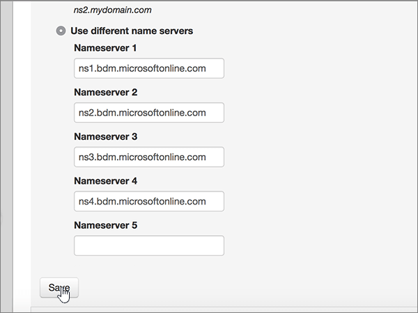

# MyDomain を使用して Microsoft をセットアップするためにネームサーバーを変更する

 探している内容が見つからない場合は、**[ドメインに関する FAQ を確認Q](../setup/domains-faq.md)** を参照してください。
  
Microsoft が DNS レコードを管理する場合は、次の手順に従ってください。 (必要に応じ [て、MyDomain にあるすべての MICROSOFT DNS レコードを管理](create-dns-records-at-mydomain.md)することができます)。
  
## 確認のための TXT レコードを追加する

Microsoft のドメインを使うには、ドメインを所有していることを確認する必要があります。自分のドメイン レジストラーで自分のアカウントにログインし、DNS レコードを作成することができれば、Microsoft に対してドメインを所有していることを確認することができます。
  
> [!NOTE]
> このレコードは、ドメインを所有していることを確認するためだけに使用されます。その他には影響しません。 必要に応じて、後で削除することができます。 
  
1. まず、[このリンク](https://www.mydomain.com/controlpanel)を使って MyDomain でドメイン ページにアクセスします。最初にログインするように求められます。
    
2. [**お気に入り**] セクションで、[**Domain Central**] を選択します。
    
3. [**ドメイン**] で、編集するドメインの名前を選択します。
    
4. [**概要**] 行で、[**DNS**] を選択します。
    
5. [**変更**] ドロップダウン リストから、[**TXT/SPF レコード**] を選択します。
    
6. [**Content**] の新規レコードのボックスに、次の表の値を入力するか、コピーして貼り付けます。
    
||
|:-----|
|**Content**   |
|MS=ms *XXXXXXXX*    **注**: これは例です。 この表から **[宛先またはポイント先のアドレス]** の値を指定してください。 [確認する方法](../get-help-with-domains/information-for-dns-records.md)          |
   
7. [**追加**] を選択します。
    
8. 数分待つと、続行できます。この間、作成したレコードがインターネット全体で更新されます。
    
これで、ドメイン レジストラーのサイトでレコードが追加されました。Microsoft 365 に戻り、Microsoft 365 にレコードの検索をリクエストします。
  
Microsoft で正しい TXT レコードが見つかった場合、ドメインは確認済みとなります。
  
1. Microsoft 管理センターで、**[設定]** \> <a href="https://go.microsoft.com/fwlink/p/?linkid=834818" target="_blank">[ドメイン]</a> ページの順に移動します。

    
2. **[ドメイン]** ページで、確認するドメインを選択します。 
    
3. **[セットアップ]** ページで、**[セットアップの開始]** を選択します。
    
4. **[ドメインの確認]** ページで、**[確認]** を選択します。
    
> [!NOTE]
> 通常、DNS の変更が反映されるまでの時間は約 15 分です。ただし、インターネットの DNS システム全体を更新する変更の場合、さらに長くかかることもあります。DNS レコードの追加後にメール フローなどに問題が発生した場合は、「[ドメインまたは DNS レコードを追加後に問題を特定して解決する](../get-help-with-domains/find-and-fix-issues.md)」を参照してください。 
  
## ドメインのネーム サーバー (NS) レコードを変更する

Microsoft によるドメインの設定を完了するには、ドメインレジストラーでドメインの NS レコードを変更して、Microsoft プライマリネームサーバーとセカンダリネームサーバーをポイントするようにします。 これにより、ドメインの DNS レコードが更新されるように Microsoft が設定されます。 メール、Skype for Business Online、一般向け Web サイトをドメインで利用できるようにすべてのレコードを追加し、すべての設定を完了します。
  
> [!CAUTION]
> ドメインの NS レコードを変更して Microsoft ネームサーバーをポイントすると、現在ドメインに関連付けられているすべてのサービスが影響を受けます。 たとえば、ドメインに送信されるすべての電子メール (rob@ など *your_domain。* この変更を行った後、com) は Microsoft に送られ始めます。 
  
> [!IMPORTANT]
> 次の手順では、他の不要なネームサーバーを一覧から削除する方法、および上記のネームサーバーが一覧に表示されていない場合に、正しいネームサーバーを追加する方法を説明します。  When you have completed the steps in this section, the only nameservers that should be listed are these four:
  
1. まず、[このリンク](https://www.mydomain.com/controlpanel)を使って MyDomain でドメイン ページにアクセスします。最初にログインするように求められます。
    
2. [**お気に入り**] セクションで、[**Domain Central**] を選択します。
    
3. [**ドメイン**] で、編集するドメインの名前を選択します。
    
4. **概要**行で、[**ネーム**サーバー] を選択します。
    
    
  
5. [ **Update Name Servers**] セクションで [ **Use different name servers**] を選びます。
    
    
  
6. 現在表示されているページに既にネームサーバーが表示されているかどうかに応じて、次の2つの手順のいずれかに進みます。
    
### 正しいネームサーバーが表示されている場合

- 正しいネームサーバーが表示されている場合は、この手順をスキップできます。
    
    
  
### 正しいネームサーバーが表示されていない場合

> [!CAUTION]
> Follow these steps only if you have existing nameservers other than the four correct nameservers. (つまり、 **ns1.bdm.microsoftonline.com**、 **ns2.bdm.microsoftonline.com**、 **ns3.bdm.microsoftonline.com**、または**ns4.bdm.microsoftonline.com**という名前が付いて*いない*現在のネームサーバーのみを削除します)。 
  
1. [ **Nameserver**] フィールドの各エントリを選び、キーボードの **Delete** キーを押して既存のネームサーバーを削除します。 
    
    
  
2. [ **追加** ] を2回選択して、2つの新しいネームサーバー行を追加します。 
    
    
  
3. レコードのボックスに、次の表の nameserver の値を入力するか、コピーして貼り付けます。
    
|||
|:-----|:-----|
|**Nameserver 1**   |ns1.bdm.microsoftonline.com    |
|**Nameserver 2**   |ns2.bdm.microsoftonline.com    |
|**Nameserver 3**   |ns3.bdm.microsoftonline.com    |
|**Nameserver 4**   |ns4.bdm.microsoftonline.com    |
   
   
  
4. **[保存]** を選択します。
    
    
  
> [!NOTE]
> ネーム サーバー レコードの更新がインターネットの DNS システム全体に反映されるまでに、最大で数時間かかる場合があります。 その後、自分のドメインで使用できるように、Microsoft メールとその他のサービスがすべて設定されます。 
