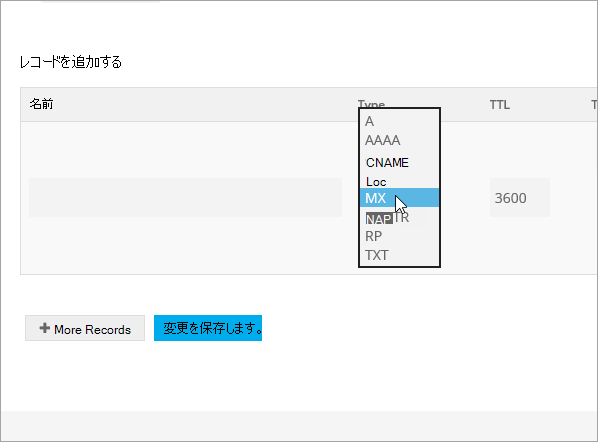
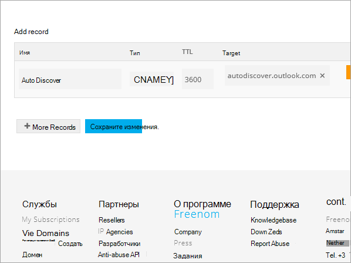
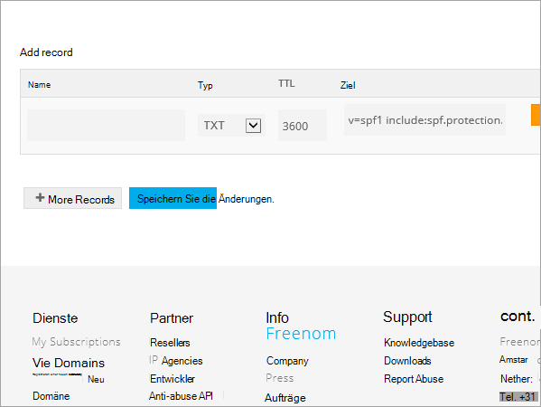

# Freenom で Office 365 用の DNS レコードを作成する

探している内容が見つからない場合は、[ドメインに関する FAQ](../setup/domains-faq.md) を確認してください。 
  
> [!CAUTION]
> Freenom の Web サイトでは、SRV レコードはサポートされません。つまり、Skype for Business Online と Outlook Web App のいくつかの機能は動作しません。どの Office 365 プランでも、かなりのサービスの制限事項があり、別の DNS ホスティング プロバイダーへの切り替えを考えることもあります。 
  
サービスの制限があっても、Freenom で Office 365 の DNS レコードを管理する場合は、この記事に示す手順に従って、ドメインを確認し、メールや他のサービスの DNS レコードを設定してください。
  
Office 365 での Web サイト向け Web ホスティングと DNS の詳細については、「[Office 365 でのパブリック Web サイトの使用](https://support.office.com/article/a8178510-501d-4bd8-9921-b04f2e9517a5.aspx)」を参照してください。
  
> [!NOTE]
> 通常、DNS の変更が有効になるのに 15 分ほどかかります。ただし、インターネットの DNS システム全体を更新する変更の場合、さらに長くかかることもあります。DNS レコードの追加でメール フローなどに問題が発生した場合は、「[ドメイン名または DNS レコードの変更後の問題に関するトラブルシューティング](../get-help-with-domains/find-and-fix-issues.md)」を参照してください。 
  
## 確認のための TXT レコードを追加する

Office 365 でドメインを使うには、ドメインを所有していることを確認する必要があります。自分のドメイン レジストラーで自分のアカウントにログインし、DNS レコードを作成することができれば、Office 365 に対してドメインを所有していることを確認することができます。
  
> [!NOTE]
> このレコードは、ドメインを所有していることを確認するためだけに使用されます。その他には影響しません。 必要に応じて、後で削除することができます。 
  
1. まず、[このリンク](https://my.freenom.com/)を使って Freenom のドメインページにアクセスします。 ログインするように求められます。
    
    
  
2. [**サービス**] を選択し、[**マイドメイン**] を選択します。
    
    
  
3. 編集するドメインの場合は、[ドメインの**管理**] を選択します。
    
    
  
4. [ **Manage Freenom DNS**] を選択します。
    
    
  
5. [ **Add Record** ] の [ **Type** ] 列でメニューから [ **TXT** ] を選びます。 
    
    
  
6. 新規レコードのボックスに、次の表の値を入力するか、コピーして貼り付けます。 
    
    |**名前**|**Type**|**TTL**|**Target**|
    |:-----|:-----|:-----|:-----|
    |(空白のまま)    |TXT    |3600 (秒)    |MS = msXXXXXXXX    **注:** これは例です。Office 365 の表から [ **宛先またはポイント先のアドレス** ] の値を指定してください。           [情報の取得方法](../get-help-with-domains/information-for-dns-records.md)          |
   
    
  
7. [ **Save Changes**] を選びます。
    
    
  
8. 数分待つと、続行できます。この間、作成したレコードがインターネット全体で更新されます。
    
これで、ドメイン レジストラーのサイトでレコードが追加されました。Office 365 に戻り、Office 365 にレコードの検索をリクエストします。
  
Office 365 で正しい TXT レコードが見つかった場合、ドメインは確認済みとなります。
  
1. 管理センターで、**[設定]** \> <a href="https://go.microsoft.com/fwlink/p/?linkid=834818" target="_blank">[ドメイン]</a> ページの順に移動します。

    
2. **[ドメイン]** ページで、確認するドメインを選択します。 
    
    
  
3. **[セットアップ]** ページで、**[セットアップの開始]** を選択します。
    
    
  
4. **[ドメインの確認]** ページで、**[確認]** を選択します。
    
    
  
> [!NOTE]
>  通常、DNS の変更が有効になるのに 15 分ほどかかります。ただし、インターネットの DNS システム全体を更新する変更の場合、さらに長くかかることもあります。DNS レコードの追加でメール フローなどに問題が発生した場合は、「[ドメイン名または DNS レコードの変更後の問題に関するトラブルシューティング](../get-help-with-domains/find-and-fix-issues.md)」を参照してください。 
  
## MX レコードを追加して、自分のドメインのメールが Office 365 に届くようにする

1. まず、[このリンク](https://my.freenom.com/)を使って Freenom のドメインページにアクセスします。 ログインするように求められます。
    
    
  
2. [**サービス**] を選択し、[**マイドメイン**] を選択します。
    
    
  
3. 編集するドメインの場合は、[ドメインの**管理**] を選択します。
    
    
  
4. ドメインの名前機能を既定の Freenom ネームサーバーに設定します。 [**管理ツール**] を選択し、[**ネーム**サーバー] を選択します。
    
    
  
5. [既定のネームサーバーを**使用する**] が選択されていることを確認し、[ネームサーバーの**変更**] を選択します
    
    
  
6. [ **Manage Freenom DNS**] を選択します。
    
    
  
7. [ **Add Record** ] の [ **Type** ] 列でメニューから [ **MX** ] を選びます。 
    
    
  
8. 新規レコードのボックスに、次の表の 1 行目の値を入力するか、コピーして貼り付けます。 
    
    |**名前**|**Type**|**TTL**|**Target**|**Priority**|
    |:-----|:-----|:-----|:-----|:-----|
    |(空白のまま)    |MX (Mail Exchanger)    |3600 (秒)    |\<ドメインキー\>. mail.protection.outlook.com    **注:** Office 365 アカウントから* \<ドメイン\>キー*を取得します。   [確認する方法](../get-help-with-domains/information-for-dns-records.md)          |10     優先度の詳細については、「[What is MX priority?](https://support.office.com/article/17d415c1-067e-4974-84d5-aaeaf3a0c0a9)」を参照してください。   |
   
   
  
9. [ **Save Changes**] を選びます。
    
    
  
10. その他の MX レコードがある場合は、すべてを削除します。 レコードごとに [**削除**] を選択します。 メッセージを**本当に削除したい場合は**、[ **OK**] を選択します。
    
## Office 365 に必要な CNAME レコードを追加する

1. まず、[このリンク](https://my.freenom.com/)を使って Freenom のドメインページにアクセスします。 ログインするように求められます。
    
    
  
2. [**サービス**] を選択し、[**マイドメイン**] を選択します。
    
    
  
3. 編集するドメインの場合は、[ドメインの**管理**] を選択します。
    
    
  
4. [ **Manage Freenom DNS**] を選択します。
    
    
  
5. [ **Add Record** ] の [ **Type** ] 列でメニューから [ **CNAME** ] を選びます。 
    
    
  
6. 最初の CNAME レコードを作成します。新規レコードのボックスに、次の表の 1 行目の値を入力するか、コピーして貼り付けます。 
    
    |**Name**|**Record type**|**TTL**|**Target**|
    |:-----|:-----|:-----|:-----|
    |autodiscover    |CNAME    |3600 (秒)    |autodiscover.outlook.com    |
    |sip    |CNAME    |3600 (秒)    |sipdir.online.lync.com    |
    |lyncdiscover    |CNAME    |3600 (秒)    |webdir.online.lync.com    |
    |enterpriseregistration    |CNAME    |3600 (秒)    |enterpriseregistration.windows.net    |
    |enterpriseenrollment    |CNAME    |3600 (秒)    |enterpriseenrollment-s.manage.microsoft.com    |
   
    
  
7. [ **Save Changes**] を選びます。
    
    
  
8. 前の手順を繰り返し、他の 5 つの CNAME レコードを作成します。 
    
    レコードごとに、上のテーブルの次の行の値をそのレコードのボックスに入力するか、コピーして貼り付けます。
    
## 迷惑メールの防止に役立つ、SPF の TXT レコードを追加する

> [!IMPORTANT]
> 1 つのドメインで、SPF に複数の TXT レコードを設定することはできません。 1 つのドメインに複数の SPF レコードがあると、メール、配信の分類、迷惑メールの分類で問題が発生することがあります。 If you already have an SPF record for your domain, don't create a new one for Office 365. 代わりに、現在のレコードに Office 365 で必要になる値を追加して、元々の値と追加する値の組み合わせが  *1 つの*  SPF レコードになるようにします。 

1. まず、[このリンク](https://my.freenom.com/)を使って Freenom のドメインページにアクセスします。 ログインするように求められます。
    
    
  
2. [**サービス**] を選択し、[**マイドメイン**] を選択します。
    
    
  
3. 編集するドメインの場合は、[ドメインの**管理**] を選択します。
    
    
  
4. [ **Manage Freenom DNS**] を選択します。
    
    
  
5. [ **Add Record** ] の [ **Type** ] 列でメニューから [ **TXT** ] を選びます。 
    
    
  
6. 新規レコードのボックスに次の値を入力するか、コピーして貼り付けます。 
    
    |**Name**|**Record type**|**TTL**|**Target**|
    |:-----|:-----|:-----|:-----|
    |(空白のまま)    |TXT    |3600 (秒)    |v=spf1 include:spf.protection.outlook.com -all   **注:** スペースも正しく入力されるように、この値をコピーして貼り付けることをお勧めします。           |
   
    
  
7. [ **Save Changes**] を選びます。
    
    
  

