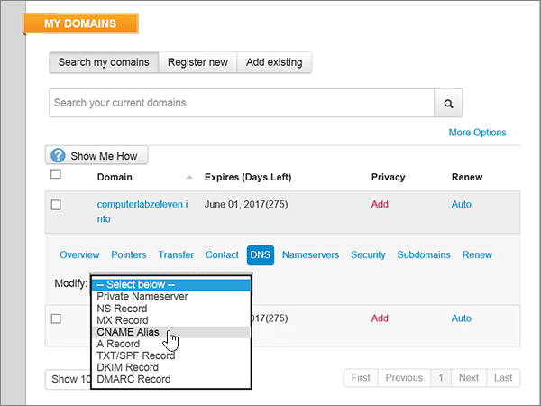

# Microsoft 用の MyDomain で DNS レコードを作成する

  
 探している内容が見つからない場合は、**[ドメインに関する FAQ を確認Q](../setup/domains-faq.md)** を参照してください。 
  
> [!CAUTION]
> MyDomain の Web サイトでは、SRV レコードはサポートされません。つまり、Skype for Business Online と Outlook Web App のいくつかの機能は動作しません。どの Microsoft プランでも、MyDomain で DNS レコードを管理する場合は、[かなりのサービスの制限事項](https://docs.microsoft.com/microsoft-365/admin/setup/domains-faq)があり、別の DNS ホスティング プロバイダーへの切り替えを考えることもあります。 
  
サービスの制限事項があっても MyDomain で自分の Microsoft DNS レコードを管理する場合は、この記事に示す手順に従って、メールや Skype for Business Online などの DNS レコードを設定してください。
    
これらのレコードを MyDomain で追加すると、使用しているドメインが、Microsoft サービスで機能するように設定されます。
  

  
> [!NOTE]
> 通常、DNS の変更が反映されるまでの時間は約 15 分です。ただし、インターネットの DNS システム全体を更新する変更の場合、さらに長くかかることもあります。DNS レコードの追加後にメール フローなどに問題が発生した場合は、「[ドメインまたは DNS レコードを追加後に問題を特定して解決する](../get-help-with-domains/find-and-fix-issues.md)」を参照してください。 
  
## 確認のための TXT レコードを追加する

Microsoft のドメインを使うには、ドメインを所有していることを確認する必要があります。自分のドメイン レジストラーで自分のアカウントにログインし、DNS レコードを作成することができれば、Microsoft に対してドメインを所有していることを確認することができます。
  
> [!NOTE]
> このレコードは、ドメインを所有していることを確認するためだけに使用されます。その他には影響しません。 必要に応じて、後で削除することができます。 
  
1. まず、[このリンク](https://www.mydomain.com/controlpanel)を使って MyDomain でドメイン ページにアクセスします。最初にログインするように求められます。
    
2. [**お気に入り**] セクションで、[**Domain Central**] を選択します。
    
3. [**ドメイン**] で、編集するドメインの名前を選択します。
    
4. [**概要**] 行で、[**DNS**] を選択します。
    
5. [**変更**] ドロップダウン リストから、[**TXT/SPF レコード**] を選択します。
    
6. [**Content**] の新規レコードのボックスに、次の表の値を入力するか、コピーして貼り付けます。
    
    ||
    |:-----|
    |**Content**   |
    |MS=ms *XXXXXXXX*    **注:** これは例です。 この表から **[宛先またはポイント先のアドレス]** の値を指定してください。 [確認する方法](../get-help-with-domains/information-for-dns-records.md)          |
   
7. [**追加**] を選択します。
    
8. 数分待つと、続行できます。この間、作成したレコードがインターネット全体で更新されます。
    
これで、ドメイン レジストラーのサイトでレコードが追加されました。Microsoft に戻り、レコードをリクエストします。
  
Microsoft で正しい TXT レコードが見つかった場合、ドメインは確認済みとなります。
  
1. Microsoft 管理センターで、**[設定]** \> <a href="https://go.microsoft.com/fwlink/p/?linkid=834818" target="_blank">[ドメイン]</a> ページの順に移動します。
    
2. **[ドメイン]** ページで、確認するドメインを選択します。 
    
3. **[セットアップ]** ページで、**[セットアップの開始]** を選択します。
    
4. **[ドメインの確認]** ページで、**[確認]** を選択します。
    
> [!NOTE]
> 通常、DNS の変更が反映されるまでの時間は約 15 分です。ただし、インターネットの DNS システム全体を更新する変更の場合、さらに長くかかることもあります。DNS レコードの追加後にメール フローなどに問題が発生した場合は、「[ドメインまたは DNS レコードを追加後に問題を特定して解決する](../get-help-with-domains/find-and-fix-issues.md)」を参照してください。 
  
## MX レコードを追加して、自分のドメインのメールが Microsoft に届くようにする

1. まず、[このリンク](https://www.mydomain.com/controlpanel)を使って MyDomain でドメイン ページにアクセスします。最初にログインするように求められます。
    
2. [**お気に入り**] セクションで、[**Domain Central**] を選択します。
    
3. [**ドメイン**] で、編集するドメインの名前を選択します。
    
4. [**概要**] 行で、[**DNS**] を選択します。
    
5. [**変更**] ドロップダウン リストから、[**MX レコード**] を選択します。
    
    
  
6. 新規レコードのボックスに、次の表の値を入力するか、コピーして貼り付けます。
    
    |**[優先度]**|**Host**|**Points To:**|
    |:-----|:-----|:-----|
    |0    優先度の詳細については、「[MX 優先度とは何ですか?](https://docs.microsoft.com/microsoft-365/admin/setup/domains-faq)」を参照してください。   |@    | *\<domain-key\>*  .mail.protection.outlook.com    **注: Microsoft アカウントから**取得\<*domain-key*\> します。 > [確認する方法](../get-help-with-domains/information-for-dns-records.md)          |
   
    
  
7. [**追加**] を選択します。
    
    
  
8. MX レコードが他にもある場合は、各レコードの [**アクション**] 列にある [**削除**] を選択して削除します。 
    
    
  
9. [**OK**] を選択します。
    
    
  
## Microsoft に必要な CNAME レコードを追加する

1. まず、[このリンク](https://www.mydomain.com/controlpanel)を使って MyDomain でドメイン ページにアクセスします。最初にログインするように求められます。
    
2. [**お気に入り**] セクションで、[**Domain Central**] を選択します。
    
3. [**ドメイン**] で、編集するドメインの名前を選択します。
    
4. [**概要**] 行で、[**DNS**] を選択します。
    
5. [**変更**] ドロップダウン リストから、[**CNAME エイリアス**] を選択します。
    
    
  
6. 1 番目の CNAME レコードを追加します。
    
    新規レコードのボックスに、次の表の 1 行目の値を入力するか、コピーして貼り付けます。
    
    |**Host**|**Points To:**|
    |:-----|:-----|
    |autodiscover    |autodiscover.outlook.com    |
    |sip    |sipdir.online.lync.com    |
    |lyncdiscover    |webdir.online.lync.com    |
    |enterpriseregistration    |enterpriseregistration.windows.net    |
    |enterpriseenrollment    |enterpriseenrollment-s.manage.microsoft.com    |
   
    
  
7. [**追加**] を選択し、最初のレコードを追加します。 
    
    
  
8. 2 番目の CNAME レコードを追加します。
    
    上の表の 2 行目の値を使用し、[**追加**] を選択して 2 番目のレコードを追加します。 
    
    同様に、表の 3 行目、4 行目、5 行目、6 行目の値を使用して、残りのレコードを追加します。
    
## 迷惑メールの防止に役立つ、SPF の TXT レコードを追加する

> [!IMPORTANT]
> 1 つのドメインで、SPF に複数の TXT レコードを設定することはできません。 1 つのドメインに複数の SPF レコードがあると、メール、配信の分類、迷惑メールの分類で問題が発生することがあります。 使用しているドメインに既に SPF レコードがある場合は、Microsoft 用に新しいレコードを作成しないでください。 代わりに、現在のレコードに Microsoft で必要になる値を追加して、元々の値と追加する値の組み合わせが 1 つの SPF レコードに含まれるようにします。 次に例を示します。 こちらの[Microsoft の外部ドメイン ネーム システムのレコード](https://docs.microsoft.com/microsoft-365/enterprise/external-domain-name-system-records#bkmk_spfrecords)を参照してください。 To validate your SPF record, you can use one of these [SPF validation tools](../setup/domains-faq.md). 
  
1. まず、[このリンク](https://www.mydomain.com/controlpanel)を使って MyDomain でドメイン ページにアクセスします。最初にログインするように求められます。
    
2. [**お気に入り**] セクションで、[**Domain Central**] を選択します。
    
3. [**ドメイン**] で、編集するドメインの名前を選択します。
    
4. [**概要**] 行で、[**DNS**] を選択します。
    
5. [**変更**] ドロップダウン リストから、[**TXT/SPF レコード**] を選択します。
    
    
  
6. [**Content**] の新規レコードのボックスに、次の表の値を入力するか、コピーして貼り付けます。
    
    |**Content**|
    |:-----|
    |v=spf1 include:spf.protection.outlook.com -all    **注:** スペースも正しく入力されるように、この値をコピーして貼り付けることをお勧めします。           |
   
    
  
7. [**追加**] を選択します。
    
    
  
## Microsoft で必要な 2 つの SRV レコードを追加する

> [!CAUTION]
> MyDomain の Web サイトでは、SRV レコードはサポートされません。つまり、Skype for Business Online と Outlook Web App のいくつかの機能は動作しません。どの Microsoft プランでも、MyDomain で DNS レコードを管理する場合は、[かなりのサービスの制限事項](https://docs.microsoft.com/microsoft-365/admin/setup/domains-faq)があり、別の DNS ホスティング プロバイダーへの切り替えを考えることもあります。 
  
> [!NOTE]
> 通常、DNS の変更が反映されるまでの時間は約 15 分です。ただし、インターネットの DNS システム全体を更新する変更の場合、さらに長くかかることもあります。DNS レコードの追加後にメール フローなどに問題が発生した場合は、「[ドメインまたは DNS レコードを追加後に問題を特定して解決する](../get-help-with-domains/find-and-fix-issues.md)」を参照してください。 
  
