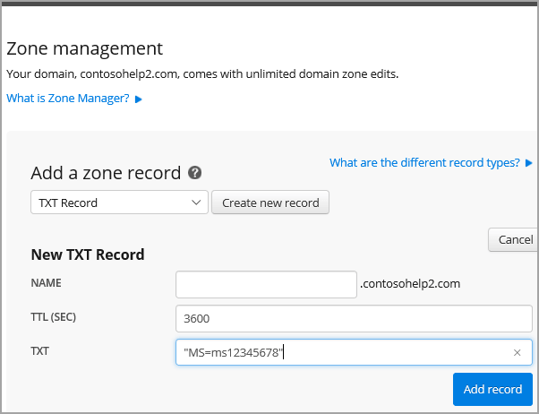

# Microsoft の Netregistry で DNS レコードを作成する

探している内容が見つからない場合は、[ドメインに関する FAQ を確認](../setup/domains-faq.md)してください。 
  
使用している DNS ホスティング プロバイダーが Netregistry の場合は、この記事に記載された手順に従って、ドメインの確認とメールや Skype for Business Online などの DNS レコードのセットアップを行います。
  
追加する主なレコードは次のとおりです。
  
- [確認のための TXT レコードを追加する](#add-a-txt-record-for-verification)
    
- [MX レコードを追加して、自分のドメインのメールが Microsoft に届くようにする](#add-an-mx-record-so-email-for-your-domain-will-come-to-microsoft)

- [Microsoft に必要な CNAME レコードを追加する](#add-the-cname-records-that-are-required-for-microsoft)
    
- [迷惑メールの防止に役立つ、SPF の TXT レコードを追加する](#add-a-txt-record-for-spf-to-help-prevent-email-spam)
    
- [Microsoft で必要な 2 つの SRV レコードを追加する](#add-the-two-srv-records-that-are-required-for-microsoft)
    
これらのレコードを Netregistry で追加すると、使用しているドメインが Microsoft サービスで機能するように設定されます。
  
  
> [!NOTE]
> 通常、DNS の変更が有効になるのに 15 分ほどかかります。ただし、インターネットの DNS システム全体を更新する変更の場合、さらに長くかかることもあります。DNS レコードの追加でメール フローなどに問題が発生した場合は、「[ドメイン名または DNS レコードの変更後の問題に関するトラブルシューティング](../get-help-with-domains/find-and-fix-issues.md)」を参照してください。 
  
## 確認のための TXT レコードを追加する

Microsoft のドメインを使うには、ドメインを所有していることを確認する必要があります。自分のドメイン レジストラーで自分のアカウントにログインし、DNS レコードを作成することができれば、Microsoft に対してドメインを所有していることを確認することができます。
  
> [!NOTE]
> このレコードは、ドメインを所有していることを確認するためだけに使用されます。その他には影響しません。 必要に応じて、後で削除することができます。 
  
1. まず、[こちらのリンク](https://theconsole.netregistry.com.au/)を使って、Netregistry のドメイン ページにアクセスします。ログインするように求められます。
    
    
  
2. 管理するドメインの横にある、[ **Manage** ] を選択します。
    
    
  
3. [ **Zone Manager** ] を選択します。
    
    
  
4. [ **Add a zone record**] の一覧から [ **TXT record** ] を選択し、[**新しいレコードの作成**] を選択します。
    
    
  
    > [!NOTE]
    > TXT ボックスでは、エントリの前後に引用符を使用する必要があります。 
  
    [ **New TXT Record** ] フォームに、次の表の値を入力するか、コピーして貼り付けます。 
    
    |**名前**|**TTL (秒)**|**TXT (ポイント先のアドレスまたは値)**|
    |:-----|:-----|:-----|
    |(空白のまま)    |3600 (秒)    |"MS = msXXXXXXXX"    **注:** これは例です。 この表から **[宛先またはポイント先のアドレス]** の値を指定してください。 [確認する方法](../get-help-with-domains/information-for-dns-records.md)  |
       
    
  
6. [ **Add record**] を選択します。
    
これで、ドメイン レジストラーのサイトでレコードが追加されました。Microsoft に戻り、レコードをリクエストします。
  
Microsoft で正しい TXT レコードが見つかった場合、ドメインは確認済みとなります。
  
1. 管理センターで、**[設定]** \> <a href="https://go.microsoft.com/fwlink/p/?linkid=834818" target="_blank">[ドメイン]</a> ページの順に移動します。
    
2. **[ドメイン]** ページで、確認するドメインを選択します。 
    
    
  
3. **[セットアップ]** ページで、**[セットアップの開始]** を選択します。
    
    
  
4. **[ドメインの確認]** ページで、**[確認]** を選択します。
    
    
  
> [!NOTE]
>  通常、DNS の変更が有効になるのに 15 分ほどかかります。ただし、インターネットの DNS システム全体を更新する変更の場合、さらに長くかかることもあります。DNS レコードの追加でメール フローなどに問題が発生した場合は、「[ドメイン名または DNS レコードの変更後の問題に関するトラブルシューティング](../get-help-with-domains/find-and-fix-issues.md)」を参照してください。 
  
## MX レコードを追加して、自分のドメインのメールが Microsoft に届くようにする

1. まず、[こちらのリンク](https://theconsole.netregistry.com.au/)を使って、Netregistry のドメイン ページにアクセスします。ログインするように求められます。
    
    
  
2. 管理するドメインの横にある、[ **Manage** ] を選択します。
    
    
  
3. [ **Zone Manager** ] を選択します。
    
    
  
4. [**現在のゾーンレコード**] で、リスト内の各 mx レコードの横にある [**削除**] を選択して、既定の mx レコードを削除します。 
    
    
  
5. [ **Add a zone record**] の一覧から [ **MX record** ] を選択し、[**新しいレコードの作成**] を選択します。
    
    
  
6. [**新しい MX レコード**] フォームで、次の表の値を入力するか、コピーして貼り付けます。 
    
    |**名前**|**TTL (秒)**|**Exchange (ポイント先アドレスまたは値)**|**ホストは完全に修飾されていますか?**|**優先順位 (優先度)**|
    |:-----|:-----|:-----|:-----|:-----|
    |(空白のまま)    |3600 (秒)    | *\<ドメインキー\>*  .mail.protection.outlook.com    **注:** Microsoft アカウントから* \<ドメインキー\> *を取得します。  [確認する方法](../get-help-with-domains/information-for-dns-records.md)      |(チェックボックスをオンにします)    |10      For more information about priority, see What is MX priority?    |
       
    
  
7. [ **Add Record** ] を選択します。
    
    
  
## Microsoft に必要な CNAME レコードを追加する

1. まず、[こちらのリンク](https://theconsole.netregistry.com.au/)を使って、Netregistry のドメイン ページにアクセスします。ログインするように求められます。
    
    
  
2. 管理するドメインの横にある、[ **Manage** ] を選択します。
    
    
  
3. [ **Zone Manager** ] を選択します。
    
    
  
4. [ **Add a zone record**] の一覧から [ **CNAME record** ] を選択し、[**新しいレコードの作成**] を選択します。
    
    
  
5. 新規レコードのボックスに、次の表の値を入力するか、コピーして貼り付けます。
    
    |**名前**|**Type**|**TTL**|**ホスト (ポイントまたはアドレスの値)**|
    |:-----|:-----|:-----|:-----|
    |autodiscover    |CNAME    |3600 (秒)    |autodiscover.outlook.com    |
    |sip    |CNAME    |3600 (秒)    |sipdir.online.lync.com    |
    |lyncdiscover    |CNAME    |3600 (秒)    |webdir.online.lync.com    |
    |enterpriseregistration    |CNAME    |3600 (秒)    |enterpriseregistration.windows.net    |
    |enterpriseenrollment    |CNAME    |3600 (秒)    |enterpriseenrollment-s.manage.microsoft.com    |
       
    
      
6. [ **Add record**] を選択します。
    
    
  
7. 前の手順を繰り返し、他の 5 つの CNAME レコードを作成します。
    
    レコードごとに、上のテーブルの次の行の値をそのレコードのボックスに入力するか、コピーして貼り付けます。
    
## 迷惑メールの防止に役立つ、SPF の TXT レコードを追加する

> [!IMPORTANT]
> 1 つのドメインで、SPF に複数の TXT レコードを設定することはできません。 1 つのドメインに複数の SPF レコードがあると、メール、配信の分類、迷惑メールの分類で問題が発生することがあります。 使用しているドメインに既に SPF レコードがある場合は、Microsoft 用に新しいレコードを作成しないでください。 代わりに、値のセットを含む*1 つ*の SPF レコードがあるように、現在のレコードに必要な Microsoft の値を追加します。
  
1. まず、[こちらのリンク](https://theconsole.netregistry.com.au/)を使って、Netregistry のドメイン ページにアクセスします。ログインするように求められます。
    
    
  
2. 管理するドメインの横にある、[ **Manage** ] を選択します。
    
    
  
3. [ **Zone Manager** ] を選択します。
    
    
  
4. [ **Add a zone record**] の一覧から [ **TXT record** ] を選択し、[**新しいレコードの作成**] を選択します。
    
    
  
5. 新規レコードのボックスに、次の表の値を入力するか、コピーして貼り付けます。 
    
    > [!NOTE]
    > TXT ボックスでは、エントリの前後に引用符を使用する必要があります。 
  
    |**名前**|**Type**|**TTL**|**TXT データ (ターゲット)**|
    |:-----|:-----|:-----|:-----|
    |(空白のまま)    |TXT    |3600 (秒)    |"v = spf1 には、以下のようにします。    **注:** スペースも正しく入力されるように、この値をコピーして貼り付けることをお勧めします。           |
   
    
  
6. [ **Add Record** ] を選択します。
    
    
  
## Microsoft で必要な 2 つの SRV レコードを追加する

1. まず、[こちらのリンク](https://theconsole.netregistry.com.au/)を使って、Netregistry のドメイン ページにアクセスします。ログインするように求められます。
    
    
  
2. 管理するドメインの横にある [ **manage**] を選択します。
    
    
  
3. [ **Zone Manager** ] を選択します。
    
    
  
4. [ **Add a zone record**] の一覧から [ **SRV record** ] を選択し、[**新しいレコードの作成**] を選択します。
    
    
  
5. 新規レコードのボックスに、次の表の値を入力するか、コピーして貼り付けます。
    
    > [!NOTE]
    > [名前] フィールドは、サービス (たとえば、_sip) とプロトコル (たとえば、_tls) の組み合わせです。 
  
    |**Type**|**名前**|**TTL (秒)**|**Priority**|**Weight**|**Port**|**対象**|
    |:-----|:-----|:-----|:-----|:-----|:-----|:-----|
    |SRV (サービス)    |_sip _tls    |3600 (秒)    |100    |1-d    |443    |sipdir.online.lync.com    |
    |SRV (サービス)    |_sipfederationtls _tcp    |3600 (秒)    |100    |1-d    |5061    |sipfed.online.lync.com    |
       
    
  
6. [ **Add Record** ] を選択します。
    
    
  
7. 上記の手順を繰り返し、他の SRV レコードを作成します。
    
    2 番目のレコードのボックスに、上の表の 2 行目の値を入力するかコピーして貼り付けます。
    
> [!NOTE]
> 通常、DNS の変更が有効になるのに 15 分ほどかかります。ただし、インターネットの DNS システム全体を更新する変更の場合、さらに長くかかることもあります。DNS レコードの追加でメール フローなどに問題が発生した場合は、「[ドメイン名または DNS レコードの変更後の問題に関するトラブルシューティング](../get-help-with-domains/find-and-fix-issues.md)」を参照してください。 
  

