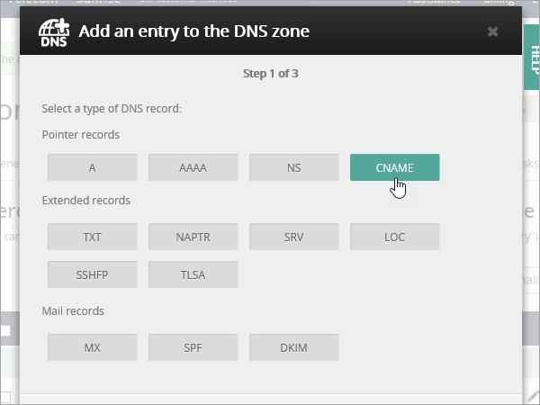

# Microsoft 用の「Excel で DNS レコードを作成する」

探している内容が見つからない場合は、[ドメインに関する FAQ を確認](../setup/domains-faq.md)してください。 
  
使用している DNS ホスティング プロバイダーが OVH の場合は、この記事に記載された手順に従って、ドメインの確認とメールや Skype for Business Online などの DNS レコードのセットアップを行います。
  
追加する主なレコードは次のとおりです。 
  
- [Microsoft 用の「Excel で DNS レコードを作成する」](#create-dns-records-at-ovh-for-microsoft)
    
- [MX レコードを追加して、自分のドメインのメールが Microsoft に届くようにする](#add-an-mx-record-so-email-for-your-domain-will-come-to-microsoft)
    
- [Microsoft に必要な CNAME レコードを追加する](#add-the-cname-records-that-are-required-for-microsoft)
    
- [迷惑メールの防止に役立つ、SPF の TXT レコードを追加する](#add-a-txt-record-for-spf-to-help-prevent-email-spam)
    
- [Microsoft で必要な 2 つの SRV レコードを追加する](#add-the-two-srv-records-that-are-required-for-microsoft)
    
これらのレコードを "準備中" で追加すると、使用しているドメインが Microsoft サービスで機能するように設定されます。

  
> [!NOTE]
>  通常、DNS の変更が有効になるのに 15 分ほどかかります。ただし、インターネットの DNS システム全体を更新する変更の場合、さらに長くかかることもあります。DNS レコードの追加でメール フローなどに問題が発生した場合は、「[ドメイン名または DNS レコードの変更後の問題に関するトラブルシューティング](../get-help-with-domains/find-and-fix-issues.md)」を参照してください。 
  
## 確認のための TXT レコードを追加する

Microsoft のドメインを使うには、ドメインを所有していることを確認する必要があります。自分のドメイン レジストラーで自分のアカウントにログインし、DNS レコードを作成することができれば、Microsoft に対してドメインを所有していることを確認することができます。
  
> [!NOTE]
> このレコードは、ドメインを所有していることを確認するためだけに使用されます。その他には影響しません。 必要に応じて、後で削除することができます。 
  
1. まず、[このリンク](https://www.ovh.com/manager/)を使って OVH でドメイン ページにアクセスします。ログインするように求められます。
    
    
  
2. [ **Domains**] の下で、編集するドメインの名前を選択します。
    
    
  
3. [ **DNS zone**] を選択します。
    
    
  
4. [**エントリを追加する**] を選択します。
    
    
  
5. **TXT**の選択
    
    ![[すべて選択] TXT エントリ](../../media/3aaa9dae-0b1d-436b-a980-b67a970f31a9.png)
  
6. 新規レコードのボックスに、次の表の値を入力するか、コピーして貼り付けます。 TTL 値を割り当てるには、ドロップダウンリストから [**個人用**] を選択し、テキストボックスに値を入力します。 
    
    |**Record type**|**サブドメイン**|**TTL**|**値**|
    |:-----|:-----|:-----|:-----|
    |TXT    |(空白のまま)    |3600 (秒)    |MS=msxxxxxxxx    **注:** これは例です。 この表から **[宛先またはポイント先のアドレス]** の値を指定してください。           [確認する方法](../get-help-with-domains/information-for-dns-records.md)          |
   
7. [**確認**] を選択します。 
    
    
  
8. 数分待つと、続行できます。この間、作成したレコードがインターネット全体で更新されます。
    
これで、ドメイン レジストラーのサイトでレコードが追加されました。Microsoft に戻り、レコードをリクエストします。
  
Microsoft で正しい TXT レコードが見つかった場合、ドメインは確認済みとなります。
  
1. 管理センターで、**[設定]** \> <a href="https://go.microsoft.com/fwlink/p/?linkid=834818" target="_blank">[ドメイン]</a> ページの順に移動します。
    
2. **[ドメイン]** ページで、確認するドメインを選択します。 
    
    
  
3. **[セットアップ]** ページで、**[セットアップの開始]** を選択します。
    
    
  
4. **[ドメインの確認]** ページで、**[確認]** を選択します。
    
    
  
> [!NOTE]
>  通常、DNS の変更が有効になるのに 15 分ほどかかります。ただし、インターネットの DNS システム全体を更新する変更の場合、さらに長くかかることもあります。DNS レコードの追加でメール フローなどに問題が発生した場合は、「[ドメイン名または DNS レコードの変更後の問題に関するトラブルシューティング](../get-help-with-domains/find-and-fix-issues.md)」を参照してください。 
  
## MX レコードを追加して、自分のドメインのメールが Microsoft に届くようにする

1. まず、[このリンク](https://www.ovh.com/manager/)を使って OVH でドメイン ページにアクセスします。ログインするように求められます。
    
    
  
2. [ **Domains**] の下で、編集するドメインの名前を選択します。
    
    
  
3. [ **DNS zone**] を選択します。
    
    
  
4. [**エントリを追加する**] を選択します。
    
    
  
5. [ **MX**] を選択します。
    
    
  
6. 新規レコードのボックスに、次の表の値を入力するか、コピーして貼り付けます。 TTL 値を割り当てるには、ドロップダウンリストから [**個人用**] を選択し、テキストボックスに値を入力します。 
    
    > [!NOTE]
    > 既定では、移動先の相対表記を使用します。これにより、ターゲットレコードの末尾にドメイン名が追加されます。 絶対表記を代わりに使用するには、次の表に示すように、ターゲット レコードにドットを追加します。 
  
    |**Record type**|**サブドメイン**|**TTL**|**優先度**|**ターゲット**|
    |:-----|:-----|:-----|:-----|:-----|
    |MX    |(空白のまま)    |3600 (秒)    |10      優先度の詳細については、「[MX 優先度とは何か](https://docs.microsoft.com/microsoft-365/admin/setup/domains-faq)」を参照してください。   |\<domain-key\>. mail.protection.outlook.com。    **注:***\<domain-key\>* Microsoft アカウントからを取得します。  [確認する方法](../get-help-with-domains/information-for-dns-records.md)  |
   
    
  
7. [**次へ**] を選択します。
    
    
  
8. [**確認**] を選択します。
    
    
  
9. MX レコードが他にもある場合は、[ **DNS zone** ] ページですべて削除します。 各レコードを選択し、[**アクション**] 列で [ごみ箱-**削除**可能] アイコンを選択します。 
    
    
  
10. [**確認**] を選択します。
    
## Microsoft に必要な CNAME レコードを追加する

1. まず、[このリンク](https://www.ovh.com/manager/)を使って OVH でドメイン ページにアクセスします。ログインするように求められます。
    
    
  
2. [ **Domains**] の下で、編集するドメインの名前を選択します。
    
    
  
3. [ **DNS zone**] を選択します。
    
    
  
4. [**エントリを追加する**] を選択します。
    
    
  
5. [ **CNAME**] を選択します。
    
    
  
6. 1 番目の CNAME レコードを作成します。
    
    新規レコードのボックスに、次の表の 1 行目の値を入力するか、コピーして貼り付けます。 TTL 値を割り当てるには、ドロップダウンリストから [**個人用**] を選択し、テキストボックスに値を入力します。 
    
    |**Record type**|**サブドメイン**|**ターゲット**|**TTL**|
    |:-----|:-----|:-----|:-----|
    |CNAME    |autodiscover    |autodiscover.outlook.com。    |3,600 秒    |
    |CNAME    |sip    |sipdir.online.lync.com。    |3,600 秒    |
    |CNAME    |lyncdiscover    |webdir.online.lync.com。    |3,600 秒    |
    |CNAME    |enterpriseregistration    |enterpriseregistration.windows.net。    |3,600 秒    |
    |CNAME    |enterpriseenrollment    |enterpriseenrollment-s.manage.microsoft.com。    |3,600 秒    |
   
    
  
7. [**次へ**] を選択します。
    
    
  
8. [**確認**] を選択します。
    
9. 前の手順を繰り返し、他の 5 つの CNAME レコードを作成します。
    
    レコードごとに、上のテーブルの次の行の値をそのレコードのボックスに入力するか、コピーして貼り付けます。
    
## 迷惑メールの防止に役立つ、SPF の TXT レコードを追加する

> [!IMPORTANT]
> 1 つのドメインで、SPF に複数の TXT レコードを設定することはできません。 1 つのドメインに複数の SPF レコードがあると、メール、配信の分類、迷惑メールの分類で問題が発生することがあります。 使用しているドメインに既に SPF レコードがある場合は、Microsoft 用に新しいレコードを作成しないでください。 代わりに、値のセットを含む*1 つ*の SPF レコードがあるように、現在のレコードに必要な Microsoft の値を追加します。 
  
1. まず、[このリンク](https://www.ovh.com/manager/)を使って OVH でドメイン ページにアクセスします。ログインするように求められます。
    
    
  
2. [ **Domains**] の下で、編集するドメインの名前を選択します。
    
    
  
3. [ **DNS zone**] を選択します。
    
    
  
4. [**エントリを追加する**] を選択します。
    
    
  
5. [ **TXT**] を選択します。
    
6. 新規レコードのボックスに次の値を入力するか、コピーして貼り付けます。
    
    |**レコードの種類**|**サブドメイン**|**TTL**|**TXT 値**|
    |:-----|:-----|:-----|:-----|
    |TXT    |(空白のまま)    |3600 (秒)    |v=spf1 include:spf.protection.outlook.com -all    **注:** スペースも正しく入力されるように、この値をコピーして貼り付けることをお勧めします。           |
   
    ![[詳細] SPF の TXT レコードを追加する](../../media/f50466e9-1557-4548-8a39-e98978a5ee2e.png)
  
7. [**次へ**] を選択します。
    
    ![[追加] SPF の TXT レコードを追加し、[次へ] を選択します。](../../media/7937eb7c-114f-479f-a916-bcbe476d6108.png)
  
8. [**確認**] を選択します。
    
    
  
## Microsoft で必要な 2 つの SRV レコードを追加する

1. まず、[このリンク](https://www.ovh.com/manager/)を使って OVH でドメイン ページにアクセスします。ログインするように求められます。
    
    
  
2. [ **Domains**] の下で、編集するドメインの名前を選択します。
    
    
  
3. [ **DNS zone**] を選択します。
    
    
  
4. [**エントリを追加する**] を選択します。
    
    
  
5. [ **SRV**] を選択します。
    
    
  
6. 1 番目の SRV レコードを作成します。
    
    新規レコードのボックスに、次の表の 1 行目の値を入力するか、コピーして貼り付けます。 TTL 値を割り当てるには、ドロップダウンリストから [**個人用**] を選択し、テキストボックスに値を入力します。 
    
    |**Record type**|**サブドメイン**|**Priority**|**Weight**|**Port**|**TTL**|**ターゲット**|
    |:-----|:-----|:-----|:-----|:-----|:-----|:-----|
    |SRV (Service)    |_sip _tls    |100    |1     |443    |3600 (秒)    |sipdir.online.lync.com。    |
    |SRV (Service)    |_sipfederationtls _tcp    |100    |1     |5061    |3600 (秒)    |sipfed.online.lync.com。    |
       
    
  
7. [**次へ**] を選択します。
    
    
  
8. [**確認**] を選択します。
    
9. 上記の手順を繰り返し、他の SRV レコードを作成します。2 番目のレコードのボックスに、上の表の 2 行目の値を入力するかコピーして貼り付けます。
    
> [!NOTE]
>  通常、DNS の変更が有効になるのに 15 分ほどかかります。ただし、インターネットの DNS システム全体を更新する変更の場合、さらに長くかかることもあります。DNS レコードの追加でメール フローなどに問題が発生した場合は、「[ドメイン名または DNS レコードの変更後の問題に関するトラブルシューティング](../get-help-with-domains/find-and-fix-issues.md)」を参照してください。 
  
