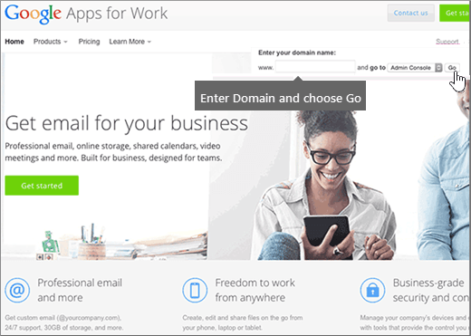

# Google がドメインを管理している場合に DNS レコードを作成する (eNom)

 探している内容が見つからない場合は、**[ドメインに関する FAQ を確認Q](../setup/domains-faq.md)** を参照してください。 
  
メールアカウントを Microsoft に移行するには、ドメインレジストラーで DNS レコードを作成する必要があります。
  
**Google Apps for Work** アカウントへのサインアップ時に Google 経由でドメインを購入した場合、DNS レコードは Google が管理し、eNom が登録します。 
  
[Google **Domains** ] ページで、enom にアクセスし、DNS を作成できます。 この記事の手順を実行するだけです。 
  
## DNS レコードを作成する

1. [Google 管理コンソール](https://www.google.com/work/apps/business)で、[**サインイン**] を選択します。
    
    
  
2. ドメイン名を入力し、[**移動**] を選択します。
    
    
  
3. ページの下部にある [**その他のコントロール**] を選択します。
    
    
  
4. [ **ドメイン**] を選択します。
    
    
  
5. [**ドメイン**] ページで、[**ドメインの追加と削除**] を選択します。
    
    
  
6. [**ドメイン**] ページで、[ **Advanced DNS settings**] を選択します。
    
    > [!NOTE]
    > **Google Apps for Work** アカウントへのサインアップ時に Google 経由でドメイン名を購入しなかった場合は、[ **Domains**] ページで [ **Advanced DNS settings**] を使用できません。 代わりに、ユーザーがドメインのホストの Web サイトに直接移動し、DNS 設定にアクセスして、この手順と次の手順に従う必要があります。 詳細については[、「G Suite ドメイン設定にアクセス](https://support.google.com/a/answer/54693?hl=en)する」を参照してください。 
  
    
  
7. [ **ADVANCED dns settings** ] ページで、[ **Dns コンソールにサインイン**] を選択します。 [ **Sign-in name**] と [ **Password**] の情報をメモします。 次の手順で使用します。 
    
    
  
8. [ **Advanced DNS settings**] ページから [ **Sign-in name**] と [ **Password**] を使用して Google **Domain Manager** にログインします。 
    
    
  
9. [ ***Domain_name*** ] ページの [**ホストレコード**] セクションで、[**編集**] を選択します。
    
    
  
10. [ **Host Records** ] セクションで、[ **Add New**] を選択します。
    
    
  
11. 新規レコードのボックスに、次の表の値を入力するか、コピーして貼り付けます。
    
    |**ホスト**|**TXT VALUE**|**レコードの種類**|
    |:-----|:-----|:-----|
    |@    ||TXT    |

    > [!NOTE]
    > This is an example. この表から **[宛先またはポイント先のアドレス]** の値を指定してください。 
  
    [確認する方法](../get-help-with-domains/information-for-dns-records.md)
  
12. **[保存]** を選択します。
    
    
  
13. [ **Save Changes**] を選びます。
    
    
  
> [!NOTE]
>  通常、DNS の変更が有効になるのに 15 分ほどかかります。ただし、インターネットの DNS システム全体を更新する変更の場合、さらに長くかかることもあります。DNS レコードの追加でメール フローなどに問題が発生した場合は、「[ドメイン名または DNS レコードの変更後の問題に関するトラブルシューティング](../get-help-with-domains/find-and-fix-issues.md)」を参照してください。 
  
