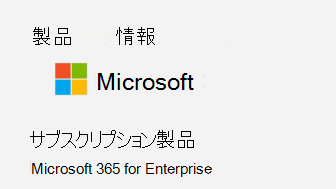

# <a name="determine-if-centralized-deployment-of-add-ins-works-for-your-organization"></a>組織でアドインの一元展開が機能するかどうかを判断する

一元展開は、ほとんどのお客様が組織内のユーザーやグループに Office アドインを展開するために推奨される最も豊富な方法です。 管理者である場合は、このガイダンスを使用して、一括展開を使用できるようにテナントとユーザーが要件を満たしているかどうかを判断します。
一元展開は、3つのデスクトッププラットフォーム Windows、Mac、およびオンライン Office アプリをサポートします。 一元展開では、iOS および Android もサポートされています (Outlook モバイルアドインのみ)。
すべてのユーザーについて、アドインがクライアントに対して表示されるまでに最大24時間かかる場合があります。
  
## <a name="requirements"></a>Requirements

アドインを一元展開するには、ユーザーが Microsoft 365 Apps for enterprise (組織の ID を使用して Office にサインインしている) を使用しており、Exchange Online および Exchange Online の Exchange Online メールボックスを持っている必要があります。 サブスクリプションディレクトリは、に含まれているか、Azure Active Directory にフェデレーションされている必要があります。
以下の Office および Exchange の特定の要件を確認することも、[集中展開の互換性チェック](https://docs.microsoft.com/office365/admin/manage/centralized-deployment-of-add-ins?view=o365-worldwide#office-365-centralized-deployment-compatibility-checker)を使用することもできます。

一元展開は、次の機能をサポートしていません。
  
- Office 2013 の Word、Excel、または PowerPoint を対象とするアドイン
    
- オンプレミスのディレクトリ サービス
    
- SharePoint に展開するアドイン  

- Teams アプリ
   
- コンポーネント オブジェクト モデル (COM) アドインまたは Visual Studio Tools for Office (VSTO) アドインの展開
    
- Microsoft 365 の展開には、Microsoft 365 Apps for business などの Exchange は含まれていません。

### <a name="office-requirements"></a>Office の要件

- Word、Excel、PowerPoint のアドインでは、ユーザーが次のいずれかを使用している必要があります。
  - Windows デバイスでは、バージョン1704以降の Microsoft 365 Apps for enterprise。
  - Mac では、バージョン15.34 以降。

- Outlook の場合、ユーザーは次のいずれかを使用する必要があります。 
  - バージョン1701以降の Microsoft 365 Apps for enterprise。
  - バージョン1808以降の Office Professional Plus 2019 または Office Standard 2019。
  - 16.0.4494.1000 以降のバージョンの Office Professional Plus 2016 (MSI) または Office Standard 2016 (MSI)\*
  - 15.0.4937.1000 以降のバージョンの Office Professional Plus 2013 (MSI) または Office Standard 2013 (MSI)\*
  - Office 2016 for Mac のバージョン16.0.9318.1000 以降 
- IOS 版 Outlook mobile のバージョン2.75.0 以降 
- Outlook mobile for Android のバージョン2.2.145 以降 
    
    * MSI バージョンの Outlook では、[個人用アドイン] セクションではなく、適切な Outlook リボンに管理者がインストールしたアドインが表示されます。
    

#### <a name="find-out-if-microsoft-365-apps-for-enterprise-is-installed"></a>Microsoft 365 Apps for enterprise がインストールされているかどうかを確認する

Microsoft 365 Apps for enterprise を使用するには、ユーザーは Microsoft 365 アカウントを持っていて、ライセンスが割り当てられている必要があります。 詳細については、「 [Microsoft 365 Apps for enterprise](https://go.microsoft.com/fwlink/p/?linkid=846328)」を参照してください。

ユーザーがエンタープライズ向けの Microsoft 365 アプリをインストールしていて、それを最近使用しているかどうかを検出する最も簡単な方法は、microsoft 365 管理センターで利用できる Microsoft Office ライセンス認証レポートを使用することです。 このレポートでは、過去7日間、30日間、90日間、または180日以内に、エンタープライズ向けの Microsoft 365 アプリをアクティブ化したすべてのユーザーの一覧を示します。 一元展開をするという目的のため、Windows または Mac のデスクトップで行ったライセンス認証は、レポートの重要な列に表示されます。 このレポートは、Excel にエクスポートできます。 レポートの詳細については、「 [Microsoft Office ライセンス認証」の「microsoft 365 レポート](../activity-reports/microsoft-office-activations.md)」を参照してください。
  
ライセンス認証レポートを使用しない場合は、ユーザーが Word などの Office アプリケーションを自分のコンピューターで開くように求めることができます。次に、[**ファイル**アカウント] を選択し \> **Account**ます。 [**製品情報**] の下に、次の図に示すように、**サブスクリプション製品**と**Microsoft 365 for enterprise**が表示されます。


  
Microsoft 365 App for enterprise のヘルプについては、「 [microsoft 365 apps for enterprise のトラブルシューティングのヒント](https://go.microsoft.com/fwlink/p/?linkid=846339)」を参照してください。


### <a name="exchange-online-requirements"></a>Exchange Online の要件

Microsoft Exchange では、アドインのマニフェストが組織のテナントに格納されます。 管理者がアドインを展開し、アドインを受信するユーザーは、OAuth 認証をサポートする Exchange Online のバージョンになっている必要があります。
  
Check with your organization's Exchange admin to find out which configuration is in use. OAuth connectivity per user can be verified by using the [Test-OAuthConnectivity](https://go.microsoft.com/fwlink/p/?linkid=846351) PowerShell cmdlet. 


### <a name="centralized-deployment-compatibility-checker"></a>一元的な展開の互換性チェック

一元展開の互換性チェックを使用して、テナントのユーザーが Word、Excel、PowerPoint の一元展開を使用するように設定されているかどうかを確認できます。 互換性チェックは、Outlook のサポートには必要ありません。 互換性チェックを[ここ](https://aka.ms/officeaddindeploymentorgcompatibilitychecker)にダウンロードします。
  
#### <a name="run-the-compatibility-checker"></a>互換性チェックを実行する
  
1. 管理者特権での PowerShell.exe ウィンドウを起動します。
    
2. 次のコマンドを実行します。

```powershell
Import-Module O365CompatibilityChecker
```
    
3. **CompatabilityCheck**コマンドを実行します。

```powershell
Invoke-CompatibilityCheck
```
   これにより、 *_Tenantdomain_* (たとえば、 *TailspinToysIncorporated </span> ) の入力を求められます。com*) と*_TenantAdmin_* の資格情報 (グローバル管理者の資格情報を使用) を使用して、同意を要求します。
    
> [!NOTE]
> テナントのユーザー数によって、チェックが完了するのに数分または数時間かかる場合があります。 
  
ツールの実行が完了すると、コンマ区切り (.csv) 形式で出力ファイルが作成されます。 既定では、ファイルは**C:\windows\system32**に保存されます。 出力ファイルには、次の情報が含まれます。
  
- ユーザー名
    
- ユーザー ID (ユーザーのメール アドレス)
    
- 一元展開の準備完了 - 残りの項目が TRUE の場合
    
- Office プラン-ライセンスが付与されている Office のプラン
    
- ライセンス認証された Office - Office をライセンス認証している場合
    
- サポートされているメールボックス - OAuth 対応メールボックスを使用している場合


  
## <a name="user-and-group-assignments"></a>ユーザーとグループの割り当て

一元展開機能は、現在、Microsoft 365 グループ、配布リスト、セキュリティグループなど、Azure Active Directory でサポートされているグループの大部分をサポートしています。
  
> [!NOTE]
> メールが有効ではないセキュリティ グループは、現段階ではサポートされていません。 
  
一元展開では、テナント内の個々のユーザー、グループ、および全員への割り当てがサポートされます。 一元展開では、最上位のグループまたは親グループのないグループのユーザーがサポートされますが、親グループを持つグループまたはグループのユーザーはネストできません。
   
Take a look at the following example where Sandra, Sheila, and the Sales Department group are assigned to an add-in. Because the West Coast Sales Department is a nested group, Bert and Fred aren't assigned to an add-in.
  


   
### <a name="find-out-if-a-group-contains-nested-groups"></a>グループにネストされたグループが含まれているかどうかを調べる

グループにネストされたグループが含まれているかどうかを調べる最も簡単な方法は、Outlook 内のグループの連絡先カードを確認することです。 電子メールの [宛先] フィールド**に**グループ名を入力し、解決時にグループ名を選択すると、ユーザーまたはネストしたグループが含まれている場合は、そのグループの名前が表示されます。 次の例では、「テスト グループ」での Outlook 情報先カードの [ **メンバー**] タブには、ユーザーはなく、2 つのサブ グループのみが表示されています。 
  
![Outlook 連絡先カードの [メンバー] タブ](../../media/d9db88c4-d752-426c-a480-b11a5b3adcd6.png)
  
You can do the opposite query by resolving the group to see if it's a member of any group. In the example below, you can see under the **Membership** tab of the Outlook contact card that Sub Group 1 is a member of the Test Group. 
  
![Outlook 連絡先カードの [メンバーシップ] タブ](../../media/a9f9b6ab-9c19-4822-9e3d-414ca068c42f.png)
  
Alternately, you can use the Azure Active Directory Graph API to run queries to find the list of groups within a group. For more information, see [Operations on groups | Graph API reference](https://go.microsoft.com/fwlink/p/?linkid=846342).
  
### <a name="contacting-microsoft-for-support"></a>Microsoft に連絡してサポートを受ける

中央で展開された web 用 Office アプリ (Word、Excel など) を使用しているときにアドインの読み込みに問題が発生した場合は、Microsoft サポートに問い合わせる必要があります ([詳細につい](../contact-support-for-business-products.md)ては、「」を参照してください)。 サポートチケットに、Microsoft 365 環境に関する以下の情報を提供します。
  
|**プラットフォーム**|**デバッグ情報**|
|:-----|:-----|
|Office  <br/> | Charles/Fiddler ログ  <br/>  テナント ID ( [詳細情報](https://docs.microsoft.com/onedrive/find-your-office-365-tenant-id.aspx))  <br/>  CorrelationID. いずれかの office ページのソースを表示し、関連付け ID の値を探して、サポートに送信します。  <br/>`<input name=" **wdCorrelationId**" type="hidden" value=" **{BC17079E-505F-3000-C177-26A8E27EB623}**">`  <br/>  `<input name="user_id" type="hidden" value="1003bffd96933623"></form>`  <br/> |
|リッチ クライアント (Windows、Mac)  <br/> | Charles/Fiddler ログ  <br/>  クライアントアプリのビルド番号 (**ファイル/アカウント**のスクリーンショットとして推奨)  <br/> |
   

