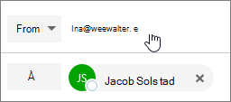

# 配布リストとしてメールを送信する

Microsoft 365 では、電子メールを配布リストとして送信できます。 配布リストのメンバーであるユーザーが配布リストに送信されたメッセージに返信すると、メールは個別のユーザーからではなく、配布リストからであることが表示されます。 このトピックでは、この操作を行う方法を示します。
  
## 配布リストとしてメールを送信する

これらの手順を実行する前に、Microsoft 365 配布リストにが追加されており、それに対する送信者アクセス許可が付与されていることを確認してください。
  
 **管理者**: 「 [microsoft 365 のユーザーまたは連絡先をリストに追加](../email/add-user-or-contact-to-distribution-list.md)し、[メンバーが microsoft 365 のグループのトピックとして電子メールを送信できるように](../create-groups/allow-members-to-send-as-or-send-on-behalf-of-group.md#allow-members-to-send-email-as-a-group)し、配布リストに正しいユーザーを追加することを許可する」の手順に従っていることを確認してください。
  
1. Outlook on the web を開き、受信トレイに移動します。 
    
2. 配布リストに送信されたメッセージを開きます。 
    
3. [**返信**] を選択します。 
    
4. メッセージの下部で、[**その他** \> **の表示元**] を選択します。  ![[詳細] を選択し、[表示] を選択します。](../../media/534f13b7-9f15-48ea-8835-ea2ed1863ece.png)
  
5. -などの差出人のアドレスを右クリックして、[ `Ina@weewalter.me` **削除**] を選択します。  
  
6. 次に、support@contoso.com などの配布リストを入力して、メッセージを送信します。 次回、配布リストから返信するときに、そのアドレスが [**差出人**] リストにオプションとして表示されます。 
  

