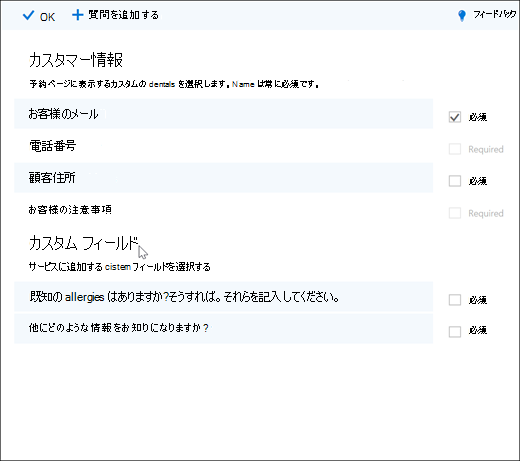
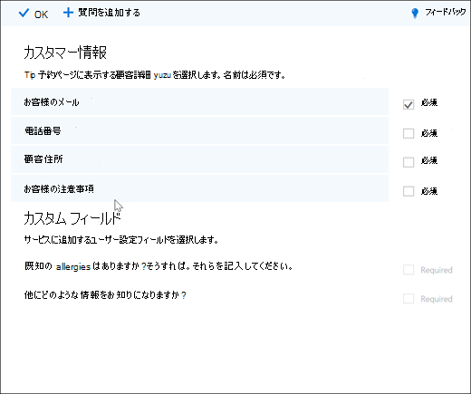

# 予約ページにカスタムおよび必要な質問を追加する

予約を使用すると、予定を予約している場合に、顧客にたずねる質問を作成できます。 また、必要な質問を選択することもできます。

質問をサービスに関連付けることで、各サービスに異なる一連の質問を含めることができます。 たとえば、ヘア stylist の予定を予約しているユーザーが、bleaches または濃淡に対する既知の allergies を持っている場合に、髪の色を予約していることがあります。 これにより、お客様とお客様は、予定に到着する時間を節約できます。

予約ページで予定を作成するときに、カスタムの質問が表示されます。 予約予定表から新しい予約を作成したり、既存の予定を表示したりすると、スタッフにカスタム質問が表示されます。 予約では、すべての質問がマスターリストに保存されるので、すべてのサービスについて同じ質問を再作成する必要はありません。 質問を必須にするか、省略可能にするかを選択することもできます。

> [!NOTE]
> 予約予定表で自分の予定を確認すると、お客様の質問に対する回答が表示されます。

予約ページをカスタマイズおよびカスタマイズする方法の詳細については、「 [予約ページをカスタマイズ](customize-booking-page.md)する」を参照してください。

## サービスにカスタムの質問を追加する

1. Microsoft 365 にサインインして、[ **予約**] に移動します。

1. [ **サービス** ] に移動し、既存のサービスを編集するか **、サービスを追加**します。

1. [ **ユーザー設定フィールド** ] セクションまで下にスクロールし、[ **変更**] を選択します。

   お客様の電子メール、電話番号、お客様の住所、お客様のメモなど、いくつかの基本的な顧客情報に関する質問が既に追加されています。 初めてこれを行うときは、お客様の情報に関する質問が灰色で強調表示されています。 これは、ユーザーにこの質問が表示されることを意味します。 質問を選択すると、その中の強調表示ボックスが非表示になり、お客様に質問するメッセージは表示されません。

   この例では、電話番号とお客様のノートがオフになっており、質問をするために2つの新しいカスタム質問を作成しました。

   

1. 必要な質問を行うには、 **必要な** チェックボックスをオンにします。 お客様は、必要な質問に回答しない限り、予約を完了できません。

1. カスタム質問を作成するには、パネルの上部にある [ **質問の追加** ] を選択します。 質問を記入し、[ **保存**] を選択します。

1. その質問をクリックして有効にします。 強調表示されたボックスが周囲に表示され、質問が有効になります。

1. ページの上部にある [ **Ok** ] をクリックし、 **サービスを保存**します。

予約では、同じ質問を繰り返し入力することなく、各サービスに質問を簡単に追加できるように、すべてのカスタム質問がマスターリストに保存されます。 たとえば、別のサービスを開いた場合、最初のサービスに対して作成した質問が [ユーザー設定フィールド] セクションに表示されますが、wil は無効になります。 [質問] をクリックすると、強調表示された四角形が表示され、質問が有効になります。

この例では、最初のサービスに対して追加された質問がこのサービスで利用可能であることを確認できます。 このサービスに対して作成した質問はすべてのサービスで利用可能になります。

   

予約ページが既に公開されている場合は、他に何もする必要はありません。 お客様には、次の質問が表示されます。 予約ページがまだ公開されていない場合は、web 上の Outlook から **予約ページ** に移動して、[ **保存して発行**] を選択します。

> [!WARNING]
> マスターリストから質問を削除することもできます。 ただし、質問を削除すると、すべてのサービスから削除されます。 他のサービスに影響がないように、この質問を選択して無効にすることをお勧めします。 強調表示されていない四角形で囲まれていない場合は、質問が無効になっていることを確認できます。

## カスタマー エクスペリエンス

顧客が予定を予約すると、[ **詳細の追加** ] セクションにお客様に関する基本的な情報が表示されます。 カスタマイズした質問がある場合は、「 **追加情報を提供** する」セクションに追加されます。

## スタッフの作業状況

顧客が予定を予約している場合、会議予定表の質問とお客様の回答がスタッフに表示されます。 これを確認するには、[**予約**予定表] に移動して、 \> **Calendar**予定を開きます。

