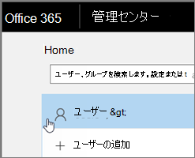

# <a name="delete-a-booking-calendar-in-bookings"></a><span data-ttu-id="1a024-103">予約された予定表を削除する</span><span class="sxs-lookup"><span data-stu-id="1a024-103">Delete a booking calendar in Bookings</span></span>

<span data-ttu-id="1a024-104">この記事では、不要な予約予定表を削除する方法について説明します。</span><span class="sxs-lookup"><span data-stu-id="1a024-104">This article explains how you can delete an unwanted booking calendar.</span></span> <span data-ttu-id="1a024-105">Microsoft 365 管理センターで予約予定表を削除するか、PowerShell を使用することができます。</span><span class="sxs-lookup"><span data-stu-id="1a024-105">You can delete the booking calendar in the Microsoft 365 admin center or you can use PowerShell.</span></span> <span data-ttu-id="1a024-106">予約予定表は、Exchange Online のメールボックスで、予約予定表を削除するために対応するユーザーアカウントを削除します。</span><span class="sxs-lookup"><span data-stu-id="1a024-106">The Bookings calendar is a mailbox in Exchange Online so you delete the corresponding user account to delete the booking calendar.</span></span>

> [!IMPORTANT]
> <span data-ttu-id="1a024-107">2017またはそれ以前に作成したすべての予約予定表は、このトピックの PowerShell の手順を使用して削除する必要があります。</span><span class="sxs-lookup"><span data-stu-id="1a024-107">All booking calendars that you created in 2017 or before must be deleted using the PowerShell instructions on this topic.</span></span> <span data-ttu-id="1a024-108">2018またはそれ以降に作成されたすべての予約予定表は、Microsoft 365 管理センターで削除できます。</span><span class="sxs-lookup"><span data-stu-id="1a024-108">All booking calendars created in 2018 or after can be deleted in the Microsoft 365 admin center.</span></span>

<span data-ttu-id="1a024-109">予約予定表は、予約された予定表とデータに関するすべての関連情報を格納する場所です。</span><span class="sxs-lookup"><span data-stu-id="1a024-109">The booking calendar is where all relevant information about that booking calendar and data are stored, including:</span></span>

- <span data-ttu-id="1a024-110">予約予定表を作成したときに追加された勤務先情報、ロゴ、および稼働時間</span><span class="sxs-lookup"><span data-stu-id="1a024-110">Business information, logo, and working hours added when the booking calendar was created</span></span>
- <span data-ttu-id="1a024-111">予約予定表の作成時に追加された関連スタッフとサービス</span><span class="sxs-lookup"><span data-stu-id="1a024-111">Relevant staff and services added when the booking calendar was created</span></span>
- <span data-ttu-id="1a024-112">予約された予定表に追加された予約および期間のすべての予定を予約します。</span><span class="sxs-lookup"><span data-stu-id="1a024-112">All bookings and time off appointments added to the booking calendar once it was created.</span></span>

> [!WARNING]
> <span data-ttu-id="1a024-113">予約予定表を削除すると、この追加情報も完全に削除され、回復できなくなります。</span><span class="sxs-lookup"><span data-stu-id="1a024-113">Once a booking calendar is deleted, this additional information is also permanently deleted and can't be recovered.</span></span>

## <a name="delete-a-booking-calendar-in-the-microsoft-365-admin-center"></a><span data-ttu-id="1a024-114">Microsoft 365 管理センターで予約予定表を削除する</span><span class="sxs-lookup"><span data-stu-id="1a024-114">Delete a booking calendar in the Microsoft 365 admin center</span></span>

1. <span data-ttu-id="1a024-115">Microsoft 365 管理センターに移動します。</span><span class="sxs-lookup"><span data-stu-id="1a024-115">Go to the Microsoft 365 admin center.</span></span>

1. <span data-ttu-id="1a024-116">管理センターで、[ **ユーザー** ] を選択します。</span><span class="sxs-lookup"><span data-stu-id="1a024-116">In the Admin center, select **Users**.</span></span>

   

1. <span data-ttu-id="1a024-118">[ **アクティブ ユーザー**] ページで、削除するユーザー名を選択して、[ **ユーザーの削除**] を選択します。</span><span class="sxs-lookup"><span data-stu-id="1a024-118">On the **Active Users** page, choose the names of the users that you want to delete, and then select **Delete user**.</span></span>

   

## <a name="delete-a-booking-calendar-using-exchange-online-powershell"></a><span data-ttu-id="1a024-120">Exchange Online の PowerShell を使用して予約予定表を削除する</span><span class="sxs-lookup"><span data-stu-id="1a024-120">Delete a booking calendar using Exchange Online PowerShell</span></span>

<span data-ttu-id="1a024-121">Exchange Online PowerShell への接続に関する前提条件とガイダンスについては、「 [Exchange Online powershell への接続](https://docs.microsoft.com/powershell/exchange/exchange-online-powershell-v2?view=exchange-ps) 」を参照してください。</span><span class="sxs-lookup"><span data-stu-id="1a024-121">See [Connect to Exchange Online PowerShell](https://docs.microsoft.com/powershell/exchange/exchange-online-powershell-v2?view=exchange-ps) for prerequisites and guidance for connecting to Exchange Online PowerShell.</span></span>

<span data-ttu-id="1a024-122">これらの手順を実行するには、[管理者として実行] オプションを選択して実行したアクティブな Microsoft PowerShell コマンドウィンドウを使用する必要があります。</span><span class="sxs-lookup"><span data-stu-id="1a024-122">To perform these steps, you must be using an active Microsoft PowerShell command window that you ran by choosing the “Run as administrator” option.</span></span>

1. <span data-ttu-id="1a024-123">次のコマンドを入力します。</span><span class="sxs-lookup"><span data-stu-id="1a024-123">Enter the following command:</span></span>

   ```PowerShell
    $user = get-credential
   ```

1. <span data-ttu-id="1a024-124">メッセージが表示されたら、完全に削除する予約予定表をホストする Microsoft 365 テナントに、テナント管理者の資格情報を使用してログオンします。</span><span class="sxs-lookup"><span data-stu-id="1a024-124">When you are prompted, log on with tenant administrator credentials to the Microsoft 365 tenant that hosts the booking calendar you want to permanently delete.</span></span>

1. <span data-ttu-id="1a024-125">PowerShell コマンドプロンプトで、次のコマンドを入力します。</span><span class="sxs-lookup"><span data-stu-id="1a024-125">At the PowerShell command prompt, enter this command:</span></span>

   ```PowerShell
    $s = New-Pssession -ConnectionUri https://outlook.office365.com/powershell-liveid -Credential $user -Authentication basic -AllowRedirection -ConfigurationName Microsoft.Exchange
   ```

1. <span data-ttu-id="1a024-126">次のコマンドを入力します。</span><span class="sxs-lookup"><span data-stu-id="1a024-126">Enter the following command:</span></span>

   ```PowerShell
    Import-PSSession $s
   ```

1. <span data-ttu-id="1a024-127">このコマンドの処理が終わったら、次のコマンドを入力して、テナントの予約メールボックスの一覧を取得します。</span><span class="sxs-lookup"><span data-stu-id="1a024-127">Once this command is done processing, enter the following command to get a list of the booking mailboxes in your tenant:</span></span>

   ```PowerShell
    get-mailbox -RecipientTypeDetails Scheduling
   ```

1. <span data-ttu-id="1a024-128">次のコマンドを入力します。</span><span class="sxs-lookup"><span data-stu-id="1a024-128">Type the following command:</span></span>

   ```PowerShell
   remove-mailbox [BookingCalendarToDelete]
   ```

   > [!IMPORTANT]
   > <span data-ttu-id="1a024-129">完全に削除する予約メールボックスのエイリアスの正確な名前を入力するように注意してください。</span><span class="sxs-lookup"><span data-stu-id="1a024-129">Be careful to type the exact name of the booking mailbox alias that you want to permanently delete.</span></span>

1. <span data-ttu-id="1a024-130">予定表が削除されたことを確認するには、次のコマンドを入力します。</span><span class="sxs-lookup"><span data-stu-id="1a024-130">To verify that the calendar has been deleted, enter the following command:</span></span>

   ```PowerShell
    get-mailbox -RecipientTypeDetails Scheduling
   ```

   <span data-ttu-id="1a024-131">削除された予定表は出力に表示されません。</span><span class="sxs-lookup"><span data-stu-id="1a024-131">The deleted calendar will not appear in the output.</span></span>
