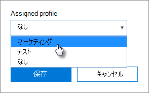

# AutoPilot プロファイルの作成と編集

## プロファイルの作成

プロファイルがデバイスまたはデバイスのグループに割り当てられます。
  
1. Microsoft 365 Business 管理センターで、[**デバイス** \> **自動操縦**] を選択します。
  
2. [**自動操縦**] ページで、 **[プロファイル] タブ** \>を選択してプロファイルを**作成**します。
    
3. [**プロファイルの作成**] ページで、「Marketing」などの特定に役立つプロファイルの名前を入力します。 目的の設定を有効にして、[**保存**] を選択します。 自動操縦プロファイル設定の詳細については、「[自動操縦プロファイル設定につい](autopilot-profile-settings.md)て」を参照してください。
    
    
  
### プロファイルをデバイスに適用する

プロファイルを作成したら、それをデバイスまたはデバイスのグループに適用できます。 [ステップバイステップガイド](add-autopilot-devices-and-profile.md)で既存のプロファイルを選択して新しいデバイスに適用したり、デバイスまたはデバイスのグループの既存のプロファイルを置き換えたりすることができます。 
  
1. [ **Windows の準備**] ページで、[ **デバイス**] タブを選びます。 
    
2. デバイス名の横にあるチェックボックスをオンにし、[**デバイス**] パネルで、[**割り当てられたプロファイル**] ドロップ\> **ダウンリストから**プロファイルを選択します。
    
    
  
## プロファイルの編集または削除

デバイスにプロファイルを割り当てると、そのデバイスを既にユーザーに渡していても、そのプロファイルを更新できます。デバイスをインターネットに接続すると、セットアップ プロセス中に最新バージョンのプロファイルをダウンロードします。ユーザーがデバイスを出荷時の既定の設定にリセットする場合は、デバイスはもう一度プロファイルに最新の更新プログラムをダウンロードします。 
  
### プロファイルを編集する

1. [ **Windows の準備**] ページで、[ **プロファイル**] タブを選びます。 
    
2. デバイス名の横にあるチェックボックスをオンにし、[**プロファイル**] パネルで、利用可能な\>設定の**保存**を更新します。
    
    ユーザーがデバイスをインターネットに接続する前にこの操作を行った場合、プロファイルはセットアップ プロセスに適用されます。
    
### プロファイルを削除する

1. [ **Windows の準備**] ページで、[ **プロファイル**] タブを選びます。 
    
2. デバイス名の横にあるチェックボックスをオンにし、[**プロファイル**] パネルで [**プロファイル** \>の**保存**の削除] を選択します。
    
    プロファイルを削除すると、プロファイルが割り当てられていたデバイスまたはデバイスのグループから削除されます。
    
### プロフィールを削除する

1. [ **Windows の準備**] ページで、[ **デバイス**] タブを選びます。 
    
2. デバイス名の横にあるチェックボックスをオンにし、 **[デバイス**] パネルで、[**割り当てられたプロファイル**] \>ドロップダウン**リストから [** **保存**] を選択します。
    
