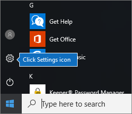

# Microsoft 365 Business Premium ユーザーの Windows デバイスをセットアップする

## Microsoft 365 Business Premium ユーザーの Windows デバイスをセットアップするための前提条件

Microsoft 365 Business Premium ユーザーの Windows デバイスをセットアップする前に、すべての Windows デバイスで Windows 10 Pro、バージョン 1703 (作成者の更新プログラム) が実行されていることを確認してください。 Windows 10 Pro は windows 10 Business を展開するための前提条件です。これは、Windows 10 Pro を補完する一連のクラウドサービスとデバイス管理機能であり、Microsoft 365 Business Premium の集中管理およびセキュリティ制御を有効にします。
  
Windows 7 Pro、Windows 8 Pro、または Windows 8.1 Pro を実行している Windows デバイスを使用している場合は、Microsoft 365 Business Premium サブスクリプションで Windows 10 のアップグレードができます。
  
Windows デバイスを Windows 10 Pro Creators Update にアップグレードする方法については、「[Windows デバイスを Windows Pro Creators Update にアップグレードする](upgrade-to-windows-pro-creators-update.md)」の手順に従います。
  
アップグレードが完了していることを確認するには、[ [デバイスが AZURE AD に接続されていること](#verify-the-device-is-connected-to-azure-ad) を確認する] を参照してください。

Microsoft 365 への Windows の接続に関する短いビデオをご覧ください。  

> [!VIDEO https://www.microsoft.com/videoplayer/embed/RE3yXh3] 

このビデオが役に立った場合には、「[complete training series for small businesses and those new to Microsoft 365 (小規模企業および Microsoft 365 を初めて使用する企業向けのトレーニング シリーズ)](https://support.microsoft.com/office/6ab4bbcd-79cf-4000-a0bd-d42ce4d12816)」をご覧ください。
  
## Windows 10 デバイスを組織の Azure AD に参加させる

組織内のすべての Windows デバイスを Windows 10 Pro クリエーターの更新プログラムにアップグレードするか、または Windows 10 Pro クリエーターの更新プログラムを既に実行している場合は、これらのデバイスを組織の Azure Active Directory に参加させることができます。 参加したデバイスは、Microsoft 365 Business Premium サブスクリプションの一部である Windows 10 Business に自動的にアップグレードされます。
  
### 新しい、または新たにアップグレードした Windows 10 Pro デバイスについて

Windows 10 Pro Creators Update が実行されている新しいデバイス、または Windows 10 Pro Creators Update にアップグレードしたが、Windows 10 デバイスのセットアップが完了していないデバイスについては、次の手順に従います。
  
1. [ **設定方法** ] ページが表示されるまで Windows 10 デバイスのセットアップを行います。 
    
    
  
2. ここで、[ **組織用に設定** ] を選択し、Microsoft 365 Business Premium のユーザー名とパスワードを入力します。 
    
3. Windows 10 デバイスのセットアップを完了します。
    
   完了すると、組織の Azure AD に接続されます。「[デバイスが Azure AD に接続されていることを確認する](#verify-the-device-is-connected-to-azure-ad)」を参照して確認します。 
  
### 既にセットアップして、Windows 10 Pro を実行しているデバイスの場合

 **ユーザーを Azure AD に接続する**
  
1. Windows 10 Pro バージョン 1703 (Creators Update) を実行しているユーザーの Windows PC で ([前提条件](pre-requisites-for-data-protection.md)を参照)、Windows ロゴ、[設定] アイコンの順にクリックします。
  
   
  
2. [ **設定** ] で [ **アカウント** ] に移動します。
  
   
  
3. On **Your info** page, click **Access work or school** \> **Connect** .
  
   
  
4. [ **職場または学校アカウントの設定** ] ダイアログの [ **別の操作** ] の下で、[ **このデバイスを Azure Active Directory に参加させる** ] を選びます。
  
   
  
5. On the **Let's get you signed in** page, enter your work or school account \> **Next** .
  
   On the **Enter password** page, enter your password \> **Sign in** .
  
   
  
6. [ **組織が組織** であることを確認してください] ページで、情報が正しいことを確認し、[ **参加** ] を選択します。
  
   [ **すべて完了しました。** ページ、[チョーク sse **完了** ]。
  
   ![[自分の組織になっていることを確認してください] 画面で、[参加] を選択します。](../media/c749c0a2-5191-4347-a451-c062682aa1fb.png)
  
ファイルを OneDrive for Business にアップロードした場合、それらの同期を取り消します。 サードパーティ製のツールを使用してプロファイルとファイルを移行した場合は、それらを新しいプロファイルにも同期します。
  
## デバイスが Azure AD に接続されていることを確認する

同期の状態を確認するには、[ **設定** ] の [ **職場または学校** へのアクセス] ページで、[ **接続先** ] _ \<organization name\> _ _ _ _ _ _ _ _ _ _」を選択し、ボタンの **情報** と **切断** を表示します。 [ **情報** ] を選択して同期の状態を取得します。 
  
[ **同期の状態** ] ページで、[ **同期** ] を選択して、PC に最新のモバイルデバイス管理ポリシーを取得します。
  
Microsoft 365 Business Premium アカウントの使用を開始するには、Windows の [ **スタート** ] ボタンに移動し、現在のアカウントの画像を右クリックして、 **アカウントを切り替え** ます。 自分の組織のメール アドレスとパスワードを使用してサインインします。
  

  
## PC が Windows 10 Business にアップグレードされていることを確認する

Microsoft 365 Business Premium サブスクリプションの一部として、Azure AD に参加している Windows 10 デバイスが Windows 10 Business にアップグレードされていることを確認します。
  
1. Go to **Settings** \> **System** \> **About** .
    
2. [ **エディション** ] が **Windows 10 Business** であることを確認します。
    
    
  
## 次の手順

モバイルデバイスをセットアップするには、「 [microsoft 365 Business Premium ユーザーのモバイルデバイス](set-up-mobile-devices.md)をセットアップする」を参照してください。デバイス保護またはアプリ保護ポリシーを設定するには、「 [Manage microsoft 365 for business](manage.md)」を参照してください。
  
## Microsoft 365 Business Premium の設定と使用の詳細については、「」を参照してください。

[一般法人向け Microsoft 365 のトレーニング ビデオ](https://support.microsoft.com/office/6ab4bbcd-79cf-4000-a0bd-d42ce4d12816)
