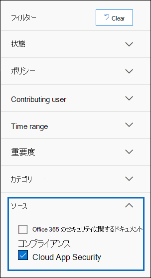

# <a name="alert-policies-in-the-security-and-compliance-center"></a>セキュリティ/コンプライアンスセンターのアラートポリシー

Office 365 および Microsoft 365 セキュリティ/コンプライアンスセンターの新しいアラートポリシーとアラートダッシュボードツールを使用して、アラートポリシーを作成し、アラートポリシーの条件に一致するアクティビティをユーザーが実行したときに生成されたアラートを表示することができます。 

アラートポリシー通知ポリシーを分類し、組織内のすべてのユーザーにポリシーを適用し、通知がトリガーされたときのしきい値レベルを設定し、電子メールを受信するかどうかを決定することによって、アクティビティアラートの機能を構築および拡張します。受け取る. セキュリティ/コンプライアンスセンターに [**通知の表示**] ページもあります。ここでは、通知の表示とフィルター処理、通知の管理に役立つアラート状態の設定、および基になるインシデントのアドレス指定または解決後の通知の破棄を行うことができます。 また、通知を作成できるイベントの種類も拡張しました。 たとえば、マルウェアの処理とデータ損失のインシデントを追跡するアラートポリシーを作成できます。 また、Exchange Online での管理者権限の割り当て、マルウェア攻撃、フィッシングキャンペーン、およびファイルの削除や外部共有の異常なレベルでの管理者権限の割り当てなどのアクティビティの監視に役立つ、いくつかの既定の通知ポリシーも用意してあります。

> [!NOTE]
> アラートポリシーは、Microsoft 365、Office 365 Enterprise、または Office 365 US Government E1/F1/G1、E3/G3、または E5/G5 サブスクリプションを使用する組織で利用できます。 高度な機能は、E5/G5 サブスクリプションを使用している組織、または E1/F1/G1 または E3/G3 サブスクリプションと Office 365 Advanced Threat Protection (ATP) P2 または Office 365 Advanced コンプライアンスアドオンサブスクリプションを持つ組織に対してのみ使用できます。 このトピックでは、E5/G5 またはアドオンサブスクリプションを必要とする機能が強調されています。 また、アラートポリシーは Office 365 GCC、GCC 高、および DoD 米国政府機関の環境で利用可能であることにも注意してください。

## <a name="how-alert-policies-work"></a>アラートポリシーのしくみ

アラートポリシーのしくみと、ユーザーまたは管理者のアクティビティがアラートポリシーの条件に一致した場合にトリガーとなるアラートの概要を以下に示します。


1. 組織内の管理者は、セキュリティ/コンプライアンスセンターの [**アラートポリシー** ] ページを使用して通知ポリシーを作成、構成、および有効にします。 セキュリティ & コンプライアンスセンターの PowerShell で、**新しい-protectionalert**コマンドレットを使用して警告ポリシーを作成することもできます。 通知ポリシーを作成するには、セキュリティ/コンプライアンスセンターで、[警告の管理] ロールまたは [組織の構成] の役割が割り当てられている必要があります。

2. ユーザーがアラートポリシーの条件に一致するアクティビティを実行する。 マルウェア攻撃の場合は、組織内のユーザーに送信される感染した電子メールメッセージがアラートをトリガーします。

3. Office 365 は、セキュリティ/コンプライアンスセンターの [**通知の表示**] ページに表示される通知を生成します。 また、通知ポリシーに対して電子メール通知が有効になっている場合、Office 365 は受信者の一覧に通知を送信します。 管理者またはその他のユーザーが [通知の表示] ページで確認できる通知は、ユーザーに割り当てられている役割によって決まります。 詳細については、「 [alerts の表示に必要な RBAC アクセス許可](#rbac-permissions-required-to-view-alerts)」セクションを参照してください。

4. 管理者は、セキュリティ/コンプライアンスセンターで通知を管理します。 通知の管理では、アラート状態を割り当てて、調査を追跡および管理することができます。

## <a name="alert-policy-settings"></a>アラートポリシーの設定

通知ポリシーは、通知を生成するユーザーまたは管理者のアクティビティを定義する一連のルールおよび条件で構成され、アクティビティを実行するとアラートをトリガーするユーザーのリスト、および通知の前にアクティビティが発生する回数を定義するしきい値で構成されます。がトリガーされます。 また、ポリシーを分類し、重要度レベルを割り当てます。 これらの2つの設定は、ポリシーを管理し、セキュリティ/コンプライアンスセンターで通知を表示するときにこれらの設定をフィルター処理できるため、アラートポリシー (およびポリシーの条件が一致したときにトリガーされるアラート) を管理するのに役立ちます。 たとえば、同じカテゴリの条件に一致する通知を表示したり、同じ重大度レベルで通知を表示したりすることができます。

通知ポリシーを表示および作成するには[https://protection.office.com](https://protection.office.com) 、に移動して、[アラート**ポリシー**の**通知** \> ] を選択します。

![セキュリティ/コンプライアンスセンターで、[通知] を選択し、[アラートポリシー] を選択して警告ポリシーを表示および作成します。](../media/09ebd451-8e84-44e1-aefc-63e70bba4d97.png)

通知ポリシーは、次の設定と条件で構成されています。

- **[アラートが追跡されているアクティビティ**]-アクティビティを追跡するためのポリシーを作成します。また、共有して、アクセス許可を割り当てたり、匿名リンクを作成したりすることによって、外部ユーザーとファイルを共有するなど、いくつかの関連アクティビティを追跡するポリシーを作成します。 ユーザーがポリシーによって定義されたアクティビティを実行すると、アラートのしきい値の設定に基づいて警告がトリガーされます。

    > [!NOTE]
    > 追跡できる活動は、組織の Office 365 Enterprise または Office 365 US Government プランによって異なります。 一般に、マルウェアキャンペーンおよびフィッシング攻撃に関連するアクティビティには、 [Office 365 Advanced Threat Protection](../security/office-365-security/office-365-atp.md)プラン2アドオンサブスクリプションを使用した E5/G5 サブスクリプションまたは E1/F1/G1 または E3/G3 サブスクリプションが必要です。

- **アクティビティの条件**-ほとんどのアクティビティでは、アラートをトリガーするために満たす必要がある追加の条件を定義できます。 一般的な条件には IP アドレスが含まれています (つまり、ユーザーが特定の IP アドレスまたは IP アドレスの範囲内のコンピューターでアクティビティを実行したときにアラートがトリガーされます)。特定のユーザーまたはユーザーがそのアクティビティを実行した場合にアラートをトリガーするかどうか、およびアクティビティは、特定のファイル名または URL に対して実行されます。 組織内のユーザーによってアクティビティが実行されたときに通知をトリガーする条件を構成することもできます。 利用可能な条件は、選択したアクティビティに依存します。

- **アラートがトリガーされたとき**に、通知がトリガーされるまでにアクティビティが発生する頻度を定義する設定を構成できます。 これにより、特定のしきい値を超えたときに、アクティビティがポリシー条件に一致するたびに、またはアラートが追跡されているアクティビティの発生が組織にとって異常な状態になったときに、警告を生成するポリシーを設定できます。

    

    通常とは異なるアクティビティに基づいて設定を選択すると、Office 365 は、選択されたアクティビティの標準頻度を定義する基準値を確立します。 この基準を確立するには最大7日間かかりますが、通知は生成されません。 ベースラインが確立されると、通知ポリシーによって追跡されたアクティビティの頻度が基準値を大幅に超えたときに、アラートがトリガーされます。 監査関連のアクティビティ (ファイルアクティビティやフォルダーアクティビティなど) については、単一のユーザーに基づいて、または組織内のすべてのユーザーに基づいてベースラインを設定することができます。マルウェア関連のアクティビティについては、1つのマルウェアファミリ、単一の受信者、または組織内のすべてのメッセージに基づいてベースラインを確立できます。

    > [!NOTE]
    > しきい値に基づいて、または異常なアクティビティに基づいて警告ポリシーを構成する機能を使用するには、E5/G5 サブスクリプション、または Office 365 ATP P2 または Advanced コンプライアンスアドオンサブスクリプションを使用した E1/F1/G1 または E3/G3 サブスクリプションが必要です。 E1/F1/G1 および E3/G3 サブスクリプションを持つ組織は、アクティビティが発生するたびにアラートがトリガーされるアラートポリシーのみを作成できます。

- **アラートカテゴリ**-ポリシーによって生成されたアラートの追跡と管理に役立つように、次のカテゴリのいずれかをポリシーに割り当てることができます。

  - データ損失防止

  - 情報ガバナンス

  - メール フロー

  - アクセス許可

  - 脅威の管理

  - その他

  アラートポリシーの条件に一致するアクティビティが発生すると、生成されたアラートに、この設定で定義されたカテゴリでタグが付けられます。 これにより、カテゴリに基づいて通知を並べ替えてフィルター処理できるため、セキュリティ/コンプライアンスセンターの [**通知の表示**] ページで同じカテゴリ設定を持つ通知を追跡して管理することができます。

- **アラートの重要度**-アラートカテゴリと同様に、重大度属性 (**低**、**中**、**高**、または**情報**) を警告ポリシーに割り当てます。 警告カテゴリと同様に、アラートポリシーの条件に一致するアクティビティが発生すると、生成されたアラートは、アラートポリシーに設定されているのと同じ重大度レベルでタグ付けされます。 これにより、[**通知の表示**] ページで同じ重要度が設定された通知を追跡して管理することができます。 たとえば、警告の一覧をフィルター処理して、重要度の**高い**通知のみが表示されるようにすることができます。

    > [!TIP]
    > 通知ポリシーを設定する場合は、ユーザーへの配信後のマルウェアの検出、機密データの表示、外部ユーザーとのデータの共有など、重大な悪影響を及ぼす可能性のあるアクティビティに、重要度の高いものを割り当てることを検討してください。または、データ損失またはセキュリティ上の脅威につながる可能性があるその他のアクティビティ。 これにより、根本的な原因を調査して解決するために、アラートの優先順位付けと操作を行うことができます。

- **電子メール通知**-通知がトリガーされたときに、電子メール通知がユーザーのリストに送信 (または送信されない) されるようにポリシーを設定できます。 通知の最大数に達すると、その日に通知が送信されなくなるように、毎日の通知制限を設定することもできます。 電子メール通知に加えて、管理者または他の管理者は、[**通知の表示**] ページでポリシーによってトリガーされた通知を表示できます。 特定のカテゴリの警告ポリシーの電子メール通知を有効にするか、またはより高い重要度の設定を使用することを検討してください。

## <a name="default-alert-policies"></a>既定の通知ポリシー

Office 365 には、Exchange 管理者のアクセス許可の悪用、マルウェアのアクティビティ、外部および内部の脅威、および情報ガバナンスのリスクを特定するのに役立つ組み込みの通知ポリシーが用意されています。 [**通知ポリシー** ] ページでは、これらの組み込みポリシーの名前が太字で、ポリシーの種類が**System**として定義されています。 これらのポリシーは既定で有効になっています。 これらのポリシーをオフにする (または、再度オンに戻す) か、電子メール通知を送信する受信者の一覧を設定し、毎日の通知制限を設定することができます。 これらのポリシーのその他の設定を編集することはできません。

次の表に、使用可能な既定の通知ポリシーと、各ポリシーに割り当てられているカテゴリを示します。 カテゴリは、[通知の表示] ページでユーザーが表示できる通知を決定するために使用されます。 詳細については、「 [alerts の表示に必要な RBAC アクセス許可](#rbac-permissions-required-to-view-alerts)」セクションを参照してください。

また、この表は、それぞれに必要な Office 365 Enterprise および Office 365 US 自治体プランを示しています。 組織が E1/F1/G1 または E3/G3 サブスクリプションに加えて適切なアドオンサブスクリプションを持っている場合は、一部の既定の通知ポリシーを使用できます。

|**既定の通知ポリシー**|**説明**|**Category**|**Office 365 Enterprise サブスクリプション**|
|:-----|:-----|:-----|:-----|
|**悪意のある可能性がある URL のクリックが検出されました**|組織内の[Office 365 の ATP Safe リンク](../security/office-365-security/atp-safe-links.md)によって保護されているユーザーが悪意のあるリンクをクリックしたときにアラートを生成します。 このイベントは、URL verdict の変更が Office 365 ATP によって識別された場合、またはユーザーが Office 365 ATP Safe Links ページを上書きした場合にトリガーされます (組織の Office 365 ATP 安全リンクポリシーに基づいて)。 このアラートポリシーには、**高い**重要度が設定されています。 Office 365 ATP P2、E5、G5 のお客様の場合、このアラートは[office 365 で自動調査と応答](https://go.microsoft.com/fwlink/?linkid=2084737)を自動的にトリガーします。 このアラートをトリガーするイベントの詳細については、「 [Office 365 ATP セーフリンクポリシーの設定](../security/office-365-security/set-up-atp-safe-links-policies.md)」を参照してください。|脅威の管理|E5/G5 または Office 365 ATP P2 アドオンサブスクリプション|
|**管理者送信の結果が完了**|[管理者](../security/office-365-security/admin-submission.md)による提出で、送信されたエンティティの再スキャンが完了したときにアラートを生成します。 再スキャン結果が管理者送信からレンダリングされるたびに、警告がトリガーされます。 これらのアラートは、[以前の送信の結果を確認](https://protection.office.com/reportsubmission)し、ユーザーが報告したメッセージを送信して最新のポリシーチェックおよび再スキャンを行うように通知することを目的としており、組織内のフィルターポリシーが意図した影響を verdicts ているかどうかを判断するのに役立ちます。 このポリシーには重要度の**低い**設定があります。|脅威の管理|E1/F1、E3、または E5|
|**転送/リダイレクトルールの作成**|組織内のユーザーが自分のメールボックスの受信トレイルールを作成し、別の電子メールアカウントにメッセージを転送またはリダイレクトしたときに通知を生成します。 このポリシーでは、web 上の Outlook (旧称 Outlook Web App) または Exchange Online PowerShell を使用して作成された受信トレイルールのみを追跡します。 このポリシーには重要度の**低い**設定があります。 受信トレイルールを使用して Outlook on the web で電子メールを転送およびリダイレクトする方法の詳細については、「Use rules in Outlook on the web」を参照してください。[メッセージを別のアカウントに自動的に転送](https://support.office.com/article/1433e3a0-7fb0-4999-b536-50e05cb67fed)します。|脅威の管理|E1/F1/G1、E3/G3、または E5/G5|
|**電子情報開示検索の開始またはエクスポート**|ユーザーがセキュリティ/コンプライアンスセンターでコンテンツ検索ツールを使用したときに通知を生成します。 次のコンテンツ検索アクティビティが実行されると、アラートがトリガーされます。 <br/><br/>•コンテンツ検索が開始されます。<br/>•コンテンツ検索の結果がエクスポートされます。<br/>•コンテンツ検索レポートがエクスポートされます。<br/><br/>また、以前のコンテンツ検索アクティビティが電子情報開示ケースに関連して実行された場合にも、アラートがトリガーされます。 このポリシーには、**中程度**の重要度が設定されています。 コンテンツ検索アクティビティの詳細については、「 [Office 365 監査ログで電子情報開示アクティビティを検索](search-for-ediscovery-activities-in-the-audit-log.md#ediscovery-activities)する」を参照してください。|脅威の管理|E1/F1/G1、E3/G3、または E5/G5|
|**Exchange 管理者特権の昇格**|ユーザーが Exchange Online 組織で管理者権限を割り当てられたときに通知を生成します。 たとえば、Exchange Online の組織の管理役割グループにユーザーが追加されたとき。 このポリシーには重要度の**低い**設定があります。|アクセス許可|E1/F1/G1、E3/G3、または E5/G5|
|**配信後に削除されたマルウェアを含む電子メールメッセージ**|マルウェアを含むメッセージが組織内のメールボックスに配信されたときにアラートを生成します。 このイベントが発生した場合、Office 365 は、[自動削除をゼロ時間](../security/office-365-security/zero-hour-auto-purge.md)にして、感染したメッセージを Exchange Online メールボックスから削除します。 このポリシーには、[**情報**] の重要度が設定されており、 [Office 365 で自動調査と応答](https://go.microsoft.com/fwlink/?linkid=2084737)が自動的にトリガーされます。|脅威の管理|E5/G5 または Office 365 ATP P2 アドオンサブスクリプション|
|**配信後に削除されたフィッシング Url を含む電子メールメッセージ**|フィッシングを含むメッセージが組織内のメールボックスに配信されたときにアラートを生成します。 このイベントが発生した場合、Office 365 は、[自動削除をゼロ時間](../security/office-365-security/zero-hour-auto-purge.md)にして、感染したメッセージを Exchange Online メールボックスから削除します。 このポリシーには、[**情報**] の重要度が設定されており、 [Office 365 で自動調査と応答](https://go.microsoft.com/fwlink/?linkid=2084737)が自動的にトリガーされます。|脅威の管理|E5/G5 または Office 365 ATP P2 アドオンサブスクリプション|
|**ユーザーがマルウェアまたはフィッシングとして報告した電子メール**|組織内のユーザーがレポートメッセージアドインを使用してメッセージをフィッシング電子メールとして報告したときに通知を生成します。 このポリシーには、**情報**が含まれる重要度の設定があります。 このアドインの詳細については、「[レポートメッセージアドインを使用する](https://support.office.com/article/b5caa9f1-cdf3-4443-af8c-ff724ea719d2)」を参照してください。 Office 365 ATP P2、E5、G5 のお客様の場合、このアラートは[office 365 で自動調査と応答](https://go.microsoft.com/fwlink/?linkid=2084737)を自動的にトリガーします。|脅威の管理|E1/F1/G1、E3/G3、または E5/G5|
|**メール送信の制限を超えました**|組織内のユーザーが、送信スパムポリシーで許可されているよりも多くのメールを送信した場合に通知を生成します。 これは通常、ユーザーが送信している電子メールが多すぎることや、アカウントが侵害されている可能性があることを示しています。 このポリシーには、**中程度**の重要度が設定されています。 このアラートポリシーによって生成されたアラートを受け取った場合は、[ユーザーアカウントが侵害さ](../security/office-365-security/responding-to-a-compromised-email-account.md)れていないかどうかを確認することをお勧めします。|脅威の管理|E1/F1/G1、E3/G3、または E5/G5|
|**メッセージが遅延しています**|Office 365 がコネクタを使用してオンプレミスの組織またはパートナーサーバーに電子メールメッセージを配信できない場合にアラートを生成します。 これが発生すると、メッセージは Office 365 でキューに入れられます。 この警告は、キューに格納されているメッセージが1時間以上の場合2000に発生します。 このポリシーには、**高い**重要度が設定されています。|メール フロー|E1/F1/G1、E3/G3、または E5/G5|
|**配信後に検出されたマルウェアキャンペーン**|マルウェアを含む非常に大量のメッセージが組織内のメールボックスに配信されたときにアラートを生成します。 このイベントが発生すると、Office 365 は感染したメッセージを Exchange Online メールボックスから削除します。 このポリシーには、**高い**重要度が設定されています。|脅威の管理|E5/G5 または Office 365 ATP P2 アドオンサブスクリプション|
|**検出されブロックされたマルウェアキャンペーン**|組織内のユーザーに特定の種類のマルウェアを含む大量の電子メールメッセージを送信しようとした場合に警告を生成します。 このイベントが発生した場合、感染したメッセージは Office 365 によってブロックされ、メールボックスに配信されません。 このポリシーには重要度の**低い**設定があります。|脅威の管理|E5/G5 または Office 365 ATP P2 アドオンサブスクリプション|
|**SharePoint および OneDrive で検出されたマルウェアキャンペーン**|組織内の SharePoint サイトまたは OneDrive アカウントに存在するファイルで、非常に大量のマルウェアまたはウイルスが検出された場合にアラートを生成します。 このポリシーには、**高い**重要度が設定されています。|脅威の管理|E5/G5 または Office 365 ATP P2 アドオンサブスクリプション|
|**テナントまたはユーザーの上書き1のため、フィッシングが配信**<sup>1</sup>されました|Office 365 が管理者またはユーザーによる上書きを検出し、メールボックスへのフィッシングメッセージの配信を許可した場合に通知を生成します。 上書きの例としては、特定の送信者またはドメインからのメッセージ、または特定の送信者またはドメインからのメッセージを許可するスパム対策ポリシーの受信トレイやメールフロールールなどがあります。 このポリシーには、**高い**重要度が設定されています。|脅威の管理|E5/G5 または Office 365 ATP P2 アドオンサブスクリプション|
|**疑わしい電子メール送信パターンが検出された**|組織内のユーザーが疑わしい電子メールを送信したときに、電子メールの送信が制限される危険がある場合に、アラートを生成します。 これは、アカウントが侵害されているが、ユーザーを制限するのに十分ではないことを示している可能性のある動作に関する初期警告です。 このポリシーには、**中程度**の重要度が設定されています。 めったにありませんが、このポリシーによって生成されたアラートが異常になることがあります。 ただし、[ユーザーアカウントが侵害されているかどうかを確認](../security/office-365-security/responding-to-a-compromised-email-account.md)することをお勧めします。|脅威の管理|E1/F1/G1、E3/G3、または E5/G5  |
|**テナントのメール送信からの制限**|組織からのほとんどの電子メールトラフィックが疑わしいとして検出され、Microsoft によって組織が電子メールの送信を制限している場合にアラートを生成します。 侵害されている可能性のあるユーザーおよび管理者アカウント、新しいコネクタ、または第三者中継を調査し、Microsoft サポートに連絡して組織のブロックを解除します。 このポリシーには、**高い**重要度が設定されています。 組織がブロックされる理由の詳細については、「 [Exchange Online でエラーコード 5.7.7 xx のメール配信の問題を修正する](https://go.microsoft.com/fwlink/?linkid=2022138)」を参照してください。|脅威の管理|E1/F1/G1、E3/G3、または E5/G5|
|**異常な外部ユーザーファイルアクティビティ**|SharePoint または OneDrive 内のファイルに対して、組織外のユーザーによって、非常に多くのアクティビティが実行されたときにアラートを生成します。 これには、ファイルへのアクセス、ファイルのダウンロード、ファイルの削除などの操作が含まれます。 このポリシーには、**高い**重要度が設定されています。|情報ガバナンス|E5/G5、Office 365 ATP P2、または Advanced コンプライアンスアドオンサブスクリプション|
|**外部ファイル共有の特異なボリューム**|SharePoint または OneDrive で、非常に多くのファイルが組織外のユーザーと共有されている場合にアラートを生成します。 このポリシーには、**中程度**の重要度が設定されています。|情報ガバナンス|E5/G5、Office 365 ATP P2、または Advanced コンプライアンスアドオンサブスクリプション|
|**ファイル削除の異常なボリューム**|短時間の間に SharePoint または OneDrive で大量のファイルが削除されたときにアラートを生成します。 このポリシーには、**中程度**の重要度が設定されています。|情報ガバナンス|E5/G5、Office 365 ATP P2、または Advanced コンプライアンスアドオンサブスクリプション|
|**フィッシングとして報告される電子メールの例外的な増加**|Outlook のレポートメッセージアドインを使用してメッセージをフィッシングメールとして報告することによって、組織内のユーザー数が大幅に増加した場合にアラートを生成します。 このポリシーには、**高い**重要度が設定されています。 このアドインの詳細については、「[レポートメッセージアドインを使用する](https://support.office.com/article/b5caa9f1-cdf3-4443-af8c-ff724ea719d2)」を参照してください。|脅威の管理|E5/G5 または Office 365 ATP P2 アドオンサブスクリプション|
|**受信トレイ/フォルダー**<sup>1、</sup><sup>2</sup>に配信されるユーザー偽装フィッシング|Office 365 によって、管理者またはユーザーによる上書きにより、メールボックスの受信トレイ (または他のユーザーがアクセス可能なフォルダー) へのユーザー偽装フィッシングメッセージの配信が許可されたことを検出したときにアラートを生成します。 上書きの例としては、特定の送信者またはドメインからのメッセージ、または特定の送信者またはドメインからのメッセージを許可するスパム対策ポリシーの受信トレイやメールフロールールなどがあります。 このポリシーには、**中程度**の重要度が設定されています。|脅威の管理|E5/G5 または Office 365 ATP P2 アドオンサブスクリプション|
|**ユーザーが電子メールの送信を制限されている**|組織内のユーザーが送信メールの送信を制限されている場合に通知を生成します。 通常、アカウントが侵害され、ユーザーがセキュリティ & コンプライアンスセンターの [**制限**されたユーザー] ページに一覧表示されます。 (このページにアクセスするには、[脅威の管理] に移動して、制限された**ユーザー > > を確認**してください)。 このポリシーには、**高い**重要度が設定されています。 制限されたユーザーの詳細については、「[ユーザー、ドメイン、または IP アドレスをスパム電子メール送信後のブロック一覧から削除する](https://docs.microsoft.com/office365/securitycompliance/removing-user-from-restricted-users-portal-after-spam)」を参照してください。|脅威の管理|E1/F1/G1、E3/G3、または E5/G5|
|||||

> [!NOTE]
> <sup>1</sup>お客様のフィードバックに基づいて、この既定の通知ポリシーを一時的に削除しました。 この機能は改善され、近い将来、新しいバージョンに置き換えられる予定です。 その後、次の設定を使用して、この機能を置き換えるカスタムのアラートポリシーを作成できます。<br/>&nbsp;•配信時に検出されたフィッシング電子メール<br/>&nbsp;•メールは ZAP されていません。<br/>&nbsp;•メールの方向は受信です<br/>&nbsp;•メール配信の状態が配信される<br/>&nbsp;•検出テクノロジは、悪意のある URL の保持、URL 分析、高度なフィッシングフィルター、一般的なフィッシングフィルター、ドメイン偽装、ユーザー偽装、およびブランド偽装です。<br/><br/>&nbsp;&nbsp;&nbsp;Office 365 のフィッシング対策の詳細については、「[フィッシング対策とフィッシング対策ポリシーを設定](../security/office-365-security/set-up-anti-phishing-policies.md)する」を参照してください。<br/><br/><sup>2</sup>この通知ポリシーを再作成するには、前の脚注のガイダンスに従いますが、唯一の検出テクノロジとして [User impersonation] を選択します。

いくつかの組み込みポリシーによって監視される異常な動作は、前に説明した警告のしきい値の設定と同じプロセスに基づいています。 Office 365 は、"通常" アクティビティの通常の頻度を定義する基準値を確立します。 組み込みの通知ポリシーによって追跡されたアクティビティの頻度が基準値を大幅に超過すると、通知がトリガーされます。

## <a name="viewing-alerts"></a>通知の表示

組織内のユーザーによって実行されたアクティビティがアラートポリシーの設定と一致すると、セキュリティ/コンプライアンスセンターの [**通知の表示**] ページに通知が生成され、表示されます。 通知ポリシーの設定によっては、通知がトリガーされたときに、指定したユーザーの一覧に電子メール通知も送信されます。 通知ごとに、[**通知の表示**] ページのダッシュボードに、対応するアラートポリシーの名前、アラートの重要度とカテゴリ、およびアラートが生成されたアクティビティが発生した回数が表示されています。 この値は、アラートポリシーのしきい値の設定に基づいています。 ダッシュボードには、各警告の状態も表示されます。 Status プロパティを使用した通知の管理の詳細については、「 [alerts の管理](#managing-alerts)」セクションを参照してください。

通知を表示するには[https://protection.office.com](https://protection.office.com) 、に移動して、[アラート] [**警告を表示**する]**を選択** \>します。

![[セキュリティとコンプライアンス] で、[通知] を選択し、[通知の表示] を選択して通知を表示します。](../media/ec5ea59b-bf61-459f-8b65-970ab4bb8bcc.png)

[**通知の表示**] ページですべての通知のサブセットを表示するには、次のフィルターを使用します。

- **現状.** 特定の状態に割り当てられた通知を表示するには、このフィルターを使用します。 既定の状態は [**アクティブ**です。 ユーザーまたは他の管理者は、状態の値を変更できます。

- **原則.** このフィルターを使用して、1つ以上の警告ポリシーの設定に一致する通知を表示します。 または、すべてのアラートポリシーのすべての通知を表示することもできます。

- **時間の範囲。** このフィルターを使用して、特定の日付と時間の範囲内で生成された通知を表示します。

- **重大度.** このフィルターを使用して、特定の重要度が割り当てられた通知を表示します。

- **項目.** このフィルターを使用して、1つまたは複数の通知カテゴリからの通知を表示します。

- **ソース.** このフィルターを使用して、セキュリティセンターとコンプライアンスセンターで、または Office 365 Cloud App Security policies またはその両方によってトリガーされたアラートポリシーで通知される通知を表示します。 Office 365 Cloud App Security alerts の詳細については、「 [Cloud App security alerts の表示](#viewing-cloud-app-security-alerts)」セクションを参照してください。

## <a name="rbac-permissions-required-to-view-alerts"></a>通知を表示するために必要な RBAC アクセス許可

組織内のユーザーに割り当てられた役割ベースのアクセス制御 (RBAC) アクセス許可によって、ユーザーが [**通知の表示**] ページに表示できる通知が決まります。 これにはどのような方法がありますか。 ユーザーに割り当てられた管理役割 (セキュリティ & コンプライアンスセンターの役割グループのメンバーシップに基づいて) によって、ユーザーが [通知の**表示**] ページに表示できる通知カテゴリが決まります。 次に例を示します。

- レコード管理役割グループのメンバーは、**情報ガバナンス**カテゴリに割り当てられているアラートポリシーによって生成されたアラートのみを表示できます。

- コンプライアンス管理者役割グループのメンバーは、**脅威管理**カテゴリに割り当てられたアラートポリシーによって生成されたアラートを表示できません。

- 電子情報開示マネージャーの役割グループのメンバーは、任意のアラートカテゴリからの通知を表示するアクセス許可を与えられていないため、すべてのアラートを表示できません。

この設計 (RBAC アクセス許可に基づいて) を使用すると、組織内の特定のジョブの役割でユーザーが表示できる (または管理されている) アラートを判断できます。

次の表に、6つの異なるアラートカテゴリからの通知を表示するために必要な役割を示します。 表の最初の列には、セキュリティ & コンプライアンスセンターのすべての役割が一覧表示されています。  チェックマークは、その役割を割り当てられているユーザーが、先頭行に表示されている対応する警告カテゴリから通知を表示できることを示します。

既定の通知ポリシーが割り当てられているカテゴリを確認するには、[[既定の警告ポリシー](#default-alert-policies) ] セクションの表を参照してください。

|&nbsp;|情報ガバナンス|データ損失防止|メール フロー|アクセス許可|脅威の管理|その他|
|:---------|:---------:|:---------:|:---------:|:---------:|:---------:|:---------:|
|監査ログ|||||||
|ケース管理|||||||
|コンプライアンス管理者|||||||
|コンプライアンス検索|||||||
|デバイスの管理|||||||
|廃棄管理|||||||
|DLP コンプライアンス管理|||||||
|エクスポート|||||||
|Hold|||||||
|通知の管理|||||||
|組織の構成|||||||
|プレビュー|||||||
|レコード管理|||||||
|保持管理|||||||
|レビュー|||||||
|RMS の暗号化解除|||||||
|役割管理|||||||
|検索と消去|||||||
|セキュリティ管理者|||||||
|セキュリティ閲覧者||||||
|サービス保証ビュー|||||||
|監督レビュー管理者|||||||
|表示のみの監査ログ|||||||
|表示専用のデバイス管理|||||||
|表示のみの DLP コンプライアンス管理|||||||
|表示のみの通知の管理|||||||
|"View-Only Recipients/表示専用受信者"|||  ||||
|表示専用のレコード管理|||||||
|表示のみの保持管理|||||||
|||||||

**ヒント:** 各既定の役割グループに割り当てられている役割を表示するには、セキュリティ & コンプライアンスセンターの PowerShell で次のコマンドを実行します。

```PowerShell
$RoleGroups = Get-RoleGroup
```

```PowerShell
$RoleGroups | foreach {Write-Output -InputObject `r`n,$_.Name,"-----------------------"; Get-RoleGroup $_.Identity | Select-Object -ExpandProperty Roles}
```

セキュリティ & コンプライアンスセンターで、役割グループに割り当てられている役割を表示することもできます。 [**権限**] ページに移動して、役割グループを選択します。 割り当てられた役割は、フライアウトページに表示されます。

## <a name="managing-alerts"></a>通知の管理

通知が生成され、セキュリティ/コンプライアンスセンターの [**通知の表示**] ページに表示されたら、それらをトリアージ、調査、および解決することができます。 通知を管理するために実行できるタスクを次に示します。

- **通知に状態を割り当てます。** 次のいずれかの状態を通知に割り当てることができます:**アクティブ**(既定値)、**調査**、**解決**、または**消去**。 その後、この設定をフィルター処理して、同じ状態の設定で通知を表示できます。 この状態設定は、通知の管理プロセスを追跡するのに役立ちます。

- **通知の詳細を表示します。** 通知を選択すると、通知の詳細を含むポップアップページが表示されます。 詳細情報は、対応するアラートポリシーによって異なりますが、通常は、通知をトリガーした実際の操作の名前 (コマンドレットなど)、警告をトリガーしたアクティビティの説明、ユーザー (またはユーザーのリスト) が含まれます。アラートをトリガーしたユーザー、および対応するアラートポリシーの名前 (およびリンク)。

  - コマンドレットまたは監査ログ操作など、警告をトリガーした実際の操作の名前。

  - アラートをトリガーしたアクティビティの説明。

  - 警告をトリガーしたユーザー。 これは、1人のユーザーまたは1つのアクティビティを追跡するように設定された警告ポリシーに対してのみ含まれます。

  - 通知によって追跡されたアクティビティが実行された回数。 この数は、通知がトリガーされている可能性があるため、[通知の表示] ページに表示されている関連する通知の実際の数と一致しない場合があります。

  - 通知をトリガーした、実行された各アクティビティのアイテムを含むアクティビティリストへのリンク。 このリストの各エントリは、アクティビティがいつ発生したか、実際の操作の名前 ("FileDeleted" など)、アクティビティを実行したユーザー、アクティビティが実行されたオブジェクト (ファイル、電子情報開示ケース、メールボックスなど)、および IPユーザーのコンピューターのアドレス。 マルウェア関連の警告については、このリンクをメッセージリストにリンクします。

  - 対応するアラートポリシーの名前 (およびリンク先)。

- **電子メール通知を抑制します。** 通知のポップアップページからの電子メール通知をオフ (または抑制) することができます。 電子メール通知を抑制すると、Office 365 は、通知ポリシーの条件に一致するアクティビティまたはイベントが発生したときに通知を送信しません。 ただし、ユーザーが実行したアクティビティがアラートポリシーの条件と一致すると、アラートがトリガーされます。 通知ポリシーを編集して、電子メール通知をオフにすることもできます。

- **アラートを解決します。** アラートのポップアップページで、アラートを解決済みとしてマークすることができます (アラートの状態が [**解決済み**] に設定されています)。 フィルターを変更しない限り、解決済みの通知は [**通知の表示**] ページに表示されません。

## <a name="viewing-cloud-app-security-alerts"></a>Cloud App Security alerts の表示

Office 365 Cloud App Security ポリシーによってトリガーされた通知は、セキュリティ/コンプライアンスセンターの [**通知の表示**] ページに表示されるようになりました。 これには、Office 365 Cloud App Security の異常検出ポリシーによってトリガーされたアクティビティポリシーとアラートによってトリガーされるアラートが含まれます。 これは、セキュリティ/コンプライアンスセンターですべての警告を表示できることを意味します。 Office 365 Cloud App Security は、Office 365 Enterprise E5 または Office 365 US Government G5 サブスクリプションを使用している組織に対してのみ使用できます。 詳細については、「 [Cloud App Security の概要](https://docs.microsoft.com/cloud-app-security/what-is-cloud-app-security)」を参照してください。

Microsoft Cloud App Security を Enterprise Mobility + Security E5 サブスクリプションの一部として、またはスタンドアロンサービスとして持っている組織では、セキュリティ & コンプライアンスセンターの Office 365 アプリおよびサービスに関連する Cloud App Security alerts を表示することもできます。

セキュリティ/コンプライアンスセンターで Cloud App Security alerts のみを表示するには、**ソース**フィルターを使用して、[ **cloud app security**] を選択します。



セキュリティ/コンプライアンスセンターのアラートポリシーによってトリガーされるアラートに似ていますが、Cloud App Security アラートを選択して、通知の詳細を示すフライアウトページを表示することができます。 通知には、Cloud App Security portal で詳細情報を表示し、アラートを管理するためのリンクが含まれています。これには、アラートをトリガーした対応する Cloud App Security policy へのリンクが含まれています。 「 [Cloud App Security でアラートを監視](https://docs.microsoft.com/cloud-app-security/monitor-alerts)する」を参照してください。


> [!IMPORTANT]
> セキュリティ/コンプライアンスセンターの Cloud App Security アラートの状態を変更しても、Cloud App Security ポータルで同じアラートの解決状態は更新されません。 たとえば、セキュリティ/コンプライアンスセンターでアラートの状態を [**解決済み**] としてマークした場合、Cloud App security ポータルのアラートの状態は変更されません。 Cloud App Security のアラートを解決または破棄するには、Cloud App Security ポータルで通知を管理します。
