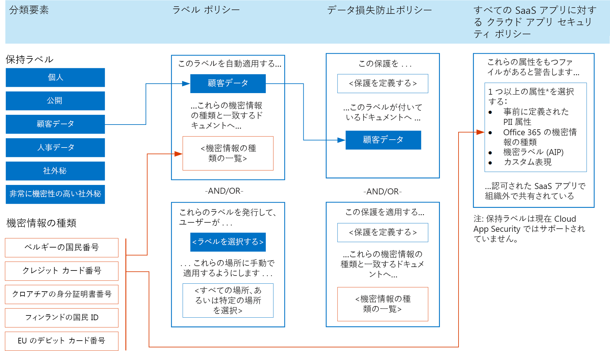

# 個人データにラベルを適用する

 GDPR 保護計画の一環として、分類ラベルを使用している場合は、このトピックを使用します。 

Microsoft 365 で個人データを保護するためにラベルを使用している場合は、[保持ラベル](retention.md#retention-labels)を使用することをお勧めします。 保持ラベルを使用すると、次のことができます。
- アドバンスト データ ガバナンスを使用して、機密情報の種類やその他の基準に基づいてラベルを自動的に適用できます。
- データ損失防止機能を備えた保持ラベルを使用して、保護を適用できます。 
- 電子情報開示とコンテンツの検索でラベルを使用できます。 

現在、Cloud App Security は保持ラベルをサポートしていません。ただし、Microsoft 365 の機密情報を Cloud App Security と併用して、別の SaaS アプリにある個人データを監視することはできます。

[機密ラベル](sensitivity-labels.md)は現在、オンプレミスのファイル、その他のクラウド サービスのファイル、プロバイダーにラベルを適用する場合に推奨されています。 また、営業秘密ファイルなどのデータ保護用の Azure Information Protection 暗号化を必要とする Microsoft 365 のファイルにも推奨されます。

現時点では、GDPR の対象となるデータを含む Microsoft 365 のファイルに対して Azure Information Protection を使用して暗号化を適用することは、推奨されていません。 現在、Microsoft 365 サービスでは AIP で暗号化されたファイルへの読み取りはできません。 そのため、サービスでこれらのファイル内の機密データを検索することはできません。

保持ラベルは Exchange Online のメールに適用できます。これらのラベルは Microsoft 365 のデータ損失防止と連動することができます。 

この図について:

-   SharePoint Online および OneDrive for Business では、個人データや厳しく規制された営業秘密ファイルに保持ラベルを使用します。
-   Microsoft 365 の機密情報の種類を Microsoft 365 内と Cloud App Security で使用して、別の SaaS アプリにある個人データを監視できます。
-   厳しく規制された営業秘密ファイル、Exchange Online 電子メール、他の SaaS サービスのファイル、オンプレミスのデータセンターのファイル、他のクラウド プロバイダーのファイルには、機密ラベルを使用します。

## 情報を保護するために Microsoft 365 全体で保持ラベルと機密情報の種類を使用する

次の図は、ラベル ポリシー、データ損失防止ポリシー、Cloud App Security ポリシーで保持ラベルと機密情報の種類を使用する方法を示しています。

次の表では、図での例と同じものを見やすいように記載しています。

<table>
<thead>
<tr class="header">
<th align="left"><strong>分類の要素</strong></th>
<th align="left"><strong>ラベル ポリシー — 2 つの例</strong></th>
<th align="left"><strong>データ損失防止ポリシー — 2 つの例</strong></th>
<th align="left"><strong>すべての SaaS アプリの Cloud App Security ポリシー — 1 つの例</strong></th>
</tr>
</thead>
<tbody>
<tr class="odd">
<td align="left">保持ラベル。 例: 個人、公開、顧客のデータ、人事データ、社外秘、非常に機密性の高い社外秘</td>
<td align="left">
Auto apply this label . . .

顧客データ

. . . to documents that match these sensitive information types . . .

&lt;機密情報の種類の例の一覧&gt;
</td>
<td align="left">
Apply this protection . . .

&lt;保護の定義&gt;

. . . to documents with this label . . .

顧客データ
</td>
<td align="left">
Alert when files with these attributes . . .

1 つまたは複数の属性を選択します: 定義済みの PII 属性、Microsoft 365 の機密情報の種類、秘密度ラベル (AIP)、カスタム式

。 。 。 組織外で共有された際に警告します

注: 現在、保持ラベルは Cloud App Security ではサポートされていません。</td>
</tr>
<tr class="even">
<td align="left">Sensitive information types. Examples: Belgium National Number, Credit Card Number, Croatia Identity Cart Number, Finland National ID</td>
<td align="left">
Publish these labels for users to manually apply . . .

&lt;ラベルの選択&gt;

. . . to these locations . . .

&lt;すべての場所、あるいは特定の場所を選択&gt;
</td>
<td align="left">
Apply this protection . . .

&lt;保護の定義&gt;

. . . to documents that match these sensitive information types&gt;
</td>
<td align="left"></td>
</tr>
</tbody>
</table>

## 自動適用ラベル ポリシーの優先順位付け

For personal data that is subject to GDPR, Microsoft recommends auto-applying labels by using the sensitive information types you curated for your environment. It is important that auto-apply label policies are well designed and tested to ensure the intended behavior occurs.

The order that auto-apply policies are created and whether users are also applying these labels affect the result. So, it's important to carefully plan the roll-out. Here's what you need to know.

### 一度に 1 つのラベルを適用する

ドキュメントに割り当てることができるラベルの数は 1 つのみです。

### 優先されるのは古いポリシー

If there are multiple rules that assign an auto-apply label and content meets the conditions of multiple rules, the label for the oldest rule is assigned. For this reason, it's important to plan the label policies carefully before configuring them. If an organization requires a change to the priority of the label policies, they'll need to delete and recreate them.

### 自動適用ラベルよりもユーザーが手動で適用したラベルが優先される

Manual user applied labels trump auto-applied labels. Auto-apply policies can't replace a label that is already applied by a user. Users can replace labels that are auto-applied.

### 自動的に割り当てられたラベルは更新可能

自動的に割り当てられたラベルは、新しいラベル ポリシーにより、または既存のポリシーを更新することによって最新の状態にすることができます。

ラベルを実装する際に重要な点:

- 自動適用ポリシーが作成される順序の優先順位付けを行います。

- Allowing enough time for labels to be automatically applied before rolling these out for users to manually apply. It can take up to seven days for the labels to be applied to all content that matches the conditions.

### 自動適用ポリシー作成の優先順位の例

<table>
<thead>
<tr class="header">
<th align="left"><strong>ラベル</strong></th>
<th align="left"><strong>自動適用ポリシーの作成順序の優先順位</strong></th>
</tr>
</thead>
<tbody>
<tr class="odd">
<td align="left">人事 — 従業員データ</td>
<td align="left">1</td>
</tr>
<tr class="even">
<td align="left">顧客データ</td>
<td align="left">2</td>
</tr>
<tr class="odd">
<td align="left">非常に機密性の高い社外秘</td>
<td align="left">3</td>
</tr>
<tr class="even">
<td align="left">人事 — 給与データ</td>
<td align="left">4</td>
</tr>
<tr class="odd">
<td align="left">社外秘</td>
<td align="left">5</td>
</tr>
<tr class="even">
<td align="left">公開</td>
<td align="left">6</td>
</tr>
<tr class="odd">
<td align="left">個人</td>
<td align="left">自動適用ポリシーなし</td>
</tr>
</tbody>
</table>

## ラベルおよび自動適用ラベル ポリシーの作成

セキュリティ センターまたはコンプライアンス センターで、ラベルおよびポリシーを作成します。

<table>
<thead>
<tr class="header">
<th align="left"><strong>手順</strong></th>
<th align="left"><strong>説明</strong></th>
</tr>
</thead>
<tbody>
<tr class="odd">
<td align="left">
コンプライアンス チームのメンバーにアクセス許可を与えます。
</td>
<td align="left">
Members of your compliance team who will create labels need permissions to use the security center and/or the compliance center. Go to Permissions in the security center or the compliance center and modify the members of the Compliance Administrator group.

「<a href="https://docs.microsoft.com/microsoft-365/security/office-365-security/grant-access-to-the-security-and-compliance-center">ユーザーにセキュリティ センターやコンプライアンス センターへのアクセス権を付与する</a>」を参照してください。
</td>
</tr>
<tr class="even">
<td align="left">
保持ラベルを作成します。
</td>
<td align="left">セキュリティ センターまたはコンプライアンス センターの [分類] に移動し、[保持ラベル] を選択して、使用している環境のラベルを作成します。</td>
</tr>
<tr class="odd">
<td align="left">
ラベルの自動適用ポリシーを作成します。
</td>
<td align="left">Go to Classification in security center or the compliance center, choose Label policies, and create the policies for auto-applying labels. Be sure to create these policies in the prioritized order.</td>
</tr>
</tbody>
</table>

次の図は、顧客データ ラベル用の自動適用ラベルを作成する方法を示しています。

この図について:

- "顧客データ" ラベルが作成されます。

- GDPR の必要な機密情報の種類 (ベルギーの国民番号、クレジット カード番号、クロアチアの身分証明書番号、フィンランドの国民 ID) が記載されています。

- 自動適用ポリシーを作成すると、ポリシーに追加する機密情報の種類のいずれかを含むファイルに、"顧客データ" ラベルが割り当てられます。
