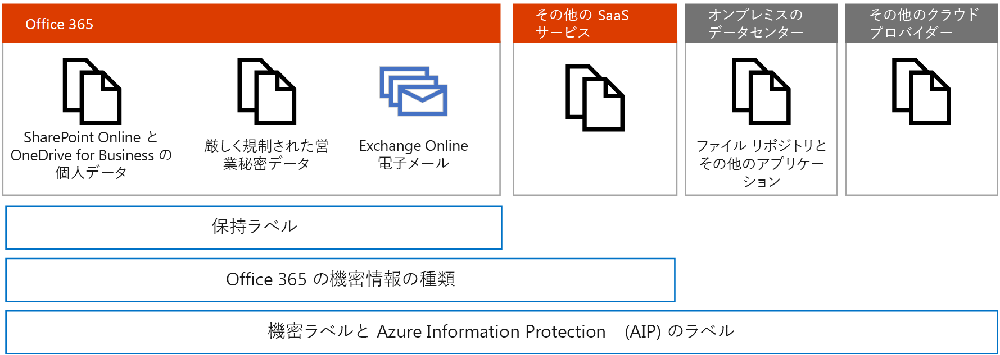
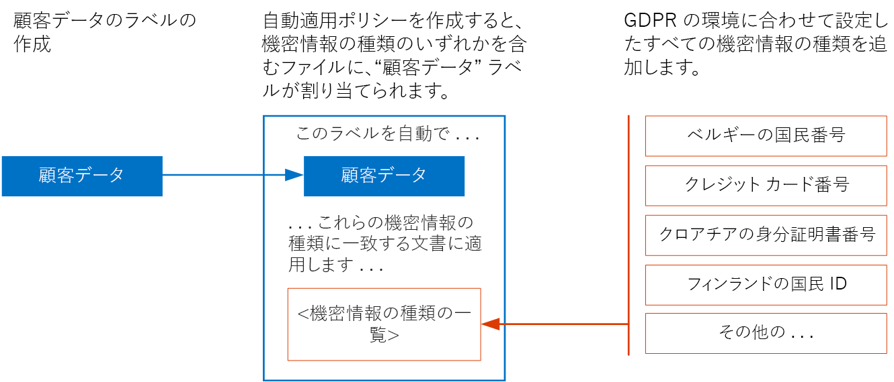

# 個人データにラベルを適用する

 GDPR 保護計画の一環として、分類ラベルを使用している場合は、このトピックを使用します。 

Microsoft 365 で個人データを保護するためにラベルを使用している場合は、[保持ラベル](retention.md#retention-labels)を使用することをお勧めします。 保持ラベルを使用すると、次のことができます。
- アドバンスト データ ガバナンスを使用して、機密情報の種類やその他の基準に基づいてラベルを自動的に適用できます。
- データ損失防止機能を備えた保持ラベルを使用して、保護を適用できます。 
- 電子情報開示とコンテンツの検索でラベルを使用できます。 

現在、Cloud App Security は保持ラベルをサポートしていません。ただし、Microsoft 365 の機密情報を Cloud App Security と併用して、別の SaaS アプリにある個人データを監視することはできます。

[機密ラベル](sensitivity-labels.md)は現在、オンプレミスのファイル、その他のクラウド サービスのファイル、プロバイダーにラベルを適用する場合に推奨されています。 また、営業秘密ファイルなどのデータ保護用の Azure Information Protection 暗号化を必要とする Microsoft 365 のファイルにも推奨されます。

現時点では、GDPR の対象となるデータを含む Microsoft 365 のファイルに対して Azure Information Protection を使用して暗号化を適用することは、推奨されていません。 現在、Microsoft 365 サービスでは AIP で暗号化されたファイルへの読み取りはできません。 そのため、サービスでこれらのファイル内の機密データを検索することはできません。

保持ラベルは Exchange Online のメールに適用できます。これらのラベルは Microsoft 365 のデータ損失防止と連動することができます。 

この図について:

-   SharePoint Online および OneDrive for Business では、個人データや厳しく規制された営業秘密ファイルに保持ラベルを使用します。
-   Microsoft 365 の機密情報の種類を Microsoft 365 内と Cloud App Security で使用して、別の SaaS アプリにある個人データを監視できます。
-   厳しく規制された営業秘密ファイル、Exchange Online 電子メール、他の SaaS サービスのファイル、オンプレミスのデータセンターのファイル、他のクラウド プロバイダーのファイルには、機密ラベルを使用します。

## 情報を保護するために Microsoft 365 全体で保持ラベルと機密情報の種類を使用する

次の図は、ラベル ポリシー、データ損失防止ポリシー、Cloud App Security ポリシーで保持ラベルと機密情報の種類を使用する方法を示しています。

次の表では、図での例と同じものを見やすいように記載しています。

<table>
<thead>
<tr class="header">
<th align="left"><strong>分類の要素</strong></th>
<th align="left"><strong>ラベル ポリシー — 2 つの例</strong></th>
<th align="left"><strong>データ損失防止ポリシー — 2 つの例</strong></th>
<th align="left"><strong>すべての SaaS アプリの Cloud App Security ポリシー — 1 つの例</strong></th>
</tr>
</thead>
<tbody>
<tr class="odd">
<td align="left">保持ラベル。 例: 個人、公開、顧客のデータ、人事データ、社外秘、非常に機密性の高い社外秘</td>
<td align="left">
このラベルを自動で . . .

顧客データ

. . . これらの機密情報の種類に一致する文書に適用します . . .

&lt;機密情報の種類の例の一覧&gt;
</td>
<td align="left">
この保護を . . .

&lt;保護の定義&gt;

. . . このラベルを持つドキュメントに適用します . . .

顧客データ
</td>
<td align="left">
承認された SaaS アプリのこれらの属性を持つファイルが . . .

1 つまたは複数の属性を選択します: 定義済みの PII 属性、Microsoft 365 の機密情報の種類、秘密度ラベル (AIP)、カスタム式

。 。 。 組織外で共有された際に警告します

注: 現在、保持ラベルは Cloud App Security ではサポートされていません。</td>
</tr>
<tr class="even">
<td align="left">機密情報の種類。例: ベルギーの国民番号、クレジット カード番号、クロアチアの身分証明書番号、フィンランドの国民 ID</td>
<td align="left">
これらのラベルを発行して、ユーザーが . . .

&lt;ラベルの選択&gt;

. . . これらの場所に手動で適用するようにします . . .

&lt;すべての場所、あるいは特定の場所を選択&gt;
</td>
<td align="left">
この保護を . . .

&lt;保護の定義&gt;

. . . これらの機密情報の種類に一致する文書に適用します&gt;
</td>
<td align="left"></td>
</tr>
</tbody>
</table>

## 自動適用ラベル ポリシーの優先順位付け

GDPR の対象となる個人データについては、環境に合わせて設定した機密情報の種類を使用してラベルを自動適用することをお勧めします。自動適用ラベル ポリシーは、意図した動作が確実に行われるように、適切に設計され、テストされていることが重要です。

自動適用ポリシーが作成される順序と、ユーザーもこれらのラベルを適用するかどうかによって結果が異なってきます。したがって、ポリシーの作成とラベルの適用を慎重に計画する必要があります。重要なポイントを次に示します。

### 一度に 1 つのラベルを適用する

ドキュメントに割り当てることができるラベルの数は 1 つのみです。

### 優先されるのは古いポリシー

自動適用ラベルを割り当てるルールが複数あり、コンテンツが複数のルールの条件を満たす場合は、最も古いルールのラベルが割り当てられます。このため、ラベル ポリシーを構成する前に注意深く計画することが重要です。組織がラベル ポリシーの優先順位を変更する必要がある場合は、ラベル ポリシーを削除して再度作成する必要があります。

### 自動適用ラベルよりもユーザーが手動で適用したラベルが優先される

ユーザーが手動で適用したラベルは、自動適用ラベルよりも優先されます。自動適用ポリシーでは、ユーザーがすでに適用しているラベルを置き換えることはできませんが、ユーザーは、自動適用されたラベルを置き換えることができます。

### 自動的に割り当てられたラベルは更新可能

自動的に割り当てられたラベルは、新しいラベル ポリシーにより、または既存のポリシーを更新することによって最新の状態にすることができます。

ラベルを実装する際に重要な点:

- 自動適用ポリシーが作成される順序の優先順位付けを行います。

- ユーザーが手動でラベルを適用する前に、ラベルが自動適用されるまで十分な時間の余裕があります。条件に一致するすべてのコンテンツにラベルが適用されるまでに最大 7 日間かかることがあります。

### 自動適用ポリシー作成の優先順位の例

<table>
<thead>
<tr class="header">
<th align="left"><strong>ラベル</strong></th>
<th align="left"><strong>自動適用ポリシーの作成順序の優先順位</strong></th>
</tr>
</thead>
<tbody>
<tr class="odd">
<td align="left">人事 — 従業員データ</td>
<td align="left">1</td>
</tr>
<tr class="even">
<td align="left">顧客データ</td>
<td align="left">2</td>
</tr>
<tr class="odd">
<td align="left">非常に機密性の高い社外秘</td>
<td align="left">3</td>
</tr>
<tr class="even">
<td align="left">人事 — 給与データ</td>
<td align="left">4</td>
</tr>
<tr class="odd">
<td align="left">社外秘</td>
<td align="left">5</td>
</tr>
<tr class="even">
<td align="left">公開</td>
<td align="left">6</td>
</tr>
<tr class="odd">
<td align="left">個人</td>
<td align="left">自動適用ポリシーなし</td>
</tr>
</tbody>
</table>

## ラベルおよび自動適用ラベル ポリシーの作成

セキュリティ センターまたはコンプライアンス センターで、ラベルおよびポリシーを作成します。

<table>
<thead>
<tr class="header">
<th align="left"><strong>手順</strong></th>
<th align="left"><strong>説明</strong></th>
</tr>
</thead>
<tbody>
<tr class="odd">
<td align="left">
コンプライアンス チームのメンバーにアクセス許可を与えます。
</td>
<td align="left">
ラベルを作成するコンプライアンス チームのメンバーには、セキュリティ センターやコンプライアンス センターを使用するためのアクセス許可が必要です。セキュリティ センターまたはコンプライアンス センターの [アクセス許可] に移動し、コンプライアンス管理者グループのメンバーを変更します。

「<a href="https://docs.microsoft.com/microsoft-365/security/office-365-security/grant-access-to-the-security-and-compliance-center">ユーザーにセキュリティ センターやコンプライアンス センターへのアクセス権を付与する</a>」を参照してください。
</td>
</tr>
<tr class="even">
<td align="left">
保持ラベルを作成します。
</td>
<td align="left">セキュリティ センターまたはコンプライアンス センターの [分類] に移動し、[保持ラベル] を選択して、使用している環境のラベルを作成します。</td>
</tr>
<tr class="odd">
<td align="left">
ラベルの自動適用ポリシーを作成します。
</td>
<td align="left">セキュリティ センターまたはコンプライアンスセンターの [分類] に移動し、[ラベル ポリシー] を選択し、自動適用ラベルのポリシーを作成します。これらのポリシーは、優先順位に従って作成してください。</td>
</tr>
</tbody>
</table>

次の図は、顧客データ ラベル用の自動適用ラベルを作成する方法を示しています。

この図について:

- "顧客データ" ラベルが作成されます。

- GDPR の必要な機密情報の種類 (ベルギーの国民番号、クレジット カード番号、クロアチアの身分証明書番号、フィンランドの国民 ID) が記載されています。

- 自動適用ポリシーを作成すると、ポリシーに追加する機密情報の種類のいずれかを含むファイルに、"顧客データ" ラベルが割り当てられます。
