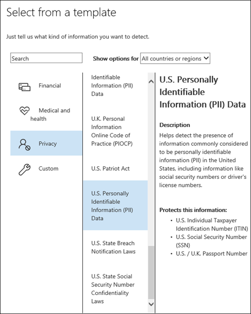

# 保持ラベルを自動的に適用してコンテンツを保持または削除する

>*[セキュリティとコンプライアンスのための Microsoft 365 ライセンス ガイダンス](https://aka.ms/ComplianceSD)。*

[保持ラベル](retention.md)の最も強力な機能の 1 つは、指定した条件に一致したコンテンツに自動的にラベルを適用することです。 この場合、組織内のユーザーが保持ラベルを適用する必要はありません。 Microsoft 365 が行います。
  
自動適用アイテム保持ラベルが強力な機能である理由は次のとおりです。
  
- ユーザーのトレーニングは、一部の分類方法についてのみ必要。
    
- ユーザーへの依存は、一部のコンテンツを正しく分類するためにのみ必要。
    
- ユーザーはデータ ガバナンス ポリシーについて把握する必要がなくなるので、仕事に集中できる。
    
コンテンツに機密情報、キーワード、[トレーニング可能な分類子](classifier-getting-started-with.md)のマッチが含まれている場合、保持ラベルをコンテンツに自動的に適用できます。
    
保持ラベルを自動的に適用するプロセスは、次の条件に基づいています。

次の手順を 2 つの管理手順に使用します。

> [!NOTE]
> 自動ポリシーで、保持ラベルを自動的に適用するための条件によりサービス側でのラベル付けを使用します。 次の操作を行うときにラベル ポリシーを使用して保持ラベルを自動的に適用することもできます。 
>
> - SharePoint ライブラリ、フォルダー、ドキュメントに既定の保持ラベルを適用して、そのコンテナー内のラベルのないコンテンツに自動的にラベルが付けられるようにする
>- ルールを使用して、保持ラベルをメールに自動的に適用する
>
> これらのシナリオについては、[アイテム保持ラベルを作成してアプリに適用する](create-apply-retention-labels.md)を参照してください。

## はじめに

組織のグローバル管理者には、保持ラベルとそれらのポリシーを作成および編集できる完全な権限があります。 グローバル管理者としてサインインしていない場合は、「[アイテム保持ポリシーと保持ラベルを作成して管理するために必要なアクセス許可](get-started-with-retention.md#permissions-required-to-create-and-manage-retention-policies-and-retention-labels)」を参照してください。

## 保持ラベルを自動適用する方法

まず、保持ラベルを作成します。 次に、そのラベルを適用する自動ポリシーを作成します。 保持ラベルを既に作成してある場合は、[自動ポリシーの作成](#step-2-create-an-auto-apply-policy)に進んでください。

ナビゲーション手順は、[レコード管理](records-management.md)を使用しているかどうかによって異なります。 両方のシナリオの手順を説明します。

### 手順 1: 保持ラベルを作成する

1. [Microsoft 365 コンプライアンス センター](https://compliance.microsoft.com/)で、次のいずれかの場所に移動します。
    
    - レコード管理を使用している場合:
        - [**ソリューション**] > [**レコード管理**] > [**ファイル計画**] タブ > [**+ラベルを作成**] > [**保持ラベル**]
        
    - レコード管理を使用していない場合:
       - [**ソリューション**] > [**情報ガバナンス**] > [**ラベル**] タブ > + [**ラベルを作成**]
    
    すぐにオプションが表示されませんか? 最初に [**すべて表示**] を選択します。 

2. ウィザードでプロンプトに従います。 レコード管理を使用している場合:
    
    - ファイル計画記述子については、「[Use file plan to manage retention labels (ファイル計画を使用して保持ラベルを管理する)](file-plan-manager.md)」を参照してください。
    
    - 保持ラベルを使用してコンテンツをレコードとして宣言するには、[**このラベルを使用して、コンテンツを「レコード」に分類する**] チェックボックスをオンにします。

既存のラベルを編集するには、そのラベルを選択してから [**ラベルの編集**] を選択し、手順 2 からラベルの説明や[有効な設定](#updating-retention-labels-and-their-policies)を変更するための同じウィザードを開始します。 または、使用可能な **[編集]** オプションのいずれかを選択して、関連するページに直接アクセスして更新を行うこともできます。

### 手順 2: 自動適用ポリシーを作成する

自動適用ポリシーを作成する場合、指定した条件に基づいてコンテンツに自動的に適用する保持ラベルを選択します。

1. [Microsoft 365 コンプライアンス センター](https://compliance.microsoft.com/)で、次のいずれかの場所に移動します。
    
    - レコード管理を使用している場合: **情報ガバナンス**:
        - [**ソリューション**] > [**レコード管理**] > [**ラベル ポリシー**] タブ > [**自動適用ラベル**]
    
    - レコード管理を使用していない場合:
        - [**ソリューション**] > [**情報ガバナンス**] > [**ラベル ポリシー**] タブ > [**自動適用ラベル**]
    
    すぐにオプションが表示されませんか? 最初に [**すべて表示**] を選択します。 

2. ウィザードでプロンプトに従います。
    
    保持ラベルを自動的に適用する条件の構成については、このページの「[自動適用の保持ラベルの条件の構成](#configuring-conditions-for-auto-apply-retention-labels)」セクションをご覧ください。
    
    保持ラベルでサポートされている場所については、「[保持ラベルと場所](retention.md#retention-label-policies-and-locations)」のセクションをご覧ください。

既存の自動適用ラベル ポリシーを編集するには、そのラベルを選択してから [**ポリシーの編集**] を選択し、手順 2 からポリシーの説明や[有効な設定](#updating-retention-labels-and-their-policies)を変更するための同じウィザードを開始します。 または、利用可能な**編集**オプションを選択して、関連するページに直接アクセスして更新を行うこともできます。

### 自動適用の保持ラベルの条件の構成

コンテンツに次の内容が含まれている場合は、保持ラベルを自動的にコンテンツに適用できます。

- [特定の種類の機密情報](#auto-apply-labels-to-content-with-specific-types-of-sensitive-information)

- [作成したクエリに一致する特定のキーワード](#auto-apply-labels-to-content-with-keywords-or-searchable-properties)

- [トレーニング可能な分類子の一致](#auto-apply-labels-to-content-by-using-trainable-classifiers)

#### 特定の種類の機密情報によるコンテンツへのラベルの自動適用

機密情報用に自動適用の保持ラベルを作成するときに、データ損失防止 (DLP) ポリシーを作成するときと同じポリシー テンプレートの一覧が表示されます。 各ポリシー テンプレートは、特定の種類の機密情報を見つけるように事前に設定されています。 たとえば、次に示すテンプレートは、米国の ITIN、SSN、パスポート番号を探します。 DLP の詳細については、「[データ損失防止ポリシーの概要](data-loss-prevention-policies.md)」を参照してください。
  

  
ポリシー テンプレートを選択すると、すべての種類の機密情報を追加または削除したり、インスタンス数と一致精度を変更したりできます。ここに示す例では、保持ラベルは次の場合にのみ自動的に適用されます。
  
- コンテンツに、次の 3 種類の機密情報のいずれかに 1 から 9 個のインスタンスが含まれる場合。**最大** 値を削除して、**任意** の値に変更できます。
    
- 検出される機密情報の種類には、一致精度 (または信頼度) が少なくとも 75 はあります。 機密情報の種類の多くは、複数のパターンで定義されています。高い一致精度が指定されたパターンにはより多くの証拠 (キーワード、日付、アドレスなど) が見つかることが必要とされるのに対して、低い一致精度が指定されたパターンでは必要とされる証拠は少なくなります。 **最小**一致精度が低いほど、コンテンツは条件に一致しやすくなります。 
    
これらのオプションの詳細については、「[一致の難易度を設定するためのルールの調整](data-loss-prevention-policies.md#tuning-rules-to-make-them-easier-or-harder-to-match)」をご覧ください。
    

  
#### キーワードまたは検索可能なプロパティによるコンテンツへの自動適用ラベル

特定の条件を満たすコンテンツにラベルを自動的に適用できます。現在利用可能な条件では、特定の単語、フレーズ、または検索可能なプロパティの値を含むコンテンツへのラベルの適用がサポートされています。AND、OR、NOT などの検索演算子を使用してクエリを絞り込むことができます。

クエリ構文の詳細については、次を参照してください。

- [キーワード クエリ言語 (KQL) 構文のリファレンス](https://docs.microsoft.com/sharepoint/dev/general-development/keyword-query-language-kql-syntax-reference)

クエリ ベースのラベルは検索インデックスを使用してコンテンツを特定します。有効な検索可能なプロパティの詳細については、以下を参照してください。

- [コンテンツ検索のキーワード クエリと検索条件](keyword-queries-and-search-conditions.md)
- [クロールされたプロパティと管理プロパティの概要 (SharePoint Server)](https://docs.microsoft.com/SharePoint/technical-reference/crawled-and-managed-properties-overview)

クエリの例:

- Exchange
    - subject:"Quarterly Financials"
    - 受信者: garthf<!--nolink-->@contoso.com
- SharePoint および OneDrive
    - contenttype:contract
    - site:https<!--nolink-->://contoso.sharepoint.com/sites/teams/procurement AND contenttype:contract

#### トレーニング可能な分類子を使用して、ラベルをコンテンツに自動的に適用する

トレーニング可能な分類子のオプションを選択すると、組み込み分類子またはカスタム分類子のいずれかを選択できます。 組み込み分類子には、**履歴書**、**ソース コード**、**個人を標的にしたハラスメント**、**冒とく**、および**脅威**が含まれます。

> [!CAUTION]
> 組み込みの [**不快な言葉**] は、誤検知の数が多いため、廃止予定です。 この組み込み分類子を使用しないでください。現在使用している場合は、ビジネス プロセスを移動する必要があります。 代わりに、[**個人を標的にしたハラスメント**]、[**冒涜的表現**]、および [**脅威**] の組み込み分類子を使用することをお勧めします。

このオプションを使用してラベルを自動的に適用するには、SharePoint Online サイトとメールボックスには少なくとも 10 MB のデータが必要です。

トレーニング可能な分類子の詳細については、「[トレーニング可能な分類子 (プレビュー) の概要](classifier-getting-started-with.md)」を参照してください。

構成の例については、「[組み込みの分類子を準備して使用する方法](classifier-using-a-ready-to-use-classifier.md#how-to-verify-that-a-built-in-classifier-will-meet-your-needs)」を参照してください。

## 保持ラベルが有効になるまでの所要時間

保持ラベルを自動適用する場合、条件に一致する既存のコンテンツすべてに保持ラベルが適用されるまでに最大 7 日間かかります。
  

  
## 保持ラベルとそのポリシーの更新

保持ラベルや自動適用ポリシーを編集すると、その保持ラベルが既にコンテンツに適用されている場合、新しく識別されるコンテンツに加えて、そのコンテンツにも更新された設定が自動的に適用されます。

ラベルやポリシーを作成して保存した後には変更できない設定があり、それらは以下のものを含みます。
- 作成日時に基づいてコンテンツを保持または削除するようにラベルを構成していない場合を除いた、保持期間以外の保持設定。
- レコードとして分類するオプション。

## 次の手順

別の形式のオートメーションである[イベント ベースの保持](event-driven-retention.md)による保持ラベルの使用を検討します。 この構成を使用すると、指定したイベントによって保持の開始がトリガーされます。 イベント ベースの保持は、自動ポリシーやラベル ポリシーと組み合わせて使用できます。

SharePont の管理プロパティを使用して保持ラベルを自動適用し、イベント ドリブンの保持を実装する詳細なシナリオについては、「[保持ラベルを使用して SharePoint ドキュメントのライフサイクルを管理する](auto-apply-retention-labels-scenario.md)」を参照してください。