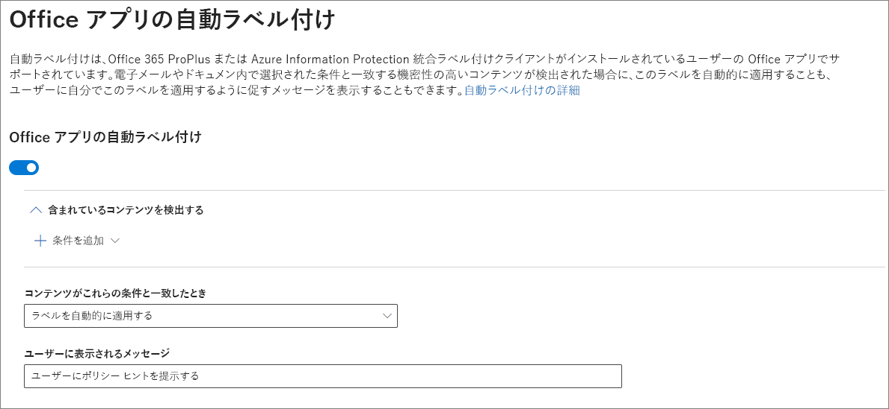

# 機密ラベルをコンテンツに自動的に適用するApply a sensitivity label to content automatically

機密ラベルを作成する場合、機密情報を含むコンテンツにそのラベルを自動的に割り当てるか、あるいは推奨するラベルを適用するようにユーザーに求めることができます。When you create a sensitivity label, you can automatically assign that label to content containing sensitive information, or you can prompt users to apply the label that you recommend.

機密ラベルを自動的にコンテンツに適用する機能が重要である理由は次のとおりです。The ability to apply sensitivity labels to content automatically is important because:

- ユーザーのトレーニングは、一部の分類方法についてのみ必要。You don't need to train your users on all of your classifications.

- ユーザーへの依存は、一部のコンテンツを正しく分類するためにのみ必要。You don't need to rely on users to classify all content correctly.

- ユーザーはポリシーについて把握する必要がなくなり、自分たちの仕事に集中できます。Users no longer need to know about your policies — they can instead focus on their work.

ライセンス要件の詳細については、「[機密度ラベルのサブスクリプションおよびライセンス要件](sensitivity-labels-office-apps.md#subscription-and-licensing-requirements-for-sensitivity-labels)」を参照してください。For information about license requirements, see [Subscription and licensing requirements for sensitivity labels](sensitivity-labels-office-apps.md#subscription-and-licensing-requirements-for-sensitivity-labels).

自動ラベル付けの設定は、Microsoft 365 コンプライアンス センター、Microsoft 365 セキュリティ センター、Office 365 セキュリティ/コンプライアンス センターの **[分類]**  >  **[機密ラベル]** で機密ラベルを作成するときに使用できます。The auto-labeling settings are available when you create a sensitivity label in the Microsoft 365 compliance center, Microsoft 365 security center, or Office 365 Security & Compliance Center under **Classification** > **Sensitivity labels**.

## 条件に基づいた機密ラベルの自動適用Apply a sensitivity label automatically based on conditions

機密ラベルの最も強力な機能の 1 つは、特定の条件に一致したコンテンツに自動的に機密ラベルを適用する能力です。One of the most powerful features of sensitivity labels is the ability to apply them automatically to content that matches certain conditions. この場合、組織内のユーザーが機密ラベルを適用する必要はありません。これは Office 365 により自動的に行われます。In this case, people in your organization don't need to apply the sensitivity labels — Office 365 does the work for them.

コンテンツに特定の種類の機密情報が含まれている場合、そのコンテンツに機密ラベルを自動的に適用することを選択できます。機密ラベルを自動的に適用するように構成すると、データ損失防止 (DLP) ポリシーを作成する場合と同じ機密情報の種類のリストが表示されます。たとえば、クレジット カード番号や社会保障番号などの顧客の個人情報 (PII) が含まれるすべてのコンテンツに高機密ラベルを自動的に適用できます。You can choose to apply sensitivity labels to content automatically when that content contains specific types of sensitive information. When you configure a sensitivity label to be applied automatically, you see the same list of sensitive information types as when you create a data loss prevention (DLP) policy. So you can, for example, automatically apply a Highly Confidential label to any content that contains customers' personally identifiable information (PII), such as credit card numbers or social security numbers.

機密情報の種類を選択した後は、インスタンス数または一致精度を変更して条件を絞り込むことができます。After you choose your sensitive information types, you can refine your condition by changing the instance count or match accuracy. 詳細については、「[一致の難易度を設定するためのルールの調整](data-loss-prevention-policies.md#tuning-rules-to-make-them-easier-or-harder-to-match)」を参照してください。For more information, see [Tuning rules to make them easier or harder to match](data-loss-prevention-policies.md#tuning-rules-to-make-them-easier-or-harder-to-match).

さらに、条件で検知する必要があるのは、機密情報の種類のすべてか、またはそのうちの 1 つだけかを選択できます。Further, you can choose whether a condition must detect all sensitive information types, or just one of them. また、条件をより柔軟または複雑にするには、グループを追加し、グループ間で論理演算子を使用できます。And to make your conditions more flexible or complex, you can add groups and use logical operators between the groups. 詳細については、「[グループ化および論理演算子](data-loss-prevention-policies.md#grouping-and-logical-operators)」を参照してください。For more information, see [Grouping and logical operators](data-loss-prevention-policies.md#grouping-and-logical-operators).

機密ラベルが自動的に適用されると、ユーザーの Office アプリに通知が表示されます。**[OK]** をクリックして通知を閉じることができます。When a sensitivity label is automatically applied, the user sees a notification in their Office app. They can choose **OK** to dismiss the notification.

## ユーザーが機密ラベルを適用することを推奨Recommend that the user apply a sensitivity label

状況に応じて、ユーザーがラベルを適用することを推奨できます。If you prefer, you can recommend to your users that they apply the label. このオプションでは、分類および関連する保護を受け入れるか、またはラベルがドキュメントや電子メールに適していない場合、推奨事項を無視するかをユーザーが選択できます。With this option, your users can accept the classification and any associated protection, or dismiss the recommendation if the label isn't suitable for their document or email.

推奨ラベルは、Word、PowerPoint、Excel でサポートされています (Azure Information Protection 統合ラベル付けクライアントがインストールされている必要がります)。Recommended labels are supported in Word, PowerPoint, and Excel (and require that the Azure Information Protection unified labeling client is installed).

ラベルを推奨される操作として適用するように条件を構成したときのプロンプトの例を、カスタム ポリシー ヒントと共に示します。ポリシー ヒントに表示するテキストを選択できます。Here's an example of a prompt when you configure a condition to apply a label as a recommended action, with a custom policy tip. You can choose what text is displayed in the policy tip.

## 自動ラベルと推奨ラベルが適用されるしくみHow automatic or recommended labels are applied

- 自動ラベル付けは、Word、Excel、PowerPoint でドキュメントが保存されるときと、Outlook で電子メールが送信されるときに適用されます。Automatic labeling applies to Word, Excel, and PowerPoint when you save a document, and to Outlook when you send an email. これらの条件により、ドキュメントや電子メール内の本文、およびヘッダーとフッターに含まれる機密情報が検出されますが、件名や電子メールの添付ファイルのものは検知されません。These conditions detect sensitive information in the body text in documents and emails, and to headers and footers — but not in the subject line or attachments of email.

- 以前に手動でラベルが付けられているか、以前に上位の分類で自動的にラベルが付けられているドキュメントと電子メールには自動分類を使用できません。You can't use automatic classification for documents and emails that were previously manually labeled, or previously automatically labeled with a higher classification. ドキュメントや電子メールに適用できる機密ラベルは (1 つの保持ラベルに加えて) 1 つだけであることにご注意ください。Remember, you can only apply a single sensitivity label to a document or email (in addition to a single retention label).

- 推奨分類は、Word、Excel、PowerPoint でドキュメントが保存されるときに適用されます。Recommended classification applies to Word, Excel, and PowerPoint when you save documents.

- 以前に上位の分類でラベルが付けられているドキュメントには推奨分類を使用できません。You can't use recommended classification for documents that were previously labeled with a higher classification. コンテンツにすでに上位の分類でラベルが付けられている場合、推奨事項とポリシー ヒントに関するプロンプトは、ユーザーに表示されません。When the content's already labeled with a higher classification, the user won't see the prompt with the recommendation and policy tip.

## 複数のラベルに適用するときの複数の条件の評価方法How multiple conditions are evaluated when they apply to more than one label

ラベルは、ポリシー内で指定した位置に従って評価の順序を決められます。先頭に配置したラベルが最下位 (機密性が最も低い) になり、最後に配置したラベルが最上位 (機密性が最も高い) になります。優先度に関する詳細については、「[ラベルの優先度 (順序の問題)](sensitivity-labels.md#label-priority-order-matters)」を参照してください。The labels are ordered for evaluation according to their position that you specify in the policy: The label positioned first has the lowest position (least sensitive) and the label positioned last has the highest position (most sensitive). For more information on priority, see [Label priority (order matters)](sensitivity-labels.md#label-priority-order-matters).

## 自動適用または推奨されるように親ラベルを構成しないDon't configure a parent label to be applied automatically or recommended

親ラベル (サブラベルのあるラベル) はコンテンツに適用できません。Remember, you can't apply a parent label (a label with sublabels) to content. 親ラベルは Azure Information Protection 統合ラベル付けクライアントを使用する Office アプリのコンテンツには適用されないため、決して親ラベルを自動適用または推奨するように構成しないでください。Make sure that you don't configure a parent label to be auto-applied or recommended, because the parent label won't be applied to content in Office apps that use the Azure Information Protection unified labeling client. 親ラベルとサブラベルの詳細については、「[サブラベル (ラベルのグループ化)](sensitivity-labels.md#sublabels-grouping-labels)」を参照してください。For more information on parent labels and sublabels, see [Sublabels (grouping labels)](sensitivity-labels.md#sublabels-grouping-labels).
