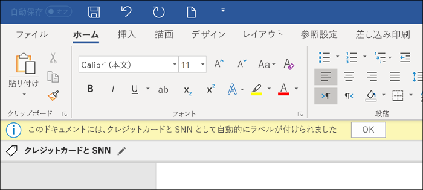

# 機密ラベルをコンテンツに自動的に適用する

>*[セキュリティとコンプライアンスのための Microsoft 365 ライセンス ガイダンス](https://aka.ms/ComplianceSD)。*

機密ラベルを作成する場合、機密情報が含まれている場合にそのラベルをコンテンツに自動的に割り当てるか、あるいは推奨するラベルを適用するようにユーザーに求めることができます。

機密ラベルを自動的にコンテンツに適用する機能が重要である理由は次のとおりです。

- ユーザーのトレーニングは、一部の分類方法についてのみ必要。

- ユーザーへの依存は、一部のコンテンツを正しく分類するためにのみ必要。

- ユーザーはポリシーについて把握する必要がなくなり、自分たちの仕事に集中できます。

Windows 用 Office アプリの自動ラベル付けは、Azure Information Protection 統合ラベル付けクライアントでサポートされています。 Office アプリ組み込みのラベル付けでは、この機能が[一部のアプリでプレビュー](sensitivity-labels-office-apps.md#support-for-sensitivity-label-capabilities-in-apps)されています。

Office アプリの自動ラベル付け設定は、[機密ラベルを作成または編集する](create-sensitivity-labels.md)ときに使用できます。

## Office アプリの自動ラベル付けを構成する方法

秘密度ラベルの最も強力な機能の 1 つは、特定の条件に一致したコンテンツに自動的に秘密度ラベルを適用する能力です。 この場合、組織内のユーザーが機密ラベルを適用する必要はありません。これは Office 365 により自動的に行われます。

コンテンツに特定の種類の機密情報が含まれている場合、機密ラベルをコンテンツに自動的に適用することを選択できます。 機密情報の種類または分類子のリストから選択します。

> [!NOTE]
> 現在、**分類子** のオプションは制限付きプレビュー中であり、テナントでこの機能を有効にするには Microsoft にフォームを送信する必要があります。 詳細については、「[Announcing automatic labeling in Office Apps using built-in classifiers - Limited Preview (組み込みの分類子を使用した Office アプリの自動ラベル付けの発表 - 制限付きプレビュー)](https://techcommunity.microsoft.com/t5/security-privacy-and-compliance/announcing-automatic-labeling-in-office-apps-using-built-in/ba-p/1192889)」のブログ投稿を参照してください。

この機密ラベルが自動的に適用されると、ユーザーの Office アプリに通知が表示されます。 例:

### ラベルの機密情報の種類の構成

**機密情報の種類** オプションを選択すると、データ損失防止 (DLP) ポリシーを作成するときと同じ機密情報の種類の一覧が表示されます。 そのため、たとえば、クレジットカード番号や社会保障番号など、お客様の個人情報 (PII) を含むコンテンツに極秘ラベルを自動的に適用できます。

機密情報の種類を選択した後は、インスタンス数または一致精度を変更して条件を絞り込むことができます。 詳細については、「[一致の難易度を設定するためのルールの調整](data-loss-prevention-policies.md#tuning-rules-to-make-them-easier-or-harder-to-match)」を参照してください。

さらに、条件で検知する必要があるのは、機密情報の種類のすべてか、またはそのうちの 1 つだけかを選択できます。 また、条件をより柔軟または複雑にするには、グループを追加し、グループ間で論理演算子を使用できます。 詳細については、「[グループ化および論理演算子](data-loss-prevention-policies.md#grouping-and-logical-operators)」を参照してください。

### ラベルの分類子の構成

**分類子** オプションを選択する場合、1 つ以上の組み込み分類子を選択します。

それらの分類子の詳細については、「[トレーニング可能な分類子 (プレビュー) の概要](classifier-getting-started-with.md)」を参照してください。

プレビュー期間中は、次のアプリが機密ラベルの分類子をサポートします。

- [Office Insider](https://office.com/insider) の Windows 用 Office 365 ProPlus デスクトップ アプリ:
    - Word
    - Excel
    - PowerPoint

- [SharePoint および OneDrive で Office ファイルの秘密度ラベルを有効にする機能 (パブリック プレビュー)](sensitivity-labels-sharepoint-onedrive-files.md) が有効になっている場合の Web アプリ用の Office:
    - Word
    - Excel
    - PowerPoint
    - Outlook

## ユーザーが機密ラベルを適用することを推奨

状況に応じて、ユーザーがラベルを適用することを推奨できます。 このオプションでは、分類および関連する保護を受け入れるか、またはラベルがそのコンテンツに適していない場合、推奨事項を無視するかをユーザーが選択できます。

ラベルを推奨される操作として適用するように条件を構成したときの、Azure Information Protection の統合ラベル付けクライアントからのプロンプトの例を、カスタム ポリシー ヒントと共に示します。ポリシー ヒントに表示するテキストを選択できます。

## 自動ラベルと推奨ラベルが適用されるしくみ

Office アプリでの自動ラベル付けと推奨ラベル付けの実装は、Office に組み込まれているラベル付けを使用しているか、または Azure Information Protection の統合ラベル付けクライアントを使用しているかによって異なります。 ただし、どちらの場合も次のようになります。

- 以前に手動でラベルが付けられているか、以前に上位の機密度で自動的にラベルが付けられているドキュメントと電子メールには自動ラベル付けを使用できません。 ドキュメントや電子メールに適用できる機密ラベルは (1 つの保持ラベルに加えて) 1 つだけであることにご注意ください。

- 以前に上位の秘密度でラベルが付けられているドキュメントまたはメールには推奨ラベル付けを使用できません。 コンテンツに既に上位の秘密度でラベルが付けられている場合、推奨事項とポリシー ヒントに関するプロンプトは、ユーザーに表示されません。

組み込みのラベル付けに関してのみ以下の点が当てはまります。

- 必ずしもすべての Office アプリで自動 (および推奨) ラベル付けがサポートされるわけではありません。 詳しくは、「[アプリでの秘密度ラベル機能のサポート](sensitivity-labels-office-apps.md#support-for-sensitivity-label-capabilities-in-apps)」を参照してください。

- Word のデスクトップ バージョンにおける推奨ラベルでは、推奨をトリガーした機密コンテンツにフラグが付けられるので、ユーザーが確認して、推奨されている秘密度ラベルを適用しないで機密コンテンツを削除できます。

- こうしたラベルが Office アプリで適用される方法、スクリーンショット例、機密情報の検出方法について詳しくは、「[Office のファイルとメールに秘密度ラベルを自動的に適用、または推奨する](https://support.office.com/en-us/article/automatically-apply-or-recommend-sensitivity-labels-to-your-files-and-emails-in-office-622e0d9c-f38c-470a-bcdb-9e90b24d71a1)」を参照してください。

Azure Information Protection 統合ラベル付けクライアントに関してのみ以下の点が当てはまります。

-  自動ラベル付けと推奨ラベル付けは、Word、Excel、PowerPoint でドキュメントが保存されるときと、Outlook でメールが送信されるときに適用されます。

- Outlook で推奨ラベル付けをサポートするには、最初に[詳細なポリシー設定](https://docs.microsoft.com/azure/information-protection/rms-client/clientv2-admin-guide-customizations#enable-recommended-classification-in-outlook)を構成する必要があります。

- ドキュメントやメール内の本文、およびヘッダーとフッターに含まれる機密情報が検出されますが、件名やメールの添付ファイルのものは検知されません。

## 複数のラベルに適用するときの複数の条件の評価方法

ラベルは、ポリシー内で指定した位置に従って評価の順序を決められます。先頭に配置したラベルが最下位 (機密性が最も低い) になり、最後に配置したラベルが最上位 (機密性が最も高い) になります。優先度に関する詳細については、「[ラベルの優先度 (順序の問題)](sensitivity-labels.md#label-priority-order-matters)」を参照してください。

## 自動適用または推奨されるように親ラベルを構成しない

親ラベル (サブラベルのあるラベル) はコンテンツに適用できません。 親ラベルは Azure Information Protection 統合ラベル付けクライアントを使用する Office アプリのコンテンツには適用されないため、決して親ラベルを自動適用または推奨するように構成しないでください。 親ラベルとサブラベルの詳細については、「[サブラベル (ラベルのグループ化)](sensitivity-labels.md#sublabels-grouping-labels)」を参照してください。
