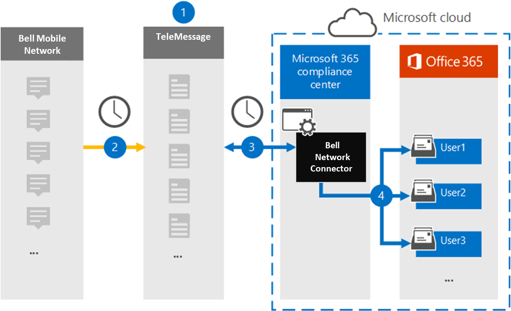

# ベルネットワークデータをアーカイブするためのコネクタの設定 (プレビュー)

Microsoft 365 コンプライアンスセンターの TeleMessage コネクタを使用して、ベルネットワークからの短いメッセージングサービス (SMS) メッセージとマルチメディアメッセージングサービス (MMS) メッセージのインポートとアーカイブを行います。 コネクタをセットアップして構成した後は、組織のベルネットワークに毎日接続し、SMS および MMS メッセージを Microsoft 365 のメールボックスにインポートします。

SMS および MMS メッセージをユーザーのメールボックスに格納した後は、訴訟ホールド、コンテンツ検索、Microsoft 365 アイテム保持ポリシーなどの Microsoft 365 コンプライアンス機能を Bell Network データに適用することができます。 たとえば、コンテンツ検索を使用して Bell Network SMS/MMS を検索したり、Bell Network connector データを含むメールボックスを高度な電子情報開示ケースの保管担当者に関連付けることができます。 Bell ネットワークコネクタを使用して Microsoft 365 のデータをインポートおよびアーカイブすることにより、組織は政府および規制ポリシーに準拠したままにすることができます。

## Bell ネットワークデータのアーカイブの概要

次の概要では、コネクタを使用して Microsoft 365 でベルネットワークデータをアーカイブするプロセスについて説明します。

1. 組織は TeleMessage および Bell を使用して、Bell ネットワークコネクタを設定します。 詳細については、「 [Bell Network Archiver](https://www.telemessage.com/office365-activation-for-bell-network-archiver)」を参照してください。

2. 24時間ごとに、組織のベルネットワークからの SMS および MMS メッセージは TeleMessage サイトにコピーされます。

3. Microsoft 365 コンプライアンスセンターで作成する Bell ネットワークコネクタは、TeleMessage サイトに毎日接続し、SMS および MMS メッセージを過去24時間から Microsoft クラウド内のセキュアな Azure ストレージの場所に転送します。 また、このコネクタは、SMS メッセージと MMS メッセージの内容を電子メールメッセージ形式に変換します。

4. コネクタは、特定のユーザーのメールボックスにモバイル通信アイテムをインポートします。 「 **BELL SMS/MMS Network Archiver** 」という名前の新しいフォルダーが特定のユーザーのメールボックスに作成され、アイテムがインポートされます。 コネクタは、 *ユーザーの電子メールアドレス* プロパティの値を使用して、このマッピングを行います。 すべての SMS および MMS メッセージには、このプロパティが含まれています。このプロパティには、メッセージのすべての参加者の電子メールアドレスが設定されます。

   *ユーザーの電子メールアドレス*プロパティの値を使用した自動ユーザーマッピングに加えて、CSV マッピングファイルをアップロードしてカスタムマッピングを定義することもできます。 このマッピングファイルには、組織内のユーザーの携帯電話番号と、対応する Microsoft 365 メールアドレスが含まれています。 自動ユーザーマッピングとカスタムマッピングの両方を有効にした場合、すべての Bell ネットワークアイテムに対して、コネクタは最初にカスタムマッピングファイルを検索します。 ユーザーの携帯電話番号に対応する有効な Microsoft 365 ユーザーが見つからない場合、コネクタはインポートしようとしているアイテムの [電子メールアドレス] プロパティの値を使用します。 コネクタがカスタムマッピングファイルまたはベルネットワークアイテムの電子メールアドレスプロパティに有効な Microsoft 365 ユーザーを見つけられない場合、アイテムはインポートされません。

## はじめに

Bell Network データをアーカイブするために必要な実装手順の一部は、Microsoft 365 の外部にあり、コンプライアンスセンターでコネクタを作成する前に完了する必要があります。

- [TeleMessage から Bell Network Archiver サービス](https://www.telemessage.com/mobile-archiver/order-mobile-archiver-for-o365/)を注文し、組織の有効な管理アカウントを取得します。 コンプライアンスセンターでコネクタを作成するときに、このアカウントにサインインする必要があります。

- TeleMessage のオンボードフォームに記入して、メッセージアーカイブサービスを Bell から注文できるように、Bell のネットワークアカウントと請求連絡先の詳細を取得します。

- TeleMessage アカウントに、Bell の SMS/MMS ネットワークアーカイブを必要とするすべてのユーザーを登録します。 ユーザーを登録する場合は、Microsoft 365 アカウントに使用しているのと同じ電子メールアドレスを使用してください。

- 従業員には、Bell 社の携帯電話ネットワーク上に企業所有者と会社が責任を持つ携帯電話が必要です。 Microsoft 365 のメッセージのアーカイブは、従業員が所有している場合、または "独自のデバイス (BYOD) デバイスを使用している場合には利用できません。

- 組織は、Office 365 インポートサービスが組織内のメールボックスデータにアクセスできるようにするための同意を得る必要があります。 この同意を得るには、コネクタを作成する必要があります。 この要求に同意するには、 [このページ](https://login.microsoftonline.com/common/oauth2/authorize?client_id=570d0bec-d001-4c4e-985e-3ab17fdc3073&response_type=code&redirect_uri=https://portal.azure.com/&nonce=1234&prompt=admin_consent)に移動して、Microsoft 365 グローバル管理者の資格情報でサインインし、要求を承諾します。 Bell ネットワークコネクタを正常に作成するには、この手順を完了する必要があります。

- Bell ネットワークコネクタを作成するユーザーには、Exchange Online のメールボックスのインポートのエクスポート役割が割り当てられている必要があります。 これは、Microsoft 365 コンプライアンスセンターの [ **データコネクタ** ] ページでコネクタを追加するために必要です。 既定では、この役割は Exchange Online のどの役割グループにも割り当てられていません。 Exchange Online の組織の管理役割グループに、メールボックスのインポートの役割を追加することができます。 または、役割グループを作成し、メールボックスインポートエクスポート役割を割り当ててから、適切なユーザーをメンバーとして追加することもできます。 詳細については、記事「Manage role groups in Exchange Online」の「 [役割グループの作成](https://docs.microsoft.com/Exchange/permissions-exo/role-groups#create-role-groups) 」または「 [役割グループの変更](https://docs.microsoft.com/Exchange/permissions-exo/role-groups#modify-role-groups) 」のセクションを参照してください。

## Bell ネットワークコネクタを作成する

最後の手順では、Microsoft 365 コンプライアンスセンターで Bell ネットワークコネクタを作成します。 コネクタは、提供された情報を使用して、TeleMessage サイトに接続し、SMS/MMS メッセージを Microsoft 365 の対応するユーザーメールボックスに転送します。

1. に移動 [https://compliance.microsoft.com](https://compliance.microsoft.com) し、[**データコネクタ**ベル] [  >  **SMS/MMS Network Archiver**] をクリックします。

2. [**ベルネットワーク**製品の説明] ページで、[**コネクタの追加**] をクリックします。

3. [ **サービス利用規約** ] ページで、[ **同意**する] をクリックします。

4. [ **TeleMessage へのログイン** ] ページの [ステップ 3] で、必要な情報を次のボックスに入力し、[ **次へ**] をクリックします。

   - **ユーザー名:** TeleMessage ユーザー名。

   - **パスワード:** TeleMessage のパスワードを入力します。

5. コネクタが作成されたら、ポップアップウィンドウを閉じて次のページに進むことができます。

6. [ **ユーザーマッピング** ] ページで、[自動ユーザーマッピング] を有効にします。 カスタムマッピングを有効にするには、ユーザーマッピング情報を含む CSV ファイルをアップロードし、[ **次へ**] をクリックします。

7. 管理者の同意を得てから、[ **次へ**] をクリックします。

   管理者の同意を得るには、Office 365 グローバル管理者の資格情報を使用してサインインし、同意要求を承諾する必要があります。 グローバル管理者としてサインインしていない場合は、 [このページ](https://login.microsoftonline.com/common/oauth2/authorize?client_id=570d0bec-d001-4c4e-985e-3ab17fdc3073&response_type=code&redirect_uri=https://portal.azure.com/&nonce=1234&prompt=admin_consent) に移動して、グローバル管理者の資格情報を使用してサインインし、要求を承諾することができます。

8. 設定内容を確認し、[ **完了** ] をクリックしてコネクタを作成します。

9. コンプライアンスセンターの [**データコネクタ**] ページで、[**コネクタ**] タブに移動して、新しいコネクタのインポート処理の進行状況を確認します。

## 既知の問題

- 現時点では、10 MB を超える添付ファイルのインポートをサポートしていませんが、より大きいアイテムのサポートは後日提供されます。
