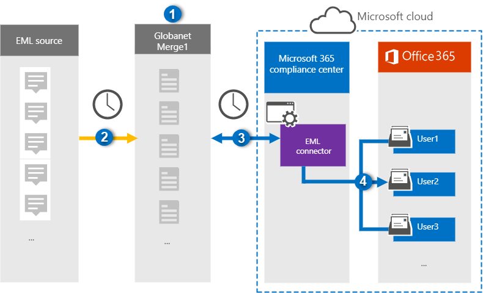

# EML データをアーカイブするためのコネクタの設定

Microsoft 365 コンプライアンスセンターの Globanet コネクタを使用して、EML データを Microsoft 365 組織のユーザーのメールボックスにインポートおよびアーカイブします。 EML は、ファイルに保存される電子メールメッセージのファイル拡張子です。 コネクタは、アイテムのコンテンツをソース形式から電子メールメッセージ形式に変換し、そのアイテムをユーザーメールボックスにインポートします。

EML メッセージをユーザーのメールボックスに格納した後は、訴訟ホールド、電子情報開示、アイテム保持ポリシー、保持ラベル、および通信コンプライアンスなどの Microsoft 365 コンプライアンス機能を適用できます。 EML コネクタを使用して Microsoft 365 のデータをインポートおよびアーカイブすることにより、組織は政府および規制ポリシーに準拠し続けることができます。

## EML データのアーカイブの概要

次の概要では、コネクタを使用して Microsoft 365 の EML データをアーカイブするプロセスについて説明します。

1. 組織は EML ソースを使用して、EML サイトをセットアップおよび構成します。

2. 24時間ごとに、EML ソースのコンテンツアイテムは Globanet Merge1 サイトにコピーされます。 このプロセスでは、EML ファイルの内容が電子メールメッセージの形式に変換されます。

3. Microsoft 365 コンプライアンスセンターで作成した EML コネクタは、毎日 Globanet Merge1 サイトに接続し、メッセージを Microsoft クラウド内のセキュアな Azure ストレージの場所に転送します。

4. コネクタは、[手順 3](#step-3-map-users-and-complete-the-connector-setup)で説明されている自動ユーザーマッピングプロセスの*Email*プロパティの値を使用して、変換されたメッセージアイテムを特定のユーザーのメールボックスにインポートします。 このプロセスでは、 **eml**という名前の受信トレイフォルダー内のサブフォルダーがユーザーのメールボックス内に作成され、そのフォルダーに eml アイテムがインポートされます。 コネクタは、 *Email* プロパティの値を使用してこれを実行します。 すべてのメッセージにこのプロパティが含まれており、コンテンツ項目のすべての参加者の電子メールアドレスが設定されます。

## はじめに

- Microsoft コネクタ用の Globanet Merge1 アカウントを作成します。 これを行うには、 [Globanet カスタマーサポート](https://globanet.com/ms-connectors-contact)にお問い合わせください。 手順1でコネクタを作成するときに、このアカウントにサインインする必要があります。

- 手順1で EML コネクタを作成して (手順3で完了させる) ユーザーは、Exchange Online のメールボックスのインポートのエクスポート役割に割り当てられている必要があります。 この役割は、Microsoft 365 コンプライアンスセンターの [ **データコネクタ** ] ページでコネクタを追加するために必要です。 既定では、この役割は Exchange Online のどの役割グループにも割り当てられていません。 Exchange Online の組織の管理役割グループに、メールボックスのインポートの役割を追加することができます。 または、役割グループを作成し、メールボックスインポートエクスポート役割を割り当ててから、適切なユーザーをメンバーとして追加することもできます。 詳細については、記事「Manage role groups in Exchange Online」の「 [役割グループの作成](https://docs.microsoft.com/Exchange/permissions-exo/role-groups#create-role-groups) 」または「 [役割グループの変更](https://docs.microsoft.com/Exchange/permissions-exo/role-groups#modify-role-groups) 」のセクションを参照してください。

## 手順 1: EML コネクタを設定する

最初の手順として、Microsoft 365 コンプライアンスセンターの [ **データコネクタ** ] ページにアクセスし、EML データ用のコネクタを作成します。

1. に移動 [https://compliance.microsoft.com](https://compliance.microsoft.com/) し、[**データコネクタ**の EML] をクリックし  >  **EML**ます。

2. [ **EML** product description] ページで、[ **コネクタの追加**] をクリックします。

3. [ **サービス利用規約** ] ページで、[ **同意**する] をクリックします。

4. コネクタを識別する一意の名前を入力し、[ **次へ**] をクリックします。

5. Merge1 アカウントにサインインして、コネクタを構成します。

## 手順 2: Globanet Merge1 サイトで EML コネクタを構成する

2番目の手順は、Globanet Merge1 サイトで EML コネクタを構成することです。 EML コネクタの構成の詳細については、「 [Merge1 サードパーティコネクタのユーザーガイド](https://docs.ms.merge1.globanetportal.com/Merge1%20Third-Party%20Connectors%20EML%20User%20Guide%20.pdf)」を参照してください。

[ **保存 & 完了**] をクリックすると、Microsoft 365 コンプライアンスセンター、コネクタウィザードの [ **ユーザーマッピング** ] ページに戻ります。

## 手順 3: ユーザーをマップしてコネクタのセットアップを完了する

ユーザーをマップし、Microsoft 365 コンプライアンスセンターでコネクタの設定を完了するには、次の手順を実行します。

1. [ **外部ユーザーを Microsoft 365 ユーザーにマップする** ] ページで、[自動ユーザーマッピング] を有効にします。 EML ソースのアイテムには、 *電子メール*というプロパティが含まれています。これには、組織内のユーザーの電子メールアドレスが含まれます。 コネクタがこのアドレスを Microsoft 365 ユーザーに関連付けることができる場合は、そのユーザーのメールボックスに EML アイテムがインポートされます。

2. [ **管理者の同意** ] ページで、[ **同意を与える** ] ボタンをクリックします。 Microsoft サイトにリダイレクトされます。 同意を得るには、[ **承諾** ] をクリックします。

   組織は、Office 365 インポートサービスが組織内のメールボックスデータにアクセスできるようにするための同意を得る必要があります。 管理者の同意を得るには、Microsoft 365 グローバル管理者の資格情報を使用してサインインし、同意要求を承諾する必要があります。 グローバル管理者としてサインインしていない場合は、 [このページ](https://login.microsoftonline.com/common/oauth2/authorize?client_id=570d0bec-d001-4c4e-985e-3ab17fdc3073&response_type=code&redirect_uri=https://portal.azure.com/&nonce=1234&prompt=admin_consent) に移動して、グローバル管理者の資格情報を使用してサインインし、要求を承諾することができます。

3. [ **次へ**] をクリックして設定を確認し、[ **データコネクタ** ] ページに移動して、新しいコネクタのインポート処理の進行状況を確認します。

## 手順 4: EML コネクタを監視する

EML コネクタを作成した後、Microsoft 365 コンプライアンスセンターでコネクタの状態を表示できます。

1. [https://compliance.microsoft.com](https://compliance.microsoft.com)左側のナビゲーションに移動し、[**データコネクタ**] をクリックします。

2. [ **コネクタ** ] タブをクリックし、[ **EML** ] コネクタを選択して、フライアウトページを表示します。このページには、コネクタに関するプロパティと情報が含まれています。

3. [ **コネクタの状態 (ソース付き**)] の下で、[ **ログのダウンロード** ] リンクをクリックしてコネクタの状態ログを開く (または保存) します。 このログには、Microsoft クラウドにインポートされたデータに関する情報が含まれています。

## 既知の問題

- 現時点では、10 MB を超える添付ファイルやアイテムのインポートはサポートされていません。 より大きいアイテムのサポートは、後日提供されます。
