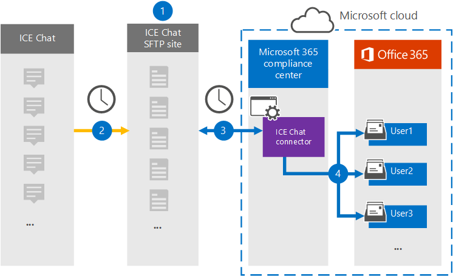

# コネクタを設定してアーカイブ ICE チャットデータ (プレビュー)

Microsoft 365 コンプライアンスセンターのネイティブコネクタを使用して、ICE チャットコラボレーションツールから金融サービスチャットデータのインポートとアーカイブを行います。 コネクタをセットアップして構成した後は、組織の ICE チャットセキュリティで保護された FTP (SFTP) サイトに毎日接続して、チャットメッセージの内容を電子メールメッセージの形式に変換してから、それらのアイテムを Microsoft 365 のメールボックスにインポートします。

ICE チャットデータをユーザーのメールボックスに格納した後は、訴訟ホールド、電子情報開示、アーカイブ、監査、通信コンプライアンス、Microsoft 365 保持ポリシーなどの Microsoft 365 コンプライアンス機能を ICE チャットデータに適用することができます。 たとえば、コンテンツ検索を使用して ICE チャットのメッセージを検索したり、ICE チャットデータを含むメールボックスを高度な電子情報開示ケースの保管担当者と関連付けることができます。 ICE Chat コネクタを使用して Microsoft 365 のデータをインポートおよびアーカイブすることにより、組織は政府および規制ポリシーに準拠し続けることができます。

## ICE チャットデータのアーカイブの概要

次の概要では、コネクタを使用して、Microsoft 365 で ICE chat データをアーカイブするプロセスについて説明します。

1. 組織は ICE チャットを使用して、ICE チャット SFTP サイトを設定します。 また、ice チャットを使用して ice チャットを構成し、着氷チャットの SFTP サイトにチャットメッセージをコピーします。

2. 24時間ごとに、ICE チャットからのチャットメッセージは ICE チャット SFTP サイトにコピーされます。

3. Microsoft 365 コンプライアンスセンターで作成する ICE チャットコネクタは、毎日 ICE Chat SFTP サイトに接続して、過去24時間のチャットメッセージを Microsoft クラウド内のセキュリティで保護された Azure ストレージの場所に転送します。 また、コネクタはチャットのメッセージの内容を電子メールメッセージの形式に変換します。

4. コネクタは、特定のユーザーのメールボックスにチャットメッセージアイテムをインポートします。 **ICE チャット**という名前の新しいフォルダーがユーザーメールボックスに作成され、チャットメッセージアイテムがそのフォルダーにインポートされます。 コネクタは、 *SenderEmail*および*受信者の電子メール*のプロパティの値を使用して実行されます。 すべてのチャットメッセージには、送信者の電子メールアドレスとチャットメッセージのすべての受信者または参加者に設定されたプロパティが含まれています。

   *SenderEmail*および受信者の*電子メール*プロパティの値を使用する自動ユーザーマッピングに加えて (つまり、コネクタが送信者のメールボックスおよびすべての受信者のメールボックスにチャットメッセージをインポートすることを意味します)、CSV マッピングファイルをアップロードしてカスタムユーザーマッピングを定義することもできます。 このマッピングファイルには、ICE Chat *Imid*と、組織内のすべてのユーザーに対応する Microsoft 365 メールボックスアドレスが含まれています。 自動ユーザーマッピングを有効にし、カスタムマッピングファイルを指定すると、コネクタはまずカスタムマッピングファイルを調べます。 ユーザーの ICE Chat ImId に対応する有効な Microsoft 365 ユーザーアカウントが見つからない場合、コネクタはチャットアイテムの*SenderEmail*および*受信者の電子メール*プロパティを使用して、チャットの参加者のメールボックスにアイテムをインポートします。 コネクタが、カスタムマッピングファイルまたは*SenderEmail*および*受信者の電子メール*プロパティに有効な Microsoft 365 ユーザーを見つけられない場合、アイテムはインポートされません。

## はじめに

ICE チャットデータをアーカイブするために必要な実装手順の多くは、Microsoft 365 の外部にあり、コンプライアンスセンターでコネクタを作成する前に、完了する必要があります。

- 組織は、Office 365 インポートサービスが組織内のメールボックスデータにアクセスできるようにするための同意を得る必要があります。 この要求に同意するには、[このページ](https://login.microsoftonline.com/common/oauth2/authorize?client_id=570d0bec-d001-4c4e-985e-3ab17fdc3073&response_type=code&redirect_uri=https://portal.azure.com/&nonce=1234&prompt=admin_consent)に移動して、Office 365 グローバル管理者の資格情報でサインインし、要求を承諾します。 手順3で ICE Chat コネクタが正常に作成されるようにするには、この手順を完了する必要があります。

- ICE チャットは、顧客に外部のコンプライアンスの料金を課金します。 組織は、ICE Chat sales グループに連絡して、ICE Chat データサービス契約 (で取得可能) に署名する必要があり [https://www.theice.com/publicdocs/agreements/ICE\_Data\_Services\_Agreement.pdf](https://www.theice.com/publicdocs/agreements/ICE\_Data\_Services\_Agreement.pdf) ます。 この契約は、ICE チャットと組織の間にあり、Microsoft は関与していません。 手順2で ICE チャット SFTP サイトをセットアップした後、ICE チャットは、組織に直接 FTP 資格情報を提供します。 次に、手順3でコネクタを設定するときに、これらの資格情報を Microsoft に提供します。

- 手順3でコネクタを作成する前に、ICE チャット SFTP サイトを設定する必要があります。 ICE チャットを使用して SFTP サイトをセットアップした後は、ICE チャットからのデータが毎日 SFTP サイトにアップロードされます。 手順3で作成したコネクタがこの SFTP サイトに接続し、チャットデータを Microsoft 365 メールボックスに転送します。 SFTP では、転送プロセス中にメールボックスに送信される ICE チャットデータも暗号化されます。

- 手順3で ICE Chat コネクタを作成した管理者 (および手順1で公開キーと IP アドレスをダウンロードするユーザー) に、Exchange Online のメールボックスのインポートのエクスポート役割を割り当てる必要があります。 この役割は、Microsoft 365 コンプライアンスセンターの [**データコネクタ**] ページでコネクタを追加するために必要です。 既定では、この役割は Exchange Online のどの役割グループにも割り当てられていません。 Exchange Online の組織の管理役割グループに、メールボックスのインポートの役割を追加することができます。 または、役割グループを作成し、メールボックスインポートエクスポート役割を割り当ててから、適切なユーザーをメンバーとして追加することもできます。 詳細については、記事「Manage role groups in Exchange Online」の「[役割グループの作成](https://docs.microsoft.com/Exchange/permissions-exo/role-groups#create-role-groups)」または「[役割グループの変更](https://docs.microsoft.com/Exchange/permissions-exo/role-groups#modify-role-groups)」のセクションを参照してください。

## 手順 1: SSH と PGP の公開キーを取得する

最初の手順として、Secure Shell (SSH) およびかなり良好なプライバシー (PGP) のための公開キーのコピーを取得します。 手順2でこれらのキーを使用して、(手順3で作成した) コネクタが SFTP サイトに接続して、ICE チャットデータを Microsoft 365 メールボックスに転送できるように、ICE Chat SFTP サイトを構成します。 また、この手順では、ICE チャット SFTP サイトを構成するときに使用する IP アドレスも取得します。

1. [https://compliance.microsoft.com](https://compliance.microsoft.com)左側のナビゲーションに移動し、[**データコネクタ**] をクリックします。

2. [**データコネクタ] (プレビュー)** ページの [**着氷チャット**] で、[**表示**] をクリックします。

3. [ **ICE チャット**] ページで、[**コネクタの追加**] をクリックします。

4. [**サービス利用規約**] ページで、[**同意**する] をクリックします。

5. 各ファイルのコピーをローカルコンピューターに保存するには、[ステップ 1] の下にある [ **ICE CHAT SFTP サイトの資格情報の追加**] ページで、[ **SSH キーのダウンロード**]、[ **PGP キーのダウンロード**]、[ **IP アドレスのダウンロード**] のリンクをクリックします。 これらのファイルには、手順2で ICE Chat SFTP サイトを構成するために使用される次の項目が含まれています。

   - SSH 公開キー: このキーは、コネクタが ICE チャット SFTP サイトに接続する際にセキュリティで保護されたリモートログインを有効にするように、Secure SSH を構成するために使用されます。

   - PGP 公開鍵: このキーは、ICE チャットの SFTP サイトから Microsoft 365 に転送されるデータの暗号化を構成するために使用されます。

   - IP アドレス: ICE チャット SFTP サイトは、この IP アドレスからの接続要求のみを受け入れるように構成されています。これは、手順3で作成した ICE Chat コネクタによって使用されます。

6. ウィザードを閉じるには、[**キャンセル**] をクリックします。 このウィザードに戻り、手順3でコネクタを作成します。

## 手順 2: ICE チャット SFTP サイトを構成する

次の手順では、SSH と PGP の公開キーと、手順1で取得した IP アドレスを使用して、ICE チャット SFTP サイトの SSH 認証と PGP 暗号化を構成します。 これにより、手順3で作成した ICE チャットコネクタは、ICE Chat SFTP サイトに接続して ICE チャットデータを Microsoft 365 に転送することができます。 Ice チャットのカスタマーサポートと協力して、ICE Chat SFTP サイトを設定する必要があります。

## 手順 3: ICE チャットコネクタを作成する

最後の手順では、Microsoft 365 コンプライアンスセンターで ICE Chat コネクタを作成します。 コネクタは、指定された情報を使用して ICE Chat SFTP サイトに接続し、チャットメッセージを Microsoft 365 の対応するユーザーメールボックスに転送します。

1. [https://compliance.microsoft.com](https://compliance.microsoft.com)左側のナビゲーションに移動し、[**データコネクタ**] をクリックします。

2. [**データコネクタ**] ページの [**着氷チャット**] で、[**表示**] をクリックします。

3. [ **ICE チャット**] ページで、[**コネクタの追加**] をクリックします。

4. [**サービス利用規約**] ページで、[**同意**する] をクリックします。

5. [ **ICE CHAT SFTP サイトの資格情報の追加**] ページの [ステップ 3] で、必要な情報を次のボックスに入力し、[**接続の検証**] をクリックします。

   - **確定コード:** 組織の ID。 ICE チャット SFTP サイトのユーザー名として使用されます。

   - **パスワード:** ICE チャット SFTP サイトのパスワード。

   - **SFTP URL:** ICE チャットの SFTP サイトの URL (たとえば、sftp.theice.com)。

   - **SFTP ポート:** ICE チャット SFTP サイトのポート番号。 コネクタはこのポートを使用して、SFTP サイトに接続します。

6. 接続が検証されたら、[**次へ**] をクリックします。

7. [**外部ユーザーを Microsoft 365 ユーザーにマップする**] ページで、自動ユーザーマッピングを有効にし、必要に応じてカスタムユーザーマッピングを提供します。 このページでは、ユーザーマッピングの CSV ファイルのコピーをダウンロードできます。 ユーザーマッピングをファイルに追加してアップロードすることができます。

   > [!NOTE]
   > 前述のように、カスタムマッピングファイル CSV ファイルには、ICE Chat imid と、各ユーザーの対応する Microsoft 365 メールボックスアドレスが含まれています。 自動ユーザーマッピングを有効にしてカスタムマッピングを指定すると、すべてのチャットアイテムに対して、コネクタはまずカスタムマッピングファイルを参照します。 ユーザーの着氷チャット imid に対応する有効な Microsoft 365 ユーザーが見つからない場合、コネクタは、そのアイテムを、チャットアイテムの*SenderEmail*および*受信者の電子メール*プロパティで指定されたユーザーのメールボックスにインポートします。 コネクタが自動またはカスタムユーザーマッピングによって有効な Microsoft 365 ユーザーを見つけられない場合、アイテムはインポートされません。

8. [**次へ**] をクリックして設定を確認し、[**完了**] をクリックしてコネクタを作成します。

9. [**データコネクタ**] ページに移動して、新しいコネクタのインポート処理の進行状況を確認します。
