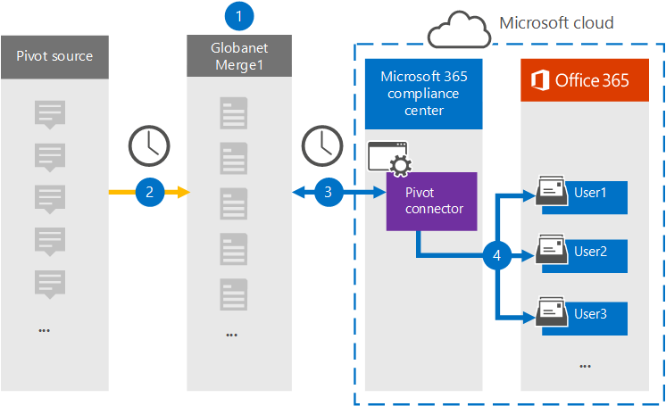

# ピボットデータをアーカイブするコネクタを設定する

Microsoft 365 コンプライアンスセンターの Globanet コネクタを使用して、ピボットプラットフォームから Microsoft 365 組織のユーザーメールボックスにデータをインポートし、アーカイブします。 Globanet では、サードパーティのデータソースからアイテムを取得するように構成された [ピボット](https://globanet.com/pivot/) コネクタ (定期的に) が提供され、それらのアイテムを Microsoft 365 にインポートします。 Pivot は、財務市場の参加者とのコラボレーションを可能にするインスタントメッセージングプラットフォームです。 このコネクタは、チャットメッセージなどのアイテムを、ユーザーのピボットアカウントから電子メールメッセージ形式に変換し、それらのアイテムを Microsoft 365 のユーザーメールボックスにインポートします。

ユーザーのメールボックスにピボットデータが格納されると、訴訟ホールド、電子情報開示、アイテム保持ポリシー、保持ラベル、および通信コンプライアンスなどの Microsoft 365 コンプライアンス機能を適用できます。 Microsoft 365 でピボットコネクタを使用してデータをインポートおよびアーカイブすることにより、組織は政府および規制ポリシーに準拠し続けることができます。

## ピボットデータのアーカイブの概要

次の概要では、コネクタを使用して Microsoft 365 のピボットデータをアーカイブするプロセスについて説明します。

1. 組織はピボットを使用して、ピボットソースサイトを設定して構成します。

2. 24時間ごとに、ピボットアイテムは Globanet Merge1 サイトにコピーされます。 また、コネクタは、ピボットアイテムを電子メールメッセージの形式に変換します。

3. Microsoft 365 コンプライアンスセンターで作成した Pivot connector は、Globanet Merge1 サイトに毎日接続し、そのピボットアイテムを Microsoft クラウド内のセキュリティで保護された Azure ストレージの場所に転送します。

4. コネクタは、 [手順 3](#step-3-map-users-and-complete-the-connector-setup)で説明されているように、自動ユーザーマッピングの *Email* プロパティの値を使用して、ピボットアイテムを特定のユーザーのメールボックスにインポートします。 ユーザーのメールボックスに、 **Pivot** という名前の受信トレイフォルダー内のサブフォルダーが作成され、そのフォルダーにアイテムがインポートされます。 コネクタは、 *Email* プロパティの値を使用してこれを実行します。 すべてのピボットアイテムには、アイテムのすべての参加者の電子メールアドレスが設定されたこのプロパティが含まれています。

## 開始する前に

- Microsoft コネクタ用の Globanet Merge1 アカウントを作成します。 これを行うには、 [Globanet カスタマーサポート](https://globanet.com/ms-connectors-contact/)にお問い合わせください。 手順1でコネクタを作成するときに、このアカウントにサインインする必要があります。

- 手順1でピボットコネクタを作成する (および手順3で完了する) ユーザーは、Exchange Online のメールボックスのインポートのエクスポート役割に割り当てられている必要があります。 この役割は、Microsoft 365 コンプライアンスセンターの [データコネクタ] ページでコネクタを追加するために必要です。 既定では、この役割は Exchange Online のどの役割グループにも割り当てられていません。 Exchange Online の組織の管理役割グループに、メールボックスのインポートの役割を追加することができます。 または、役割グループを作成し、メールボックスインポートエクスポート役割を割り当ててから、適切なユーザーをメンバーとして追加することもできます。 詳細については、記事「Manage role groups in Exchange Online」の「 [役割グループの作成](https://docs.microsoft.com/Exchange/permissions-exo/role-groups#create-role-groups) 」または「 [役割グループの変更](https://docs.microsoft.com/Exchange/permissions-exo/role-groups#modify-role-groups) 」のセクションを参照してください。

## 手順 1: ピボットコネクタを設定する

最初の手順として、Microsoft コンプライアンスセンターの [ **データコネクタ** ] ページにアクセスし、ピボットデータ用のコネクタを作成します。

1. に移動 [https://compliance.microsoft.com](https://compliance.microsoft.com/) し、[ **データコネクタ** ] ピボットをクリックし  >  **Pivot** ます。

2. [ **ピボット** 製品の説明] ページで、[ **コネクタの追加** ] をクリックします。

3. [ **サービス利用規約** ] ページで、[ **同意** する] をクリックします。

4. コネクタを識別する一意の名前を入力し、[ **次へ** ] をクリックします。

5. Merge1 アカウントにサインインして、コネクタを構成します。

## 手順 2: Globanet Merge1 サイトでピボットコネクタを構成する

2番目の手順では、Merge1 サイト上にピボットコネクタを構成します。 Globanet Merge1 サイトでピボットコネクタを構成する方法については、「 [Merge1 サードパーティ製コネクタユーザーガイド](https://docs.ms.merge1.globanetportal.com/Merge1%20Third-Party%20Connectors%20Pivot%20User%20Guide%20.pdf)」を参照してください。

[ **保存 & 完了** ] をクリックすると、Microsoft 365 コンプライアンスセンター (コネクタウィザードの [ **ユーザーマッピング** ] ページ) に戻ることができます。

## 手順 3: ユーザーをマップしてコネクタのセットアップを完了する

ユーザーをマップし、Microsoft 356 コンプライアンスセンターでコネクタの設定を完了するには、次の手順を実行します。

1. [ **ピボットユーザーを Microsoft 365 ユーザーにマップする** ] ページで、[自動ユーザーマッピング] を有効にします。 Pivot アイテムには、 *電子メール* というプロパティが含まれています。このプロパティには、組織内のユーザーの電子メールアドレスが含まれています。 コネクタがこのアドレスを Microsoft 365 ユーザーに関連付けることができる場合は、そのユーザーのメールボックスにアイテムがインポートされます。

2. [ **管理者の同意** ] ページで、[ **同意を提供** する] をクリックします。 Microsoft サイトにリダイレクトされます。 同意を得るには、[ **承諾** ] をクリックします。

   組織は、Office 365 インポートサービスが組織内のメールボックスデータにアクセスできるようにするための同意を得る必要があります。 管理者の同意を得るには、Microsoft 365 グローバル管理者の資格情報を使用してサインインし、同意要求を承諾する必要があります。 グローバル管理者としてサインインしていない場合は、 [このページ](https://login.microsoftonline.com/common/oauth2/authorize?client_id=570d0bec-d001-4c4e-985e-3ab17fdc3073&response_type=code&redirect_uri=https://portal.azure.com/&nonce=1234&prompt=admin_consent) に移動して、グローバル管理者の資格情報を使用してサインインし、要求を承諾することができます。

3. [ **次へ** ] をクリックして設定を確認し、[ **データコネクタ** ] ページに移動して、新しいコネクタのインポート処理の進行状況を確認します。

## 手順 4: ピボットコネクタを監視する

ピボットコネクタを作成した後、Microsoft 365 コンプライアンスセンターでコネクタの状態を表示できます。

1. [https://compliance.microsoft.com](https://compliance.microsoft.com)左側のナビゲーションに移動し、[ **データコネクタ** ] をクリックします。

2. [ **コネクタ** ] タブをクリックし、[ **ピボット** コネクタ] を選択して、コネクタに関するプロパティと情報を含む、フライアウトページを表示します。

3. [ **コネクタの状態 (ソース付き** )] の下で、[ **ログのダウンロード** ] リンクをクリックしてコネクタの状態ログを開く (または保存) します。 このログには、Microsoft クラウドにインポートされたデータが含まれています。

## 既知の問題

- 現時点では、10 MB を超える添付ファイルやアイテムのインポートはサポートされていません。 より大きいアイテムのサポートは、後日提供されます。
