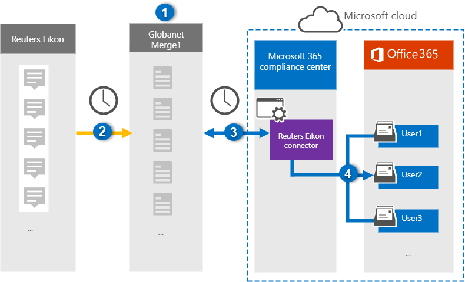

# コネクタを Reuters Eikon data にアーカイブするように設定する (プレビュー)

Microsoft 365 コンプライアンスセンターの Globanet コネクタを使用して、Reuters Eikon プラットフォームから Microsoft 365 組織のユーザーメールボックスにデータをインポートし、アーカイブします。 Globanet では、サードパーティのデータソースからアイテムを取得するように構成された [Reuters Eikon](https://globanet.com/eikon/) connector が提供されています (定期的に)。これらのアイテムを Microsoft 365 にインポートします。 コネクタは、個人のメッセージ、グループのチャット、添付ファイル、免責事項などのコンテンツをユーザーの Reuters Eikon アカウントから電子メールメッセージ形式に変換し、それらのアイテムを Microsoft 365 のユーザーのメールボックスにインポートします。

Reuters Eikon のデータがユーザーのメールボックスに格納された後、訴訟ホールド、電子情報開示、アイテム保持ポリシー、保持ラベル、および通信コンプライアンスなどの Microsoft 365 コンプライアンス機能を適用できます。 Reuters Eikon コネクタを使用して Microsoft 365 のデータをインポートおよびアーカイブすることにより、組織は政府および規制ポリシーに準拠し続けることができます。

## Reuters Eikon データのアーカイブの概要

次の概要では、コネクタを使用して Microsoft 365 の Reuters Eikon 情報をアーカイブするプロセスについて説明します。

1. 組織は Reuters Eikon を使用して、Reuters Eikon サイトをセットアップして構成します。

2. 24時間ごとに Reuters Eikon アイテムは Globanet Merge1 サイトにコピーされます。 また、コネクタは Reuters Eikon アイテムを電子メールメッセージ形式に変換します。

3. Microsoft 365 コンプライアンスセンターで作成した Reuters Eikon コネクタは、毎日 Globanet Merge1 サイトに接続し、そのコンテンツを Microsoft クラウド内のセキュリティ保護された Azure ストレージの場所に転送します。

4. コネクタは、[手順 3](#step-3-map-users-and-complete-the-connector-setup)で説明されているように、自動ユーザーマッピングの*Email*プロパティの値を使用して、特定のユーザーのメールボックスにアイテムをインポートします。 ユーザーメールボックスに **Reuters Eikon** という名前の受信トレイフォルダー内のサブフォルダーが作成され、そのフォルダーにアイテムがインポートされます。 コネクタは、 *Email* プロパティの値を使用してこれを実行します。 すべての Reuters Eikon item には、アイテムのすべての参加者の電子メールアドレスが設定されたこのプロパティが含まれています。

## はじめに

- Globanet Merge1 アカウントを作成するには、余裕期間電子情報開示コネクタの使用条件に同意します。 これを行うには、 [Globanet カスタマーサポート](https://globanet.com/contact-us)にお問い合わせください。 手順1でコネクタを作成するときに、このアカウントにサインインする必要があります。

- 手順1で Reuters Eikon コネクタを作成したユーザー (および手順3で完了します) は、Exchange Online のメールボックスのインポートのエクスポート役割に割り当てる必要があります。 この役割は、Microsoft 365 コンプライアンスセンターの [ **データコネクタ** ] ページでコネクタを追加するために必要です。 既定では、この役割は Exchange Online のどの役割グループにも割り当てられていません。 Exchange Online の組織の管理役割グループに、メールボックスのインポートの役割を追加することができます。 または、役割グループを作成し、メールボックスインポートエクスポート役割を割り当ててから、適切なユーザーをメンバーとして追加することもできます。 詳細については、記事「Manage role groups in Exchange Online」の「 [役割グループの作成](https://docs.microsoft.com/Exchange/permissions-exo/role-groups#create-role-groups) 」または「 [役割グループの変更](https://docs.microsoft.com/Exchange/permissions-exo/role-groups#modify-role-groups) 」のセクションを参照してください。

## 手順 1: Reuters Eikon コネクタを設定する

最初の手順として、Microsoft 365 コンプライアンスセンターの [ **データコネクタ** ] ページにアクセスし、Reuters Eikon Data のコネクタを作成します。

1. に移動 [https://compliance.microsoft.com](https://compliance.microsoft.com/) し、[**データコネクタ**  >  **Reuters Eikon**] をクリックします。

2. [ **Reuters Eikon** product description] ページで、[ **コネクタの追加**] をクリックします。

3. [ **サービス利用規約** ] ページで、[ **同意**する] をクリックします。

4. コネクタを識別する一意の名前を入力し、[ **次へ**] をクリックします。

5. Merge1 アカウントにサインインして、コネクタを構成します。

## 手順 2: Globanet Merge1 サイト上の Reuters Eikon コネクタを構成する

2番目の手順は、Merge1 サイトで Reuters Eikon コネクタを構成することです。 Globanet Merge1 サイトで Reuters Eikon コネクタを構成する方法については、「 [Merge1 サードパーティコネクタユーザーガイド](https://docs.ms.merge1.globanetportal.com/Merge1%20Third-Party%20Connectors%20Reuters%20Eikon%20User%20Guide%20.pdf)」を参照してください。

[ **保存 & 完了**] をクリックすると、Microsoft 365 コンプライアンスセンター (コネクタウィザードの [ **ユーザーマッピング** ] ページ) に戻ることができます。

## 手順 3: ユーザーをマップしてコネクタのセットアップを完了する

ユーザーをマップし、Microsoft 365 コンプライアンスセンターで設定したコネクタを完成させるには、次の手順を実行します。

1. [ **外部ユーザーを Microsoft 365 ユーザーにマップする** ] ページで、[自動ユーザーマッピング] を有効にします。 Reuters Eikon のアイテムには、組織内のユーザーの電子メールアドレスを含む *email*というプロパティが含まれています。 コネクタがこのアドレスを Microsoft 365 ユーザーに関連付けることができる場合は、そのユーザーのメールボックスにアイテムがインポートされます。

2. [ **管理者の同意** ] ページで、[ **同意を与える** ] ボタンをクリックします。 Microsoft サイトにリダイレクトされます。 同意を得るには、[ **承諾** ] をクリックします。

   組織は、Office 365 インポートサービスが組織内のメールボックスデータにアクセスできるようにするための同意を得る必要があります。 管理者の同意を得るには、Microsoft 365 グローバル管理者の資格情報を使用してサインインし、同意要求を承諾する必要があります。 グローバル管理者としてサインインしていない場合は、 [このページ](https://login.microsoftonline.com/common/oauth2/authorize?client_id=570d0bec-d001-4c4e-985e-3ab17fdc3073&response_type=code&redirect_uri=https://portal.azure.com/&nonce=1234&prompt=admin_consent) に移動して、グローバル管理者の資格情報を使用してサインインし、要求を承諾することができます。

3. [ **次へ**] をクリックして設定を確認し、[ **データコネクタ** ] ページに移動して、新しいコネクタのインポート処理の進行状況を確認します。

## 手順 4: Reuters Eikon コネクタを監視する

Reuters Eikon コネクタを作成した後、Microsoft 365 コンプライアンスセンターでコネクタの状態を表示できます。

1. [https://compliance.microsoft.com](https://compliance.microsoft.com)左側のナビゲーションに移動し、[**データコネクタ**] をクリックします。

2. [ **コネクタ** ] タブをクリックし、[ **Reuters Eikon** コネクタ] を選択して、コネクタに関するプロパティと情報を含むフライアウトページを表示します。

3. [ **コネクタの状態 (ソース付き**)] の下で、[ **ログのダウンロード** ] リンクをクリックしてコネクタの状態ログを開く (または保存) します。 このログには、Microsoft クラウドにインポートされたデータに関する情報が含まれています。

## 既知の問題

- 現時点では、10 MB を超える添付ファイルのインポートをサポートしていませんが、より大きいアイテムのサポートは後日提供されます。
