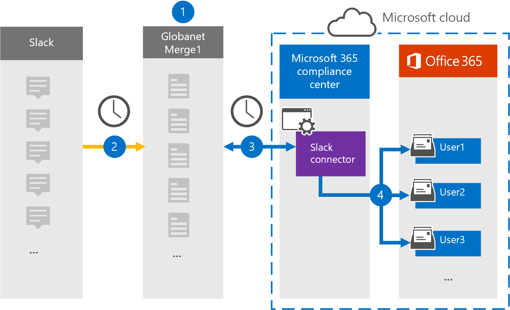

# アーカイブ余裕期間電子情報開示データへのコネクタの設定

Microsoft 365 コンプライアンスセンターの Globanet コネクタを使用して、ソーシャルメディア、インスタントメッセージング、およびドキュメントコラボレーションプラットフォームから Microsoft 365 組織のメールボックスにサードパーティのデータをインポートし、アーカイブします。 Globanet には、サードパーティのデータソースからアイテムを取得するように構成された [余裕期間](https://globanet.com/slack/) コネクタが用意されています (定期的に)。次に、それらのアイテムを Microsoft 365 にインポートします。 余裕期間は、メッセージやファイルを余裕期間 API から取得して電子メールメッセージ形式に変換し、そのアイテムをユーザーのメールボックスにインポートします。

余裕期間の電子情報開示データはユーザーのメールボックスに格納されます。訴訟ホールド、電子情報開示、アイテム保持ポリシー、保持ラベル、および通信コンプライアンスなどの Microsoft 365 コンプライアンス機能を適用できます。 余裕期間コネクタを使用して Microsoft 365 のデータをインポートおよびアーカイブすることにより、組織は政府および規制ポリシーに準拠したままにすることができます。

## アーカイブ余裕期間の電子情報開示データの概要

次の概要では、コネクタを使用して、Microsoft 365 で余裕期間情報をアーカイブするプロセスについて説明します。

1. 組織は余裕期間を使用して、余裕期間サイトを設定および構成します。

2. 24時間ごとに、余裕期間電子情報開示からのチャットメッセージは Globanet Merge1 サイトにコピーされます。 また、コネクタは、チャットメッセージの内容を電子メールメッセージの形式に変換します。

3. Microsoft 365 コンプライアンスセンターで作成した余裕期間電子情報開示コネクタは、毎日 Globanet Merge1 サイトに接続し、チャットメッセージを Microsoft クラウド内のセキュアな Azure ストレージの場所に転送します。

4. 手順3で説明されているように、コネクタは、 *電子メール* プロパティの値と自動ユーザーマッピングを使用して、変換されたチャットメッセージアイテムを特定のユーザーのメールボックスにインポートします。 ユーザーメールボックスに「 **余裕期間電子情報開示** 」という名前の受信トレイフォルダーに新しいサブフォルダーが作成され、そのフォルダーにチャットメッセージアイテムがインポートされます。 コネクタは、 *Email* プロパティの値を使用して、アイテムをインポートするメールボックスを決定します。 すべてのチャットメッセージには、このプロパティが含まれており、チャットメッセージのすべての参加者の電子メールアドレスが設定されます。

## はじめに

- Microsoft コネクタ用の Globanet Merge1 アカウントを作成します。 アカウントを作成するには、 [Globanet カスタマーサポート](https://globanet.com/ms-connectors-contact)に問い合わせてください。 このアカウントは、手順1でコネクタを作成するときにサインインします。

- 組織の余裕期間エンタープライズアカウントのユーザー名とパスワードを取得します。 余裕期間を構成するときは、手順2でこのアカウントにサインインする必要があります。

- 手順1で余裕期間の電子情報開示コネクタを作成する (および手順3で完了する) ユーザーは、Exchange Online のメールボックスのインポートのエクスポート役割に割り当てられている必要があります。 この役割は、Microsoft 365 コンプライアンスセンターの [ **データコネクタ** ] ページでコネクタを追加するために必要です。 既定では、この役割は Exchange Online の役割グループに割り当てられていません。 Exchange Online の組織の管理役割グループに、メールボックスのインポートの役割を追加することができます。 または、役割グループを作成し、メールボックスインポートエクスポート役割を割り当ててから、適切なユーザーをメンバーとして追加することもできます。 詳細については、記事「Manage role groups in Exchange Online」の「 [役割グループの作成](https://docs.microsoft.com/Exchange/permissions-exo/role-groups#create-role-groups) 」または「 [役割グループの変更](https://docs.microsoft.com/Exchange/permissions-exo/role-groups#modify-role-groups) 」のセクションを参照してください。

## 手順 1: 余裕期間電子情報開示コネクタを設定する

最初の手順として、Microsoft 365 コンプライアンスセンターの [ **データコネクタ** ] ページにアクセスし、余裕期間データ用のコネクタを作成します。

1. に移動 [https://compliance.microsoft.com](https://compliance.microsoft.com/) し、[ **データコネクタ** の  >  **余裕期間電子情報開示** ] をクリックします。

2. [ **余裕期間の電子情報開示** の製品の説明] ページで、[ **コネクタの追加** ] をクリックします。

3. [ **サービス利用規約** ] ページで、[ **同意** する] をクリックします。

4. コネクタを識別する一意の名前を入力し、[ **次へ** ] をクリックします。

5. Merge1 アカウントにサインインして、コネクタを構成します。

## 手順 2: 余裕期間の電子情報開示を構成する

2番目の手順は、Merge1 サイトで余裕期間電子情報開示コネクタを構成することです。 Globanet Merge1 サイトで余裕期間電子情報開示コネクタを構成する方法の詳細については、「 [Merge1 サードパーティコネクタユーザーガイド](https://docs.ms.merge1.globanetportal.com/Merge1%20Third-Party%20Connectors%20Slack%20eDiscovery%20User%20Guide.pdf)」を参照してください。

[ **保存 & 完了** ] をクリックすると、Microsoft 365 コンプライアンスセンターのコネクタウィザードの [ **ユーザーマッピング** ] ページが表示されます。

## 手順 3: ユーザーをマップしてコネクタのセットアップを完了する

1. [ **外部ユーザーを Microsoft 365 ユーザーにマップする** ] ページで、[自動ユーザーマッピング] を有効にします。

   余裕期間電子情報開示アイテムには、 *電子メール* というプロパティが含まれています。これには、組織内のユーザーの電子メールアドレスが含まれます。 コネクタがこのアドレスを Microsoft 365 ユーザーに関連付けることができる場合は、そのユーザーのメールボックスにアイテムがインポートされます。

2. [ **管理者の同意** ] ページで、[ **同意を提供** する] をクリックします。 Microsoft サイトにリダイレクトされます。 同意を得るには、[ **承諾** ] をクリックします。

   組織は、Office 365 インポートサービスが組織内のメールボックスデータにアクセスできるようにするための同意を得る必要があります。 管理者の同意を得るには、Microsoft 365 グローバル管理者の資格情報を使用してサインインし、同意要求を承諾する必要があります。 グローバル管理者としてサインインしていない場合は、 [このページ](https://login.microsoftonline.com/common/oauth2/authorize?client_id=570d0bec-d001-4c4e-985e-3ab17fdc3073&response_type=code&redirect_uri=https://portal.azure.com/&nonce=1234&prompt=admin_consent) に移動して、グローバル管理者の資格情報を使用してサインインし、要求を承諾することができます。

3. [ **次へ** ] をクリックして設定を確認し、[ **データコネクタ** ] ページに移動して、新しいコネクタのインポート処理の進行状況を確認します。

## 手順 4: 余裕期間電子情報開示コネクタを監視する

余裕期間の電子情報開示コネクタを作成した後、Microsoft 365 コンプライアンスセンターでコネクタの状態を表示できます。

1. [https://compliance.microsoft.com](https://compliance.microsoft.com)左側のナビゲーションに移動し、[ **データコネクタ** ] をクリックします。

2. [ **コネクタ** ] タブをクリックし、[ **余裕期間電子情報開示** ] コネクタを選択して、フライアウトページを表示します。 このページには、コネクタに関するプロパティと情報が含まれています。

3. [ **コネクタの状態 (ソース付き** )] の下で、[ **ログのダウンロード** ] リンクをクリックしてコネクタの状態ログを開く (または保存) します。 このログには、Microsoft クラウドにインポートされたデータに関する情報が含まれています。

## 既知の問題

- 現時点では、10 MB を超える添付ファイルやアイテムのインポートはサポートされていません。 より大きいアイテムのサポートは、後日提供されます。
