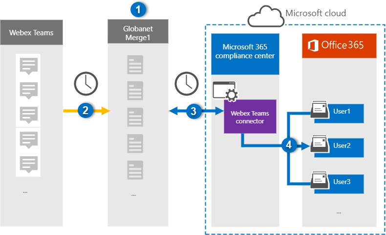

# Webex Teams データをアーカイブするコネクタを設定する (プレビュー)

Microsoft 365 コンプライアンスセンターの Globanet コネクタを使用して、Webex Teams のデータを Microsoft 365 組織のユーザーのメールボックスにインポートし、アーカイブします。 Globanet には、webex Teams のコミュニケーションアイテムをキャプチャして Microsoft 365 にインポートするために構成された [Webex teams](https://globanet.com/webex-teams/) コネクタが用意されています。 このコネクタは、Webex Teams (1:1 チャット、グループ会話、チャネル会話、添付ファイルなど) からのコンテンツを電子メールメッセージ形式に変換し、それらのアイテムを Microsoft 365 のユーザーのメールボックスにインポートします。

Webex Teams データをユーザーメールボックスに格納した後、訴訟ホールド、電子情報開示、アイテム保持ポリシー、保持ラベル、および通信コンプライアンスなどの Microsoft 365 コンプライアンス機能を適用できます。 Webex Teams コネクタを使用して Microsoft 365 のデータをインポートおよびアーカイブすることにより、組織は政府および規制ポリシーに準拠したままにすることができます。

## Webex Teams のアーカイブの概要

次の概要では、コネクタを使用して、Microsoft 365 で Webex Teams データをアーカイブするプロセスについて説明します。

1. 組織は Webex Teams と連携して、Webex Teams サイトを設定して構成します。

2. 24時間ごとに、Webex Teams アイテムは Globanet Merge1 サイトにコピーされます。 また、コネクタは、Webex Teams アイテムを電子メールメッセージ形式に変換します。

3. Microsoft 365 コンプライアンスセンターで作成した Webex Teams コネクタは、Globanet Merge1 に毎日接続し、Microsoft クラウド内のセキュアな Azure ストレージの場所に Webex Teams アイテムを転送します。

4. コネクタは、[手順 3](#step-3-map-users-and-complete-the-connector-setup)で説明されているように、自動ユーザーマッピングの*Email*プロパティの値を使用して、特定のユーザーのメールボックスにアイテムをインポートします。 ユーザーのメールボックスに、 **Webex Teams** という名前の受信トレイフォルダー内のサブフォルダーが作成され、そのフォルダーにアイテムがインポートされます。 コネクタは、 *Email* プロパティの値を使用してこれを実行します。 Webex Teams のすべてのアイテムには、アイテムのすべての参加者の電子メールアドレスが設定されたこのプロパティが含まれています。

## 開始する前に

- Webex Teams コネクタの使用条件に同意して、Globanet Merge1 アカウントを作成します。 これを行うには、 [Globanet カスタマーサポート](https://globanet.com/contact-us)にお問い合わせください。 手順1でコネクタを作成するときに、このアカウントにサインインする必要があります。

- で、 [https://developer.webex.com/](https://developer.webex.com) Webex Teams アカウントからデータを取得するためのアプリケーションを作成します。 アプリケーションの作成手順については、「 [Merge1 サードパーティコネクタのユーザーガイド](https://docs.ms.merge1.globanetportal.com/Merge1%20Third-Party%20Connectors%20Webex%20Teams%20User%20Guide%20.pdf)」を参照してください。

   このアプリケーションを作成すると、Webex プラットフォームは固有の資格情報のセットを生成します。 これらの資格情報は、グローバル Merge1 サイトで Webex Teams コネクタを構成する際に、手順2で使用されます。

- 手順1で Webex Teams コネクタを作成したユーザー (および手順3で完了します) は、Exchange Online のメールボックスのインポートのエクスポート役割に割り当てられている必要があります。 この役割は、Microsoft 365 コンプライアンスセンターの [ **データコネクタ** ] ページでコネクタを追加するために必要です。 既定では、この役割は Exchange Online のどの役割グループにも割り当てられていません。 Exchange Online の組織の管理役割グループに、メールボックスのインポートの役割を追加することができます。 または、役割グループを作成し、メールボックスインポートエクスポート役割を割り当ててから、適切なユーザーをメンバーとして追加することもできます。 詳細については、記事「Manage role groups in Exchange Online」の「 [役割グループの作成](https://docs.microsoft.com/Exchange/permissions-exo/role-groups#create-role-groups) 」または「 [役割グループの変更](https://docs.microsoft.com/Exchange/permissions-exo/role-groups#modify-role-groups) 」のセクションを参照してください。

## 手順 1: Webex Teams コネクタを設定する

最初の手順として、 **データコネクタ** へのアクセスを取得し、 [Webex Teams](https://globanet.com/webex-teams/) コネクタを設定します。

1. に移動 [https://compliance.microsoft.com](https://compliance.microsoft.com/) し、[**データコネクタ**]  >  **Webex Teams**をクリックします。

2. [ **Webex Teams** 製品の説明] ページで、[ **コネクタの追加**] をクリックします。

3. [ **サービス利用規約** ] ページで、[ **同意**する] をクリックします。

4. コネクタを識別する一意の名前を入力し、[ **次へ**] をクリックします。

5. Merge1 アカウントにサインインして、コネクタを構成します。

## 手順 2: Globanet Merge1 サイト上の Webex Teams コネクタを構成する

2番目の手順は、Merge1 サイトで Webex Teams コネクタを構成することです。 Webex Teams コネクタを構成する方法については、「 [Merge1 サードパーティコネクタユーザーガイド](https://docs.ms.merge1.globanetportal.com/Merge1%20Third-Party%20Connectors%20Webex%20Teams%20User%20Guide%20.pdf)」を参照してください。

[ **保存 & 完了**] をクリックすると、Microsoft 365 コンプライアンスセンター (コネクタウィザードの [ **ユーザーマッピング** ] ページ) に戻ることができます。

## 手順 3: ユーザーをマップしてコネクタのセットアップを完了する

ユーザーをマップし、Microsoft 365 コンプライアンスセンターでコネクタの設定を完了するには、次の手順を実行します。

1. [ **Webex Teams ユーザーを Microsoft 365 ユーザーにマップする** ] ページで、[自動ユーザーマッピング] を有効にします。 Webex Teams アイテムには、 *電子メール*というプロパティがあります。このプロパティには、組織内のユーザーの電子メールアドレスが含まれています。 コネクタがこのアドレスを Microsoft 365 ユーザーに関連付けることができる場合は、そのユーザーのメールボックスにアイテムがインポートされます。

2. [ **管理者の同意** ] ページで、[ **同意を与える** ] ボタンをクリックします。 Microsoft サイトにリダイレクトされます。 同意を得るには、[ **承諾** ] をクリックします。
  
   組織は、Office 365 インポートサービスが組織内のメールボックスデータにアクセスできるようにするための同意を得る必要があります。 管理者の同意を得るには、Microsoft 365 グローバル管理者の資格情報を使用してサインインし、同意要求を承諾する必要があります。 グローバル管理者としてサインインしていない場合は、 [このページ](https://login.microsoftonline.com/common/oauth2/authorize?client_id=570d0bec-d001-4c4e-985e-3ab17fdc3073&response_type=code&redirect_uri=https://portal.azure.com/&nonce=1234&prompt=admin_consent) に移動して、グローバル管理者の資格情報を使用してサインインし、要求を承諾することができます。

3. [ **次へ**] をクリックして設定を確認し、[ **データコネクタ** ] ページに移動して、新しいコネクタのインポート処理の進行状況を確認します。

## 手順 4: Webex Teams コネクタを監視する

Webex Teams コネクタを作成した後、Microsoft 365 コンプライアンスセンターでコネクタの状態を表示できます。

1. [https://compliance.microsoft.com](https://compliance.microsoft.com)左側のナビゲーションに移動し、[**データコネクタ**] をクリックします。

2. [ **コネクタ** ] タブをクリックし、[ **Webex Teams** コネクタ] を選択して、コネクタに関するプロパティと情報を含むフライアウトページを表示します。

3. [ **コネクタの状態 (ソース付き**)] の下で、[ **ログのダウンロード** ] リンクをクリックしてコネクタの状態ログを開く (または保存) します。 このログには、Microsoft クラウドにインポートされたデータに関する情報が含まれています。

## 既知の問題

- 現時点では、10 MB を超える添付ファイルのインポートをサポートしていませんが、より大きいアイテムのサポートは後日提供されます。
