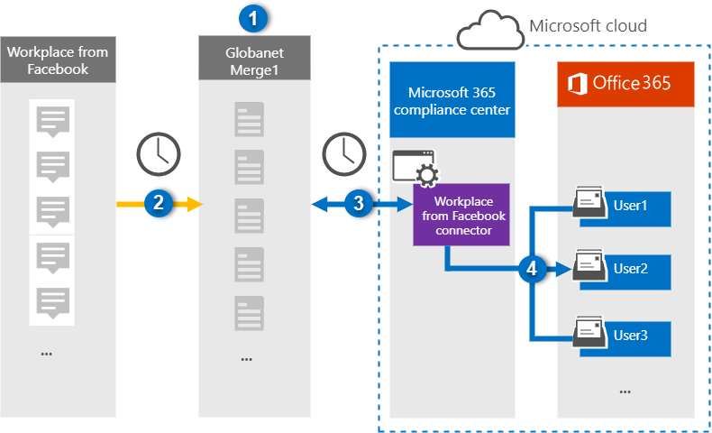

# Facebook データからワークプレースをアーカイブするためのコネクタの設定

Microsoft 365 コンプライアンスセンターの Globanet コネクタを使用して、Facebook から Microsoft 365 組織のユーザーのメールボックスにデータをインポートし、アーカイブします。 Globanet は、サードパーティのデータソースからアイテムを取得するように構成された [Facebook](https://globanet.com/workplace/) コネクタ (定期的に) を提供し、それらのアイテムを Microsoft 365 にインポートします。 コネクタは、職場からのチャット、添付ファイル、投稿、ビデオなどのコンテンツを電子メールメッセージ形式に変換し、それらのアイテムを Microsoft 365 のユーザーメールボックスにインポートします。

ユーザーのメールボックスに Workplace データを格納した後、訴訟ホールド、電子情報開示、アイテム保持ポリシー、保持ラベル、および通信コンプライアンスなどの Microsoft 365 コンプライアンス機能を適用できます。 Facebook connector から Workplace を使用して Microsoft 365 のデータをインポートおよびアーカイブすることにより、組織は政府および規制ポリシーに準拠したままにすることができます。

## Facebook データからのワークプレースのアーカイブの概要

次の概要では、コネクタを使用して Microsoft 365 の Workplace データをアーカイブするプロセスについて説明します。

1. 組織は Facebook の Workplace を使用して、Workplace サイトをセットアップして構成します。

2. 24時間ごとに、Workplace のアイテムは Globanet Merge1 サイトにコピーされます。 また、コネクタは、これらのアイテムの内容を電子メールメッセージの形式に変換します。

3. Microsoft 365 コンプライアンスセンターで作成した Facebook コネクタの Workplace は、Globanet Merge1 に毎日接続し、Microsoft クラウド内のセキュアな Azure ストレージの場所に Workplace items を転送します。

4. このコネクタは、手順3で説明されているように、自動ユーザーマッピングの *Email* プロパティの値を使用して、変換されたアイテムを特定のユーザーのメールボックスにインポートします。 **Facebook からの workplace** という名前の受信トレイフォルダー内のサブフォルダーが作成され、そのフォルダーに workplace アイテムがインポートされます。 コネクタは、 *Email* プロパティの値を使用してこれを実行します。 すべての Workplace アイテムには、すべてのチャットまたは投稿の参加者の電子メールアドレスが設定された、このプロパティが含まれています。

## はじめに

- Microsoft コネクタ用の Globanet Merge1 アカウントを作成します。 このアカウントを作成するには、 [Globanet カスタマーサポート](https://globanet.com/ms-connectors-contact)に問い合わせてください。 このアカウントは、手順1でコネクタを作成するときにサインインします。

- https://my.workplace.com/work/admin/apps/コンプライアンスと電子情報開示の目的で、api 経由でワークプレースからデータを取得するためのカスタム統合を作成します。

   統合の作成時に、Workplace プラットフォームは認証に使用されるトークンの生成に使用される一意の資格情報のセットを生成します。 これらのトークンは、手順2の Facebook コネクタ構成ウィザードで使用されます。 アプリケーションの作成方法に関するステップバイステップの手順については、「 [Merge1 サードパーティコネクタのユーザーガイド](https://docs.ms.merge1.globanetportal.com/Merge1%20Third-Party%20Connectors%20Workplace%20from%20Facebook%20User%20Guide%20.pdf)」を参照してください。

- 手順1で Facebook コネクタから Workplace を作成する (および手順3で完了する) ユーザーは、Exchange Online のメールボックスのインポートのエクスポート役割に割り当てられている必要があります。 この役割は、Microsoft 365 コンプライアンスセンターの [ **データコネクタ** ] ページでコネクタを追加するために必要です。 既定では、この役割は Exchange Online の役割グループに割り当てられていません。 Exchange Online の組織の管理役割グループに、メールボックスのインポートの役割を追加することができます。 または、役割グループを作成し、メールボックスインポートエクスポート役割を割り当ててから、適切なユーザーをメンバーとして追加することもできます。 詳細については、記事「Manage role groups in Exchange Online」の「 [役割グループの作成](https://docs.microsoft.com/Exchange/permissions-exo/role-groups#create-role-groups) 」または「 [役割グループの変更](https://docs.microsoft.com/Exchange/permissions-exo/role-groups#modify-role-groups) 」のセクションを参照してください。

## 手順 1: Facebook コネクタから Workplace をセットアップする

最初の手順として、Microsoft 365 コンプライアンスセンターの [ **データコネクタ** ] ページにアクセスし、Workplace データ用のコネクタを作成します。

1. に移動 [https://compliance.microsoft.com](https://compliance.microsoft.com/) し、[ **データコネクタ**  >  **Workplace from Facebook** ] をクリックします。

2. [ **Facebook 製品の** 説明] ページで、[ **コネクタの追加** ] をクリックします。

3. [ **サービス利用規約** ] ページで、[ **同意** する] をクリックします。

4. コネクタを識別する一意の名前を入力し、[ **次へ** ] をクリックします。

5. Merge1 アカウントにサインインして、コネクタを構成します。

## 手順 2: Globanet Merge1 サイトの Facebook コネクタから Workplace を構成する

2番目の手順は、Merge1 サイトの Facebook コネクタからの Workplace を構成することです。 Facebook コネクタからの Workplace を構成する方法については、「 [Merge1 サードパーティコネクタユーザーガイド](https://docs.ms.merge1.globanetportal.com/Merge1%20Third-Party%20Connectors%20Workplace%20from%20Facebook%20User%20Guide%20.pdf)」を参照してください。

[ **保存 & 完了** ] をクリックすると、Microsoft 365 コンプライアンスセンターのコネクタウィザードの [ **ユーザーマッピング** ] ページが表示されます。

## 手順 3: ユーザーをマップしてコネクタのセットアップを完了する

ユーザーをマップし、Microsoft 365 コンプライアンスセンターでコネクタの設定を完了するには、次の手順を実行します。

1. [ **外部ユーザーを Microsoft 365 ユーザーにマップする** ] ページで、[自動ユーザーマッピング] を有効にします。 Workplace アイテムには、組織内のユーザーの電子メールアドレスを含む *email* というプロパティが含まれています。 コネクタがこのアドレスを Microsoft 365 ユーザーに関連付けることができる場合は、そのユーザーのメールボックスにアイテムがインポートされます。

2. [ **管理者の同意** ] ページで、[ **同意を提供** する] をクリックします。 Microsoft サイトにリダイレクトされます。 同意を得るには、[ **承諾** ] をクリックします。
  
   組織は、Office 365 インポートサービスが組織内のメールボックスデータにアクセスできるようにするための同意を得る必要があります。 管理者の同意を得るには、Microsoft 365 グローバル管理者の資格情報を使用してサインインし、同意要求を承諾する必要があります。 グローバル管理者としてサインインしていない場合は、 [このページ](https://login.microsoftonline.com/common/oauth2/authorize?client_id=570d0bec-d001-4c4e-985e-3ab17fdc3073&response_type=code&redirect_uri=https://portal.azure.com/&nonce=1234&prompt=admin_consent) に移動して、グローバル管理者の資格情報を使用してサインインし、要求を承諾することができます。

3. [ **次へ** ] をクリックして設定を確認し、[ **データコネクタ** ] ページに移動して、新しいコネクタのインポート処理の進行状況を確認します。

## 手順 4: Facebook コネクタから Workplace を監視する

Facebook コネクタから Workplace を作成した後、Microsoft 365 コンプライアンスセンターでコネクタの状態を表示できます。

1. [https://compliance.microsoft.com](https://compliance.microsoft.com)左側のナビゲーションに移動し、[ **データコネクタ** ] をクリックします。

2. [ **コネクタ** ] タブをクリックしてから、[ **Facebook から Workplace** ] コネクタを選択して、フライアウトページを表示します。 このページには、コネクタに関するプロパティと情報が含まれています。

3. [ **コネクタの状態 (ソース付き** )] の下で、[ **ログのダウンロード** ] リンクをクリックしてコネクタの状態ログを開く (または保存) します。 このログには、Microsoft クラウドにインポートされたデータに関する情報が含まれています。

## 既知の問題

- 現時点では、10 MB を超える添付ファイルやアイテムのインポートはサポートされていません。 より大きいアイテムのサポートは、後日提供されます。
