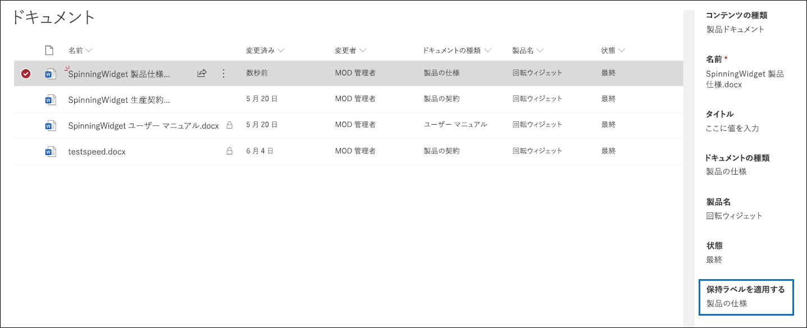
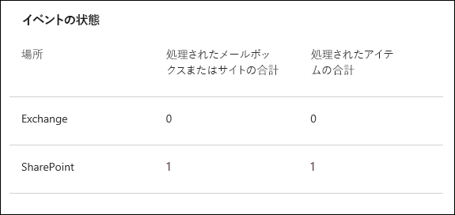

# <a name="manage-the-lifecycle-of-sharepoint-documents-with-retention-labels"></a>保持ラベルを使用して SharePoint ドキュメントのライフサイクルを管理する

>*[セキュリティとコンプライアンスのための Microsoft 365 ライセンス ガイダンス](https://aka.ms/ComplianceSD)。*

この記事では、保持ラベルを使用して、特にラベルを自動適用してイベント ベースの保持を構成することにより、SharePoint Online に保存されている製品関連ドキュメントのライフサイクルを管理する方法について説明します。 自動適用機能は、SharePoint メタデータを使用してドキュメント分類を活用します。 この記事のシナリオは製品関連のドキュメントに基づいていますが、他のシナリオにも同じ概念を使用できます。 たとえば、石油およびガス産業では、石油基地、坑井検層、生産ライセンスなどの物理的資産に関連するドキュメントのライフサイクルを管理できます。 金融サービス業界では、銀行口座、住宅ローン、または保険契約に関連するドキュメントを管理できます。 公的機関では、建設許可または税務フォームに関連する文書を管理できます。

この記事のシナリオを見てみましょう。 情報アーキテクチャと保持ラベルの定義を見ていきます。 次に、ラベルを自動適用してドキュメントを分類し、最終的に保持期間の開始を開始するイベントを生成します。

## <a name="information-architecture"></a>情報アーキテクチャ

この記事のシナリオは、SharePoint Online を使用して、会社が開発する製品に関連するすべてのドキュメントを保存する製造会社に基づいています。 これらのドキュメントには、製品の仕様、仕入先との契約、およびユーザー マニュアルが含まれます。 これらのドキュメントがエンタープライズ コンテンツ管理ポリシーの一部として SharePoint に保存されている場合、ドキュメント メタデータが定義され、分類に使用されます。 各ドキュメントには、次のメタデータ プロパティがあります。

- **ドキュメントの種類** (製品の仕様、契約、ユーザー マニュアルなど)

- **製品名**

- **状態** (下書きまたは最終版)

このメタデータは、すべてのドキュメントの**生産ドキュメント**と呼ばれる基本コンテンツの種類を形成します。


> [!NOTE]
> **ドキュメントの種類**プロパティと**状態**プロパティは、後述のシナリオで保持ポリシーによって使用され、保持ラベルを分類して自動適用します。

さまざまな種類のドキュメントを表す複数のコンテンツの種類を使用できますが、製品ドキュメントに重点を置きましょう。

このシナリオでは、Managed Metadata Service と用語ストアを使用して、**ドキュメントの種類**の用語セットと**製品名**の用語セットを作成します。 用語セットごとに、値ごとに用語を作成します。 SharePoint 組織の用語ストアでは、次のようになります。


コンテンツの種類は、[コンテンツ タイプ ハブ](https://support.office.com/article/manage-content-type-publishing-06f39ac0-5576-4b68-abbc-82b68334889b)を使用して作成および公開できます。 コンテンツの種類は、[PnP プロビジョニング フレームワーク](https://docs.microsoft.com/sharepoint/dev/solution-guidance/pnp-provisioning-framework)や[サイト デザイン JSON スキーマ](https://docs.microsoft.com/sharepoint/dev/declarative-customization/site-design-json-schema#define-a-new-content-type)などのサイト プロビジョニング ツールを使用して作成および公開することもできます。

各製品には、1 つのドキュメント ライブラリを含む専用の SharePoint Online サイトがあり、適切なコンテンツの種類が有効になっています。 すべてのドキュメントはこのドキュメント ライブラリに保存されます。


> [!NOTE]
> このシナリオの製造会社では、製品ごとに SharePoint Online サイトを用意する代わりに、製品ごとに Microsoft チームを使用して、永続チャットなどのチーム メンバーとの共同作業をサポートし、チームの [**ファイル**] タブを使用してドキュメントを管理できます。 この記事ではドキュメントのみに重点を置いているため、サイトのみを使用します。

回転ウィジェット製品のドキュメント ライブラリのビューを次に示します。


ドキュメント管理用に基本的な情報アーキテクチャが用意されているので、ドキュメントのメタデータと分類を使用するドキュメントの保持および廃棄戦略を見てみましょう。

## <a name="retention-and-disposition"></a>保持および廃棄

製造会社のコンプライアンスおよびデータ ガバナンスのポリシーは、データの保存および廃棄方法を規定しています。 製品に関連するドキュメントは、製品を製造する期間、およびその後の一定期間保管する必要があります。 この期間は、製品の仕様、契約、およびユーザー マニュアルによって異なります。 次の表は、保持と廃棄の要件を示しています。

| **ドキュメントの種類**          | **保持**                          | **廃棄**                              |
| -------------------------- | -------------------------------------- | -------------------------------------------- |
| 製品の仕様      | 生産中止後 5 年  | 削除                                       |
| 製品契約          | 生産中止後 10 年 | レビュー                                       |
| ユーザー マニュアル                | 生産中止後 5 年  | 削除                                       |
| 他のすべての種類のドキュメント | 他のドキュメントを積極的に保持しない  | ドキュメントが 3 年以上経過したときに削除する<sup>\*</sup>  |
|||

> [!NOTE]
> <sup>\*</sup> 過去 3 年以内に変更されていないドキュメントは、3 年以上前のものと見なされます。

セキュリティとコンプライアンス センターを使用して、次の保持ラベルを作成します。

  - 製品の仕様

  - 製品の契約

  - ユーザー マニュアル

この記事では、製品の仕様の保持ラベルを作成して自動適用する方法のみを示します。 完全なシナリオを実装するには、他の 2 つのドキュメントの種類の保持ラベルを作成して自動適用します。

### <a name="settings-for-the-product-specification-retention-label"></a>製品の仕様の保持ラベルの設定

製品の仕様の保持ラベルの[ファイル計画](file-plan-manager.md)は次のとおりです。 

- **名前:** 製品の仕様

- **管理者向けの説明:** 製品の仕様のラベル、生産中止後 5 年間保持、自動削除、イベント ベースの保持、イベントの種類は製品の中止

- **ユーザーの説明:** 生産中止後 5 年間保持

- **保持処理:** 保持と削除

- **保持期間:**  5 年 (1825 日)

- **レコード ラベル:** 保持ラベルを構成して、コンテンツを[レコード](labels.md#using-retention-labels-for-records-management)として分類する(レコードとして分類されたドキュメントは、ユーザーが変更または削除することはできません)

- **ファイル計画記述子:** (シナリオを簡素化するため、ファイル記述子は提供されません)

次のスクリーンショットは、セキュリティおよびコンプライアンス センターで製品の仕様の[保持ラベル](labels.md)を作成するときの設定を示しています。 保持ラベルを作成するときに、**製品の中止**のイベントの種類を作成できます。 以下の手順を参照してください。


> [!NOTE]
> 実用的な目的のため、またドキュメントが自動的に削除されるのを 5 年間待つ必要をなくすために、テスト環境でこのシナリオを再作成する場合は、保持期間を 1 日に設定します。

### <a name="create-an-event-type-when-creating-a-retention-label"></a>保持ラベルを作成するときにイベント種類を作成する

1. ドロップダウン リストに**基づくコンテンツの保持または削除**で、**イベント**を選択します。

2. [**イベントの種類を選択します**] を選択します。

   

3. [**イベントの種類を選択します**] ページで、ここで [**新しいイベントの種類を作成できます**] を選択します。

4. [**製品の中止**] という名前のイベントの種類を作成し、説明を入力し、[**完了**] を選択して作成します。 

5. [**イベントの種類を選択します**] ページに戻り、作成した [**製品の中止**] イベントの種類を選択して、[**追加**] を選択します。

製品の仕様の保持ラベルの設定は次のとおりです。 [**このラベルを作成**] を選択して作成します。


> [!TIP]
> 詳細な手順については、「[保持期間がイベントに基づくラベルを作成する](event-driven-retention.md#step-1-create-a-label-whose-retention-period-is-based-on-an-event)」をご覧ください。

保持ラベルが作成されたので、製品の仕様のコンテンツへの保持ラベルの自動適用を見てみましょう。

## <a name="classifying-content-by-auto-applying-retention-labels"></a>保持ラベルの自動適用によるコンテンツの分類

キーワード クエリ言語 (KQL) を使用して、このシナリオ用に作成した保持ラベルを[自動適用](labels.md#applying-a-retention-label-automatically-based-on-conditions)します。 KQL は、検索クエリの作成に使用される言語です。 KQL では、キーワードまたは管理プロパティを使用して検索できます。 KQL の詳細については、<https://docs.microsoft.com/sharepoint/dev/general-development/keyword-query-language-kql-syntax-reference> を参照してください。

大まかに言うと、Microsoft 365 に、「**製品の仕様**の保持ラベルを、**最終版**の**状態**および**製品の仕様**の**ドキュメントの種類**であるすべてのドキュメントに適用する」ように指示します。 **状態**および**ドキュメントの種類**は、以前に「[情報アーキテクチャ](#information-architecture)」セクションで製品のドキュメント コンテンツの種類に対して定義したサイト列であることを思い出してください。 これを実現するには、検索スキーマを構成する必要があります。

SharePoint がコンテンツのインデックスを作成するとき、各サイト列のクロールされたプロパティを自動的に生成します。 このシナリオでは、**ドキュメントの種類** プロパティと**状態**プロパティに関心があります。 検索でクロールされたプロパティを作成するには、適切なコンテンツの種類を使用し、サイト列に入力されたライブラリ内のドキュメントが必要です。

SharePoint 管理センターで、検索構成を開き、[**検索スキーマの管理**] を選択して、クロールされたプロパティを表示および構成できます。


[**クロールされたプロパティ**] ボックスに**状態**を入力し、緑色の矢印を選択すると、次のような結果が表示されます。


**ows\_\_Status** (二重アンダースコアに注意) のプロパティは、我々にとって興味のあるものです。 これは、生産ドキュメントのコンテンツの種類の**状態**プロパティにマップします。

**ows\_doc**と入力して緑色の矢印を選択すると、次のように表示されます。


プロパティ **ows\_Doc\_x0020\_Type** は、興味のある 2 番目のプロパティです。 これは、生産ドキュメントのコンテンツの種類の**ドキュメントの種類**プロパティにマップします。

> [!TIP]
> このシナリオのクロールされたプロパティの名前を識別するには、生産ドキュメントを含むドキュメント ライブラリに移動してから、ライブラリ設定に移動します。 [**列**] で、列の名前 (**状態**や**ドキュメントの種類**など) を選択して、サイトの列ページを開きます。 そのページの URL の**フィールド** パラメーターには、フィールドの名前が含まれています。 先頭に「ows_」が付いたこのフィールド名は、クロールされたプロパティの名前です。 たとえば、URL `https://tenantname.sharepoint.com/sites/SpinningWidget/_layouts/15/FldEdit.aspx?List=%7BC38C2F45-3BD6-4C3B-AA3B-EF5DF6B3D172%7D&Field=_Status` は **ows\_\_Status** のクロールされたプロパティに対応します。

探しているクロールされたプロパティが SharePoint 管理センターの [検索スキーマの管理] セクションに表示されない場合、次のいずれかの理由が考えられます。

- ドキュメントには索引が作成されていません。 [ドキュメント ライブラリ設定]、[詳細設定] の順に移動し、ライブラリのインデックスを強制的に再作成できます。

- ドキュメント ライブラリが最新のサイトにある場合は、SharePoint 管理者もサイト コレクション管理者であることを確認してください。

クロールされ管理されたプロパティの詳細については、「[SharePoint Server で自動的に作成される管理プロパティ](https://docs.microsoft.com/sharepoint/technical-reference/automatically-created-managed-properties-in-sharepoint)」をご覧ください。

### <a name="mapping-crawled-properties-to-pre-defined-managed-properties"></a>クロールされたプロパティを事前定義された管理プロパティにマッピングする

KQL は、検索クエリでクロールされたプロパティを使用できません。 管理プロパティを使用する必要があります。 通常の検索シナリオでは、管理プロパティを作成し、必要なクロールされたプロパティにマップします。 ただし、保持ラベルを自動適用する場合は、KQL で事前定義された管理プロパティのみを指定でき、カスタム管理プロパティは指定できません。 使用可能な文字列 RefinableString00 から RefinableString199 に対して、システム内に既に作成された定義済みの管理プロパティのセットがあります。 完全なリストについては、「[既定の未使用の管理プロパティ](https://docs.microsoft.com/sharepoint/manage-search-schema#default-unused-managed-properties)」を参照してください。 これらの既定の管理プロパティは、通常、絞り込み検索の条件を定義するために使用されます。

KQL クエリが機能し、正しい保持ラベルを製品ドキュメント コンテンツに自動的に適用するために、クロールされたプロパティ **ows\_Doc\_x0020\_Type** および **ows\_\_Status** を 2 つの絞り込み可能な管理プロパティにマップします。 このシナリオのテスト環境では、**RefinableString00** と **RefinableString01** は使用されていません。 SharePont 管理センターの [**検索スキーマの管理**] で [**管理プロパティ**] を見て、これを決定しました。


前のスクリーンショットの [**マップ先のクロールされたプロパティ**] 列は空であることにご注意ください。

**ows\_Doc\_x0020\_Type** のクロールされたプロパティをマップするには、次の手順を実行します。

1. [**管理プロパティ**] フィルター ボックスに **RefinableString00** と入力し、緑色の矢印を選択します。

2. 結果一覧で、**RefinableString00** リンクを選択し、[**クロールされたプロパティへのマッピング**] セクションまで下にスクロールします。  

3. [**マッピングの追加**] を選択し、[**クロールされたプロパティの選択**] ウィンドウの [**クロールされたプロパティ名の検索**] ボックスに **ows\_Doc\_x0020\_Type** と入力します。 [**検索**] を選択します。  

4. 結果リストで、**ows\_Doc\_x0020\_Type** を選択し、[**OK**] を選択します。

   [**マップ先のクロールされたプロパティ**] セクションに、次のスクリーンショットのようなものが表示されます。

   ![[マップ先のクロールされたプロパティ] セクションで [マッピングの追加] を選択する](../media/SPRetention13.png)

5. ページの一番下までスクロールし、[**OK**] を選択してマッピングを保存します。

この同じ手順を繰り返して、RefinableString01 と ows\_\_Status をマップします。

これで、2 つのクロールされたプロパティにマップされた 2 つの管理プロパティが必要になります。


エンタープライズ検索を実行して、これらすべてが正しく設定されていることを確認しましょう。 ブラウザーで、https://yourtenant.sharepoint.com/search に移動します。 検索ボックスに **RefinableString00:"Product Specification"** と入力し、Enter キーを押します。 これにより、製品の仕様が**ドキュメントの種類**であるすべてのドキュメントが返されます。

検索ボックスに、**RefinableString00:"Product Specification" AND RefinableString01:Final** と入力し、Enter キーを押します。 これにより、**ドキュメントの種類**として製品の仕様を持ち、状態が**最終版**であるすべてのドキュメントが返されます。

### <a name="creating-the-auto-apply-label-policies"></a>自動適用ラベル ポリシーの作成

KQL クエリが正しく機能していることを確認したので、KQL クエリを使用して適切なドキュメントに製品の仕様の保持ラベルを自動適用するラベル ポリシーを作成しましょう。

1. [セキュリティおよびコンプライアンス センター](https://protection.office.com)で、[**分類**] > [**保持ラベル**] に移動し、[**ラベルの自動適用**] を選択します。 

   ![[ラベル] ページで [ラベルの自動適用] を選択する](../media/SPRetention16.png)

2. [**自動適用するラベルの選択**] ウィザード ページで、[**自動適用するラベルの選択**] を選択します。

3. ラベル リストで [**製品の仕様**] を選択し、[**追加**]、[**次へ**] の順に選択します。

4. [**特定の単語または語句を含むコンテンツにラベルを適用する**] を選択し、[**次へ**] を選択します。

   ![特定の単語、語句、またはプロパティを含むコンテンツに [ラベルを適用する] を選択する](../media/SPRetention17.png)

   次の手順では、前のセクションでテストしたものと同じ KQL 検索クエリを提供します。 お気付きのとおり、このクエリは、状態が最終のすべての製品の仕様を返しました。 ラベル ポリシーでこの同じクエリを使用すると、製品の仕様の保持ラベルが、この検索クエリに一致するすべてのドキュメントに自動的に適用されます。

5. [**キーワード クエリ エディター**] ボックスに、**RefinableString00:"Product Specification" AND RefinableString01:Final** と入力し、[**次へ**] を選択します。

   ![[キーワード クエリ エディター] ボックスでクエリを指定する](../media/SPRetention19.png)

6. ラベル ポリシーの名前 (例: **製品の仕様のラベルの自動適用**) とオプションの説明を入力し、[**次へ**] を選択します。 

7. [**場所の選択**] ウィザード ページで、ポリシーを適用するコンテンツの場所を選択します。 このシナリオでは、すべての生産ドキュメントが SharePoint ドキュメント ライブラリにのみ保存されるため、SharePoint の場所にのみポリシーを適用します。 [**特定の場所を選択**] を選択して、Exchange メール、OneDrive アカウント、および Microsoft 365 グループの状態をオフに切り替え、SharePoint サイトの状態がオンに切り替えられていることを確認します。 

    

   > [!TIP]
   > ポリシーをすべての SharePoint サイトに適用する代わりに、[**サイトの選択**] を選択して、特定の SharePoint サイトの URL を追加できます。

8. [**次へ**] を選択して、[**設定を確認**] ページを表示します。 

    

9. [**自動適用**] を選択して、ラベル ポリシーを作成します。 提供した KQL 検索クエリに一致するすべてのドキュメントに製品の仕様のラベルを自動的に適用するには、最大 7 日かかります。

### <a name="verifying-the-retention-label-was-automatically-applied"></a>保持ラベルが自動的に適用されたことを確認する

7 日後、セキュリティおよびコンプライアンス センターの [[ラベル アクティビティ エクスプローラー](view-label-activity-for-documents.md)] を使用して、作成したラベル ポリシーがこのシナリオの保持ラベルを製品ドキュメントに自動的に適用したことを確認します。 次のスクリーンショットでは、保持ラベルは製品の契約およびユーザー マニュアルにも適用されています。ただし、この記事では保持ラベルとラベル ポリシーの作成については説明されていません。


もう 1 つの検証手順は、ドキュメント ライブラリ内のドキュメントのプロパティを調べることです。 情報パネルで、選択したドキュメントに保持ラベルが適用されていることがわかります。



保持ラベルはドキュメントに自動適用されていて、ドキュメントをレコードとして宣言するように保持ラベルが構成されているため、ドキュメントは削除されません。 この保護の例として、これらのドキュメントのいずれかを削除しようとすると、次のスクリーンショットに示すエラー メッセージが表示されます。


## <a name="generating-the-events-that-trigger-the-start-of-the-retention-period"></a>保持期間の開始をトリガーするイベントの生成

保持ラベルが自動的に正常に適用されたので、特定の製品の生産終了を示すイベントに注目しましょう。 このイベントが発生すると、ドキュメントに自動適用される保持ラベルで定義された保持期間の開始がトリガーされます。 たとえば、製品の仕様の場合、「生産終了」イベントがトリガーされると、5 年間の保持期間が開始されます。

セキュリティおよびコンプライアンス センターで ([**レコード管理**] > [**イベント**] に移動して) イベントを手動で作成し、イベントの種類を選択し、正しい資産 ID を設定してイベントの日付を入力できます。 詳細については、「[イベント ベースの保持の概要](event-driven-retention.md)」を参照してください。

このシナリオでは、外部の生産システムからイベントを生成することにより、イベントを自動的に作成します。 この場合、イベントを生成するシステムは、製品が生産中かどうかを示す単純な SharePoint リストと、リストに関連付けられてイベントをトリガーする [Microsoft Flow](https://docs.microsoft.com/flow/getting-started) です。 実際のシナリオでは、HR や CRM システムなど、イベントを生成する任意のシステムを使用できます。 Flow には、Exchange、SharePoint、Teams、Dynamics 365 などの Microsoft 365 ワークロード、および Twitter、Box、Salesforce、Workdays などのサード パーティ アプリ向けのすぐに使用できる多くの操作と文書パーツが含まれています。 これにより、Flow をこれらのシステムに簡単に統合できます。 詳細については、「[イベント ベースの保持を自動化する](automate-event-driven-retention.md)」を参照してください。

次のスクリーンショットは、イベントのトリガーに使用される SharePoint リストを示しています。 


現在生産中の製品は 2 つあり、[**生産中**] 列の [**はい**] の値で示されます。 製品のこの列の値が [**いいえ**] に設定されている場合、リストに関連付けられたフローは自動的にイベントを生成します。 これにより、対応する製品ドキュメントに自動適用された保持ラベルの保持期間の開始がトリガーされます。

このシナリオでは、次のフローを使用してイベントをトリガーします。


このフローを作成するには、SharePoint コネクターから開始し、「**アイテムが作成または変更されたとき**」トリガーを選択します。 サイト アドレスとリスト名を指定し、[**生産中**] リスト列の値が [**いいえ**] に設定されている (または条件カードで false に等しい) ときに基づいて条件を追加します。 次に、組み込みの HTTP テンプレートに基づいてアクションを追加します。 次のセクションの値を使用して、HTTP アクションを構成します。 以下のセクションから URI および本文プロパティの値をコピーして、テンプレートに貼り付けることができます。

- **方法**: 投稿
- **URI**: https://ps.compliance.protection.outlook.com/psws/service.svc/ComplianceRetentionEvent
- **ヘッダー**: キー = Content-Type、値 = application/atom+xml
- **本文**:

```HTML
<?xml version='1.0' encoding='utf-8' standalone='yes'>
<entry xmlns:d='https://schemas.microsoft.com/ado/2007/08/dataservices' xmlns:m='https://schemas.microsoft.com/ado/2007/08/dataservices/metadata' xmlns='https://www.w3.org/2005/Atom'>
<category scheme='https://schemas.microsoft.com/ado/2007/08/dataservices/scheme' term='Exchange.ComplianceRetentionEvent'>
<updated>9/9/2017 10:50:00 PM</updated>
<content type='application/xml'>
<m:properties>
<d:Name>Cessation Production @{triggerBody()?['Product_x0020_Name']?['Value']}</d:Name>
<d:EventType>Product Cessation&lt;</d:EventType>
<d:SharePointAssetIdQuery>ProductName:&quot;@{triggerBody()?['Product_x0020_Name']?['Value']}<d:SharePointAssetIdQuery>
<d:EventDateTime>@{formatDateTime(utcNow(),'yyyy-MM-dd')}</d:EventDateTime>
</m:properties>
</content&gt>
</entry>
```

次のセクションに、このシナリオ専用に構成する必要があるアクションの*本文*プロパティ内のパラメーターを示します。

- **名前**: このパラメーターは、セキュリティおよびコンプライアンス センターで作成されるイベントの名前を指定します。 このシナリオでは、名前は「Cessation Production xxx」です。xxx は、前に作成した ProductName 管理プロパティの値です。
- **EventType**: このパラメーターの値は、作成されたイベントが適用されるイベントの種類に対応します。 このイベントの種類は、保持ラベルを作成したときに定義されました。 このシナリオでは、イベントの種類は「製品の中止」です。
- **SharePointAssetIdQuery**: このパラメーターは、イベントの資産 ID を定義します。 イベント ベースの保持には、ドキュメントの一意の識別子が必要です。 資産 ID を使用して、特定のイベントが適用されるドキュメントを識別できます。または、このシナリオの場合と同様に、独自の製品名であるメタデータ列を特定できます。 これを行うには、KQL クエリで使用できる ProductName という名前の新しい管理プロパティを作成する必要があります (または、新しい管理プロパティを作成する代わりに RefinableString00 を使用することもできます)。 また、この新しい管理プロパティを ows_Product_x0020_Name のクロールされたプロパティにマップする必要があります。 この管理プロパティのスクリーンショットを次に示します。

    

- **EventDateTime**: このパラメーターは、イベントが発生する日付を定義します。 現在の日付形式を使用します: *formatDateTime(utcNow(),'yyyy-MM-dd'*)

### <a name="putting-it-all-together"></a>すべてをまとめる

保持ラベルが作成および自動適用され、フローが構成および作成されたので、製品リストの回転ウィジェットの製品の [**生産中**] 列の値が [**はい**] から [**いいえ**] に変更されると、次のようになります。 フローがトリガーされ、イベントが作成されます。 セキュリティおよびコンプライアンス センターでこのイベントを表示するには、[**レコード管理**] > [**イベント**] に移動します。

![セキュリティおよびコンプライアンス センターの [イベント] ページに表示されるフローによってトリガーされたイベント](../media/SPRetention28.png)

イベントを選択して、ポップアップ ページで詳細を表示します。 イベントが作成された場合でも、イベントの状態の詳細には、SharePoint サイトまたはドキュメントが処理されていないことが示されます。


しかし、しばらくすると、イベントの状態のセクションに、SharePoint サイトと SharePoint ドキュメントが処理されたことが示されます。  


 
これは、生産中止の回転ウィジェット イベントのイベント日付に基づいて、回転ウィジェットの製品ドキュメントに適用されるラベルの保持期間が開始されたことを意味します。 1 日間の保持期間を構成してテスト環境にシナリオを実装したと仮定すると、イベントが作成されてから数日後に製品ドキュメントのドキュメント ライブラリに移動し、ドキュメントが削除されたことを確認できます (SharePoint で削除ジョブが実行された後)。

### <a name="more-about-asset-ids"></a>資産 ID の詳細

「[イベント ベースの保持の概要](event-driven-retention.md)」で説明したように、イベントの種類、ラベル、イベント、資産 ID の関係を理解することが重要です。 資産 ID は、SharePoint と OneDrive の別のドキュメント プロパティです。 イベントによって保持期間がトリガーされるドキュメントをさらに識別するのに役立ちます。 既定では、SharePoint にはイベント ベースの保持に使用できる資産 ID プロパティがあります。


次のスクリーンショットに示すように、資産 ID 管理プロパティは **ComplianceAssetId** と呼ばれます。


このシナリオで行うように、既定の資産 ID プロパティを使用する代わりに、他のプロパティを使用することもできます。 ただし、イベントの資産 ID またはキーワードを指定しない場合、そのイベントの種類のラベルの付いたすべてのコンテンツはイベントによってトリガーされる保持期間を持つことを理解することが重要です。

### <a name="using-advanced-search-in-sharepoint"></a>SharePoint で高度な検索を使用する

前のスクリーンショットでは、**ComplianceTag** と呼ばれる保持ラベルに関連する別の管理プロパティがあり、クロールされたプロパティにマップされていることもわかります。 **ComplianceAssetId** 管理プロパティは、クロールされたプロパティにもマップされます。 つまり、高度な検索でこれらの管理プロパティを使用して、保持ラベルでタグ付けされたすべてのドキュメントを取得できます。

## <a name="summary"></a>概要

この記事では、SharePoint のサイト列に基づいて保持ラベルを自動的に適用するドキュメント管理シナリオを示しました。 次に、イベント ベースの保持と Microsoft Flow を使用して、外部イベントに基づいて保持期間の開始を自動的にトリガーしました。

## <a name="credits"></a>開発者情報

このシナリオの作成者: 

Frederic Lapierre<br/>Microsoft Services プリンシパル コンサルタント
