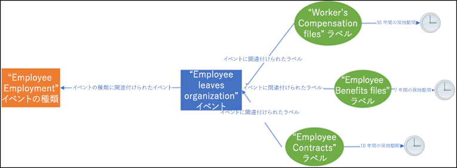
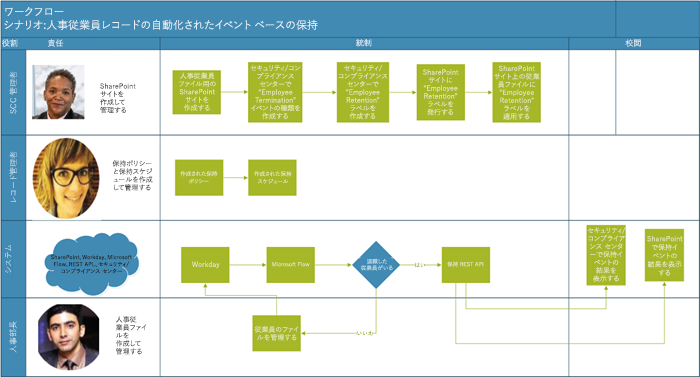
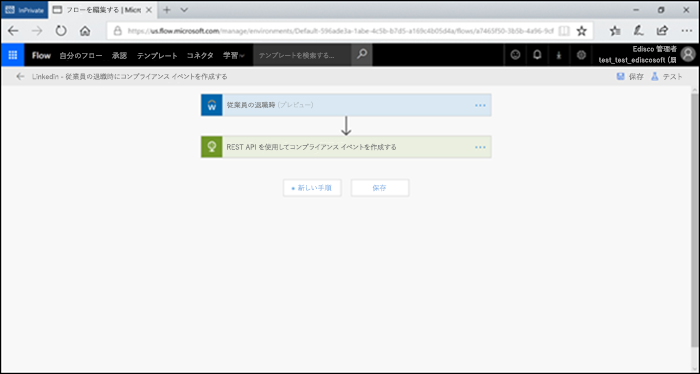
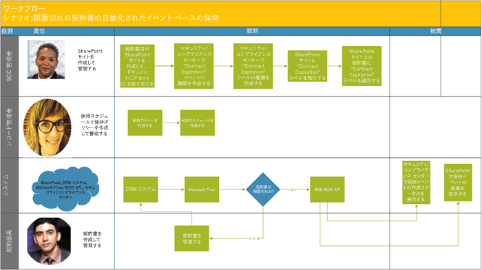
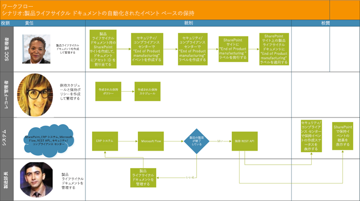

# イベント ベースの保持を自動化するAutomate event-based retention

>*[セキュリティとコンプライアンスのための Microsoft 365 ライセンス ガイダンス](https://aka.ms/ComplianceSD)。**[Microsoft 365 licensing guidance for security & compliance](https://aka.ms/ComplianceSD).*

組織内でのコンテンツの急増やコンテンツの ROT (冗長、旧版、無駄) 化は、ビジネスにとって深刻な課題です。法令、業務、規制に関するコンプライアンスの課題に継続的に対応するには、企業は重要な情報を保持して保護し、必要な情報をすばやく見つけられる必要があります。重要かつ適切な情報のみを保持することがビジネスを成功させる上での鍵です。The explosion of content in organizations and how it can become ROT (redundant, obsolete, trivial) is serious business. To continue to meet legal, business, and regulatory compliance challenges, organizations must be able to keep and protect important information and quickly find what’s relevant. Retaining only important, pertinent information is key to an organization's success.

この要求を満たすために、組織は Office 365 セキュリティ/コンプライアンス センターの保持ソリューションを活用できます。保持は、[保持ラベル](labels.md)を使用してトリガーできます。保持ラベルには、[特定のイベントに基づいて保持期間を設定する](event-driven-retention.md)オプションがあります。通常、保持期間は、コンテンツの作成日や最終変更日など既知の日付に基づきます。ただし、組織で、ある従業員が組織から離れてから 7 年後などの特定のイベントに基づいてコンテンツを破棄するという要件が生じることもあります。To help meet this need, organizations can take advantage of retention solutions in the Office 365 Security & Compliance Center. Retention can be triggered by using [retention labels](labels.md). A retention label has the option to [base the retention period on a specific event](event-driven-retention.md). Typically, the retention period is based on a known date, such as the creation date or last modified date for the content. However, organizations also have requirements to dispose of content based on the occurrence of an event, such as seven years after an employee leaves an organization.

スケジュールに則りコンテンツを破棄するには、イベントが生じた時期を把握することが不可欠です。コンテンツの量が急速に増えている現在、コンプライアンスを守りながらコンテンツの保持および破棄を適時行うことは困難になりつつあります。To ensure compliant disposal of content, it's imperative to know when an event takes place. With the volume of content increasing rapidly, it's becoming challenging to retain and dispose content in a timely and compliant manner.

イベント ベースの保持はこの問題を解決できます。このトピックでは、Microsoft 365 REST API を使用して、イベントによりビジネス プロセス フローの保持の自動化をセットアップする方法について説明します。Event-based retention solves this problem. This topic explains how to set up your business process flows to automate retention through events by using the Microsoft 365 REST API.

## イベント ベースの保持についてAbout event-based retention

組織の規模は小、中、大とさまざまです。日常的に作成および管理されるビジネス文書、法的文書、従業員のファイル、契約書、製品文書は劇的に増えています。An organization can be small, medium, or large. The number of business documents, legal documents, employee files, contracts, and product documents that get created and managed on a day-to-day basis is increasing dramatically.

たとえば、数十、数百単位の従業員が入社したり退社したりします。人事部はビジネス要件に基づいて従業員関連の文書を継続的に作成、更新、削除します。このプロセスは、会社で規定されている各種保持ポリシーの対象となります。For example, each day, tens and hundreds of employees are joining and leaving organizations. The HR department continues to create, update, or delete employee-related documents as per business requirements. This process is subject to the different retention policies outlined for the business:

- **コンテンツの保持期間は既知の日付にすることが可能です**。たとえば、コンテンツの作成日、最終変更日またはラベル設定日などです。文書を作成後 7 年間保持し、その後処分するなどが可能です。**The period of retention for content can be a known date** such as the date the content was created, last modified, or labeled. For example, you might retain documents for seven years after they're created and then delete them.

- **またコンテンツの保持期間を不明な日付にすることもできます**。たとえば、保持ラベルを使用すると、従業員が組織を離れるなどの特定のイベントが生じる時点に基づいて保持期間を設定できます。**The period of retention of content can also be an unknown date**. For example, with retention labels, you can also base a retention period on when a specific type of event occurs, such as an employee leaving the organization.

保持期間の開始はイベントによりトリガーされ、その種類のイベントのラベルが適用されているすべてのコンテンツに対してそのラベルの保持アクションが実行されます。これを、イベント ベースの保持と呼びます。詳細については、「[イベント ベースの保持の概要](event-driven-retention.md)」を参照してください。The event triggers the start of the retention period, and all content with a label applied for that type of event get the label's retention actions enforced on them. This is called event-based retention. To learn more, see [Overview of event-driven retention](event-driven-retention.md).

## イベント ベースの保持をセットアップするSet up event-based retention

このセクションでは、コンテンツを保持する前に行う必要がある作業について説明します。This section describes what needs to be done before retaining content.

### 役割を特定するIdentify roles

レコード管理業務を実行し、業務文書の有効かつ効率的な保持に関して責任を担う、組織内の各役割を特定します。Identify the different roles in an organization that perform Record Management tasks and would be responsible for effective and efficient retention of business documents.

  | **ユーザー****Persona**| **役割****Role**|
  | - | - |
  | 管理者Admin | 保持イベントの種類、保持ラベル、レコード リポジトリを SharePoint で作成しますCreates Retention Event types, Retention labels and Record repositories in SharePoint |
  | レコード管理者Records Manager                                  | 保持ポリシー、保持スケジュール ガイダンス、コンプライアンスの詳細を提供しますProvides Retention Policies and Retention Schedules guidance and compliance details   |
  | システム管理者 (会社)System Admin (business)                          | Microsoft 365 を扱う外部システムをセットアップして管理しますSets up and manages external systems to work with Microsoft 365                       |
  | インフォメーション ワーカーInformation Worker                               | (人事、財務、IT など) ビジネス プロセスのライフサイクルを管理しますManages the lifecycle of their business process (HR, Finance, IT, and so on)                 |

### セキュリティ/コンプライアンス センターをセットアップするSet up the Security & Compliance Center
  
1. コンプライアンス管理者がイベントの種類を作成します &ndash; たとえば、従業員の解雇、契約満了、製品の製造終了などです。Compliance admin creates an event type &ndash; for example, Employee Termination or Contract Expiration or End of Product Manufacturing.  (「[イベント ベースの保持](event-driven-retention.md)」で説明するプロセスの手順を参照してください。）(See the step-by-step process in [Event-driven retention](event-driven-retention.md).
    
2. コンプライアンス管理者は、イベントに基づいて保持ラベルを作成し、そのラベルをイベントの種類に関連付けます。Compliance admin creates a retention label based on an event and associates the label with an event type.
    
    保持ラベルのトリガーには 4 種類あります。There are four types of triggers for retention labels:
            
    1. 作成日Create date
                
    2. 最終更新日時Last modified
                
    3. ラベル日付 (コンテンツがラベル付けされた日)Label date (when the content was labeled)
                
    4. イベント ベースEvent-based
    
3. コンプライアンス管理者が保持ラベルを発行します。Compliance admin publishes the retention label.

### SharePoint をセットアップするSet up SharePoint
   
レコード リポジトリを作成するには、コンプライアンス管理者は次の操作を行います。To create a records repository, the compliance admin:

1. SharePoint サイトを作成します。Creates a SharePoint site.

2. 次のいずれかを実行します。Does one of the following:
        
    - SharePoint ライブラリを作成します。ライブラリ レベルでイベント ベースのラベルを設定します。詳しくは、[SharePoint ライブラリ、フォルダー、またはドキュメント セット内のすべてのコンテンツへの既定の保持ラベルの適用](labels.md#applying-a-default-retention-label-to-all-content-in-a-sharepoint-library-folder-or-document-set)をご覧ください。Creates a SharePoint library: Set event-based label at the library level. For more information, see [Applying a default retention label to all content in a SharePoint library, folder, or document set](labels.md#applying-a-default-retention-label-to-all-content-in-a-sharepoint-library-folder-or-document-set).
          
    - SharePoint でドキュメント セットをセットアップします。Sets up a document set in SharePoint. 詳細については、「[ドキュメント セット の概要](https://support.microsoft.com/ja-JP/office/introduction-to-document-sets-3dbcd93e-0bed-46b7-b1ba-b31de2bcd234)」を参照してください。For more information, see [Introduction to document sets](https://support.microsoft.com/ja-JP/office/introduction-to-document-sets-3dbcd93e-0bed-46b7-b1ba-b31de2bcd234).
      
3. 各従業員のドキュメント セットに資産 ID を割り当てます。Assigns an asset ID to each employee document set. 資産 ID は、組織で使用されている製品名またはコードです。たとえば、従業員番号を資産 ID として使用することができます。An asset ID is a product name or code used by the organization, for example, Employee number can be an asset ID. フォルダーに資産 ID を割り当てることで、そのフォルダー内のすべてのアイテムに同じ資産 ID が自動的に継承されます。By assigning the asset ID to the folder, every item in that folder automatically inherits the same asset ID. 同一のイベントにより、すべてのアイテムで保持期間をトリガーできることを意味します。This means all the items can have their retention period triggered by the same event.

## イベント ベースの保持をトリガーする方法Ways to trigger event-based retention

イベント ベースの保持をトリガーするには 2 つの方法があります。There are two ways in which event-based retention can be triggered:

- **管理センター UI を使用する** このプロセスは、同時に保持するコンテンツを減らしたり、保持をトリガーする頻度を減らしたり (月次、年次など) するために使用できます。**Using the admin center UI** This is a process that can be used to retain less content at a time or the frequency to trigger retention isn't often, such as monthly or yearly. この方法の詳細については、「[イベント ベースの保持の概要](event-driven-retention.md)」を参照してください。For more information about this method, see [Overview of event-driven retention](event-driven-retention.md). ただし、保持をトリガーするためのこの方法は、時間がかかる場合があり、エラーも発生しやすいため、大規模な適用には不向きです。However, this method of triggering retention can be time consuming and prone to error, thus stunting scalability. そのため、自動化されたシームレスなソリューションを使用して保持をトリガーさせることで、データのセキュリティとコンプライアンスを向上させられます。Therefore, an automated, seamless solution to trigger retention can enhance data security and compliance.

- **M365 REST API を使用する** このプロセスは、1 度に大量のコンテンツを保持したり、保持をトリガーする頻度が毎日や週ごとなど多い場合に使用できます。このフローによって基幹業務システムでイベントが生じたタイミングが検出され、セキュリティ/コンプライアンス センターで関連するイベントが自動的に作成されます。該当するイベントが生じるたびに UI でイベントを手動で作成する必要はありません。**Using a M365 REST API** This process can be used when large amounts of content are to be retained at a time and/or the frequency to trigger retention is often such as daily or weekly. The flow detects when an event occurs in your line-of-business system, and then automatically creates a related event in the Security & Compliance Center. You don't need to manually create an event in the UI each time one occurs.

REST API の使用に関して次の 2 つのオプションがあります。There are two options for using the REST API:

- イベントの発生を自動的にトリガーするために、**Microsoft Flow または同様のアプリケーション**を使用できます。**Microsoft Flow or a similar application** can be used to trigger the occurrence of an event automatically. Microsoft Flow は、他のシステムとの接続における統合機能を提供します。Microsoft Flow is an orchestrator for connecting to other systems. Microsoft Flow は、カスタム ソリューションがなくても使用できます。Using Microsoft Flow doesn't require a custom solution.

- **PowerShell または HTTP クライアントを使用して REST API を呼び出す** PowerShell (バージョン 6 以降) を使用して Microsoft 365 REST API を呼び出してイベントを作成します。**PowerShell or an HTTP client to call REST API** Using PowerShell (version 6 or higher) to call Microsoft 365 REST API to create events. 

Rest API は一連の HTTP 操作 (メソッド) をサポートするサービス エンドポイントで、サービスのリソースに対する作成/取得/更新/削除のアクセス権を提供します。A Rest API is a service endpoint that supports sets of HTTP operations (methods), which provide create/retrieve/update/delete access to the service's resources. 詳細については、「[REST API 要求/応答のコンポーネント](https://docs.microsoft.com/rest/api/gettingstarted/#components-of-a-rest-api-requestresponse)」を参照してください。For more information, see [Components of a REST API request/response](https://docs.microsoft.com/rest/api/gettingstarted/#components-of-a-rest-api-requestresponse). この場合、Microsoft 365 REST API を使用することにより、POST および GET 操作 (メソッド) を使用してイベントを作成および取得できます。In this case, by using the Microsoft 365 REST API, events can be created and retrieved using operations (methods) POST and GET.

## シナリオ例Example scenarios

次のシナリオについて考えます。Let’s consider the following scenarios.

### シナリオ 1: 従業員が組織のメンバーでなくなるScenario 1: Employees leaving the organization 

組織では、従業員ごとに多数の従業員関連文書を作成し、保管しています。An organization creates and stores numerous employee-related documents per employee. これらの文書は、各従業員の雇用期間中、管理および保持されます。These documents are managed and retained during the employment of each employee. ただし、従業員が組織のメンバーでなくなったり、従業員が退職したりした場合、法的および会社の要件に基づいて、規定された期間、その従業員の文書を保持する義務が組織にはあります。However, when the employee leaves the organization or the employment is terminated, the organization is obligated by legal and business requirements to retain the documents of that employee for a stipulated period.

ここで、複数の従業員が毎日組織のメンバーでなくなるとすると、数千ではないものの数百もの文書の保持期間を毎日トリガーしなくてはなりません。Now if multiple employees leave the organization every day, the organization must trigger the retention clock of hundreds if not thousands of documents each day.

また、各従業員に関して保持期間を計算する必要もあります。従業員の退社日に、従業員レコードの種類に応じて、日数、月数、または年数を加算します。In addition to this, the retention period needs to be calculated for each of these employees as Employee termination date + number of days, months, or years based on the type of the employee record. たとえば、要求される保持期間が、従業員の労働者災害補償の書類と同じ従業員の福利厚生申請書類とで異なる可能性があります。For example, worker’s compensation of the employee vs. benefits filings of the same employee may need different retention.

次の図には、1 つのイベントに複数のラベルを関連付けられることを示しています。The diagram below shows how there can be multiple labels that are associated with a single event. 「労働者災害補償 (Worker’s compensation)」ラベル下のすべてのファイルと、「従業員の福利厚生 (Employee benefits)」ラベル下のすべてのファイルがどちらも、従業員が組織のメンバーでなくなるという単一のイベントに関連付けられています。Here all the files under Worker’s compensation label and all the files under Employee benefits label are both associated with a single event, which is the employee leaving the organization. これらのファイルの保持期間はそれぞれ異なります。Each of these different files has different retention clocks. そのため、従業員が組織のメンバーでなくなると、各ラベルのファイルには異なる保持期間が適用されます。So, when an employee leaves the organization, these files within each label experience a different retention period. 各従業員について、ファイルの各種類または各ラベルのこれらの異なる保持期間をすべてトリガーすることは、困難な作業です。Triggering all these different retention clocks for each file type or label for each employee is a very challenging task. この作業を複数の従業員に対して行う場合は、困難さがさらに強まります。Imagine doing this for multiple employees.

そのため、複数の従業員に対して異なる保持期間をトリガーする自動化されたプロセスでは、時間を節約し、エラーをなくし、効率性を非常に高められます。Hence an automated process to trigger these different retention clocks for multiple employees will be time-saving, error-free, and extremely efficient.

**このシナリオに関する自動化されたイベント ベースの保持を構成する:****Configuring Automated Event Based Retention for this scenario:**

  - 管理者は Jane Doe、John Smith などのドキュメント セットに従業員フォルダーを作成します。Admin creates employee folders to the Document set such as Jane Doe, John Smith.

  - 管理者は、福利厚生、給与、労働者災害補償などの従業員ファイルを各従業員フォルダーに追加します。Admin adds employee files such as Benefits, Payroll, Worker’s Compensation to each employee folder.

  - 管理者は、各従業員フォルダーに資産 ID を割り当てます。Admin assigns Asset ID to each employee folder. 

  - SCC 管理者は、セキュリティ/コンプライアンス センターにログインします。SCC Admin logs into the Security & Compliance Center.

  - SCC 管理者は、「従業員解雇」や「従業員雇用」など、従業員関連のイベントの種類を作成します。SCC Admin creates employee-related events types such as “Employee Termination”, “Employee Hire” events.

  - SCC 管理者は、「従業員保持」ラベルを作成します。SCC Admin creates “Employee Retention” label.

  - この「従業員の保持」ラベルを発行し、SharePoint 内の従業員ファイルに手動または自動で適用します。This “Employee Retention” label is published and applied manually or automatically to the employee files in SharePoint.

  - Workday などの人事管理システムを Microsoft Flow と連携させることにより、従業員ファイルの管理を定期的に実行できます。HR Management System like Workday can work with Microsoft Flow to run periodically to manage employee files.

  - 従業員が組織のメンバーではなくなると、Flow によって M365 イベント ベースの保持 REST API がトリガーされ、特定の従業員ファイルの保持期間が開始されます。If an employee has left the organization, the Flow will trigger the M365 Event Based Retention REST API that will begin the retention clock on the specific employee’s files.

#### Microsoft Flow の使用Using Microsoft Flow

手順 1 - Microsoft 365 REST API を使用してイベントを作成するフローを作成しますStep 1- Create a flow to create an event using the Microsoft 365 REST API

##### イベントを作成するCreate an event

REST API を呼び出すサンプル コードSample code to call the REST API

<table>
<thead>
<tr class="header">
<th>メソッドMethod</th>
<th>POSTPOST</th>
<th></th>
</tr>
</thead>
<tbody>
<tr class="odd">
<td>URLURL</td>
<td>https://ps.compliance.protection.outlook.com/psws/service.svc/ComplianceRetentionEvent</td>
<td></td>
</tr>
<tr class="even">
<td>ヘッダーHeaders</td>
<td>Content-TypeContent-Type</td>
<td>application/atom+xmlapplication/atom+xml</td>
</tr>
<tr class="odd">
<td>本文Body</td>
<td>
&lt;?xml version='1.0' encoding='utf-8' standalone='yes'?&gt;&lt;?xml version='1.0' encoding='utf-8' standalone='yes'?&gt;

&lt;entry xmlns:d='https://schemas.microsoft.com/ado/2007/08/dataservices'&lt;entry xmlns:d='https://schemas.microsoft.com/ado/2007/08/dataservices'

xmlns:m='https://schemas.microsoft.com/ado/2007/08/dataservices/metadata'xmlns:m='https://schemas.microsoft.com/ado/2007/08/dataservices/metadata'

xmlns='https://www.w3.org/2005/Atom'&gt;xmlns='https://www.w3.org/2005/Atom'&gt;

&lt;category scheme='https://schemas.microsoft.com/ado/2007/08/dataservices/scheme' term='Exchange.ComplianceRetentionEvent' /&gt;&lt;category scheme='https://schemas.microsoft.com/ado/2007/08/dataservices/scheme' term='Exchange.ComplianceRetentionEvent' /&gt;

&lt;updated&gt;9/9/2017 10:50:00 PM&lt;/updated&gt;&lt;updated&gt;9/9/2017 10:50:00 PM&lt;/updated&gt;

&lt;content type='application/xml'&gt;&lt;content type='application/xml'&gt;

&lt;m:properties&gt;&lt;m:properties&gt;

&lt;d:Name&gt;Employee Termination &lt;/d:Name&gt;&lt;d:Name&gt;Employee Termination &lt;/d:Name&gt;

&lt;d:EventType&gt;99e0ae64-a4b8-40bb-82ed-645895610f56&lt;/d:EventType&gt;&lt;d:EventType&gt;99e0ae64-a4b8-40bb-82ed-645895610f56&lt;/d:EventType&gt;

&lt;d:SharePointAssetIdQuery&gt;1234&lt;/d:SharePointAssetIdQuery&gt;&lt;d:SharePointAssetIdQuery&gt;1234&lt;/d:SharePointAssetIdQuery&gt;

&lt;d:EventDateTime&gt;2018-12-01T00:00:00Z &lt;/d:EventDateTime&gt;&lt;d:EventDateTime&gt;2018-12-01T00:00:00Z &lt;/d:EventDateTime&gt;

&lt;/m:properties&gt;&lt;/m:properties&gt;

&lt;/content&gt;&lt;/content&gt;

&lt;/entry&gt;&lt;/entry&gt;
</td>
<td></td>
</tr>
<tr class="even">
<td>認証Authentication</td>
<td>基本Basic</td>
<td></td>
</tr>
<tr class="odd">
<td>ユーザー名Username</td>
<td>“Complianceuser”“Complianceuser”</td>
<td></td>
</tr>
<tr class="even">
<td>パスワードPassword</td>
<td>“Compliancepassword”“Compliancepassword”</td>
<td></td>
</tr>
</tbody>
</table>

##### 利用可能なパラメーターAvailable parameters

<table>
<thead>
<tr class="header">
<th><strong>パラメーター</strong><strong>Parameters</strong></th>
<th><strong>説明</strong><strong>Description</strong></th>
<th><strong>メモ</strong><strong>Notes</strong></th>
</tr>
</thead>
<tbody>
<tr class="odd">
<td>&lt;d:Name&gt;&lt;/d:Name&gt;&lt;d:Name&gt;&lt;/d:Name&gt;</td>
<td>イベントの一意の名前を入力します。Provide a unique name for the event,</td>
<td>末尾にスペースおよび以下の文字を含めることはできません: % \* \ &amp; &lt; &gt; | # ? , : ;Cannot contain trailing spaces, and the following characters: % \* \ &amp; &lt; &gt; | # ? , : ;</td>
</tr>
<tr class="even">
<td>&lt;d:EventType&gt;&lt;/d:EventType&gt;&lt;d:EventType&gt;&lt;/d:EventType&gt;</td>
<td>イベントの種類の名前 (または GUID) を入力します。Enter event type name (or Guid),</td>
<td>例: 「従業員の退職」というイベントの種類を保持ラベルに関連付ける必要があります。Example: “Employee termination”. Event type has to be associated with a retention label.</td>
</tr>
<tr class="odd">
<td>&lt;d:SharePointAssetIdQuery&gt;&lt;/d:SharePointAssetIdQuery&gt;&lt;d:SharePointAssetIdQuery&gt;&lt;/d:SharePointAssetIdQuery&gt;</td>
<td>“ComplianceAssetId:” と従業員 ID を入力しますEnter “ComplianceAssetId:” + employee Id</td>
<td>例: &quot;ComplianceAssetId:12345&quot;Example:&quot;ComplianceAssetId:12345&quot;</td>
</tr>
<tr class="even">
<td>&lt;d:EventDateTime&gt;&lt;/d:EventDateTime&gt;&lt;d:EventDateTime&gt;&lt;/d:EventDateTime&gt;</td>
<td>イベントの日時Event Date and Time</td>
<td>
形式: yyyy-MM-ddTHH:mm:ssZ。例:Format: yyyy-MM-ddTHH:mm:ssZ, Example:

2018-12-01T00:00:00Z2018-12-01T00:00:00Z
</td>
</tr>
</tbody>
</table>

##### 応答コードResponse codes

| **応答コード****Response Code** | **説明****Description**       |
| ----------------- | --------------------- |
| 302302               | リダイレクトRedirect              |
| 201201               | 作成済みCreated               |
| 403403               | 承認に失敗しましたAuthorization Failed  |
| 401401               | 認証に失敗しましたAuthentication Failed |

##### 時間範囲に基づいてイベントを取得するGet Events based on time range

<table>
<thead>
<tr class="header">
<th>メソッドMethod</th>
<th>GETGET</th>
<th></th>
</tr>
</thead>
<tbody>
<tr class="odd">
<td>URLURL</td>
<td><ol start="4" type="1">
<li>
https://ps.compliance.protection.outlook.com/psws/service.svc/ComplianceRetentionEvent?BeginDateTime=2019-01-11&amp;EndDateTime=2019-01-16https://ps.compliance.protection.outlook.com/psws/service.svc/ComplianceRetentionEvent?BeginDateTime=2019-01-11&amp;EndDateTime=2019-01-16
</li>
</ol></td>
<td></td>
</tr>
<tr class="even">
<td>ヘッダーHeaders</td>
<td>Content-TypeContent-Type</td>
<td>application/atom+xmlapplication/atom+xml</td>
</tr>
<tr class="odd">
<td></td>
<td></td>
<td></td>
</tr>
<tr class="even">
<td>認証Authentication</td>
<td>基本Basic</td>
<td></td>
</tr>
<tr class="odd">
<td>ユーザー名Username</td>
<td>“Complianceuser”“Complianceuser”</td>
<td></td>
</tr>
<tr class="even">
<td>パスワードPassword</td>
<td>“Compliancepassword”“Compliancepassword”</td>
<td></td>
</tr>
</tbody>
</table>

##### 応答コードResponse codes

| **応答コード****Response Code** | **説明****Description**                   |
| ----------------- | --------------------------------- |
| 200200               | 問題ありません。イベントの一覧は atom+ xml 形式ですOK, A list of events in atom+ xml |
| 404404               | 見つかりませんNot found                         |
| 302302               | リダイレクトRedirect                          |
| 401401               | 承認に失敗しましたAuthorization Failed              |
| 403403               | 認証に失敗しましたAuthentication Failed             |

##### ID でイベントを取得するGet an event by ID

| メソッドMethod         | GETGET   |                      |
| -------------- | ------------------------------------------------------------------------------------------------------------------------------------------------------------------------------------------------------------------------------------------------------------------ | -------------------- |
| URLURL            | [https://ps.compliance.protection.outlook.com/psws/service.svc/ComplianceRetentionEvent(‘174e9a86-74ff-4450-8666-7c11f7730f66’)](https://ps.compliance.protection.outlook.com/psws/service.svc/ComplianceRetentionEvent\('174e9a86-74ff-4450-8666-7c11f7730f66'\))[https://ps.compliance.protection.outlook.com/psws/service.svc/ComplianceRetentionEvent(‘174e9a86-74ff-4450-8666-7c11f7730f66’)](https://ps.compliance.protection.outlook.com/psws/service.svc/ComplianceRetentionEvent\('174e9a86-74ff-4450-8666-7c11f7730f66'\)) |                      |
| ヘッダーHeader         | Content-TypeContent-Type                                                                                                                                                                                                                                                       | application/atom+xmlapplication/atom+xml |
| 認証Authentication | 基本Basic                                                                                                                                                                                                                                                              |                      |
| ユーザー名Username       | “Complianceuser”“Complianceuser”                                                                                                                                                                                                                                                   |                      |
| パスワードPassword       | “Compliancepassword”“Compliancepassword”                                                                                                                                                                                                                                               |                      |

##### 応答コードResponse codes

| **応答コード****Response Code** | **説明****Description**                                      |
| ----------------- | ---------------------------------------------------- |
| 200200               | 問題ありません。応答本体に atom+xml 形式のイベントが含まれていますOK, The response body contains the event in atom+xml |
| 404404               | 見つかりませんNot found                                            |
| 302302               | リダイレクトRedirect                                             |
| 401401               | 承認に失敗しましたAuthorization Failed                                 |
| 403403               | 認証に失敗しましたAuthentication Failed                                |

##### 名前でイベントを取得するGet an event by name

| メソッドMethod         | GETGET       |                      |
| -------------- | -------------------------------------------------------------------------------------------------------------------------------------------- | -------------------- |
| URLURL            | <https://ps.compliance.protection.outlook.com/psws/service.svc/ComplianceRetentionEvent('EventByRESTPost-2226bfebcc2841a8968ba71f9516b763')> |                      |
| ヘッダーHeaders        | Content-TypeContent-Type                                                                                                                                 | application/atom+xmlapplication/atom+xml |
| 認証Authentication | 基本Basic                                                                                                                                        |                      |
| ユーザー名Username       | “Complianceuser”“Complianceuser”                                                                                                                             |                      |
| パスワードPassword       | “Compliancepassword”“Compliancepassword”                                                                                                                         |                      |

##### 応答コードResponse codes

| **応答コード****Response Code** | **説明****Description**                                      |
| ----------------- | ---------------------------------------------------- |
| 200200               | 問題ありません。応答本体に atom+xml 形式のイベントが含まれていますOK, The response body contains the event in atom+xml |
| 404404               | 見つかりませんNot found                                            |
| 302302               | リダイレクトRedirect                                             |
| 401401               | 承認に失敗しましたAuthorization Failed                                 |
| 403403               | 認証に失敗しましたAuthentication Failed                                |

#### PowerShell (ver.6 以降) または任意の HTTP クライアントの使用Using PowerShell (ver.6 or higher) or any HTTP client

手順 1: PowerShell に接続します。Step 1: Connect to PowerShell.

手順 2: 次のスクリプトを実行します。Step 2: Run the following script.

<table>
<tbody>
<tr class="odd">
<td>
param([string]$baseUri)param([string]$baseUri)

$userName = &quot;UserName&quot;$userName = &quot;UserName&quot;

$password = &quot;Password&quot;$password = &quot;Password&quot;

$securePassword = ConvertTo-SecureString $password -AsPlainText -Force$securePassword = ConvertTo-SecureString $password -AsPlainText -Force

$credentials = New-Object System.Management.Automation.PSCredential($userName, $securePassword)$credentials = New-Object System.Management.Automation.PSCredential($userName, $securePassword)

$EventName=&quot;EventByRESTPost-$(([Guid]::NewGuid()).ToString('N'))&quot;$EventName=&quot;EventByRESTPost-$(([Guid]::NewGuid()).ToString('N'))&quot;

Write-Host &quot;Start to create an event with name: $EventName&quot;Write-Host &quot;Start to create an event with name: $EventName&quot;

$body = &quot;&lt;?xml version='1.0' encoding='utf-8' standalone='yes'?&gt;$body = &quot;&lt;?xml version='1.0' encoding='utf-8' standalone='yes'?&gt;

&lt;entry xmlns:d='https://schemas.microsoft.com/ado/2007/08/dataservices'&lt;entry xmlns:d='https://schemas.microsoft.com/ado/2007/08/dataservices'

xmlns:m='https://schemas.microsoft.com/ado/2007/08/dataservices/metadata'xmlns:m='https://schemas.microsoft.com/ado/2007/08/dataservices/metadata'

xmlns='https://www.w3.org/2005/Atom'&gt;xmlns='https://www.w3.org/2005/Atom'&gt;

&lt;category scheme='https://schemas.microsoft.com/ado/2007/08/dataservices/scheme' term='Exchange.ComplianceRetentionEvent' /&gt;&lt;category scheme='https://schemas.microsoft.com/ado/2007/08/dataservices/scheme' term='Exchange.ComplianceRetentionEvent' /&gt;

&lt;updated&gt;7/14/2017 2:03:36 PM&lt;/updated&gt;&lt;updated&gt;7/14/2017 2:03:36 PM&lt;/updated&gt;

&lt;content type='application/xml'&gt;&lt;content type='application/xml'&gt;

&lt;m:properties&gt;&lt;m:properties&gt;

&lt;d:Name&gt;$EventName&lt;/d:Name&gt;&lt;d:Name&gt;$EventName&lt;/d:Name&gt;

&lt;d:EventType&gt;e823b782-9a07-4e30-8091-034fc01f9347&lt;/d:EventType&gt;&lt;d:EventType&gt;e823b782-9a07-4e30-8091-034fc01f9347&lt;/d:EventType&gt;

&lt;d:SharePointAssetIdQuery&gt;'ComplianceAssetId:123'&lt;/d:SharePointAssetIdQuery&gt;&lt;d:SharePointAssetIdQuery&gt;'ComplianceAssetId:123'&lt;/d:SharePointAssetIdQuery&gt;

&lt;/m:properties&gt;&lt;/m:properties&gt;

&lt;/content&gt;&lt;/content&gt;

&lt;/entry&gt;&quot;&lt;/entry&gt;&quot;

$event = $null$event = $null

trytry

{{

$event = Invoke-RestMethod -Body $body -Method 'POST' -Uri &quot;$baseUri/ComplianceRetentionEvent&quot; -ContentType &quot;application/atom+xml&quot; -Authentication Basic -Credential $credentials -MaximumRedirection 0$event = Invoke-RestMethod -Body $body -Method 'POST' -Uri &quot;$baseUri/ComplianceRetentionEvent&quot; -ContentType &quot;application/atom+xml&quot; -Authentication Basic -Credential $credentials -MaximumRedirection 0

}}

catchcatch

{{

$response = $_.Exception.Response$response = $_.Exception.Response

if($response.StatusCode -eq &quot;Redirect&quot;)if($response.StatusCode -eq &quot;Redirect&quot;)

{{

$url = $response.Headers.Location$url = $response.Headers.Location

Write-Host &quot;redirected to $url&quot;Write-Host &quot;redirected to $url&quot;

$event = Invoke-RestMethod -Body $body -Method 'POST' -Uri $url -ContentType &quot;application/atom+xml&quot; -Authentication Basic -Credential $credentials -MaximumRedirection 0$event = Invoke-RestMethod -Body $body -Method 'POST' -Uri $url -ContentType &quot;application/atom+xml&quot; -Authentication Basic -Credential $credentials -MaximumRedirection 0

}}

}}

$event | fl \*$event | fl \*
</td>
</tr>
</tbody>
</table>

#### 両方のオプションの結果を確認するVerify the outcome in both options

手順 1: セキュリティ/コンプライアンス センターに移動します。Step 1: Go to the Security & Compliance Center.

手順 2: [**情報ガバナンス**] の [**イベント**] を選択します。Step 2: Select **Events** under **Information governance**.

手順 3: イベントが作成されたことを確認します。Step 3: Verify Event has been created.

同様に、イベント ベースの保持を自動化する上記のオプションを以下のシナリオにも使用できます。Similarly, the above options to automate event-based retention can be used for the following scenarios as well.

### シナリオ 2: 契約の満了Scenario 2: Contracts Expiring

組織には、顧客、ベンダー、パートナーとの各契約で複数のレコードを保持できます。An organization can have multiple records for a single contract with customers, vendors, and partners. こうしたドキュメントは、SharePoint などのドキュメント ライブラリに格納できます。These documents can reside in a document library like SharePoint. 契約に関連付けられている文書の保持期間の開始時期は、契約の終了時期に基づいて決められます。The end of a contract determines the start of the retention period of the documents associated with the contract. たとえば、契約に関連するすべてのレコードは、契約満了後 5 年間は保持する必要があります。For example, all records related to contracts need to be retained for five years from the time the contract expires. 5 年間の保持期間をトリガーするイベントは、契約の満了です。The event that triggers the five-year retention period is the expiration of the contract.

顧客関係管理 (CRM) システムを Microsoft 365 と連携させ、契約文書の保持をトリガーできます。A Customer Relationship Management (CRM) system can work with Microsoft 365 and trigger retention of Contract documents

**このシナリオに関する自動化されたイベント ベースの保持を構成する:****Configuring Automated Event Based Retention for this scenario:**

  - 管理者は、契約の種類ごとにさまざまなフォルダーを含む SharePoint ライブラリを作成します。Admin creates a SharePoint library with various folders for each contract type.

  - 管理者は、ライセンス契約書、開発契約書などの契約ファイルを各契約フォルダーに追加します。Admin adds contract files such as License Contracts, Development Contracts to each contract folder.

  - 管理者は、各契約フォルダーに資産 ID を割り当てます。Admin assigns Asset ID to each contract folder.

  - SCC 管理者は、セキュリティ/コンプライアンス センターにログインします。SCC Admin logs into the Security & Compliance Center.

  - SCC 管理者は、「契約締結」イベントや「契約満了」イベントなど、契約関連のイベントの種類を作成します。SCC Admin creates contract-related events types such as “Contract Creation”, “Contract Expiration” events.

  - SCC 管理者は、「契約満了」ラベルを作成します。SCC Admin creates “Contract Expiration” label.

  - この「契約満了」ラベルを発行し、SharePoint 内の契約ファイルに手動または自動で適用します。This “ Contract Expiration” label is published and applied manually or automatically to the contract files in SharePoint.

  - 契約管理システムを Microsoft Flow または同様のアプリケーションと連携させることにより、契約ファイルの管理を定期的に実行できます。Contract Management System can work with Microsoft Flow or a similar application to run periodically to manage contract files.

  - 契約の期限が切れると、Microsoft Flow によって M365 イベント ベースの保持 REST API がトリガーされ、特定の契約ファイルの保持期間が開始されます。If a contract expires, Microsoft Flow will trigger the M365 Event Based Retention REST API that will begin the retention clock on the specific contract’s files.

### シナリオ 3: 製品製造の終了Scenario 3: End of Product Manufacturing

さまざまな製品群を生み出す製造企業は、多数の製造仕様と価格に関する文書を作成します。製品が製造されなくなると、その製品にリンクされているすべての仕様と文書は、製品のライフサイクル後、特定に期間にわたり保持する必要があります。A manufacturing company that produces different lines of products creates many manufacturing specifications and pricing documents. When the product is no longer manufactured, all specifications and documents linked to this product need to be retained for a specific period after the end of the lifetime of the product.

エンタープライズ リソース プランニング (ERP) システムを Microsoft 365 および Microsoft Flow と連携させ、保持をトリガーできます。An Enterprise Resource Planning (ERP) system can work with Microsoft 365 and Microsoft Flow to trigger retention.

**このシナリオに関する自動化されたイベント ベースの保持を構成する:****Configuring Automated Event Based Retention for this scenario:**

  - 管理者は、「製品 1」、「製品 2」 などの製品フォルダーをドキュメント セットに作成します。Admin creates product folders in the Document set such as Product 1, Product 2, and so on.

  - 管理者は、「製造仕様」、「製品価格」、「製品ライセンス」などの製品ファイルを各製品フォルダーに追加します。Admin adds product files such as Manufacturing Specifications, Product Pricing, Product licensing to each product folder.

  - 管理者は、各製品フォルダーに資産 ID を割り当てます。Admin assigns Asset ID to each product folder.

  - SCC 管理者は、セキュリティ/コンプライアンス センターにログインします。SCC Admin logs into the Security & Compliance Center.

  - SCC 管理者は、「製品製造開始」イベントや「製品製造終了」イベントなど、従業員関連のイベントの種類を作成します。SCC Admin creates employee-related events types such as “Start of Product Manufacturing”, “End of Product Manufacturing” events.

  - SCC 管理者は、「製品製造終了」ラベルを作成します。SCC Admin creates “End of Product Manufacturing” label.

  - この「製品製造終了」ラベルを発行し、SharePoint 内の製品ファイルに手動または自動で適用します。This “ End of Product Manufacturing” label is published and applied manually or automatically to the product files in SharePoint.

  - ERP システムを Microsoft Flow または同様のアプリケーションと連携させることにより、製品ファイルの管理を定期的に実行できます。ERP Systems can work with Microsoft Flow or similar applications to run periodically to manage product files.

  - 製品製造が終了すると、Microsoft Flow によって M365 イベント ベースの保持 REST API がトリガーされ、特定の製品ファイルの保持期間が開始されます。If the manufacturing of a product ends, Microsoft Flow will trigger the M365 Event Based Retention REST API that will begin the retention clock on the specific product’s files.

## 付録Appendix

### リダイレクト 302 応答結果を使用して REST API を呼び出すUsing Redirect 302 response results to call the REST API

1. REST API URL <https://ps.compliance.protection.outlook.com/psws/service.svc/ComplianceRetentionEvent> を使用して、POST 保持イベント呼び出しを実行します (全体管理者のアクセス許可が必要です)Invoke a POST retention event call using the REST API URL <https://ps.compliance.protection.outlook.com/psws/service.svc/ComplianceRetentionEvent> (Global Admin permissions are required)

2. 応答コードを確認し、302 の場合、応答ヘッダーの場所プロパティから、リダイレクトされた URL を取得しますCheck the response code. If it’s 302, then get the redirected URL from Location property of the response header

3. リダイレクトされた URL を使用して、もう一度 POST 保持イベント呼び出しを実行します。Invoke the POST retention event call again using the redirected URL.

## 開発者情報Credits

このトピックの校閲者をご紹介します。This topic was reviewed by:

Antonio MaioAntonio Maio Microsoft Office アプリとサービスの MVPMicrosoft Office Apps and Services MVP  Antonio.Maio@Protiviti.comAntonio.Maio@Protiviti.com
