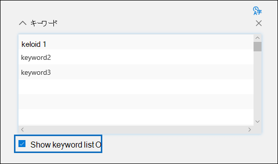

# 高度な電子情報開示での検索コレクションクエリの作成

高度な電子情報開示ケースでデータを収集するための検索クエリを作成する場合、キーワードを使用して特定のコンテンツと条件を見つけ、法的調査に最も関連のあるアイテムを返すために検索の範囲を絞ることができます。

## キーワード検索

検索クエリの [ **キーワード** ] ボックスにキーワードクエリを入力します。 キーワード、電子メールメッセージのプロパティ ([送信日時] や [受信日時] など)、またはドキュメントのプロパティ (ファイル名、ドキュメントが最後に変更された日付など) を指定できます。 **AND**、**OR**、**NOT**、**NEAR** などのブール演算子を使用するより複雑なクエリを使用できます。 SharePoint および OneDrive (電子メールメッセージではない) のドキュメントで機密情報 (社会保障番号など) を検索したり、外部で共有されているドキュメントを検索したりすることもできます。 この**キーワード** ボックスを空のままにすると、指定したコンテンツの場所にあるすべてのコンテンツが検索結果に入ります。
    
または、[ **キーワードリストを表示** する] チェックボックスをオンにして、各行にキーワードまたはキーワードフレーズを入力することもできます。 このようにすると、各行のキーワードは、作成された検索クエリの**or**演算子の機能と類似した論理演算子 (検索クエリ構文では*c:s*で表されます) によって接続されます。 これは、任意の行にキーワードを含むアイテムが検索結果に含まれることを意味します。

キーワードリストを使用する理由 キーワードリストの各キーワードに一致するアイテムの数を示す統計情報を取得できます。 これは、最も頻繁に使用される (および最も少ない) キーワードをすばやく識別するのに役立ちます。 キーワードリストの行にキーワードフレーズ (かっこで囲む) を使用することもできます。 検索統計の詳細については、「 [検索統計](search-statistics.md)」を参照してください。

> [!NOTE]
> 大きなキーワードリストによって発生する問題を減らすために、キーワード一覧では最大20行に制限されています。

## 条件
    
検索条件を追加して検索の範囲を絞り込んだり、より洗練された結果セットを返すことができます。 各条件によって、作成された検索クエリに句が追加され、ユーザーが検索を開始するとそのクエリが実行されます。 条件は、論理演算子 (検索クエリ構文で *c:c* として表されます) で指定されたキーワードクエリに論理的に接続されています。これは、 **and 演算子と** 機能が似ています。 つまり、アイテムは、キーワードクエリと、検索結果に含まれる1つまたは複数の条件を満たす必要があることを意味します。 このように、条件を使用して結果を絞り込むことができます。 検索クエリで使用できる条件の一覧と説明については、「 [キーワードクエリと検索条件](keyword-queries-and-search-conditions.md#search-conditions)」の「検索条件」を参照してください。
