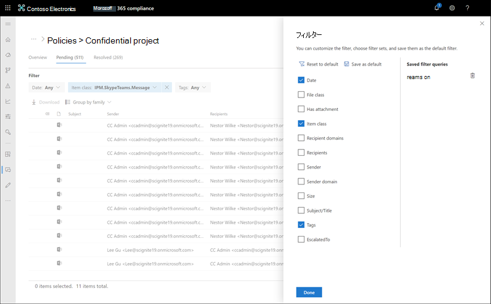

# 通信コンプライアンスのアラートを調査して修復する

通信コンプライアンスポリシーを構成した後は、ポリシー条件に一致するメッセージの問題に関する Microsoft 365 コンプライアンスセンターでの通知の受信を開始します。 ここにあるワークフローの手順に従って、アラートの問題を調査して修復します。

## 通知の調査

ポリシーによって検出された問題を調査するための最初の手順は、Microsoft 365 コンプライアンスセンターで生成された通知を確認することです。 通知のグループ化をどのように表示するかに応じて、コンプライアンスセンターにはアラートをすばやく調査するのに役立ついくつかの領域があります。

- **通信コンプライアンスのホームページ**: [https://compliance.microsoft.com](https://compliance.microsoft.com) Microsoft 365 組織の管理者アカウントの資格情報を使用してサインインするときに、[**通信コンプライアンスの**概要] を選択して [  >  **Overview**通信コンプライアンスのホーム] ページを表示します。 表示内容は次のとおりです。
    - レビューが必要な通知を高い重要度レベルから低い重要度レベルに表示します。 警告のうち一つを選択して、その警告詳細ページを開き、修復アクションを開始します。
    - ポリシー名で表示された最近のポリシー一致。
    - ポリシー名で表示された解決済み事項。
    - ポリシー名で表示されたエスカレーション。
    - 最も多くのポリシーをもつユーザーを一致数の多い方から少ない方へ表示します。
- **[通知] タブ: [****通信コンプライアンス**アラート] に移動し  >  **Alerts**て、ポリシーの一致によってグループ化されたアラートの過去30日間を表示します。 このビューでは、重要度順に並べ替えられているほとんどの通知を生成している通信コンプライアンスポリシーをすばやく確認できます。  修復アクションを開始するには、ポリシーを展開し、特定の警告を選択してから、[通知詳細] ページを開きます。
- **[ポリシー] タブ: [****通信コンプライアンス**ポリシー] に移動して  >  **Policies** 、Microsoft 365 組織用に構成された通信コンプライアンスポリシーを表示します。 表示される各ポリシーには、確認の必要がある警告数が含まれます。 ポリシーのどれかを選択すると、ポリシーに一致しているすべての保留中警告が表示されます。特定の通知を選択して、ポリシーの詳細ページを開き、修復アクションを開始します。

### フィルターの使用

次に、メッセージを並べ替えて、簡単に通知を調べられるようにしてください。 通信コンプライアンスではメッセージフィールドに複数レベルのフィルター処理をサポートしており、ポリシーと一致するメッセージをすばやく調べて確認できます。 フィルター処理は、構成された各ポリシーの保留中アイテムと解決済みアイテムに利用できます。 ポリシーのフィルタークエリの構成や、特定のポリシーで使用するカスタムフィルタークエリおよびカスタムフィルタークエリの構成または保存も可能です。 フィルター用のフィールドを構成すると、特定のフィルター値に対して構成可能な警告メッセージキューの上部に、フィルターフィールドが表示されます。

フィルターとフィールドの詳細の一覧については、「機能リファレンス」の「 [filters](communication-compliance-feature-reference.md#filters) 」を参照してください。

#### フィルターを構成するには

1. [https://compliance.microsoft.com](https://compliance.microsoft.com)Microsoft 365 組織の管理者アカウントの資格情報を使用してサインインします。

2. Microsoft 365 コンプライアンスセンターで、[通信の**コンプライアンス**] に移動します。

3. [**ポリシー** ] タブを選択し、調査対象のポリシーを選択して、ダブルクリックして [**ポリシー** ] ページを開きます。

4. [**ポリシー** ] ページで、[**保留中**] または [**解決済み**] タブのいずれかを選択して、フィルター処理するアイテムを表示します。

5. [**フィルター** ] コントロールを選択して、[**フィルター**の詳細] ページを開きます。

6. これらの通知のフィルターを有効にするには、1つ以上のチェックボックスをオンにします。 *日付*、*送信者*、*件名/タイトル*、*分類子*など、さまざまなフィルタから選択できます。

7. 選択したフィルターを既定のフィルターとして保存する場合は、[**既定値として保存**] を選択します。 このフィルターを保存済みのフィルターとして使用する場合は、[**完了**] を選択します。

8. 選択したフィルターをフィルタークエリとして保存する場合は、少なくとも1つのフィルター値を構成した後で、[クエリコントロールを**保存**する] を選択します。 フィルタークエリの名前を入力し、[**保存**] を選択します。 このフィルターは、このポリシーに対してのみ使用でき、[**フィルター**の詳細] ページの [**保存されたフィルタークエリ**] セクションに一覧表示されます。

    

### 準重複分析と完全重複分析の使用

通信コンプライアンスポリシーでは、追加の構成手順を使用せずに、メッセージを自動的にスキャンし、準重複または完全重複にグループ化します。 このビューでは、似たようなメッセージを1つずつ、またはグループ別に簡単に修復できるので、レビュー担当者のメッセージ調査の負担が軽減されます。 重複が検出されると、修復アクション ツールバーに**準重複**および/または**完全重複**コントロールが表示されます。  このビューは、near または exact の重複が見つからない場合は使用できません。

#### 重複を修復するには

1. [https://compliance.microsoft.com](https://compliance.microsoft.com)Microsoft 365 組織の管理者アカウントの資格情報を使用してサインインします。

2. Microsoft 365 コンプライアンスセンターで、[通信の**コンプライアンス**] に移動します。

3. [**ポリシー** ] タブを選択し、調査対象のポリシーを選択して、ダブルクリックして [**ポリシー** ] ページを開きます。

4. [**ポリシー** ] ページで、[**保留中**] または [**解決済み**] タブのいずれかを選択して、重複するメッセージを表示します。

5. [重複した場合 **] または**[**完全**に重複した場合] コントロールを選択し、[重複の詳細] ページを開きます。

6. これらのメッセージの1つ以上のメッセージを修復アクションコントロールに選択します。

7. [**解決**、**通知**、**エスカレート**、または**ダウンロード**] を選択して、選択した重複メッセージにアクションを適用します。既定のフィルターとして選択されます。

8. メッセージの修復アクションを完了したら、[**閉じる**] を選択します。

    

## アラートを修復する

警告または構成したフィルター処理を開始する場所に関係なく、次の手順では、通知の修復を実行します。 [**ポリシー**または**警告**のページで、次のワークフローを使用して通知の修復を開始します。

1. **メッセージの基本の確認**: 送信元や件名でメッセージを直ちに修正できることがはっきりすることがあります。 メッセージが誤っているかポリシーに一致しない可能性があるため、誤検知として解決する必要があります。 **誤検知** コントロールを選択して、直ちに通知を解決して保留中通知キューから通知を削除します。 ソースまたは送信者の情報から、このような状況でのメッセージのルーティング方法や処理方法が既にわかる場合があります。 **タグ** を使用するか **エスカレート** コントロールの使用を検討して、該当するメッセージにタグを割り当てか、指定した校閲者にメッセージを送信します。

    

2. **メッセージ詳細を確認**: メッセージの基本を確認した後、メッセージを開いて詳細を確認し、修正対策を決定します。 メッセージを選択して、完全なメッセージヘッダーと本文情報を表示します。 正しい修正対策を決定するのに役立つさまざまなビューが利用できます。

    - **ソースビュー**: このビューは、ウェブベースのメッセージングプラットフォームのほとんどで一般的に見られる標準的なメッセージビューです。 ヘッダー情報は標準スタイルで書式設定され、メッセージ本文は埋め込まれたグラフィックファイルとワードラップテキストをサポートします。
    - **テキスト表示**: テキスト表示では、メッセージの行番号付きのテキストのみのビューが表示され、関連のあるコミュニケーションポリシーに一致する用語へのキーワード強調表示機能があります。 キーワード強調表示を使用すると、長いメッセージをすばやくスキャンでき、関心のある部分を検索できます。 埋め込みファイルは表示されず、行番号は、複数の校閲者間で関連する詳細情報を参照するのに役立ちます。
    - **ビューに注釈を付ける**: このビューでは、メッセージのビューに保存されているメッセージに、レビュー担当者が直接注釈を追加することができます。
    - **ユーザー履歴**: ユーザー履歴ビューには、メッセージを送信するユーザーへの通信コンプライアンスポリシーにより生成された他のすべての警告が表示されます。

    

3. **修復アクションを決定**する: 通知のメッセージの詳細を確認したので、いくつかの修復アクションを選択できます。

    - **解決策**: [**解決**] コントロールを選択すると、**保留中の通知**キューからメッセージがすぐに削除され、そのメッセージに対して他の操作を実行することはできません。 [**解決**方法] を選択することで、通知は基本的には分類されずに閉じられるので、さらにアクションを再開することはできません。 解決されたすべてのメッセージは、[**解決済み**] タブに表示されます。
    - **誤**検知: メッセージレビューワークフローの任意の時点で、メッセージを誤検知としていつでも解決できます。 メッセージを再度開くことはできず、すべての偽の正のメッセージが [**解決済み**] タブに表示されます。
    - [**タグ**]: 組織のポリシーおよび標準に関連するメッセージを、*準拠*しているか、準拠してい*ない*か、または*疑わしい*としてタグ付けします。 タグやタグ付けのコメントを追加すると、エスカレーション用としてまたは他の内部レビュープロセスの一部としてポリシーの警告をフィルター処理できます。 タグ付けが完了したら、メッセージを解決して、保留中のレビューキューから移動することもできます。
    - **通知**: 通知コントロールを使用し**て、カスタム**通知テンプレートを通知に割り当て、ユーザーに警告通知を送信できます。 適切な通知テンプレートを選択し、[**送信**] を選択して、メッセージを送信した従業員にアラームを電子メールで送信し、問題を解決します。
    - **エスカレート**:**エスカレート**コントロールを使用して、組織内の他の誰がメッセージを確認する必要があるかを選択できます。 コミュニケーションコンプライアンスポリシーに構成されたレビュー担当者の一覧から、メッセージ通知の追加のレビューを求める電子メール通知を送信することを選択します。 指定されたレビュー担当者は、電子メール通知のリンクを使用して、確認のためにエスカレーションされたアイテムに直接アクセスできます。
    - **調査のためのエスカレーション**:**調査管理のためにエスカレート**を使用すると、単一または複数のメッセージに対して新しい[高度な電子情報開示ケース](overview-ediscovery-20.md)を作成できます。 新しいケースには名前とメモを指定し、ポリシーに一致するメッセージを送信したユーザーは、保管担当者ケースとして自動的に割り当てられます。 ケースを管理するために追加のアクセス許可は必要ありません。 ケースを作成しても、メッセージの新しいタグは解決または作成されません。 修復プロセス中に高度な電子情報開示ケースを作成する場合は、合計100メッセージを選択できます。 通信コンプライアンスによって監視されるすべての通信チャネル内のメッセージがサポートされています。 たとえば、ユーザーに対して新しい高度な電子情報開示ケースを開くときに、Microsoft Teams チャット、25 Exchange Online 電子メールメッセージ、および 25 Yammer メッセージを50選択することができます。

4. **メッセージの詳細を通信コンプライアンス外でアーカイブする必要があるか決定する**: メッセージを他の保管ソリューションでアーカイブする必要がある場合は、メッセージをエクスポートまたはダウンロードできます。 **ダウンロード**コントロールを選択すると、自動的に選択したメッセージを Microsoft 365 の外部のストレージに保存できる ZIP ファイルに追加します。
