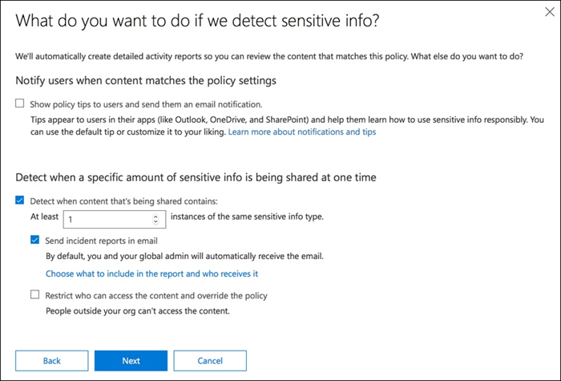
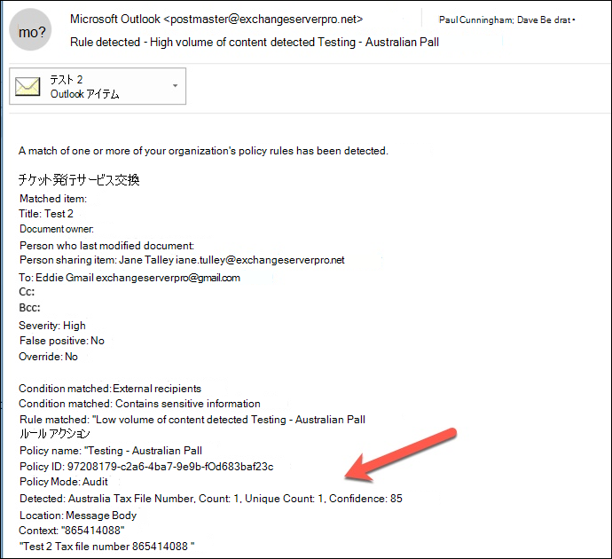
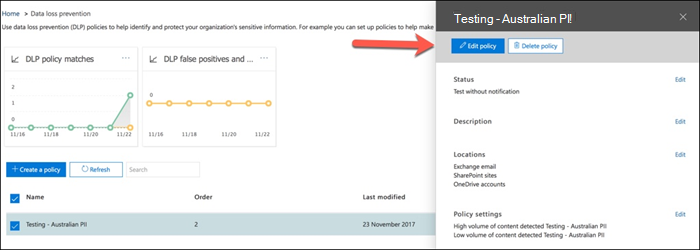
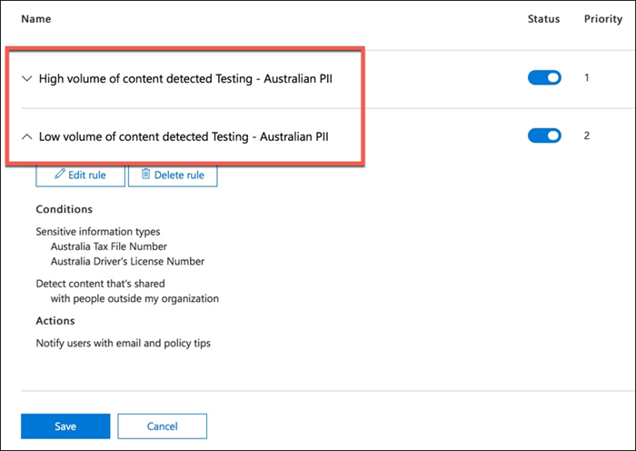
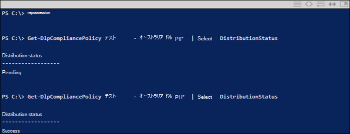

# DLP ポリシーを作成、テスト、調整するCreate, test, and tune a DLP policy

データ損失防止 (DLP) は、組織が不必要な機密情報を意図的または偶発的に危険にさらすことを防止するために設計されたコンプライアンス機能です。Data loss prevention (DLP) is a compliance feature designed to help your organization prevent the intentional or accidental exposure of sensitive information to unwanted parties. DLP のルーツは Exchange Server および Exchange Online にあり、SharePoint Online および OneDrive for Business にも適用できます。DLP has its roots in Exchange Server and Exchange Online, and is also applicable in SharePoint Online and OneDrive for Business.

DLP は、コンテンツ分析エンジンを使用してメール メッセージおよびファイルのコンテンツを調べ、クレジット カード番号や個人を特定できる情報 (PII) などの機密情報を探します。DLP uses a content analysis engine to examine the contents of email messages and files, looking for sensitive information such as credit card numbers and personally identifiable information (PII). 通常、機密情報はメール メッセージやファイルの暗号化などの追加の手順を実行せずにメールで送信したり、ドキュメントに含めたりするべきではありません。Sensitive information should typically not be sent in email, or included in documents, without taking additional steps such as encrypting the email message or files. DLP を使用することで機密情報を検出し、次のようなアクションを実行できます。Using DLP you can detect sensitive information, and take action such as:

- 監査目的でイベントを記録するLog the event for auditing purposes
- 電子メールを送信またはファイルを共有しているエンド ユーザーに警告を表示するDisplay a warning to the end user who is sending the email or sharing the file
- メールまたはファイルの共有の実行を積極的にブロックするActively block the email or file sharing from taking place

保護が必要な種類のデータを持っていると自分が考えていないために、顧客が DLP を却下する場合があります。Sometimes customers dismiss DLP because they don't consider themselves to have the type of data that needs protecting. 医療記録や財務情報などの機密データは、ヘルスケアなどの業界またはオンライン ストアを運営する企業にのみ存在するという前提があります。The assumption is that sensitive data, such as medical records or financial information, only exists for industries like health care or for companies that run online stores. しかし、どんなビジネスでも、たとえ気付いていなくても定期的に機密情報を扱う場合があります。But any business can handle sensitive information on a regular basis, even if they don't realize it. 従業員の名前および生年月日のスプレッドシートは、顧客名およびクレジット カードの詳細情報のスプレッドシートと同じくらい重要です。A spreadsheet of employee names and dates of birth is just as sensitive as a spreadsheet of customer names and credit card details. そして、従業員は日々のタスクを静かに行っており、システムから CSV ファイルをエクスポートして誰かにメールで送信することに関して何も考えていないため、このタイプの情報は予想以上に多く出回っています。And this type of information tends to float around more than you might expect, as employees quietly go about their day to day tasks, thinking nothing of export a CSV file from a system and emailing it to someone. また、従業員がクレジット カードまたは銀行の詳細情報を含むメールを結果を考慮せずに送信する頻度にも驚かれるかもしれません。You might also be surprised how often employees send emails containing credit card or banking details without considering the consequences.

## DLP による機密情報の検出方法How sensitive information is detected by DLP

機密情報は、一致パターンに対する特定のキーワードの近接度など、他のインジケーターと組み合わせて、正規表現 (RegEx) パターンマッチングで識別されます。Sensitive information is identified by regular expression (RegEx) pattern matching, in combination with other indicators such as the proximity of certain keywords to the matching patterns. この例として、クレジット カード番号が挙げられます。An example of this is credit card numbers. VISA のクレジット カード番号は 16 桁です。A VISA credit card number has 16 digits. しかしながら、これらの数字は 1111-1111-1111-1111、1111 1111 1111 1111、または 1111111111111111 など、さまざまな方法で記述することができます。However, those digits can be written in different ways, such as 1111-1111-1111-1111, 1111 1111 1111 1111, or 1111111111111111.

16 桁の数字列は必ずしもクレジット カード番号とは限らず、ヘルプ デスク システムのチケット番号、またはハードウェアのシリアル番号である可能性があります。Any 16 digit string is not necessarily a credit card number, it could be a ticket number from a help desk system, or a serial number of a piece of hardware. クレジット カード番号と無害な 16 桁の数字列の違いを判断するために計算が実行され (チェックサム)、番号がさまざまなクレジット カード ブランドの既知のパターンに一致することを確認します。To tell the difference between a credit card number and a harmless 16-digit string, a calculation is performed (checksum) to confirm that the numbers match a known pattern from the various credit card brands.

さらに、"VISA" や "AMEX" などのキーワードと、クレジットカードの有効期限が切れる日付の間の類似性は、データがクレジットカード番号であるかどうかを決定することも検討しています。Furthermore, the proximity of keywords such as "VISA" or "AMEX", along with the proximity to date values that might be the credit card expiry date, is also considered to make a decision about whether the data is a credit card number or not.

言い換えれば、DLP は通常メール内のこれら 2 つのテキストの違いを認識するのに十分なほどスマートです。In other words, DLP is usually smart enough to recognize the difference between these two texts in an email:

- "新しいラップトップをご注文いただくことができます。"Can you order me a new laptop. VISA カード1111-1111-1111-1111、有効期限11/22、および自分が所有しているときに送信する予定の日付を送信するUse my VISA number 1111-1111-1111-1111, expiry 11/22, and send me the estimated delivery date when you have it."
- "My ラップトップのシリアル番号は2222-2222-2222-2222 で、11/2010 で購入されました。"My laptop serial number is 2222-2222-2222-2222 and it was purchased on 11/2010. ところで、旅行 visa は承認されていますか?By the way, is my travel visa approved yet?"

ブックマークされた状態を維持するための適切なリファレンスは、それぞれの情報の種類がどのように検出されるかを説明するこの[機密情報の種類に関するトピック](what-the-sensitive-information-types-look-for.md)です。A good reference to keep bookmarked is this [topic on sensitive information types](what-the-sensitive-information-types-look-for.md) that explains how each information type is detected.

## データ損失防止を開始する場所Where to start with data loss prevention

データ漏洩のリスクが完全に明らかではない場合、DLP の実装をどこから始めるべきかを正確に判断することは困難です。When the risks of data leakage aren't entirely obvious, it's difficult to work out where exactly you should start with implementing DLP. さいわい、DLP ポリシーを "テストモード" で実行して、有効にする前に、その実効性と正確性を測定できます。Fortunately, DLP policies can be run in "test mode", allowing you to gauge their effectiveness and accuracy before you turn them on.

Exchange Online の DLP ポリシーは、Exchange 管理センターを介して管理できます。DLP policies for Exchange Online can be managed through the Exchange admin center. ただし、セキュリティ/コンプライアンス センターを介してすべてのワークロードの DLP ポリシーを構成できるため、この記事のデモではこれを使用します。But you can configure DLP policies for all workloads through the Security & Compliance Center, so that's what I'll use for demonstrations in this article. セキュリティ/コンプライアンス センターでは、[**データ損失防止**] >  [**ポリシー**] の下に DLP ポリシーがあります。In the Security & Compliance Center you'll find the DLP policies under **Data loss prevention** > **Policy**. [**ポリシーの作成**] をクリックして開始します。Click on **Create a policy** to start.

Microsoft 365 には、DLP ポリシーの作成に使用できる一連の[dlp ポリシーテンプレート](what-the-dlp-policy-templates-include.md)が用意されています。Microsoft 365 provides a range of [DLP policy templates](what-the-dlp-policy-templates-include.md) you can use to create DLP policies. 例えば、ここがオーストラリアの企業だとしましょう。Let's say that you're an Australian business. ポリシー テンプレートをフィルター処理し、オーストラリアに関連するもののみを表示できます。これらは金融、医療、健康、プライバシーの一般カテゴリに分類されます。You can filter the policy templates to display only those that are relevant to Australia, which fall into the general categories of Financial, Medical and Health, and Privacy.

このデモンストレーションでは、オーストラリアの個人を特定できる情報 (PII) データを選択します。これには、オーストラリアのタックス ファイル ナンバー (TFN) および運転免許証番号の情報の種類が含まれます。For this demonstration I'll choose Australian Personally Identifiable Information (PII) Data, which includes the information types of Australian Tax File Number (TFN) and Driver's License Number.

新しい DLP ポリシーに名前を付けます。Give your new DLP policy a name. 規定の名前は DLP ポリシー テンプレートと一致しますが、同じテンプレートから複数のポリシーを作成できるため、よりわかりやすい独自の名前を選択する必要があります。The default name will match the DLP policy template, but you should choose a more descriptive name of your own, because multiple policies can be created from the same template.

ポリシーを適用する場所を選択します。Choose the locations that the policy will apply to. DLP ポリシーは Exchange Online、SharePoint Online、および OneDrive for Business に適用できます。DLP policies can apply to Exchange Online, SharePoint Online, and OneDrive for Business. このポリシーは、すべての場所に適用されるように構成したまま残します。I am going to leave this policy configured to apply to all locations.

最初の**ポリシー設定**手順では、今のところは規定値をそのまま使用します。At the first **Policy Settings** step just accept the defaults for now. DLP ポリシーでは行うことができるカスタマイズが非常に多くありますが、規定値は開始するのに適しています。There is quite a lot of customization you can do in DLP policies, but the defaults are a fine place to start.

[**次へ**] をクリックすると、カスタマイズ オプションが増えた追加の [**ポリシー設定**] ページが表示されます。After clicking **Next** you'll be presented with an additional **Policy Settings** page with more customization options. テストしているポリシーの場合、ここから調整を開始できます。For a policy that you are just testing, here's where you can start to make some adjustments.

- 現時点ではポリシー ヒントをオフにしています。これは、テストを行っているだけであってまだユーザーに何も表示したくない場合に行う合理的な手順です。I've turned off policy tips for now, which is a reasonable step to take if you're just testing things out and don't want to display anything to users yet. ポリシー ヒントは、ユーザーに対して DLP ポリシーに違反しようとしているという警告を表示します。Policy tips display warnings to users that they're about to violate a DLP policy. たとえば Outlook ユーザーには添付したファイルにクレジット カード番号が含まれているという警告が表示され、メールが拒否されます。For example, an Outlook user will see a warning that the file they've attached contains credit card numbers and will cause their email to be rejected. ポリシー ヒントの目標は、非準拠の動作を発生前に停止することです。The goal of policy tips is to stop the non-compliant behaviour before it happens.
- また、インスタンスの数を 10 から 1 に減らすことで、このポリシーがデータの一括共有だけでなくオーストラリアの PII データの共有を検出できるようにしました。I've also decreased the number of instances from 10 to 1, so that this policy will detect any sharing of Australian PII data, not just bulk sharing of the data.
- また、インシデント レポートのメールに別の受信者を追加しました。I've also added another recipient to the incident report email.

最後に、最初はテスト モードで実行するようにこのポリシーを構成しました。Finally, I've configured this policy to run in test mode initially. ここには、テスト モード中にポリシー ヒントを無効にするオプションもあります。Notice there's also an option here to disable policy tips while in test mode. これにより、ポリシー内でポリシー ヒントを有効にする柔軟性が得られますが、それらを表示するか非表示にするかをテスト中に決定します。This gives you the flexibility to have policy tips enabled in the policy, but then decide whether to show or suppress them during your testing.

最終確認画面で [**作成**] をクリックして、ポリシーの作成を完了します。On the final review screen click **Create** to finish creating the policy.

## DLP ポリシーをテストするTest a DLP policy

新しい DLP ポリシーは、約 1 時間以内に有効になります。Your new DLP policy will begin to take effect within about 1 hour. 通常のユーザー アクティビティによってトリガーされるのを待つことも、試しに自分でトリガーすることもできます。You can sit and wait for it to be triggered by normal user activity, or you can try to trigger it yourself. 先ほど、この[機密情報の種類に関するトピック](what-the-sensitive-information-types-look-for.md)にリンクをしました。これは、DLP の一致をトリガーする方法に関する情報を提供します。Earlier I linked to this [topic on sensitive information types](what-the-sensitive-information-types-look-for.md), which provides you with information about how to trigger DLP matches.

例として、この記事のために作成した DLP ポリシーはオーストラリアのタックス ファイル ナンバー (TFN) を検出します。As an example, the DLP policy I created for this article will detect Australian tax file numbers (TFN). ドキュメントによると、一致は以下の基準に基づいています。According to the documentation, the match is based on the following criteria.

 
Blunt のように、TFN の検出をデモンストレーションするために、"税ファイル番号" という単語を持つ電子メールと、近接している9桁の文字列は、問題を発生させることなく sail ます。To demonstrate TFN detection in a rather blunt manner, an email with the words "Tax file number" and a 9 digit string in close proximity will sail through without any issues. DLP ポリシーがトリガーされない理由は、9 桁の数字列が無害な数字の文字列ではなく有効な TFN であることを示すチェックサムに合格する必要があるためです。The reason it does not trigger the DLP policy is that the 9-digit string must pass the checksum that indicates it is a valid TFN and not just a harmless string of numbers.

これに対して、"税ファイル番号" という語句を持つ電子メールと、チェックサムを渡す有効な TFN がポリシーをトリガーします。In comparison, an email with the words "Tax file number" and a valid TFN that passes the checksum will trigger the policy. 実際には、私が使用している TFN は有効ではあるものの本物ではない TFN を生成する Web サイトから取得したものです。For the record here, the TFN I'm using was taken from a website that generates valid, but not genuine, TFNs. DLP ポリシーをテストする際の最も一般的な間違いの 1 つは、有効ではなくチェックサムを渡さない (したがってポリシーをトリガーしない) 偽の番号を使用することです。したがって、そういったサイトはとても便利です。Such sites are very useful because one of the most common mistakes when testing a DLP policy is using a fake number that's not valid and won't pass the checksum (and therefore won't trigger the policy).

インシデント レポートのメールには、検出された機密情報の種類、検出されたインスタンスの数、および検出の信頼レベルが含まれています。The incident report email includes the type of sensitive information that was detected, how many instances were detected, and the confidence level of the detection.

DLP ポリシーをテスト モードのままにしてインシデント レポートのメールを分析すると、DLP ポリシーの正確性およびそれが適用されたときの効果について感触をつかむことができます。If you leave your DLP policy in test mode and analyze the incident report emails, you can start to get a feel for the accuracy of the DLP policy and how effective it will be when it is enforced. インシデント レポートに加えて、[DLP レポートを使用](view-the-dlp-reports.md)してテナント全体でのポリシーの一致の集計ビューを表示できます。In addition to the incident reports, you can [use the DLP reports](view-the-dlp-reports.md) to see an aggregated view of policy matches across your tenant.

## DLP ポリシーを調整するTune a DLP policy

ポリシーのヒットを分析する際に、ポリシーの動作を調整する必要があるかもしれません。As you analyze your policy hits you might want to make some adjustments to how the policies behave. 簡単な例として、メール内に 1 つ TFN がある場合には問題がないと判断するとします (もちろん問題があるとは思いますが、デモのためにこの方法を使います)。しかし、問題は 2 つ以上のインスタンスです。As a simple example, you might determine that one TFN in email is not a problem (I think it still is, but let's go with it for the sake of demonstration), but two or more instances is a problem. 複数のインスタンスは、従業員が HR データベースから外部パーティ (外部会計サービスなど) に CSV エクスポートをメールで送信するなどの危険性を持ったシナリオである可能性があります。Multiple instances could be a risky scenario such as an employee emailing a CSV export from the HR database to an external party, for example an external accounting service. 間違いなく、検出してブロックしたいはずです。Definitely something you would prefer to detect and block.

セキュリティ/コンプライアンス センターでは、既存のポリシーを編集して動作を調整できます。In the Security & Compliance Center you can edit an existing policy to adjust the behaviour.

 
ポリシーが特定のワークロードまたは特定のサイトおよびアカウントにのみ適用されるように、場所の設定を調整できます。You can adjust the location settings so that the policy is applied only to specific workloads, or to specific sites and accounts.

また、ポリシー設定を調整し、ニーズに合わせてルールを編集することもできます。You can also adjust the policy settings and edit the rules to better suit your needs.

DLP ポリシー内のルールを編集する際、以下を変更できます。When editing a rule within a DLP policy you can change:

- ルールをトリガーする機密データのインスタンスの種類および数を含む条件。The conditions, including the type and number of instances of sensitive data that will trigger the rule.
- コンテンツへのアクセス制限などの、実行されるアクション。The actions that are taken, such as restricting access to the content.
- ユーザー通知。メール クライアントまたは Web ブラウザーでユーザーに表示されるポリシー ヒントです。User notifications, which are policy tips that are displayed to the user in their email client or web browser.
- ユーザーによる上書き。ユーザーがメールまたはファイル共有を続行するかどうかを決定します。User overrides, which determines whether users can choose to proceed with their email or file sharing anyway.
- 管理者に通知するためのインシデント レポート。Incident reports, to notify administrators.

このデモンストレーションでは、ポリシーにユーザー通知を追加し (適切なユーザー認識トレーニングなしで行う場合には注意してください)、ユーザーがビジネス上の理由または誤検知としてフラグを立てることでポリシーを上書きすることを許可しました。For this demonstration I've added user notifications to the policy (be careful of doing this without adequate user awareness training), and allowed users to override the policy with a business justification or by flagging it as a false positive. 組織のポリシーに関する追加情報を含める場合にはメールおよびポリシー ヒントのテキストをカスタマイズしたり、質問がある場合にはサポートに連絡するようユーザーに促したりすることもできることに注意してください。Note that you can also customize the email and policy tip text if you want to include any additional information about your organization's policies, or prompt users to contact support if they have questions.

このポリシーには高ボリュームおよび低ボリュームの処理に関する 2 つのルールが含まれているため、必要なアクションでは必ず両方を編集してください。The policy contains two rules for handling of high volume and low volume, so be sure to edit both with the actions that you want. これは、その特性に応じてケースを異なる方法で処理する機会となっています。This is an opportunity to treat cases differently depending on their characteristics. たとえば、低ボリューム違反への上書きは許可しても、高ボリューム違反への上書きは許可しない場合などです。For example, you might allow overrides for low volume violations, but not allow overrides for high volume violations.

また、ポリシーに違反しているコンテンツへのアクセスを実際にブロックまたは制限したい場合には、そうするようにルールでアクションを構成する必要があります。Also, if you want to actually block or restrict access to content that is in violation of policy, you need to configure an action on the rule to do so.

ポリシー設定へのこれらの変更を保存した後、ポリシーのメイン設定ページに戻り、ポリシーがテスト モードのときにユーザーにポリシー ヒントを表示するオプションを有効にする必要もあります。After saving those changes to the policy settings, I also need to return to the main settings page for the policy and enable the option to show policy tips to users while the policy is in test mode. これは、エンド ユーザーに DLP ポリシーを紹介し、生産性に影響を与える多数の誤検知のリスクを負うことなくユーザーの意識向上トレーニングを行う効果的な方法です。This is an effective way to introduce DLP policies to your end users, and do user awareness training, without risking too many false positives that impact their productivity.

サーバー側 (または必要に応じてクラウド側) では、さまざまな処理間隔により、変更がすぐに有効にならない場合があります。On the server side (or cloud side if you prefer), the change may not take effect immediately, due to various processing intervals. ユーザーに新しいポリシー ヒントを表示する DLP ポリシーの変更を行っている場合、Outlook クライアントは 24 時間ごとにポリシーの変更をチェックするのでユーザーには変更がすぐに反映されない場合があります。If you're making a DLP policy change that will display new policy tips to a user, the user may not see the changes take effect immediately in their Outlook client, which checks for policy changes every 24 hours. テストのためにスピードを上げたい場合には、このレジストリ修正を使用して [PolicyNudges キーから最終ダウンロードのタイムスタンプをクリア](https://support.microsoft.com/en-au/help/2823261/changes-to-a-data-loss-prevention-policy-don-t-take-effect-in-outlook?__hstc=18650278.46377037dc0a82baa8a30f0ef07a7b2f.1538687978676.1538693509953.1540315763430.3&__hssc=18650278.1.1540315763430&__hsfp=3446956451)できます。If you want to speed things up for testing, you can use this registry fix to [clear the last download time stamp from the PolicyNudges key](https://support.microsoft.com/en-au/help/2823261/changes-to-a-data-loss-prevention-policy-don-t-take-effect-in-outlook?__hstc=18650278.46377037dc0a82baa8a30f0ef07a7b2f.1538687978676.1538693509953.1540315763430.3&__hssc=18650278.1.1540315763430&__hsfp=3446956451). Outlook は次回再起動してメール メッセージの作成を開始する際に、最新のポリシー情報をダウンロードします。Outlook will download the latest policy information the next time you restart it and begin composing an email message.

ポリシー ヒントを有効にしている場合、ユーザーは Outlook でヒントの表示を開始し、誤検知が発生した場合に報告することができます。If you have policy tips enabled, the user will begin to see the tips in Outlook, and can report false positives to you when they occur.

## 誤検知を調査するInvestigate false positives

DLP ポリシー テンプレートは、そのままでは完璧ではありません。DLP policy templates are not perfect straight out of the box. 自身の環境で誤検出が発生する可能性は高いため、DLP 展開への道を容易にし、適切なポリシーのテストおよび調整に時間をかけることが非常に重要です。It's likely that you'll find some false positives occurring in your environment, which is why it's so important to ease your way into a DLP deployment, taking the time to adequately test and tune your policies.

これが誤検知の例です。Here's an example of a false positive. このメールは、まったくの無害です。This email is quite harmless. ユーザーは自分の携帯電話番号を誰かに提供し、メールに署名を含めています。The user is providing their mobile phone number to someone, and including their email signature.

 
しかしユーザーには、メールに機密情報、具体的にはオーストラリアの運転免許証番号が含まれていることを警告するポリシー ヒントが表示されます。But the user sees a policy tip warning them that the email contains sensitive information, specifically, an Australian driver's license number.

ユーザーは誤検知を報告でき、管理者はそれが発生した理由を調べることができます。The user can report the false positive, and the administrator can look into why it has occurred. インシデント レポートのメールには、誤検知のフラグが設定されています。In the incident report email, the email is flagged as a false positive.

この運転免許証のケースは、掘り下げるにはちょうど良い例です。This driver's license case is a good example to dig into. この誤検知が発生した理由は、"オーストラリアのドライバーのライセンス" の種類が、キーワード "シドニー nsw" (大文字と小文字を区別しない) の300文字以内の9桁の文字列でトリガーされるためです。The reason this false positive has occurred is that the "Australian Driver's License" type will be triggered by any 9-digit string (even one that is part of a 10-digit string), within 300 characters proximity to the keywords "sydney nsw" (not case sensitive). そのため、ユーザーがたまたまシドニーにいるという理由だけで、電話番号とメール署名によってトリガーされます。So it's triggered by the phone number and email signature, only because the user happens to be in Sydney.

1 つのオプションは、オーストラリアの運転免許証の情報の種類をポリシーから削除することです。One option is to remove the Australian driver's license information type from the policy. DLP ポリシー テンプレートの一部なのでそこに含まれていますが、強制的に使用する必要はありません。It's in there because it's part of the DLP policy template, but we're not forced to use it. 運転免許証ではなくタックス ファイル ナンバーのみに関心がある場合には、削除して構いません。If you're only interested in Tax File Numbers and not driver's licenses, you can just remove it. たとえば、ポリシーの低ボリューム ルールからそれを削除しながらも、複数の運転免許証のリストがまだ検出されるように高ボリューム ルールにはそのままそれを残しておくことができます。For example, you can remove it from the low volume rule in the policy, but leave it in the high volume rule so that lists of multiple drivers licenses are still detected.

 
別のオプションとしては、単純にインスタンス数を増やすことが挙げられます。これにより、複数のインスタンスがある場合にのみ少量の運転免許証が検出されます。Another option is to simply increase the instance count, so that a low volume of driver's licenses is only detected when there are multiple instances.

インスタンス数の変更に加えて、一致の精度 (または信頼レベル) を調整することもできます。In addition to changing the instance count, you can also adjust the match accuracy (or confidence level). 機密情報の種類に複数のパターンがある場合、ルールが特定のパターンのみに一致するように、ルールの一致の精度を調整できます。If your sensitive information type has multiple patterns, you can adjust the match accuracy in your rule, so that your rule matches only specific patterns. たとえば、誤検出を減らすためにルールの一致の精度を設定して、最も高い信頼レベルを持つパターンのみと一致するようにできます。For example, to help reduce false positives, you can set the match accuracy of your rule so that it matches only the pattern with the highest confidence level. 信頼レベルの計算方法を理解することは少し難しい (そしてこの投稿の範囲を超えている) のですが、ここに[信頼レベルを使用してルールを調整する方法](data-loss-prevention-policies.md#match-accuracy)の良い説明があります。Understanding how confidence level is calculated is a bit tricky (and beyond the scope of this post), but here's a good explanation of [how to use confidence level to tune your rules](data-loss-prevention-policies.md#match-accuracy).

最後に、さらに高度な情報が必要な場合には、機密情報の種類をカスタマイズできます。たとえば、[オーストラリアの運転免許証](what-the-sensitive-information-types-look-for.md#australia-drivers-license-number)のキーワードのリストから "Sydney NSW" を削除して、上記の誤検知を排除できます。Finally, if you want to get even a bit more advanced, you can customize any sensitive information type -- for example, you can remove "Sydney NSW" from the list of keywords for [Australian Driver's License](what-the-sensitive-information-types-look-for.md#australia-drivers-license-number), to eliminate the false positive triggered above. XML および PowerShell を使用してこれを行う方法については、[組み込みの機密情報の種類のカスタマイズ](customize-a-built-in-sensitive-information-type.md)に関するこのトピックを参照してください。To learn how to do this by using XML and PowerShell, see this topic on [customizing a built-in sensitive information type](customize-a-built-in-sensitive-information-type.md).

## DLP ポリシーを有効にするTurn on a DLP policy

DLP ポリシーが機密情報の種類を正確かつ効果的に検出し、エンド ユーザーが設定されたポリシーに対処する準備ができていることに満足したら、ポリシーを有効にできます。When you're happy that your DLP policy is accurately and effectively detecting sensitive information types, and that your end users are ready to deal with the policies being in place, then you can enable the policy.

 
ポリシーを有効にする時期を待っている場合には、[セキュリティ/コンプライアンス センターの PowerShell に接続し](https://docs.microsoft.com/powershell/exchange/office-365-scc/connect-to-scc-powershell/connect-to-scc-powershell?view=exchange-ps)、[Get-DlpCompliancePolicy コマンドレット](https://docs.microsoft.com/powershell/module/exchange/policy-and-compliance-dlp/get-dlpcompliancepolicy?view=exchange-ps)を実行して DistributionStatus を確認します。If you're waiting to see when the policy will take effect, [Connect to Security & Compliance Center PowerShell](https://docs.microsoft.com/powershell/exchange/office-365-scc/connect-to-scc-powershell/connect-to-scc-powershell?view=exchange-ps) and run the [Get-DlpCompliancePolicy cmdlet](https://docs.microsoft.com/powershell/module/exchange/policy-and-compliance-dlp/get-dlpcompliancepolicy?view=exchange-ps) to see the DistributionStatus.

DLP ポリシーをオンにした後、独自の最終テストをいくつか実行し、予想されるポリシー アクションが発生していることを確認する必要があります。After turning on the DLP policy, you should run some final tests of your own to make sure that the expected policy actions are occurring. クレジット カード データなどをテストしようとしている場合、チェックサムを通過しポリシーをトリガーするサンプルのクレジット カードやその他の個人情報を生成する方法についての情報を掲載した Web サイトがオンラインにあります。If you're trying to test things like credit card data, there are websites online with information on how to generate sample credit card or other personal information that will pass checksums and trigger your policies.

ユーザーによる上書きを許可するポリシーは、ポリシー ヒントの一部としてユーザーにそのオプションを提示します。Policies that allow user overrides will present that option to the user as part of the policy tip.

コンテンツを制限するポリシーは、ポリシー ヒントの一部としてユーザーに警告を表示しユーザーがメールを送信できないようにします。Policies that restrict content will present the warning to the user as part of the policy tip, and prevent them from sending the email.

## 概要Summary

データ損失防止ポリシーは、あらゆるタイプの組織に役立ちます。Data loss prevention policies are useful for organizations of all types. 一部の DLP ポリシーのテストは、ポリシー ヒント、エンド ユーザーによる上書き、インシデント レポートなどを制御できるため、リスクの低い演習です。Testing some DLP policies is a low risk exercise due to the control you have over things like policy tips, end user overrides, and incident reports. 一部の DLP ポリシーを静かにテストし、組織で既に発生している違反の種類を確認し、誤検知率の低いポリシーを作成し、許可されているものと許可されていないものについてユーザーを教育し、DLP ポリシーを組織へとロールアウトします。You can quietly test some DLP policies to see what type of violations are already occurring in your organization, and then craft policies with low false positive rates, educate your users on what is allowed and not allowed, and then roll out your DLP policies to the organization.
