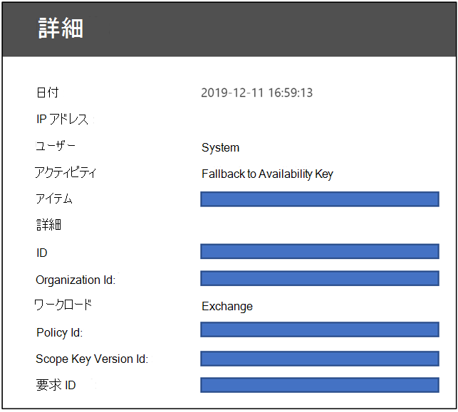

# 顧客キーの可用性キーについて

可用性キーは、データ暗号化ポリシーの作成時に自動的に生成され、プロビジョニングされるルートキーです。 Microsoft 365 は、可用性キーを格納して保護します。 可用性キーは、顧客キーを使用してサービス暗号化を行うために提供する2つのルートキーと同じように機能します。 可用性キーは、キー階層の1層下のキーをラップします。 Azure Key Vault で提供および管理するキーとは異なり、可用性キーに直接アクセスすることはできません。 Microsoft 365 自動サービスは、可用性キーをプログラムによって管理します。 これらのサービスは、可用性キーへの直接アクセスを伴わない自動操作を開始します。

可用性キーの主な目的は、管理している予期しないルートキーから回復機能を提供することです。 Mismanagement または悪意のあるアクションの結果が失われる可能性があります。 ルートキーを制御できなくなった場合は、Microsoft サポートに連絡して、可用性キーを使用した回復のプロセスを支援します。 可用性キーを使用して、新しいデータ暗号化ポリシーに、プロビジョニングする新しいルートキーを使用して移行します。

可用性キーのストレージと制御は、次の3つの理由から、Azure Key Vault キーとは意図的に異なります。

- 可用性キーは、両方の Azure キーヴォールトキーを制御することができない場合の回復、"破損ガラス" 機能を提供します。
- 論理コントロールと安全な格納場所の分離により、多層防御が提供され、単一の攻撃または障害点から、すべてのキーとデータが失われないように保護されます。
- 可用性キーは、一時的なエラーのために Azure Key Vault でホストされているキーにアクセスでき365ない場合に、高可用性機能を提供します。 このルールは、Exchange Online と Skype for Business サービスの暗号化にのみ適用されます。 SharePoint Online、OneDrive for Business、および Teams ファイルは、回復プロセスを開始することを明示的に指示しない限り、可用性キーを使用しません。

キー管理のためのさまざまな保護とプロセスを使用して、データを保護する責任を共有することにより、最終的にすべてのキー (つまりデータ) が完全に失われたり破壊されたりするリスクを軽減します。 Microsoft は、サービスを終了するときに、可用性キーの disablement または破壊に関してのみ権限を提供します。 設計上、Microsoft で可用性キーにアクセスできるのは、Microsoft 365 のサービスコードによってのみです。

キーをセキュリティで保護する方法の詳細については、 [Microsoft Trust Center](https://www.microsoft.com/trustcenter/Privacy/govt-requests-for-data)を参照してください。
  
## 可用性キーの用途

可用性キーは、外部のマルウェアまたは悪意のある insider がキーコンテナーの制御を盗み出た場合、または不注意に mismanagement によってルートキーが失われた場合に、回復機能を提供します。 この回復機能は、顧客キーと互換性のあるすべての Microsoft 365 サービスに適用されます。 個別のサービスでは、可用性キーが異なる方法で使用されます。 Microsoft 365 は、以下に示す方法で可用性キーのみを使用します。

### Exchange Online と Skype for Business の用途

回復機能に加えて、Exchange Online と Skype for Business は可用性キーを使用して、一時的なデータ可用性を確保したり、運用上の問題が断続的に発生したり、ルートキーにアクセスするサービスに関連したりすることができます。 一時的なエラーのために、サービスが Azure Key Vault の顧客キーのいずれかに到達できない場合、サービスは自動的に可用性キーを使用します。 サービスが可用性キーに直接到達することはありません。

Exchange Online および Skype for Business の自動システムでは、一時的なエラー時に可用性キーを使用して、ウイルス対策、電子情報損失防止、メールボックスの移動、データのインデックス作成などの自動化されたバックエンドサービスをサポートできます。

### SharePoint Online、OneDrive for Business、および Teams のファイルの用途

SharePoint Online、OneDrive for Business、Teams ファイルでは、可用性キーは復旧機能の外部では使用されず、お客様は、復旧シナリオで可用性キーの使用を開始するように明示的に指示する必要があります。 自動化されたサービス操作は、Azure Key vault の顧客キーにのみ依存します。 これらのサービスにおけるキー階層のしくみの詳細については、「 [SharePoint Online、OneDrive For business、および Teams の各ファイルが可用性キーを使用する方法](#how-sharepoint-online-onedrive-for-business-and-teams-files-use-the-availability-key)」を参照してください。

## 可用性キーのセキュリティ

Microsoft では、可用性キーをインスタンス化し、それを保護するために大きな手段を講じることによって、データ保護の責任を負っています。 Microsoft は、お客様に可用性キーの直接制御を公開しません。 たとえば、Azure Key Vault で所有するキーのみをロール (回転) することができます。 詳細については、「 [customer key または availability キーをロールまたは回転する](customer-key-availability-key-roll.md)」を参照してください。

### 可用性キーシークレットストア

Microsoft は、顧客に接している Azure Key Vault のような、アクセス制御された内部シークレットストアの可用性キーを保護します。 アクセス制御を実装することで、Microsoft の管理者は、に含まれる機密情報に直接アクセスすることができなくなります。 キーのローテーションや削除などのシークレットストア操作は、可用性キーへの直接アクセスを伴わない自動コマンドによって行われます。 シークレットストア管理操作は、特定のエンジニアに限定され、内部ツールのロックボックスを使用して特権のエスカレーションが必要になります。 特権の昇格を行うには、上司の承認と根拠を付与する必要があります。 ロックボックスアクセスは、時間の満了時またはエンジニアのログアウト時に、自動的にアクセスが失効した時間に制限されます。

Exchange **online と Skype For business の**可用性キーは、Exchange Online Active Directory シークレットストアに格納されます。 可用性キーは、Active Directory ドメインコントローラー内のテナント固有のコンテナー内に安全に格納されます。 このセキュリティで保護された格納場所は、SharePoint Online、OneDrive for Business、および Teams ファイルシークレットストアとは別の場所に分離されています。

**SharePoint Online、OneDrive For business、および Teams ファイル**の可用性キーは、サービスチームが管理する内部シークレットストアに格納されます。 このセキュリティで保護された機密ストレージサービスには、アプリケーションエンドポイントを使用するフロントエンドサーバーと、バックエンドとして SQL データベースがあります。 可用性キーは、SQL データベースに格納され、保持 (暗号化) されて、AES-256 と HMAC の組み合わせを使用して、残りの可用性キーを暗号化します。 シークレットストアの暗号化キーは、同じ SQL データベースの論理的に分離されたコンポーネントに格納され、Microsoft の証明機関 (CA) によって管理される証明書に含まれる RSA 2048 キーを使用してさらに暗号化されます。 これらの証明書は、データベースに対する操作を実行するシークレットストアフロントエンドサーバーに格納されます。

### 詳細な防御

Microsoft では、多層防御戦略を使用して、悪意のある俳優が Microsoft クラウドに格納されている顧客データの機密性、整合性、または可用性に影響を与えることを防止しています。 詳細なセキュリティ戦略の一部として、シークレットストアと可用性キーを保護するために、特定の予防および検出コントロールを実装します。

Microsoft 365 は、可用性キーを誤用しないようにビルドされています。 アプリケーション層は、可用性キーを含むキーを使用してデータを暗号化および復号化できる唯一の方法です。 暗号化と復号化のアクティビティについては、Microsoft 365 サービスコードのみがキー階層を解釈し、スキャンすることができます。 顧客キー、可用性キー、他の階層キー、および顧客データのストレージの場所の間に論理的な分離が存在します。 この分離により、1つ以上の場所が危険にさらされた場合に、データが危険にさらされるリスクを軽減できます。 階層内の各レイヤーには、24時間365日の侵入検知機能が組み込まれており、データと機密情報を保護します。

アクセス制御は、可用性キーシークレットストアなど、内部システムへの権限のないアクセスを防止するために実装されています。 Microsoft のエンジニアは、可用性キーシークレットストアに直接アクセスすることはできません。 アクセス制御の詳細については、 [Microsoft 365 の「管理アクセス制御](https://docs.microsoft.com/Office365/securitycompliance/office-365-administrative-access-controls-overview)」を参照してください。

テクニカルコントロールは、Microsoft の担当者が高度な権限を持つサービスアカウントにログインすることを禁止します。それ以外の場合、攻撃者が Microsoft サービスを偽装するために使用します。 たとえば、これらのコントロールは対話型ログオンを防ぎます。

セキュリティログおよび監視制御は、Microsoft のサービスとデータに対するリスクを軽減するために実装されたもう1つの多層防御セーフガードです。 Microsoft サービスチームは、アラートと監査ログを生成するアクティブな監視ソリューションを展開しました。 すべてのサービスチームがログを中央リポジトリにアップロードし、ログを集約して処理します。 内部ツールは、レコードを自動的に調査して、サービスが最適で回復可能な状態で機能していることを確認します。 異常なアクティビティについては、さらにレビューを行うようにフラグを付けます。

マイクロソフトのセキュリティポリシーに違反する可能性があることを示すログイベントは、直ちにマイクロソフトのセキュリティチームを重視しています。 Microsoft 365 security では、可用性キーシークレットストアへのアクセス試行を検出するように警告が構成されています。 Microsoft の担当者が、アクセス制御によって禁止および保護されているサービスアカウントへの対話型ログオンを試行する場合も、通知が生成されます。 Microsoft 365 セキュリティは、通常のベースライン操作から Microsoft 365 サービスの偏差を検出し、警告を出します。 Microsoft 365 サービスを誤用しようとした場合、攻撃者が Microsoft クラウド環境からの削除によって警告を発生させる可能性があります。

## 可用性キーを使用してキー損失からの回復を行う

お客様のキーを制御できなくなった場合は、可用性キーを使用して、データを回復して暗号化することができます。

### Exchange Online と Skype for Business の回復手順

顧客キーを制御できなくなった場合は、可用性キーによって、データを回復し、影響を受ける Microsoft 365 リソースをオンラインに戻すことができます。 可用性キーは、回復時にデータを保護し続けます。重要な損失から完全に回復するには、高レベルで、新しい DEP を作成し、影響を受けるリソースを新しいポリシーに移行する必要があります。

新しい顧客キーを使用してデータを暗号化するには、Azure Key Vault で新しいキーを作成し、新しい顧客キーを使用して新しい DEP を作成した後、以前の DEP で暗号化されたキーが失われたか漏洩したメールボックスに新しい DEP を割り当てます。

この再暗号化プロセスには、最大72時間かかる場合があります。 これは、DEP を変更するときの標準的な期間です。
  
### SharePoint Online、OneDrive for Business、および Teams ファイルの回復手順

SharePoint Online、OneDrive for Business、Teams ファイルでは、可用性キーが回復機能の外部で使用されることはありません。 回復シナリオで可用性キーの使用を開始するように、Microsoft に明示的に指示する必要があります。 回復プロセスを開始するには、Microsoft に連絡して可用性キーを有効にします。 有効にすると、可用性キーが自動的に使用され、新しい顧客キーに関連付けられた新しく作成された DEP を使用してデータを暗号化することができます。  

この操作は、組織内のサイト数に比例します。 Microsoft に連絡して可用性キーを使用すると、約4時間以内に完全にオンラインになります。

## Exchange Online と Skype for Business が可用性キーを使用する方法

顧客キーを使用して DEP を作成すると、Microsoft 365 はその DEP に関連付けられているデータ暗号化ポリシーキー (DEP キー) を生成します。 このサービスは、DEP キーを3回暗号化します。1回は各顧客キーで、もう1回は可用性キーを使用しています。 暗号化されたバージョンの DEP キーのみが保存され、DEP キーは顧客キーまたは可用性キーを使用してのみ復号化できます。 次に、DEP キーを使用して、個々のメールボックスを暗号化するメールボックスキーを暗号化します。
  
Microsoft 365 は、ユーザーがサービスを使用しているときにデータを復号化し、提供するために、このプロセスに従います。
  
1. 顧客キーを使用して DEP キーを復号化します。

2. 暗号化されていない DEP キーを使用して、メールボックスキーを復号化します。

3. 復号化されたメールボックスキーを使用して、メールボックス自体の暗号化を解除し、メールボックス内のデータにアクセスできるようにします。

## SharePoint Online、OneDrive for Business、および Teams のファイルが可用性キーを使用する方法

SharePoint Online および OneDrive for Business のアーキテクチャと、顧客キーと可用性キーの実装は、Exchange Online と Skype for business とは異なります。
  
組織が顧客が管理するキーに移行すると、Microsoft 365 によって組織固有の中間キー (TIK) が作成されます。 Microsoft 365 は、各顧客キーを使用して、TIK を2回暗号化し、TIK の2つの暗号化されたバージョンを格納します。 TIK の暗号化バージョンのみが保存され、TIK は顧客キーでのみ復号化できます。 次に、TIK は、サイトキーを暗号化するために使用され、次に blob キー (ファイルチャンクキーとも呼ばれる) を暗号化するために使用されます。 ファイルサイズに応じて、1つのファイルを一意のキーを持つ複数のファイルチャンクに分割することができます。 Blob (ファイルチャンク) 自体は、blob キーを使用して暗号化され、Microsoft Azure Blob ストレージサービスに格納されます。
  
Microsoft 365 は、お客様がサービスを使用しているときにお客様のファイルを復号化し、提供するために、このプロセスに従います

1. 顧客キーを使用して、TIK を復号化します。

2. 復号化された TIK を使用して、サイトキーを復号化します。

3. 復号化されたサイトキーを使用して、blob キーを復号化します。

4. 復号化された blob キーを使用して、blob の暗号化を解除します。

Microsoft 365 は、わずかなオフセットで Azure Key Vault に2つの復号化要求を発行することによって、TIK を復号化します。 最初の furnishes が完了し、その他の要求を取り消します。
  
顧客キーへのアクセスが失われた場合、Microsoft 365 は、可用性キーを使用して TIK を暗号化し、その情報を、各顧客キーで暗号化された Tik と共に格納します。 可用性キーで暗号化された TIK は、お客様が Microsoft を呼び出して、キーにアクセスできなくなったときに、故意または誤って回復パスを登録する場合にのみ使用されます。
  
可用性とスケールの理由から、復号化された TIKs は時間限定メモリキャッシュにキャッシュされます。 TIK キャッシュを期限切れに設定する2時間前に、Microsoft 365 は各 TIK の暗号化を解除しようとします。 TIKs を復号化すると、キャッシュの有効期間が延長されます。 TIK 復号化が長時間に失敗すると、Microsoft 365 はキャッシュの有効期限が切れる前にエンジニアリングに通知する通知を生成します。 お客様が Microsoft に電話をかけている場合に限り、microsoft 365 は、microsoft のシークレットストアに格納されている可用性キーで TIK の暗号化を解除して、復号化された TIK と、お客様が提供する新しい Azure Key Vault キーのセットを使用して、再度テナントをオンボードにします。
  
現時点では、顧客キーは Azure blob ストアに保存されている SharePoint Online ファイルデータの暗号化と復号化チェーンに関係していますが、SQL データベースに格納されている SharePoint Online のリストアイテムまたはメタデータは含まれていません。 Microsoft 365 では、Exchange Online、Skype for Business、SharePoint Online、OneDrive for Business、および前述のケース以外の Teams ファイル (お客様が開始) に対して可用性キーを使用していません。 お客様のデータへのアクセスは、顧客のロックボックスで保護されています。

## 可用性キートリガー

Microsoft 365 は、特定の状況でのみ可用性キーをトリガーします。 これらの環境はサービスによって異なります。

### Exchange Online と Skype for Business のトリガー
  
1. Microsoft 365 は、Azure Key Vault で2つの顧客キーの場所を決定するために、メールボックスが割り当てられている DEP を読み取ります。

2. Microsoft 365 は、DEP から2つの顧客キーのいずれかをランダムに選択し、顧客キーを使用して DEP キーの折り返しを解除するために、Azure Key Vault に要求を送信します。

3. 顧客キーを使用して DEP キーのラップを解除する要求が失敗した場合、Microsoft 365 は Azure Key Vault に2番目の要求を送信します。このとき、代替 (2 番目の) 顧客キーを使用するように指示します。

4. 顧客キーを使用して DEP キーの折り返しを解除する2番目の要求が失敗した場合、Microsoft 365 は両方の要求の結果を調べます。

    - 検証で、要求がシステムエラーを返して失敗したことが判断された場合:

       - Microsoft 365 は、可用性キーをトリガーして DEP キーを復号化します。

       - その後、Microsoft 365 は、DEP キーを使用してメールボックスキーを復号化し、ユーザー要求を完了します。 

       - この場合、Azure Key Vault は一時的なエラーのために応答できないか、到達不能になります。

    - 検証で、要求がアクセス拒否を返して失敗したことが判断された場合:

       - そのため、意図的、不注意、または悪意のあるアクションが実行され、顧客キーが使用できなくなります (たとえば、サービスを終了する一環として、データの削除処理中)。

       - この場合、可用性キーはシステムアクションに対してのみ使用され、ユーザーの操作に対しては使用されず、ユーザー要求は失敗し、ユーザーはエラーメッセージを受け取ります。

>[!IMPORTANT]
>Microsoft 365 サービスコードでは、価値のあるクラウドサービスを提供するために、お客様のデータを根拠とする理由で、常に有効なログイントークンが用意されています。 そのため、可用性キーが削除されるまでは、検索インデックスの作成やメールボックスの移動など、Exchange Online と Skype for Business で開始される操作または内部からのアクションのフォールバックとして使用できます。 これは、一時的なエラーと、Azure Key Vault へのアクセス拒否要求の両方に適用されます。

### SharePoint Online、OneDrive for Business、Teams ファイルのトリガー

SharePoint Online、OneDrive for Business、Teams ファイルでは、可用性キーは復旧機能の外部では使用されず、お客様は、復旧シナリオで可用性キーの使用を開始するように明示的に指示する必要があります。

## 監査ログと可用性キー

Microsoft 365 の自動システムは、ウイルス対策、電子情報の開示、データ損失防止、データのインデックス作成など、クラウドサービスを提供するために、システム全体で流れているすべてのデータを処理します。 Microsoft 365 は、このアクティビティのお客様に表示されるログを生成しません。 また、Microsoft の担当者は、このような通常のシステム操作の一部としてデータにアクセスすることはありません。

### Exchange Online と Skype for Business の可用性キーのログ

Exchange Online と Skype for Business がサービスを提供するための可用性キーにアクセスすると、Microsoft 365 は、セキュリティ/コンプライアンスセンターからアクセス可能な顧客の表示ログを公開します。 可用性キー操作の監査ログレコードは、サービスが availability キーを使用するたびに生成されます。 アクティビティの種類が "フォールバックツー可用性キー" の新しいレコードの種類として、管理者が[統合監査ログ](https://docs.microsoft.com/microsoft-365/compliance/search-the-audit-log-in-security-and-compliance)の検索結果をフィルター処理して可用性キーレコードを表示することができます。

ログレコードには、日付、時刻、アクティビティ、組織 ID、データ暗号化ポリシー ID などの属性が含まれます。 レコードは、統合監査ログの一部として使用でき、[セキュリティ & コンプライアンスセンターの監査ログの検索] タブからアクセスできます。

Exchange Online と Skype for Business の可用性キーレコードは、Office 365 Management Activity [common schema](https://docs.microsoft.com/office/office-365-management-api/office-365-management-activity-api-schema#common-schema)を追加のカスタムパラメーターと共に使用します。ポリシー Id、範囲キーバージョン Id、および要求 Id。

### SharePoint Online、OneDrive for Business、および Teams ファイル可用性キーのログ

可用性キーのログ記録は、これらのサービスではまだ利用できません。 SharePoint Online、OneDrive for Business、Teams ファイルでは、可用性キーは Microsoft によって指示された場合にのみ、回復目的でライセンス認証されます。 その結果、これらのサービスに対して可用性キーが使用されるすべてのイベントが既にわかっています。

## 顧客キー階層の可用性キー
  
Microsoft 365 では、可用性キーを使用して、カスタマーキーサービスの暗号化に対して確立されたキー階層の下位レベルのキーをラップしています。 サービス間には異なるキー階層が存在します。 キーアルゴリズムは、適用可能な各サービスの階層内の可用性キーとその他のキーによっても異なります。 さまざまなサービスで使用される可用性キーアルゴリズムは次のとおりです。

- Exchange Online と Skype for Business の可用性キーは、AES-256 を使用します。

- SharePoint Online、OneDrive for Business、および Teams ファイルの可用性キーは RSA-2048 を使用します。

### Exchange Online と Skype for Business のキーを暗号化するために使用される暗号化暗号

### SharePoint Online と OneDrive for business のキーを暗号化するために使用される暗号化暗号

## 関連記事

- [顧客キーによるサービスの暗号化](customer-key-overview.md)

- [顧客キーを設定する](customer-key-set-up.md)

- [顧客キーを管理する](customer-key-manage.md)

- [顧客キーまたは可用性キーをローリングまたはローテーションする](customer-key-availability-key-roll.md)
