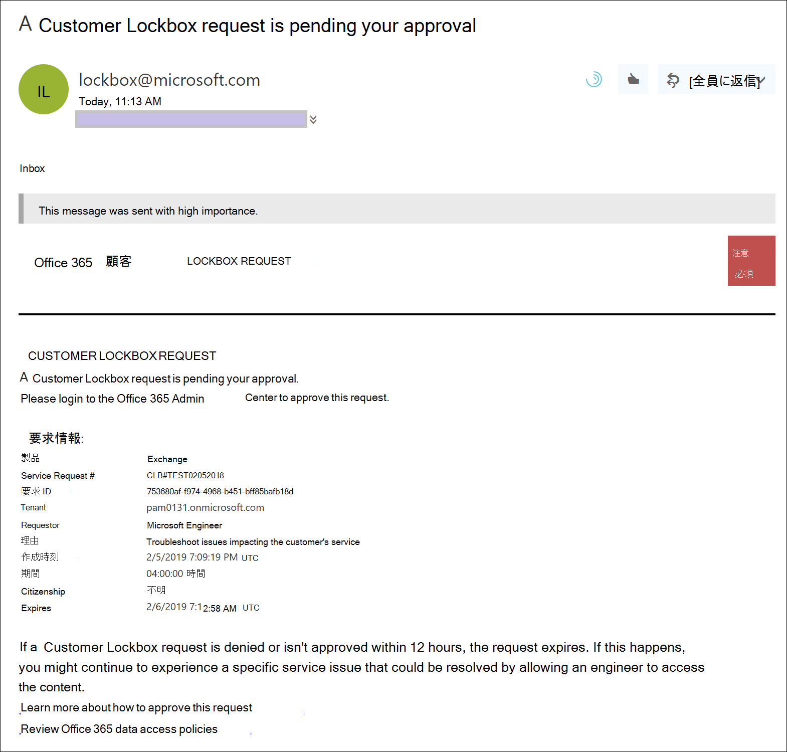

# Office 365 のカスタマーロックボックス

この記事では、お客様のロックボックスの展開と構成に関するガイダンスを示します。 Customer ロックボックスは、Exchange Online、SharePoint Online、OneDrive for business のデータにアクセスするための要求をサポートしています。 他のサービスのサポートを推奨するには、 [Office 365 UserVoice](https://office365.uservoice.com/)で要求を送信してください。

Microsoft 365 のコンプライアンスの提供 (2020 年4月1日現在) を利用してユーザーにライセンスを付与するためのオプションを確認するには、「 [microsoft 365 ライセンスガイダンス (セキュリティ & 法令遵守](https://aka.ms/ComplianceSD)」を参照してください。

カスタマーロックボックスを使用すると、明示的な承認なしにサービス操作を実行するために、Microsoft がコンテンツにアクセスできなくなります。 お客様のロックボックスによって、コンテンツにアクセスする要求の承認ワークフローに入ります。

Microsoft のエンジニアは、サポートプロセスでお客様から報告された問題のトラブルシューティングと修正に役立つ場合があります。 通常、問題は広範なテレメトリおよびデバッグツールによって Microsoft がサービスに適用されています。 ただし、場合によっては、Microsoft のエンジニアにお客様のコンテンツにアクセスして、根本的な原因を特定し、問題を修正する必要があります。 お客様のロックボックスには、エンジニアが承認ワークフローの最後の手順として顧客からのアクセスを要求する必要があります。 これにより、組織はこれらの要求を承認または拒否し、顧客への直接アクセスコントロールを提供することができます。

### 顧客ロックボックスの概要ビデオ

> [!VIDEO https://www.microsoft.com/videoplayer/embed/8fecf10b-1f03-4849-8b67-76d3d2a43f26?autoplay=false]

## 顧客ロックボックスのワークフロー

次の手順では、Microsoft のエンジニアがカスタマーロックボックス要求を開始するときの一般的なワークフローの概要を示します。

1. 組織内の誰かが Microsoft 365 メールボックスで問題を経験している。

2. ユーザーが問題のトラブルシューティングを行った後、問題を修正できない場合は、Microsoft サポートにサポートリクエストを開きます。

3. Microsoft サポートエンジニアがサービス要求を確認し、Exchange Online の問題を修復するために組織のテナントにアクセスする必要があるかどうかを判断します。

4. Microsoft サポートエンジニアは、カスタマーロックボックス要求ツールにログインして、組織のテナント名、サービス要求番号、およびエンジニアリングがデータにアクセスする予想時間を含むデータアクセス要求を行います。

5. Microsoft サポートマネージャーが要求を承認した後、顧客のロックボックスは、Microsoft からの保留中のアクセス要求に関する電子メール通知を組織内の指定された承認者に送信します。

    

   Microsoft 365 管理センターで[カスタマーロックボックスアクセス承認](https://docs.microsoft.com/office365/admin/add-users/about-admin-roles)者の役割を割り当てられたすべてのユーザーは、顧客ロックボックス要求を承認できます。

6. 承認者は、Microsoft 365 管理センターにサインインし、要求を承認します。 この手順では、監査ログの検索によって使用可能な監査レコードの作成が開始されます。 詳細については、「[顧客ロックボックス要求の監査](#auditing-customer-lockbox-requests)」を参照してください。

   顧客が要求を拒否した場合、または要求を12時間以内に承認しなかった場合、要求は有効期限が切れ、Microsoft のエンジニアにはアクセス権が付与されません。

   > [!IMPORTANT]
   > Microsoft では、Office 365 にサインインする必要がある、カスタマーロックボックスの電子メール通知にリンクは含まれていません。

7. 組織からの承認者が要求を承認した後、Microsoft エンジニアは承認メッセージを受信し、Exchange Online のテナントにログインして、お客様の問題を修正します。 Microsoft のエンジニアは、要求された期間に、アクセスが自動的に取り消される前に問題を修正します。

> [!NOTE]
> Microsoft のエンジニアによって実行されるすべての操作は、監査ログに記録されます。 これらの監査レコードを検索して確認することができます。

## カスタマーロックボックス要求を有効または無効にする

Microsoft 365 管理センターでカスタマーロックボックスコントロールをオンにすることができます。 カスタマーロックボックスをオンにすると、テナントのコンテンツにアクセスする前に、Microsoft は組織の承認を取得する必要があります。

1. グローバル管理者または [**カスタマーロックボックス] [アクセス承認**] 役割が割り当てられている職場また[https://admin.microsoft.com](https://admin.microsoft.com)は学校のアカウントを使用して、に移動し、サインインします。

2. **セキュリティ & プライバシーの設定 >** 選択します。

    

3. [**顧客ロックボックス**] タイルで、[**編集**] を選択し、トグルを**オン**または**オフ**にして、機能をオンまたはオフにします。

    

## カスタマーロックボックス要求を承認または拒否する

1. グローバル管理者または [**カスタマーロックボックス] [アクセス承認**] 役割が割り当てられている職場また[https://admin.microsoft.com](https://admin.microsoft.com)は学校のアカウントを使用して、に移動し、サインインします。

2. [ **Support > Customer のロックボックス要求**] を選択します。

    ![[サポート] をクリックし、[カスタマーロックボックス要求] をクリックします。](../media/CustomerLockbox5.png)

    顧客のロックボックス要求の一覧が表示されます。

    

3. 顧客のロックボックス要求を選択し、[**承認**または**拒否**] を選択します。

    

    顧客のロックボックス要求の承認に関する確認メッセージが表示されます。

    

## 顧客ロックボックス要求の監査

顧客のロックボックス要求に対応する監査レコードは、監査ログに記録されます。 これらのログには、セキュリティ & コンプライアンスセンターの[監査ログ検索ツール](search-the-audit-log-in-security-and-compliance.md)を使用してアクセスできます。 カスタマーロックボックス要求の承諾または拒否に関連する操作 (アクセス要求が承認された場合) は、監査ログにも記録されます。 これらの監査レコードを検索して確認することができます。

### カスタマーロックボックス要求に関連するアクティビティの監査ログを検索する

監査ログを使用して顧客ロックボックスの要求を追跡できるようにするには、監査ログを設定するためにいくつかの手順が必要になります。 詳細については、「[セキュリティ & のコンプライアンスセンターでの監査ログの検索](https://docs.microsoft.com/office365/securitycompliance/search-the-audit-log-in-security-and-compliance#before-you-begin)」を参照してください。 セットアップが完了したら、次の手順を使用して監査ログ検索クエリを作成し、顧客ロックボックスに関連する監査レコードを返します。

1. [https://protection.office.com](https://protection.office.com) に移動します。
  
2. 職場または学校のアカウントを使用してサインインします。

3. [セキュリティ & コンプライアンスセンター] の左側のウィンドウで、[**検索 & 調査** > **監査ログの検索**] を選択します。

    [**監査ログの検索**] ページが表示されます。

    
  
4. 次の検索条件を設定します。

    a. **アクティビティ**-検索ですべてのアクティビティの監査レコードが返されるようにするには、このフィールドを空白のままにします。 これは、カスタマーロックボックス要求と、Microsoft のエンジニアによって実行される対応するアクティビティに関連する監査レコードを返すために必要です。

    b. **開始**日と**終了日**-その期間内に発生したイベントを表示する日付と時刻の範囲を選択します。

    c. **ユーザー** -このフィールドは空白のままにします。

    d. **ファイル、フォルダー、またはサイト** - このフィールドは空白のままにします。

5. [**検索**] をクリックして、設定した検索条件で検索を実行します。

    検索結果が読み込まれ、しばらくすると、[**監査ログの検索**] ページの [**結果**] の下に表示されます。

6. [検索結果] ページで [**結果のフィルター処理**] をクリックし、次のいずれかの操作を行います。

   - 組織内の承認者に関連する監査レコードを表示するには、顧客のロックボックス要求を承認または拒否します。 [**アクティビティ**] 列の下のボックスに「 **AccessToCustomerDataRequest**」と入力します。

   - Microsoft のエンジニアに関連する監査レコードを表示するには、承認された顧客ロックボックス要求に対する処理を実行します。 [**ユーザー** ] 列の下のボックスに、「 **Microsoft Operator**」と入力します。 [ **Activity** ] 列には、エンジニアが実行したアクションが表示されます。

      

7. 結果の一覧で、監査レコードをクリックして表示します。

### カスタマーロックボックスのアクセス要求の監査レコード

組織内のユーザーがカスタマーロックボックス要求を承認または拒否すると、監査ログが監査ログに記録されます。 このレコードには、次の情報が含まれています。

| Audit record プロパティ| 説明|
|:---------- |:----------|
| 日付       | 顧客のロックボックス要求が承認または拒否された日時。
| IP アドレス | 承認者が要求を承認または拒否するために使用したコンピューターの IP アドレス。 |
| User       | Prod.outlook.com のサービスアカウント\[BOXServiceAccount@\]。            |
| アクティビティ   | AccessToCustomerDataRequest;これは、顧客のロックボックス要求を承認または拒否するときに記録される監査アクティビティです。                                |
| アイテム       | 顧客のロックボックス要求の Guid                             |

次のスクリーンショットは、承認された顧客ロックボックス要求に対応する監査ログレコードの例を示しています。 顧客のロックボックス要求が拒否された場合、 **Approvaldecision**パラメーターの値は**Deny**になります。

> [!TIP]
> 監査レコードに詳細情報を表示するには、[**詳細情報**] をクリックします。

### Microsoft のエンジニアによって実行されたアクションの監査レコード

カスタマーロックボックス要求が承認された後に Microsoft のエンジニアが実行した操作 (およびお客様のコンテンツへのアクセスが発生する可能性がある) は、監査ログに記録されます。 これらのレコードには、次の情報が含まれています。

| Audit record プロパティ| 説明|
|:---------- |:----------|
| 日付       | アクションが実行された日時。 この操作が実行された時間は、顧客のロックボックス要求が承認された4時間以内になることに注意してください。              |
| IP アドレス | Microsoft エンジニアが使用したコンピューターの IP アドレス。 |
| User       | Microsoft Operator;この値は、このレコードが顧客のロックボックス要求に関連付けられていることを示します。                                  |
| アクティビティ   | Microsoft エンジニアによって実行されたアクティビティの名前。|
| アイテム       | \<必須\>                                             |

## よく寄せられる質問

#### どの Microsoft 365 サービスが顧客ロックボックスに適用されますか。

お客様のロックボックスは現在、Exchange Online、SharePoint Online、OneDrive for business でサポートされています。

#### お客様のロックボックスはすべてのお客様が利用できますか?

カスタマーロックボックスは、Microsoft 365 または Office 365 E5 サブスクリプションに含まれており、情報の保護とコンプライアンス、または高度なコンプライアンスアドオンサブスクリプションを使用して他のプランに追加できます。 詳細については [、「プランと価格](https://products.office.com/business/office-365-enterprise-e5-business-software) 」を参照してください。

#### 顧客コンテンツとは

顧客コンテンツは、Microsoft 365 のサービスとアプリケーションのユーザーによって作成されたデータです。 顧客コンテンツの例は次のとおりです。

- 電子メール本文またはメールの添付ファイル

- SharePoint サイトのコンテンツ

- SharePoint ファイルの本文に含まれる情報

- Skype for Business プレゼンテーションファイルの本文

- インスタントメッセージ (IM) または音声会話

- ユーザーが生成した blob または構造化ストレージデータ (SQL コンテナーなど)

- 顧客が所有するセキュリティ情報 (証明書、暗号化キー、パスワードなど)

- お客様のコンテンツが残っている場合の推論、以降のすべての推論

Office 365 の顧客コンテンツの詳細については、「 [office 365 のセキュリティセンター](https://products.office.com/business/office-365-trust-center-privacy/)」を参照してください。

#### 自分のコンテンツへのアクセスを要求された場合、だれに通知されますか。

グローバル管理者と、カスタマーロックボックスアクセス許可管理者役割に割り当てられているユーザーに通知します。 これらのユーザーは、顧客のロックボックス要求の承認を行うこともできます。

#### 組織内でこれらの要求を承認または拒否できるユーザー

グローバル管理者と顧客ロックボックスアクセス許可管理者ロールに割り当てられたユーザーは、顧客ロックボックス要求を承認できます。 お客様は、組織内でこれらの役割の割り当てを制御します。

#### お客様のロックボックスにどのように選択しますか?

グローバル管理者は、Microsoft 365 または Microsoft 365 管理センターでカスタマーロックボックスを有効にして構成することができます。

#### カスタマーロックボックス要求を承認した場合、エンジニアは何をすることができますか。また、Microsoft のエンジニアが何をしたかを知る方法を教えてください。

カスタマーロックボックス要求を承認した後、Microsoft のエンジニアは、事前承認済みコマンドレットを使用して、お客様のコンテンツにアクセスするためにこれらの必要な権限を付与しました。 カスタマーロックボックス要求に対応して Microsoft のエンジニアが実行するアクションは、セキュリティ & コンプライアンスセンターの監査ログでログに記録され、アクセスできます。

#### Microsoft が承認プロセスに従うことをどのように確認できますか?

組織内の管理者および承認者に送信される電子メールの承認通知は、Microsoft 365 管理センターのカスタマーロックボックス要求の履歴と相互参照できます。

お客様のロックボックスは、最新の[SOC 1 SSAE 16 監査レポート](https://servicetrust.microsoft.com/ViewPage/MSComplianceGuide?command=Download&downloadType=Document&downloadId=91592749-e86a-43ac-801e-121382614681&docTab=4ce99610-c9c0-11e7-8c2c-f908a777fa4d_SOC%20%2F%20SSAE%2016%20Reports)に含まれています。 詳細については、 [Microsoft Service Trust Portal](https://servicetrust.microsoft.com/ViewPage/MSComplianceGuide?command=Download&downloadType=Document&downloadId=91592749-e86a-43ac-801e-121382614681&docTab=4ce99610-c9c0-11e7-8c2c-f908a777fa4d_SOC%20%2F%20SSAE%2016%20Reports)の最新レポートを参照してください。

#### Microsoft は、自分のテナントの承認者の一覧を変更できますか? そうでない場合は、どのような方法で回避できますか。

顧客のロックボックス要求を承認できるユーザーを指定できるのは、組織内のグローバル管理者のみです。 これは、Azure Active Directory の全体管理者グループのメンバーのみが、要求を承認できるユーザーを指定できることを意味します。 Azure Active Directory の全体管理者グループのメンバーシップは、組織によってのみ管理されます。

#### 承認のためにコンテンツアクセス要求に関する詳細情報が必要な場合は、どうすればよいですか?

各顧客のロックボックス要求には、Microsoft 365 サービス要求番号が含まれています。 要求に関する詳細情報を取得するには、Microsoft サポートに連絡して、このサービス番号を参照してください。

#### 顧客のロックボックス要求が承認されると、アクセス許可はどのくらいの期間有効になりますか。

現時点では、Microsoft のエンジニアに付与されるアクセス許可の最大期間は4時間です。 Microsoft のエンジニアは、短い期間を要求することもできます。

#### すべてのカスタマーロックボックス要求の履歴を取得するにはどうすればよいですか?

すべてのカスタマーロックボックス要求は、Microsoft 365 管理センターで表示されます。

#### コンテンツアクセス要求を関連する監査ログと関連付けるにはどうすればよいですか。

コンプライアンスセンターのアクティビティフィードには、顧客ロックボックスのログアクティビティが含まれています。 顧客は、受信した電子メール要求に対して、顧客のロックボックスログアクティビティをアクティビティフィードから相互参照できます。

#### お客様がお客様のロックボックス要求に応答しない場合はどうなりますか?

顧客のロックボックス要求の既定の期間は12時間です。 12時間以内に要求に応答しない場合、要求は有効期限が切れます。

#### 顧客が顧客のロックボックス要求を拒否した場合、Microsoft は何を行いますか?

顧客が顧客のロックボックス要求を拒否した場合、顧客コンテンツへのアクセスは行われません。 この問題を解決するために Microsoft がお客様のコンテンツにアクセスする必要があるというサービスの問題が組織内のユーザーから引き続き発生する場合、サービスの問題が持続する可能性があり、Microsoft はそのことをユーザーに通知します。

#### カスタマーロックボックスは、法律執行機関または他のサードパーティからのデータ要求に対して保護されるものですか?

いいえ。 Microsoft は、お客様のデータに関するサードパーティの要求を真剣に引き受けます。 クラウドサービスプロバイダーとして、Microsoft はお客様のデータのプライバシーを常に重視しています。 召喚を受け取った場合、Microsoft は常にお客様に情報を取得するためにサードパーティのリダイレクトを試行します。 (行政スミスのブログ:[政府からのお客様データの保護](https://blogs.microsoft.com/blog/2013/12/04/protecting-customer-data-from-government-snooping/))。 Microsoft が受け取る法的執行機関の要求に関する[詳細情報](https://www.microsoft.com/corporate-responsibility/lerr)を定期的に公開しています。

詳細については、「[オンラインサービス用語](https://www.microsoft.com/Licensing/product-licensing/products.aspx)」の「サードパーティのデータ要求に関する[Microsoft セキュリティセンター](https://www.microsoft.com/trustcenter/default.aspx) 」と「顧客データの開示」を参照してください。

#### Microsoft では、Office 365 アプリケーションの顧客コンテンツへの継続的なアクセス権を、スタッフのメンバーが持っているかどうかを確認する方法を教えてください。

Microsoft は、アクセス制御システムを使用して広範な予防措置を実装しており、これらのアクセス制御システムを回避する試みを識別して対処するための検出対策を行います。 Microsoft 365 は、最小限の特権とジャストインタイムアクセスの原則を使用して操作します。 そのため、Microsoft の担当者は、継続的にお客様のコンテンツにアクセスするためのアクセス許可を持っていません。 アクセス許可が付与されている場合は、期間に制限があります。 

Microsoft 365 は、*ロックボックス*と呼ばれるアクセス制御システムを使用して、サービス内で運用および管理機能を実行する機能を付与するアクセス許可に対する要求を処理します。 オペレーターは、ロックボックスを使用してユーザーのコンテンツへのアクセスを要求する必要があります。その後、アクセス許可が付与される前に、要求に対してアクションを実行する (たとえば、承認する) 必要があります。 この2番目のユーザーはリクエスターになることができず、顧客コンテンツへのアクセスを承認するように指定する必要があります。 要求が承認された場合にのみ、オペレーターは顧客コンテンツへの一時的なアクセス権を取得します。 昇格期間が過ぎると、ロックボックスはアクセスを取り消します。

Microsoft の一般的なセキュリティ対策の詳細については、[オンラインサービス](https://www.microsoft.com/licensing/product-licensing/products)の使用条件を参照してください。

#### Microsoft のエンジニアがコンテンツにアクセスする必要があるのはどのような状況ですか。

Microsoft のエンジニアがお客様のコンテンツへのアクセスを必要とする最も一般的なシナリオは、お客様がトラブルシューティングのためのアクセス権を必要とするサポート要求を行った場合です。 Microsoft 365 の基本原則は、Microsoft がお客様のコンテンツにアクセスしなくてもサービスを運用できることです。 Microsoft によって実行されるほとんどすべてのサービス操作は完全に自動化されており、人的関与はユーザーのコンテンツによって高度に制御および抽象化されています。 Microsoft 365 の目標は、お客様が Microsoft access の特定の要求を承認するまで、サービスをサポートするためにお客様のコンテンツにアクセスすることです。

#### Microsoft クラウドでデータをセキュリティで保護したことが既に考えられていますが、なぜお客様のロックボックスが必要ですか?

カスタマーロックボックスは、サービス操作の明示的なアクセス承認を提供する機能をお客様に提供することによって、特別な制御層を提供します。 明示的なデータアクセス承認のためにプロシージャが配置されていることを示すことにより、お客様のロックボックスは、顧客が HIPAA、FEDRAMP などの特定のコンプライアンス義務を満たすのを支援します。
