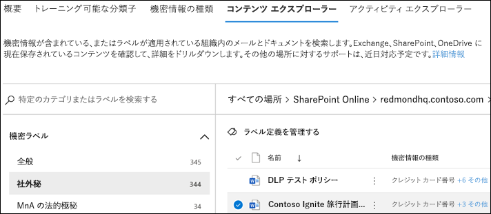

# コンテンツ エクスプローラーの使用を開始する (プレビュー)Get started with content explorer (preview)

データ分類コンテンツ エクスプローラーにより、概要ページで要約されたアイテムをネイティブに表示することができます。The data classification content explorer allows you to natively view the items that were summarized on the overview page.

## 前提条件Prerequisites

アクティビティ エクスプローラーにアクセスして使用するすべてのアカウントには、これらのいずれかのサブスクリプションのライセンスが割り当てられている必要があります。Every account that accesses and uses activity explorer must have a license assigned to it from one of these subscriptions:

- Microsoft 365 (E5)Microsoft 365 (E5)
- Office 365 (E5)Office 365 (E5)
- 高度なコンプライアンス (E5) アドオンAdvanced Compliance (E5) add-on
- 高度な脅威インテリジェンス (E5) アドオンAdvanced Threat Intelligence (E5) add-on

## コンテンツ エクスプローラーContent explorer

コンテンツ エクスプローラーは、機密ラベル、保持ラベルまたは組織で機密情報の種類として分類されているアイテムの現在のスナップショットです。Content explorer shows a current snapshot of the items that have a sensitivity label, a retention label or have been classified as a sensitive information type in your organization.

### 機密情報の種類Sensitive information types

[DLP ポリシー](data-loss-prevention-policies.md)は、**機密情報の種類**として定義されている機密情報を保護するのに役立ちます。A [DLP policy](data-loss-prevention-policies.md) can help protect sensitive information, which is defined as a **sensitive information type**. Microsoft 365 には、さまざまな地域にわたる[多くの一般的な機密情報の種類に対する定義](what-the-sensitive-information-types-look-for.md)が含まれていて、すぐに使用できる状態になっています。Microsoft 365 includes [definitions for many common sensitive information types](what-the-sensitive-information-types-look-for.md) across many different regions that are ready for you to use. たとえば、クレジットカード番号、銀行口座番号、国民識別番号、Windows Live ID サービス番号などです。For example, a credit card number, bank account numbers, national ID numbers, and Windows Live ID service numbers.

### 機密ラベルSensitivity labels

[機密ラベル](sensitivity-labels.md)は、組織に対するアイテムの価値を示すタグです。A [sensitivity label](sensitivity-labels.md) is simply a tag that indicates the value of the item to your organization. 手動で、または自動的に適用することができます。It can be applied manually, or automatically. 適用すると、ドキュメントに埋め込まれ、ドキュメントがどこへ移動されても機密ラベルは保持されます。Once applied it gets embedded in the document and will follow it everywhere it goes. 機密ラベルによって、必須のウォーターマークや暗号化など、さまざまな保護機能が有効化されます。A sensitivity label enables various protective behaviors, such as mandatory watermarking or encryption. エンド ポイントの保護を有効にすると、アイテムを組織の制御から離れさせないようにもできます。With end point protection enabled you can even prevent an item from leaving your organizational control.

SharePoint および OneDrive にあるファイルに対応するデータがデータ分類ページに表示されるようにするには、機密度ラベルを有効にする必要があります。Sensitivity labels must be enabled for files that are in SharePoint and OneDrive in order for the corresponding data to surface in the data classification page. 詳細については、「[SharePoint および OneDrive で Office ファイルの機密度ラベルを有効にする (パブリック プレビュー)](sensitivity-labels-sharepoint-onedrive-files.md)」を参照してください。For more information, see [Enable sensitivity labels for Office files in SharePoint and OneDrive (public preview)](sensitivity-labels-sharepoint-onedrive-files.md).

### 保持ラベルRetention labels

[保持ラベル](labels.md)を使用すると、ラベル付けされたアイテムの保持期間、およびアイテムを削除する前に行う手順を定義できます。A [retention label](labels.md) allows you to define how long a labeled item is kept and the steps to be taken prior to deleting it. 手動で、またはポリシーを使用して自動的に適用することができます。They are applied manually or automatically via policies. 組織が法的要件および規制要件を遵守するのに役立ちます。They can play a role in helping your organization stay in compliance with legal and regulatory requirements.

### アクセス許可Permissions

コンテンツ エクスプローラーにアクセス権を付与する役割は 2 つあります。There are two roles that grant access to content explorer:

- **コンテンツ エクスプローラーのリスト ビューアー**: この役割のグループのメンバーシップにより、ユーザーは各アイテムおよびその場所を確認することができます。**Content Explorer List viewer**: Membership in this role group allows you to see each item and its location. この役割グループには、`data classification list viewer` 役割が事前に割り当てられています。The `data classification list viewer` role has been pre-assigned to this role group.

- **コンテンツ エクスプローラーのコンテンツ ビューアー**: この役割のグループのメンバーシップにより、ユーザーはリスト内の各アイテムのコンテンツを表示することができます。**Content Explorer Content viewer**: Membership in this role group allows you to view the contents of each item in the list. この役割グループには、`data classification content viewer` 役割が事前に割り当てられています。The `data classification content viewer` role has been pre-assigned to this role group.

コンテンツ エクスプローラーにアクセスするために使用するアカウントには、1 つまたは両方の役割のグループがある必要があります。The account you use to access content explorer must be in one or both of the role groups. 独立した役割のグループがあり、累積ではありません。These are independent role groups and are not cumulative. たとえば、アイテムおよびそれらの場所のみ表示する機能をアカウントに付与する場合は、コンテンツ エクスプローラーのリスト ビューアーの権利を付与します。For example, if you want to grant an account the ability to view the items and their locations only, grant Content Explorer List viewer rights. その同じアカウントでリスト内のアイテムのコンテンツも表示できるようにするには、コンテンツ エクスプローラーのコンテンツ ビューアーの権利も付与します。If you want that same account to also be able to view the contents of the items in the list, grant Content Explorer Content viewer rights as well.

また、役割の一方または両方をカスタム役割グループに割り当てて、コンテンツ エクスプローラーへのアクセスをカスタマイズすることもできます。You can also assign either or both of the roles to a custom role group to tailor access to content explorer.

グローバル管理者、コンプライアンス管理者、またはデータ管理者は、必要な コンテンツ エクスプローラーのリスト ビューアー、および コンテンツ エクスプローラーのコンテンツ ビューアー の役割グループのメンバーシップを割り当てることができます。A Global admin, Compliance admin, or Data admin can assign the necessary Content Explorer List Viewer, and Content Explorer Content Viewer role group membership.

### コンテンツ エクスプローラーの使用方法How to use content explorer

1. **Microsoft 365 コンプライアンス センター**  > **[データ分類]** > **[コンテンツ エクスプローラー]** の順に開きます。Open **Microsoft 365 compliance center**  > **Data classification** > **Content explorer**.
2. ラベルの名前または機密情報の種類が分かる場合は、それを検索ボックスに入力することができます。If you know the name of the label, or the sensitive information type, you can type that into the search box.
3. 交互に、ラベルの種類を展開してリストからラベルを選択し、アイテムを参照することができます。以下にリストの保持ラベルの部分を示します。Alternately, you can browse for the item by expanding the label type and selecting the label from the list, an item from the retention label portion of the list is show below.
4. [**すべての場所**] の下で場所を選択して、アイテムのフォルダー構造をドリルダウンします。Select a location under **All locations** and drill down the folder structure to the item.
5. ダブルクリックして、コンテンツ エクスプローラーでネイティブにアイテムを開きます。Double-click to open the item natively in content explorer.

## 関連項目See also

- [機密ラベルSensitivity labels](sensitivity-labels.md)
- [保持ラベルRetention labels](labels.md)
- [機密情報の種類の検索基準What the sensitive information types look for](what-the-sensitive-information-types-look-for.md)
- [アイテム保持ポリシーの概要Overview of retention policies](retention-policies.md)
- [データ損失防止の概要Overview of data loss prevention](data-loss-prevention-policies.md)
