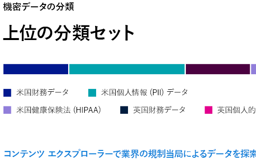
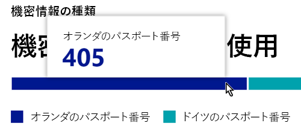
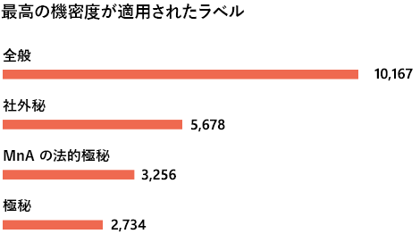
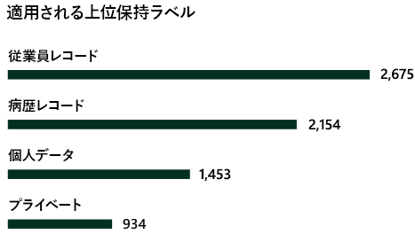

# データ分類の概要 (プレビュー)Data classification overview (preview)

Microsoft 365 の管理者またはコンプライアンス管理者は、組織内のコンテンツを評価してタグ付けすることにより、コンテンツの保存場所を制御し、保存場所に関わらずコンテンツを保護でき、また、組織のニーズに合わせてコンテンツを保持および削除できるようになります。As a Microsoft 365 administrator or compliance administrator, you can evaluate and then tag content in your organization in order to control where it goes, protect it no matter where it is and to ensure that it is preserved and deleted according your your organizations needs. これらは、[秘密ラベル](sensitivity-labels.md)、[保持ラベル](labels.md)、および機密情報の種類の分類を適用することにより行います。You do this through the application of [sensitivity labels](sensitivity-labels.md), [retention labels](labels.md), and sensitive information type classification. 検出、評価、タグ付けを行うにはさまざまな方法がありますが、最終的には、これらのラベルの一方または両方を使用してタグ付けおよび分類された大量のドキュメントとメールが生み出される可能性があります。There are various ways to do the discovery, evaluation and tagging, but the end result is that you may have very large numbers of documents and emails that are tagged and classified with one or both of these labels. 保持ラベルと機密ラベルを適用した後は、テナント全体でラベルがどのように使用されているか、これらのアイテムに対してどのような操作が行われているかを確認する必要があります。After you apply  your retention labels and sensitivity labels, you’ll want to see how the labels are being used across your tenant and what is being done with those items. こうした内容は、データ分類のページで確認できます。具体的には次の内容を確認できます。The data classification page provides visibility into that body of content, specifically:

- 機密情報の種類として分類されたアイテムの数およびこれらの分類の種類the number items that have been classified as a sensitive information type and what those classifications are
- Microsoft 365 および Azure Information Protection の両方で最も多く適用されている機密ラベルthe top applied sensitivity labels in both Microsoft 365 and Azure Information Protection
- 最も多く適用されている保持ラベルthe top applied retention labels
- 機密コンテンツに対してユーザーが行っているアクティビティの概要a summary of activities that users are taking on your sensitive content
- 機密データおよび保持されたデータの保存場所the locations of your sensitive and retained data

データ分類は、**Microsoft 365 コンプライアンス センター**または **Microsoft 365 セキュリティ センター**  >  [**分類**]  >  [**データ分類**] で確認できます。You can find data classification in the **Microsoft 365 compliance center** or **Microsoft 365 security center** > **Classification** > **Data Classification**.

## コンテンツで最も多く使用されている機密情報の種類Sensitive information types used most in your content

Microsoft 365 では、社会保障番号を含むアイテムやクレジットカード番号を含むアイテムなど、機密情報の種類の定義が多数提供されています。Microsoft 365 comes with many definitions of sensitive information types, such as an item containing a social security number or a credit card number. 機密情報の種類の詳細については、「[機密情報の種類の検索基準](what-the-sensitive-information-types-look-for.md)」を参照してください。For more information on sensitive information types, see [What the sensitive information types look for](what-the-sensitive-information-types-look-for.md).

機密情報の種類カードには、組織全体で検出されたラベル付けされている機密情報の種類のうち上位のものが示されます。The sensitive information type card shows the top sensitive information types that have been found and labeled across your organization.

特定の分類カテゴリに含まれるアイテムの数を確認するには、そのカテゴリのバーをポイントします。To find out how many items are in any given classification category, hover over the bar for the category.

> [!NOTE]
> "No data found with sensitive information" (機密情報が含まれるデータが見つかりませんでした) というメッセージがカードに表示される場合、If the card displays the message "No data found with sensitive information". 機密情報の種類として分類されているアイテムが組織に存在しないか、クロールされたアイテムが存在しないことを意味します。It means that there are no items in your organization that have been classified as being a sensitive information type or no items that have been crawled. ラベルの使用を開始するには、次を参照してください。To get started with labels, see:
>- [機密ラベルSensitivity labels](sensitivity-labels.md)
>- [保持ラベルRetention labels](labels.md)
>- [機密情報の種類の検索基準What the sensitive information types look for](what-the-sensitive-information-types-look-for.md)

## コンテンツに適用されている上位の機密ラベルTop sensitivity labels applied to content

Microsoft 365 または Azure Information Protection (AIP) のいずれかでアイテムに機密ラベルを適用すると、次の 2 つのことが起こります。When you apply a sensitivity label to an item either through Microsoft 365 or Azure Information Protection (AIP), two things happen:

- 組織にとってのアイテムの価値を示すタグがドキュメントに埋め込まれ、そのタグはドキュメントとともにどこにでも移動します。a tag that indicates the value of the item to your org is embedded in the document and will follow it everywhere it goes
- タグが含まれることで、必須のウォーターマークや暗号化など、さまざまな保護機能が有効化されます。the presence of the tag enables various protective behaviors, such as mandatory watermarking or encryption. エンド ポイントの保護を有効にすると、アイテムを組織の制御から離れさせないようにもできます。With end point protection enabled you can even prevent an item from leaving your organizational control.

機密ラベルの詳細については、「[Learn about sensitivity labels (機密ラベルの詳細)](sensitivity-labels.md)」を参照してください。For more information on sensitivity labels, see: [Learn about sensitivity labels](sensitivity-labels.md)

SharePoint および OneDrive にあるファイルに対応するデータがデータ分類ページに表示されるようにするには、機密度ラベルを有効にする必要があります。Sensitivity labels must be enabled for files that are in SharePoint and OneDrive in order for the corresponding data to surface in the data classification page. 詳細については、「[SharePoint および OneDrive で Office ファイルの機密度ラベルを有効にする (パブリック プレビュー)](sensitivity-labels-sharepoint-onedrive-files.md)」を参照してください。For more information, see [Enable sensitivity labels for Office files in SharePoint and OneDrive (public preview)](sensitivity-labels-sharepoint-onedrive-files.md).

機密ラベル カードには、機密レベルごとのアイテム (メールやドキュメント) の数が表示されます。The sensitivity label card shows the number of items (email or document) by sensitivity level.

> [!NOTE]
> 機密ラベルをまだ作成または発行していない場合、または、いずれのコンテンツにも機密ラベルが適用されていない場合、"No sensitivity labels detected" (機密ラベルが検出されませんでした) というメッセージがこのカードに表示されます。If you haven't created or published any sensitivity labels or no content has had a sensitivity label applied, this card will display the message "No sensitivity labels detected". ラベルの使用を開始するには、次を参照してください。To get started with labels, see:
>- 「[機密ラベル](sensitivity-labels.md)」または、AIPについては「[Azure Information Protection ポリシーを構成する](https://docs.microsoft.com/azure/information-protection/configure-policy)」[sensitivity labels](sensitivity-labels.md) or for AIP [Configure the Azure information protection policy](https://docs.microsoft.com/azure/information-protection/configure-policy)

## コンテンツに適用されている上位の保持ラベルTop retention labels applied to content

保持ラベルは、組織内のコンテンツの廃棄を管理するために使用されます。Retention labels are used to manage the disposition of content in your organization. 適用された保持ラベルは、ドキュメントが削除されるまでの期間、削除前に確認を必要とするかどうか、保持期間の有効期限、または削除できないよう記録としてマークするかどうかを制御できます。When applied, they can be used to control how long a document will be kept before deletion, whether it should be reviewed prior to deletion, when it's retention period expires, or whether it should be marked as a record which can never be deleted. 詳細については、「[保持ラベルの概要](labels.md)」を参照してください。For more information see, [Overview of retention labels](labels.md).

最も多く適用されている保持ラベルのカードには、特定の保持ラベルが付けられているアイテムの数が表示されます。The top applied retention labels card shows you how many items have a given retention label.

> [!NOTE]
> "No retention labels detected" (保持ラベルが検出されませんでした) というメッセージがカードに表示される場合、保持ラベルが作成または発行されていないか、いずれのコンテンツにも保持ラベルが適用されていないことを意味します。If this card displays the message, "No retention labels detected, it means you haven't created or published any retention  labels or no content has had a retention label applied. 保持ラベルの使用を開始するには、To get started with retention labels, see:
>- 「[保持ラベルの概要](labels.md)」を参照してください。[Overview of retention labels](labels.md)

## 検出された上位アクティビティTop activities detected

このカードでは、機密ラベルが付けられたアイテムに対してユーザーが行う最も一般的な操作の概要が示されます。This card provides a quick summary of the most common actions that users are taking on the sensitivity labeled items. [アクティビティ エクスプローラー](data-classification-activity-explorer.md)を使用すると、ラベル付きコンテンツおよび Windows 10 のエンドポイントにあるコンテンツでの、Microsoft 365 により追跡される 8 つの異なるアクティビティの詳細を確認できます。You can use the [Activity explorer](data-classification-activity-explorer.md) to drill deep down on eight different activities that Microsoft 365 tracks on labeled content and content that is located on Windows 10 endpoints.

> [!NOTE]
> "No activity detected" (アクティビティが検出されませんでした) というメッセージがこのカードに表示される場合、ファイルに対して行われたアクティビティがなかったか、ユーザーまたは管理者による監査が有効化されていないことを意味します。If this card displays the message, "No activity detected" it means that there's been no activity on the files or that user and admin auditing isn't turned on. 監査ログをオンにするには、次を参照してください。To turn the audit logs on , see:
>- [セキュリティ/コンプライアンス センターで監査ログを検索するSearch the audit log in security & compliance center](search-the-audit-log-in-security-and-compliance.md)

## 場所別の機密ラベルおよび保持ラベル付きデータSensitivity and retention labeled data by location

データ分類の報告の目的は、どのラベルが付いているアイテムがどこにいくつあるかを確認できるようにすることにあります。The point of the data classification reporting is to provide visibility into the number of items that have which label as well as their location. これらのカードでは、Exchange、SharePoint、OneDrive などにあるラベル付きのアイテムの数が表示されます。These cards let you know how many labeled items the are in Exchange, SharePoint, and OneDrive etc.

> [!NOTE]
> "No locations detected" (場所が検出されませんでした) というメッセージがこのカードに表示される場合、機密ラベルが作成または発行されていないか、いずれのコンテンツにも保持ラベルが適用されていないことを意味します。If this card displays the message, "No locations detected, it means you haven't created or published any sensitivity labels or no content has had a retention label applied. 機密ラベルの使用を開始するには、次を参照してください。To get started with sensitivity labels, see:
>- [機密ラベルSensitivity labels](sensitivity-labels.md)

## 関連項目See also

- [ラベル アクティビティを表示する (プレビュー)View label activity (preview)](data-classification-activity-explorer.md)
- [ラベル付きコンテンツの表示 (プレビュー)View labeled content (preview)](data-classification-content-explorer.md)
- [機密ラベルSensitivity labels](sensitivity-labels.md)
- [保持ラベルRetention labels](labels.md)
- [機密情報の種類の検索基準What the sensitive information types look for](what-the-sensitive-information-types-look-for.md)
- [アイテム保持ポリシーの概要Overview of retention policies](retention-policies.md)
