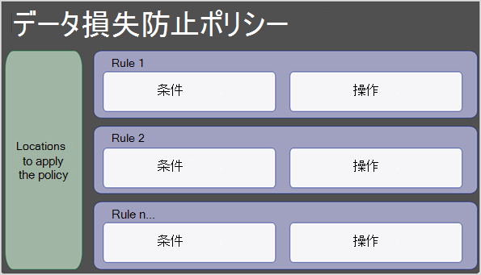
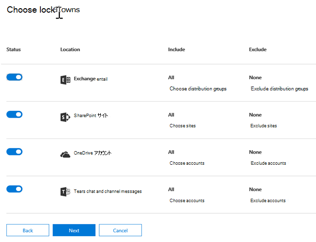
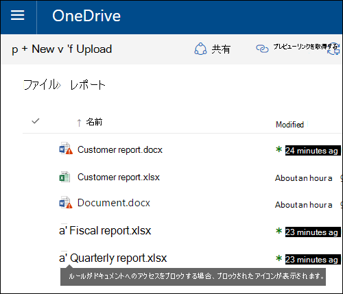

# データ損失防止の概要
<!-- this topic needs to be split into smaller, more coherent ones. It is confusing as it is. -->
<!-- move this note to a more appropriate place, no topic should start with a note -->
> [!NOTE]
> 最近、Office 365 Advanced Compliance のライセンスを取得しているユーザー向けに、データ損失防止機能が Microsoft Teams のチャットとチャネルのメッセージに追加されました。これはスタンドアロンのオプションとして提供されており、Office 365 E5 および Microsoft 365 E5 コンプライアンスに含まれています。 ライセンス要件の詳細については、「[Microsoft 365 テナントレベル サービスのライセンスに関するガイダンス](https://docs.microsoft.com/office365/servicedescriptions/microsoft-365-service-descriptions/microsoft-365-tenantlevel-services-licensing-guidance)」を参照してください。

ビジネスの標準や業界の規制に準拠するために、組織は機密情報を保護し、不注意による情報漏えいを防ぐ必要があります。 機密情報には、財務データや個人情報 (PII) (クレジット カード番号、社会保障番号、健康記録など) があります。 Office 365 セキュリティ &amp; コンプライアンス センターのデータ損失防止 (DLP) ポリシーでは、Office 365 全体の機密情報を識別、監視、または自動的に保護できます。
  
DLP ポリシーでは次のことが可能です。
  
- **Exchange Online、SharePoint Online、OneDrive for Business、Microsoft Teams などの複数の保管場所での機密情報の識別。**
    
    たとえば、OneDrive for Business サイトに保存されているクレジット カード番号を含む文書を特定したり、特定のユーザーの OneDrive サイトだけを監視したりできます。
    
- **機密情報が誤って共有されるのを保護。** 
    
    たとえば、組織外のユーザーと共有されている健康記録を含むドキュメントやメールを識別し、そのドキュメントへのアクセスやメールが送信されるのを自動的にブロックできます。
    
- **デスクトップ バージョンの Excel、PowerPoint、Word 内の機密情報の監視と保護。**
    
    Exchange Online、SharePoint Online、OneDrive for Business 同様、これらの Office デスクトップ プログラムにも機密情報を識別し、DLP ポリシーを適用する同じ機能が組み込まれています。 他のユーザーとこうした Office プログラムのコンテンツを共有すると、DLP によって継続的な監視が行われます。
    
- **ワークフローを中断することなく準拠を維持する方法についてのユーザーに対する説明。**
    
    DLP ポリシーについてユーザーを教育し、作業を妨げることなく準拠を維持できるようにします。 たとえば、ユーザーが機密情報を含むドキュメントを共有しようとした場合、DLP ポリシーは、メール通知をユーザーに送信すると共に、業務上の妥当性がある場合にはポリシーを無効にできるドキュメント ライブラリのコンテキストでポリシー ヒントを表示できます。 Outlook on the web、Outlook、Excel、PowerPoint、Word でも同じポリシー ヒントが表示されます。
    
- **組織の DLP ポリシーと一致するコンテンツを示す DLP レポートの表示。**
    
    DLP ポリシーへの組織の準拠状態を評価するには、各ポリシーやルールへの一致数の時間経過による変化を見ることができます。 DLP ポリシーでポリシー ヒントの上書きおよび誤検知の報告がユーザーに許可されている場合は、ユーザーが報告した内容を確認することもできます。
    
Office 365 セキュリティ &amp; コンプライアンス センターの [データ損失防止] ページで、 DLP ポリシーを作成して管理します。
  
![Office 365 セキュリティ &amp; コンプライアンス センターの [データ損失防止] ページ](../media/943fd01c-d7aa-43a9-846d-0561321a405e.png)
  
## DLP ポリシーの内容

DLP ポリシーにはいくつかの基本的な内容が含まれます。
  
- コンテンツを保護する場所: Exchange Online、SharePoint Online、OneDrive for Business のサイトの他、Microsoft Teams のチャットおよびチャネル メッセージなどの**保管場所**。 
    
- **ルール**を適用することによってコンテンツを保護する場合と方法は、次のもので構成されます。 
    
  - ルールを適用する前にコンテンツが一致する必要がある**条件**。 たとえば、ルールは組織外のユーザーと共有されている社会保障番号を含むコンテンツのみを探すよう構成されていることがあります。 
    
  - 条件に一致するコンテンツが見つかったときにルールが自動的に実行する**アクション**。 たとえば、ドキュメントへのアクセスをブロックし、ユーザーおよびコンプライアンス責任者の双方にメール通知を送信するようにルールが構成されていることがあります。 
    
ルールを使用して特定の保護要件を満たし、DLP ポリシーを使用して一般的な保護要件をグループ化できます (たとえば、特定の規制に準拠する必要のあるすべてのルール)。
  
たとえば、Health Insurance Portability and Accountability Act (HIPAA) の対象となる情報の存在を検出する際に役立つ DLP ポリシーがあるとします。 この DLP ポリシーは、HIPAA データ (対象) をすべての SharePoint Online サイトと OneDrive for Business サイト (場所) で保護するために、組織外の人物と共有するこの機密情報が含まれるドキュメント (条件) を検出し、そのドキュメントに対するアクセスをブロックして通知を送信 (アクション) できます。 これらの要件は、個別のルールとして保存され、簡単に管理およびレポートする DLP ポリシーとしてまとめてグループ化されます。
  

  
### 場所

DLP ポリシーは、Office 365 全体で機密情報を検出して保護できます。情報が Exchange Online、SharePoint Online、OneDrive for Business、Microsoft Teams のいずれかに保存されていてもかまいません。 Exchange メール、Microsoft Teams のチャットとチャネル メッセージ、およびすべての SharePoint または OneDrive ライブラリ内のコンテンツを保護するか、ポリシーの特定の場所を選択できます。
  

 Exchange に特定の配布グループを含めるように選択した場合、DLP ポリシーはそのグループのメンバーにのみ適用されます。 同様に、配布グループを除外すると、その配布グループのすべてのメンバーがポリシー評価から除外されます。 ポリシーを配布リストのメンバー、動的配布グループ、セキュリティ グループの範囲にすることができます。 DLP ポリシーには、このような追加および除外を 50 個まで含めることができます。

特定の SharePoint サイトまたは OneDrive アカウントを含めるか、除外するかを選択した場合、DLP ポリシーに含めることができるのは、100 を超えることはできません。 こうした制限はありますが、組織全体のポリシーまたは場所全体に適用されるポリシーを適用することで、この制限を超えることができます。
  
### ルール

ルールとは、組織のコンテンツにビジネス要件を適用するものです。 ポリシーには 1 つ以上のルールが含まれ、各ルールには、条件とアクションが含まれます。 ルールごとに、条件を満たすとアクションが自動的に実行されます。 ルールは、各ポリシー内の最も高位のルールから順に実行されます。
  
また、ルールには、コンテンツがルールに一致していることを (ポリシー ヒントとメール通知を持つ) ユーザーと (メール インシデント レポートを持つ) 管理者に通知するオプションも用意されています。
  
ここでは、ルールの構成要素をそれぞれ詳しく説明します。
  

  
#### 条件

条件は、探す情報の種類および操作をいつ実行するかを決定するため重要です。 たとえば、パスポート番号を含むコンテンツは、コンテンツに含まれる番号が 10 個より多く組織外のユーザーと共有されている場合以外は無視する、といった条件を作成できます。
  
条件は、探す機密情報の種類などの**コンテンツ**と、ドキュメントが共有されているユーザーなどの**コンテキスト**に注目します。 条件を使用して、さまざまな操作をリスクレベル別に割り当てることができます。 たとえば、組織内で共有されている機密コンテンツは、組織外のユーザーと共有されている機密コンテンツよりリスク レベルが低く、必要なアクションを少なくする、といったことができます。 
  

  
現在使用可能な条件では、以下のことを判定できます。
  
- コンテンツに機密情報が含まれている。
    
- コンテンツにラベルが含まれている。 詳細については、以下の「[DLP ポリシーでラベルを条件として使用する](#using-a-label-as-a-condition-in-a-dlp-policy)」セクションを参照してください。
    
- コンテンツが組織の内または外のユーザーと共有されている。

> [!NOTE]
> ホストの組織の Active Directory または Azure Active Directory のテナントにゲスト以外のアカウントを持っているユーザーは、組織内のユーザーと見なされます。
    
#### 機密情報の種類

DLP ポリシーは、**機密情報の種類**として定義されている機密情報を保護するのに役立ちます。 Office 365 には、クレジット カード番号、銀行口座番号、国内 ID 番号、パスポート番号など、さまざまな分野の一般的な機密情報の種類の定義が数多く含まれていて、すぐに使用できます。 
  

  
DLP ポリシーによってクレジット カード番号などの機密情報の種類を検索する場合、単に 16 桁の数字を検索するわけではありません。 機密情報のそれぞれの種類が定義され、以下の組み合わせを使用して検出されます。
  
- キーワード
    
- チェックサムや構成を検証するための内部関数
    
- パターンの一致を検出するための正規表現の評価
    
- その他のコンテンツの検査
    
これにより、DLP 検出処理において、作業の中断原因となる誤検知の数を減らし、正確性を高めることができます。
  
#### 操作

コンテンツがルールの条件と一致したら、操作を適用してコンテンツを自動的に保護できます。
  

  
現在は次のような操作を使用できます。
  
- **コンテンツへのアクセスを制限する** サイトのコンテンツの場合、これは、プライマリ サイト コレクション管理者、ドキュメントの所有者、ドキュメントを最後に変更したユーザーを除くすべてのユーザーについて、ドキュメントへのアクセス許可が制限されることを意味します。 これらのユーザーは、ドキュメントの機密情報の削除や、他の修正操作を実行できます。 ドキュメントがコンプライアンスを遵守した状態になった場合、元のアクセス許可が自動的に復元されます。 ドキュメントへのアクセスがブロックされているときは、サイトのライブラリでドキュメントに特別なポリシー ヒントのアイコンが表示されます。 
    
    
  
    メール コンテンツの場合は、この操作によりメッセージの送信がブロックされます。 DLP ルールの構成方法によっては、NDR または (ルールで通知が使用されている場合) ポリシー ヒントやメール通知が送信者に表示されます。
    
    
  
#### ユーザー通知とユーザーによる上書き

通知と上書きを使用して、DLP ポリシーについてユーザーを教育し、作業を妨げることなく準拠を維持できるようにします。 たとえば、ユーザーが機密情報を含むドキュメントを共有しようとした場合、DLP ポリシーは、メール通知をユーザーに送信すると共に、業務上の妥当性がある場合にはポリシーを無効にできるドキュメント ライブラリのコンテキストでポリシー ヒントを表示できます。
  

  
コンテンツを送信したユーザー、コンテンツを共有しているユーザー、または最後にコンテンツを変更したユーザーにメールで通知でき、サイト コンテンツについては、主要なサイト コレクション管理者とドキュメントの所有者に通知できます。 さらに、メール通知から選択したユーザーを追加または削除することができます。
  
メール通知の送信に加えて、ユーザー通知にはポリシー ヒントも表示されます。
  
- Outlook および Outlook on the web の場合。
    
- SharePoint Online または OneDrive for Business サイトにあるドキュメントの場合。
    
- DLP ポリシーに含まれるサイトにドキュメントが格納されている場合に、Excel、PowerPoint、Word。
    
メール通知およびポリシー ヒントでは、コンテンツが DLP ポリシーに違反している理由が説明されています。 洗濯した場合、ユーザーが誤検知を報告するか業務上の妥当性を示すことによってルールを上書きすることを、メール通知およびポリシー ヒントで許可できます。 これは、DLP ポリシーについてユーザーを教育し、ユーザーの仕事を妨げることなく DLP ポリシーを適用するのに役立ちます。 上書きおよび誤検知に関する情報は、レポート用に記録され (後の DLP レポートの詳細を参照)、インシデント レポート (次のセクションを参照) にも含まれるため、コンプライアンス責任者は定期的にこの情報を確認できます。
  
OneDrive for Business アカウントにおけるポリシー ヒントの表示内容を示します。
  

 DLP ポリシーのユーザー通知とポリシー ヒントの詳細については、「[通知とポリシー ヒントを使用する](use-notifications-and-policy-tips.md)」を参照してください。

#### インシデント レポート

ルールが一致する場合は、イベントの詳細を含むインシデント レポートをコンプライアンス担当者 (または選択したユーザー) に送信できます。 このレポートには、一致したアイテム、ルールに一致した実際のコンテンツ、コンテンツの最終変更者の名前が含まれます。 メール メッセージの場合、レポートには添付ファイルとして、DLP ポリシーに適合する元のメッセージも含まれます。
  

DLP は、SharePoint Online や OneDrive for Business のアイテムとは異なる方法でメールをスキャンします。 SharePoint Online や OneDrive for Business では、DLP は新しいアイテムだけでなく既存のアイテムもスキャンして、一致が検出される場合は常にインシデント レポートを生成します。 Exchange Online では、DLP は新しいメール メッセージのみをスキャンして、ポリシーとの一致が検出されるとレポートを生成します。 DLP は、メールボックスやアーカイブに保存されている既存のメール アイテムについては、スキャンや一致検出を***実行しません***。
  
## グループ化と論理演算子

多くの場合、DLP ポリシーには、米国の社会保障番号が含まれているすべてのコンテンツを特定することなど、単純な要件が含まれています。 ただし、DLP ポリシーによって、より大まかに定義されたデータを特定する必要が生じる場合があります。
  
たとえば、米国の健康保険法 (HIPAA) の適用対象のコンテンツを特定するには、次を検索する必要があります。
  
- 特定の種類の機密情報 (社会保障番号や麻薬取締局 (DEA) 番号など) を含んでいるコンテンツ。
    
    AND
    
- 特定がより難しいコンテンツ (患者の治療に関する通信記録や提供された医療サービスの説明など)。 コンテンツを特定するには、国際疾病分類 (ICD-9-CM または ICD-10-CM) などの膨大なキーワード リストからキーワードを一致させる必要があります。
    
このような大まかに定義されたデータを簡単に特定するには、グループ化と論理演算子 (AND、OR) を使用できます。 DLP ポリシーを作成するときに、次のことができます。
  
- 機密情報の種類をグループ化する。
    
- グループ内の機密情報の種類の間、およびグループ自体の間で使用する論理演算子を選択する。
    
### グループ内の演算子を選択する

グループ内では、コンテンツがルールに一致するためにそのグループが満たす必要のある条件が、そのグループ内のいずれかの条件なのか、すべての条件なのかを選択できます。
  

  
### グループを追加する

独自の条件とグループ内で演算子を持つことができるグループをすばやく追加できます。
  
![[グループの追加] ボタン](../media/5f72f292-d1f3-4f11-a911-a9f71e10abf6.png)
  
### グループ間の演算子を選択する

グループ間では、コンテンツがルールに一致するためにそのグループが満たす必要のある条件が、1 つのグループの条件のみなのか、すべてのグループの条件なのかを選択できます。
  
たとえば、**米国 HIPAA** の組み込みポリシーには、次を含むコンテンツを特定するために、グループ間で **AND** 演算子を使用するルールがあります。 
  
- **PII 識別子** グループ (少なくとも 1 つの SSN 番号**または** DEA 番号) 
    
    **AND**
    
- **医学用語**グループ (少なくとも 1 つの ICD-9-CM キーワード**または** ICD-10-CM キーワード) 
    

  
## 処理するルールの優先度

ポリシーでルールを作成すると、作成した順の優先度が各ルールに割り当てられます。つまり、最初に作成したルールの優先度が最も高くなり、2 番目に作成したルールの優先度は 2 番目になります。 
  

  
DLP ポリシーを 1 つ以上設定したら、1 つまたは複数のポリシーの優先順位を変更できます。 変更を行うには、ポリシーを選択し、**[ポリシーの編集]** を選び、**[優先度]** の一覧で優先度を指定します。

コンテンツがルールに対して評価されると、ルールは優先度順に処理されます。 コンテンツが複数のルールに一致する場合、ルールは優先度順に処理され、最も制限が厳しい操作が適用されます。 たとえば、コンテンツが以下のすべてのルールに一致する場合、最も優先度が高く、制限が厳しいルール 3 が適用されます。
  
- ルール 1: ユーザーに通知のみを行う
    
- ルール 2: ユーザーに通知する、アクセスを制限する、ユーザーによる上書きを許可する
    
- ルール 3: ユーザーに通知する、アクセスを制限する、ユーザーによる上書きを許可しない
    
- ルール 4: ユーザーに通知のみを行う
    
- ルール 5: アクセスを制限する
    
- ルール 6: ユーザーに通知する、アクセスを制限する、ユーザーによる上書きを許可しない
    
この例では、最も制限が厳しいルールのみが適用された場合でも、すべてのルールに一致するものは監査ログに記録され、DLP レポートに表示されます。
  
ポリシー ヒントについては、次の点に注意してください。
  
- 最も優先度が高く、制限が厳しいルールのポリシー ヒントのみが表示されます。 たとえば、単に通知を送信するルールのポリシー ヒントよりも、コンテンツへのアクセスを禁止するルールのポリシー ヒントの方が優先して表示されます。 これにより、ポリシー ヒントがカスケード表示されるのを防止します。
    
- 	最も制限の厳しいルールでユーザーにルールを上書きすることを許可している場合は、このルールを上書きすることで、コンテンツに一致した他のルールもすべて上書きされます。
    
## 一致の難易度を上下するためにルールを調整する

DLP ポリシーを作成して有効にすると、次の問題が発生する可能性があります。
  
- 機密情報**ではない**大量のコンテンツがルールと一致します。つまり、多数の誤検知が発生します。 
    
- 機密情報**である**コンテンツが小さすぎると、ルールと一致します。 言い換えると、保護操作は機密情報に対して実行されません。 
    
このような問題に対処するには、インスタンス数と一致精度を変更してコンテンツがルールに一致する難易度を上下させて、ルールを調整します。 ルールに使用される各機密情報の種類には、インスタンス数と一致精度の両方があります。
  
### インスタンス数

インスタンス数とは、コンテンツがルールに一致すると評価される各機密情報の種類の出現回数です。 たとえば、1 から 9 の固有の米国または英国の間のコンテンツは、次のルールに一致します。 パスポート番号が識別されます。
  
インスタンス数では、機密情報の種類とキーワードの**一意**の一致のみがカウントされます。 たとえば、メールの中に同じクレジット カード番号が 10 回出現する場合、その 10 回の出現は、クレジット カード番号の 1 つのインスタンスとしてカウントされます。 
  
インスタンス数を使用してルールを調整する方法は簡単です。
  
- ルールに一致させやすくするには、[**最小**] 数を減らし、[**最大**] 数を増やします。 また、[**最大**] の数値を削除して [**すべて**] に設定することもできます。 
    
- ルールに一致させにくくするには、[**最小**] 数を増やします。 
    
通常、ユーザー通知の送信など、制限の緩い操作は、少ないインスタンス数 (たとえば 1 から 9) のルールで使用します。 また、ユーザーによる上書きを許可せずにコンテンツへのアクセスを制限するなど制限の厳しい操作は、高いインスタンス数 (たとえば 10 からすべて) のルールで使用します。
  

  
### 一致精度

前述のように、機密情報の種類の定義と検出には、さまざまな種類の証拠を組み合わせて使用します。 一般的に、機密情報の種類はそのような複数の組み合わせ (パターンと呼ばれます) で定義されます。 必要な証拠が少ないパターンは一致精度 (信頼度) が低く、必要な証拠が多いパターンは一致精度 (信頼度) が高くなります。 各機密情報の種類に使用される実際のパターンと信頼度の詳細については、「[機密情報の種類で検索される情報](what-the-sensitive-information-types-look-for.md)」を参照してください。
  
たとえば、クレジット カード番号という機密情報の種類は次の 2 つのパターンで定義されます。
  
- 必要な信頼度が 65% のパターン:
    
  - クレジット カード番号の形式の番号。
    
  - チェックサムに合格する番号。
    
- 必要な信頼度が 85% のパターン:
    
  - クレジット カード番号の形式の番号。
    
  - チェックサムに合格する番号。
    
  - 適切な形式のキーワードまたは有効期限。
    
ルールにはこれらの信頼度 (または一致精度) を使用できます。 通常、ユーザー通知の送信など、制限の緩いアクションは、低い一致精度のルールで使用します。 また、ユーザーによる上書きを許可せずにコンテンツへのアクセスを制限するなど制限の厳しい操作は、高い一致制度のルールで使用します。
  
クレジット カード番号など、内容に含まれる各機密情報の種類が識別された場合、1 つの信頼度のみが返されることを理解する必要があります。
  
- すべての一致が 1 つのパターンの場合、そのパターンの信頼度が返されます。
    
- 複数のパターンについて一致がある場合 (つまり、2 つの信頼度の一致がある場合)、他のパターンよりも高い信頼度のみが返されます。 この点には注意する必要があります。 たとえばクレジット カードの場合、65% のパターンと 85% のパターンの両方に一致する場合、証拠が多いほど信頼度が高くなるので、その機密情報の種類について返される信頼度は 90% を超えます。
    
そのため、クレジット カードについて相互排他的な 2 つのルールを作成し、65% の一致精度のルールと 85% の一致精度のルールである場合、一致精度の範囲は次のようになります。 最初のルールでは、65% のパターンの一致のみが選択されます。 2 つ目のルールでは、**少なくとも 1 つの** 85% のパターンの一致が選択され、他の低い信頼度の一致が**選択される可能性**があります。 
  

  
以上の理由から、一致精度が異なる複数のルールを作成する方法について説明します。
  
- 通常、最も低い信頼度では、[**最小**] と [**最大**] に (範囲ではなく) 同じ値を使用します。 
    
- 通常、最も高い信頼度は、下位の信頼度のすぐ上の値から 100 の範囲です。
    
- 通常、範囲の信頼度を設定する場合、下位の信頼度のすぐ上の値から、上位の信頼度のすぐ下の値までの範囲にします。
    
## DLP ポリシーでラベルを条件として使用する

ラベルを作成すると、次のことを実行できます。
<!-- what kind of label? -->
  
- エンド ユーザーがラベルを確認したりコンテンツに手動で適用したりできるように、ラベルを**発行**します。 
    
- 選択した条件に一致するコンテンツにラベルを**自動適用**します。 
    
保持ラベルの詳細については、「[保持ラベルの概要](labels.md)」を参照してください。
  
ラベルを作成した後は、DLP ポリシーでそのラベルを条件として使用できます。 

たとえば、次のような場合があります。
  
- **社外秘**というラベルを発行して、組織内のユーザーが社外秘のメールとドキュメントにラベルを手動で適用できるようにした。 DLP ポリシーでこのラベルを条件として使用して、**社外秘**というラベルが付いたコンテンツを組織外のユーザーと共有できないように制限できます。 
    
- **Alpine House** というラベルをその名前のプロジェクト用に作成して、キーワード "Alpine House" を含むコンテンツにそのラベルを自動的に適用した。 DLP ポリシーでこのラベルを条件として使用して、エンド ユーザーが組織外のユーザーとこのコンテンツを共有しようとしたときにポリシーのヒントを表示できます。 
    
- **納税記録**というラベルを発行して、納税記録に分類する必要があるコンテンツに納税記録管理者がそのラベルを手動で適用できるようにした。 DLP ポリシーでこのラベルを条件として使用して、ITIN や SSN といった他の種類の機密性の高い情報と共にこのラベルの付いたコンテンツを検索したり、**納税記録**というラベルが付いたコンテンツに保護アクションを適用したり、DLP レポートと監査ログ データから DLP ポリシーに関する詳細なアクティビティ レポートを取得したりできます。 
    
- **役員リーダー - 機密**というラベルを役員グループの Exchange メールボックスと OneDrive アカウントに発行した。 DLP ポリシーでこのラベルを条件として使用して、コンテンツとユーザーの同じサブセットに保持操作と保護操作の両方を適用できます。 
    
DLP ルールでラベルを条件として使用して、特定のコンテンツ、場所、ユーザーに保護操作を適用できます。 

> [!NOTE]
> 保持ラベルを DLP ポリシーの条件として指定し、Exchange および/または Teams を場所として含めると、次のエラーが表示されます。「メールおよびチーム メッセージのラベル付きコンテンツの保護はサポートされていません。 下のラベルを削除するか、Exchange と Teams の場所指定をオフにしてください。」 これは、Exchange トランスポートがメッセージの送信や配信中にラベルのメタデータを評価しないためです。 

### 機密ラベルのサポートを受ける

現在は、[機密ラベル](sensitivity-labels.md)でなく、保持ラベルのみを条件として使用できます。 現在、この条件において機密ラベルの使用をサポートしています。
  
### この機能と他の機能の関係

機密情報を含むコンテンツには複数の機能を適用できます。
  
- [保持ラベル](labels.md#applying-a-retention-label-automatically-based-on-conditions)と[保持ポリシー](retention-policies.md)は、このコンテンツに**保持**操作を適用できます。 
    
- DLP ポリシーは、このコンテンツに**保護**操作を適用できます。 ただし、これらの操作を適用する前に、DLP ポリシーにはラベルを含むコンテンツ以外にも一致する他の条件が必要です。 
    

  
DLP ポリシーには、機密情報に適用されるラベルや保持ポリシーよりも機能性の高い検出機能があることに注意してください。 DLP ポリシーは、機密情報を含むコンテンツに保護アクションを適用できます。コンテンツから機密情報を削除すると、次回コンテンツがスキャンされたときにそれらの保護操作は取り消されます。 ただし、機密情報を含むコンテンツに保持ポリシーまたはラベルが適用されている場合は、機密情報が削除された場合でも取り消されない 1 回限りの操作になります。
  
DLP ポリシーでラベルを条件として使用すると、そのラベルのコンテンツに保持操作と保護操作の両方を適用できます。 ラベルを含むコンテンツは機密情報を含むコンテンツとまったく同じように考えることができます。ラベルと機密情報の種類は両方とも、コンテンツの分類に使用されるプロパティです。このため、そのコンテンツに操作を適用できます。
  

  
## 簡易設定と詳細設定

DLP ポリシーを作成するときは、次の簡易設定または詳細設定のどちらかを選択します。
  
- **簡易設定**: ルール エディターを使ってルールを作成または変更することなく、最も一般的な種類の DLP ポリシーを簡単に作成できます。 
    
- **詳細設定**: ルール エディターを使って DLP ポリシーのすべての設定を完全に制御できます。 
    
見た目ではわかりませんが、条件とアクションで構成されるルールを適用することで、簡易設定と詳細設定はまったく同じように機能するのでご安心ください。簡易設定を使用する場合のみ、ルール エディターが表示されません。 これにより、DLP ポリシーを簡単に作成できます。
  
### 簡易設定

最も一般的な DLP のシナリオでは、ポリシーを作成して機密情報を含むコンテンツが組織外のユーザーと共有されるのを防ぎ、コンテンツにアクセス可能なユーザーを制限するなどの自動修復アクションを実行し、エンドユーザーや管理者に通知を送信し、後の調査のためにイベントを監査しています。 ユーザーは、不注意による機密情報の漏洩を防ぐために DLP を使用します。
  
この目標を容易に達成するために、DLP ポリシーの作成時に [**簡易設定を使用**] を選択することができます。 簡易設定では、ルール エディターに移動することなく、最も一般的な DLP ポリシーを実装するのに必要なすべてのものが提供されます。
  

  
### 詳細設定

よりカスタマイズされた DLP ポリシーを作成する必要がある場合は、[**詳細設定を使用**] を選択できます。
  
詳細設定では、ルール エディターが表示され、そこで各ルールのインスタンス数や一致精度 (信頼度) を含む、利用可能なオプションすべてを完全に制御できます。
  
セクションにすばやく移動するには、ルール エディターの上部のナビゲーションの項目をクリックして、下のセクションに移動します。
  

  
## DLP ポリシー テンプレート

DLP ポリシーの作成における最初のステップは、保護する情報を選択することです。 DLP テンプレートを使用すると、新しい一連のルールを初めから作成し、既定で含める必要がある情報の種類を判別するという労力を省くことができます。 その後、そうした要件を追加したり変更したりして、組織の特定の要件を満たすようにルールを調整できます。
  
構成済みの DLP ポリシー テンプレートを使用すると、HIPAA データ、PCI DSS データ、グラム リーチ ブライリー法データ、またはロケール固有の個人情報 (P.I.) などの機密情報の特定の種類を検出するのに役立ちます。 一般的な種類の機密情報を簡単に検出して保護できるように、Office 365 に含まれるポリシー テンプレートには、使用開始時に必要な最も一般的な機密情報の種類が既に含まれています。
  

  
組織には固有の要件がある場合もあるため、その場合は、[**カスタム ポリシー**] オプションを選択して、最初から DLP ポリシーを作成できます。 カスタム ポリシーは空であり、既定のルールは含まれていません。 
  
## DLP ポリシーをテスト モードで段階的にロールアウトする

DLP ポリシーを作成するときは、完全に適用する前に、影響を評価し、有効性をテストしながら、段階的に展開することを検討する必要があります。 たとえば、ユーザーが業務を行うのに必要な大量のドキュメントへのアクセスを、新しい DLP ポリシーにより意図せずブロックされることがあります。
  
大きな影響を与える可能性が高い DLP ポリシーを作成している場合は、次の順序に従うことをお勧めします。
  
1. **ポリシー ヒントなしのテスト モードで開始**し、DLP レポートとインシデント レポートを使用して、影響を評価します。 DLP レポートを使用すると、ポリシー一致の回数、場所、種類、および重要度を把握できます。 その結果に基づいて、必要に応じてルールを細かく調整できます。 テスト モードでは、DLP ポリシーは組織で業務に取り組んでいるユーザーの生産性に影響を与えることはありません。 
    
2. **通知とポリシー ヒントを利用するテスト モードに移行**して、コンプライアンス ポリシーについてユーザーを教育し、適用されるルールに対して準備できるようにします。この段階で、ルールをさらに精緻化できるように、ユーザーに誤検知を報告するよう依頼することもできます。 
    
3. **ポリシーの完全な適用を開始**し、ルールのアクションが適用され、コンテンツが保護されるようにします。 DLP レポートやインシデント レポート、通知を引き続き監視して、結果が計画どおりであることを確認します。 
    

  
いつでも DLP ポリシーを無効にできます。ポリシーのすべてのルールに反映されます。 ただし、ルール エディターで状態を切り替えることで、各ルールを個別に無効にできます。
  

ポリシー内の複数のルールの優先順位を変更することもできます。 変更するには、編集のためのポリシーを開きます。 ルールの行では、省略記号 (**...**) を選択し、[**下へ移動**] または [**最後へ移動**] などのオプションを選択します。

  
## DLP レポート

DLP ポリシーを作成して有効にしたら、意図したとおりに動作し、コンプライアンスの遵守に役立っていることを確認します。 DLP レポートを使用すると、DLP ポリシーとルールの一致の数の時間経過による変化や、誤検知と無効化の回数を、すぐに見ることができます。 レポートごとに、場所や期間でこれらの一致をフィルター処理したり、さらには特定のポリシー、ルール、アクションで絞り込んだりできます。
  
DLP レポートを利用すると、ビジネスに関する洞察を得ると共に、以下のことが可能です。
  
- 特定の期間に絞り込み、スパイクや傾向の理由を理解します。
    
- 組織のコンプライアンス ポリシーに違反するビジネス プロセスを検出します。
    
- DLP ポリシーのビジネスに及ぼす影響を理解します。
    
さらに、DLP レポートを使用すると、DLP ポリシーの実行時にそれらのポリシーを調整できます。
  

  
## DLP ポリシーのしくみ

DLP は、(単純なテキスト スキャンだけでなく) 詳細なコンテンツ分析を使用して、機密情報を検出します。この詳細なコンテンツ分析は、キーワード一致、辞書一致、正規表現の評価、内部関数などの方式を使用して、DLP ポリシーに一致するコンテンツを検出します。使用しているデータのうち、ごくわずかな割合のデータのみが機密性が高いと見なされる可能性があります。DLP ポリシーは、他のコンテンツを使用した作業を妨害したり影響を与えたりすることなく、対象データのみを識別、監視し、自動的に保護できます。
  
### ポリシーの同期

セキュリティ &amp; コンプライアンス センターで DLP ポリシーを作成すると、集中管理ポリシー ストアに格納され、以下を含む各種コンテンツ ソースと同期されます。
  
- Exchange Online、そこから Outlook on the web、Outlook
    
- OneDrive for Business サイト
    
- SharePoint Online サイト
    
- Office デスクトップ プログラム (Excel、PowerPoint、Word)

- Microsoft Teams チャネルおよびチャット メッセージ
    
ポリシーが適切な場所に同期されると、コンテンツの評価とアクションの適用が開始されます。
<!-- what is the time delay for first deployment of a policy and what is the sync schedule? -->
  
### OneDrive for Business サイトと SharePoint Online サイトのポリシー評価

すべての SharePoint Online サイトと OneDrive for Business サイトで、ドキュメントは常に変化し、作成、編集、共有などが継続的に行われています。 つまり、ドキュメントはいつでも競合したり、DLP ポリシーに準拠するようになる可能性があります。 たとえば、あるユーザーがチーム サイトに機密情報を含まないドキュメントをアップロードし、後で別のユーザーが同じドキュメントを編集して機密情報を追加する、といったことが発生します。
  
このため、DLP ポリシーはバックグラウンドで頻繁にポリシーとの一致がドキュメントにあるかどうかを調べています。 これは非同期的なポリシーの評価と考えることができます。
<!-- what is the frequency? looks like it is tied to the search crawl schedule -->
  
#### メカニズム
 
ユーザーがサイトにドキュメントを追加したりドキュメントを変更したりすると、検索エンジンによってコンテンツがスキャンされるため、ユーザーが後で検索できるようになります。 これと併せて、コンテンツは機密情報に関してスキャンされ、共有されているかどうかが確認されます。 見つかった機密情報は、コンプライアンス チームだけがアクセスでき、一般ユーザーはアクセスできないように、検索インデックスに安全に保存されます。 有効にした DLP ポリシーはそれぞれバックグラウンドで (非同期に) 実行されるため、ポリシーと一致するコンテンツが頻繁に検索され、不注意によって漏えいされないようにアクションが適用されます。
  

  
<!-- conflict with a DLP policy is bad wording --> 最後に、ドキュメントが DLP ポリシーに矛盾し、その後 DLP ポリシーに準拠するようになることがあります。たとえば、ユーザーがドキュメントにクレジット カード番号を追加する場合、DLP ポリシーによってドキュメントへのアクセスが自動的にブロックされる可能性があります。しかしユーザーが後で機密情報を削除すると、次にドキュメントが対象ポリシーに対して再び評価されるときに、アクション (この例ではブロック) が自動的に取り消されます。
  
DLP は、インデックスを作成できるすべてのコンテンツを評価します。 既定でクロールされるファイルの種類の詳細については、「[SharePoint Server での既定のクロール対象ファイルのファイル名拡張子および解析対象ファイルの種類](https://docs.microsoft.com/SharePoint/technical-reference/default-crawled-file-name-extensions-and-parsed-file-types)」を参照してください。
  
### Exchange Online、Outlook、Outlook on the web でのポリシーの評価

Exchange online を場所として含む DLP ポリシーを作成すると、このポリシーは Office 365 セキュリティ &amp; コンプライアンス センターから Exchange Online に同期され、その後、Exchange Online から Outlook on the web と Outlook に同期されます。
  
メッセージが Outlook で作成される場合、作成中のコンテンツは DLP ポリシーに対して評価されるため、ユーザーはポリシー ヒントを確認できます。 さらに、メッセージは、送信された後、通常のメール フローの一部として DLP ポリシーに対して評価されるほか、Exchange 管理センターで作成された (トランスポート ルールとしても知られる) Exchange メール フロー ルールや DLP ポリシーに対しても評価されます。 DLP ポリシーは、メッセージと添付ファイルの両方をスキャンします。
  
### Office デスクトップ プログラムにおけるポリシー評価

<!-- same capability to identify sensitive information line conflates sensitive information types and such -->
Excel、PowerPoint、Word には、機密情報を識別して DLP ポリシーを適用するための、SharePoint Online と OneDrive for Business と同じ機能が含まれています。 これらの Office プログラムは、集中管理ポリシー ストアから直接 DLP ポリシーを同期し、DLP ポリシーに含まれるサイトから開かれたドキュメントをユーザーが扱うときに、DLP ポリシーに対してコンテンツを継続的に評価します。
  
Office における DLP ポリシーの評価は、プログラムのパフォーマンス、またはコンテンツを扱っているユーザーの生産性に影響を与えることがないように設計されています。 大規模なドキュメントを扱う場合、またはユーザーのコンピューターがビジー状態にある場合、ポリシー ヒントが表示されるまでに数秒かかることがあります。

### Microsoft Teams でのポリシーの評価
 <!--what do you mean that it's synched to user accounts?  I thought DLP policies were applied to locations not users like sensitivity labels are  -->

Microsoft teams を場所として含む DLP ポリシーを作成すると、Office 365 セキュリティ &amp; コンプライアンス センターからユーザー アカウントと Microsoft Teams のチャネルおよびチャット メッセージにポリシーが同期されます。 DLP ポリシーの構成方法によっては、ユーザーが Microsoft Teams のチャットやチャネル メッセージで機密情報を共有しようとしたときに、そのメッセージをブロックまたは取り消すことができます。 また、機密情報が含まれていて、ゲスト (外部ユーザー) と共有されているドキュメントは、このユーザー対しては開きません。 詳細については、「[データ損失防止と Microsoft Teams](dlp-microsoft-teams.md)」を参照してください。
 
## アクセス許可

DLP ポリシーを作成するコンプライアンス チームのメンバーは、セキュリティ &amp; コンプライアンス センターへのアクセス許可を持っている必要があります。 既定では、テナント管理者はこの場所へのアクセス許可を持ち、コンプライアンス責任者や他のユーザーに対し、テナント管理者のすべてのアクセス許可を付与せずに、セキュリティ &amp; コンプライアンス センターへのアクセスを許可できます。これを行うには、次の操作を行うことをお勧めします。
  
1. Office 365 でグループを作成して、コンプライアンス責任者をグループに追加します。
    
2. セキュリティ &amp; コンプライアンス センターの [**アクセス許可**] ページで役割グループを作成します。 
    
3. Office 365 のグループを役割グループに追加します。
    
詳細については、「[Give users access to the Office 365 Security & Compliance Center (Office 365 セキュリティ/コンプライアンス センターへのアクセス権をユーザーに付与する)](../security/office-365-security/grant-access-to-the-security-and-compliance-center.md)」を参照してください。
  
これらのアクセス許可は、DLP ポリシーを作成して適用するためにのみ必要です。 ポリシーの適用には、コンテンツへのアクセスは不要です。
  
## DLP コマンドレットを検索する

セキュリティ &amp; コンプライアンス センターのほとんどのコマンドレットを使用するには、次のようにする必要があります。
  
1. [リモート PowerShell を使用して Office 365 セキュリティ &amp; コンプライアンス センターに接続する](https://docs.microsoft.com/powershell/exchange/office-365-scc/connect-to-scc-powershell/connect-to-scc-powershell?view=exchange-ps)
    
2. これらの[ポリシーおよびコンプライアンスの dlp コマンドレット](https://docs.microsoft.com/powershell/module/exchange/policy-and-compliance-dlp/export-dlppolicycollection?view=exchange-ps)のいずれかを使用する
    
ただし、DLP レポートは、Exchange Online を含む Office 365 全体からデータを取り込む必要があります。 このため、**DLP レポート用のコマンドレットは、セキュリティ &amp; コンプライアンス センター Powershell ではなく Exchange Online Powershell で使用できます**。 したがって、DLP レポートのコマンドレットを使用するには、次の操作を行う必要があります。
  
1. [リモート PowerShell で Exchange Online に接続する](https://docs.microsoft.com/powershell/exchange/exchange-online/connect-to-exchange-online-powershell/connect-to-exchange-online-powershell?view=exchange-ps)
    
2. DLP レポート用のいずれかのコマンドレットを使用します。
    
  - [Get-DlpDetectionsReport](https://docs.microsoft.com/powershell/module/exchange/policy-and-compliance-dlp/Get-DlpDetectionsReport?view=exchange-ps)
    
  - [Get-DlpDetailReport](https://docs.microsoft.com/powershell/module/exchange/policy-and-compliance-dlp/Get-DlpDetailReport?view=exchange-ps)
    
## 詳細情報

- [テンプレートからの DLP ポリシーの作成](create-a-dlp-policy-from-a-template.md)
    
- [通知を送信して、DLP ポリシーのポリシーのヒントを表示する](use-notifications-and-policy-tips.md)
    
- [FCI または他のプロパティを含むドキュメントを保護するために DLP ポリシーを作成する](protect-documents-that-have-fci-or-other-properties.md)
    
- [DLP ポリシー テンプレートに含まれるもの](what-the-dlp-policy-templates-include.md)
    
- [機密情報の種類で検索される情報](what-the-sensitive-information-types-look-for.md)
    
- [DLP 関数の検索対象](what-the-dlp-functions-look-for.md)
    
- [カスタムの機密情報の種類を作成する](create-a-custom-sensitive-information-type.md)
    

