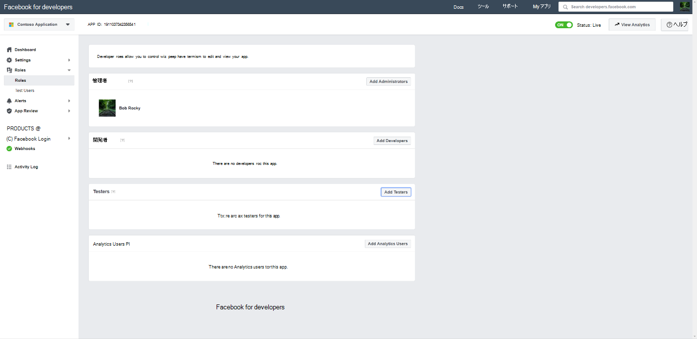
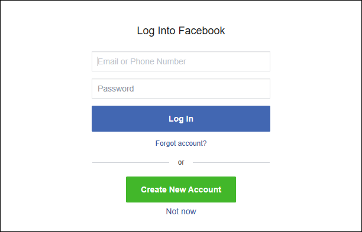

# コネクタを展開して Facebook ビジネスページデータをアーカイブする

この記事では、Office 365 インポートサービスを使用して、Facebook のビジネスページから Microsoft 365 にデータをインポートするコネクタを展開するための段階的なプロセスについて説明します。 このプロセスの概要と、Facebook コネクタを展開するために必要な前提条件の一覧については、「 [facebook データをアーカイブするためのコネクタの設定](archive-facebook-data-with-sample-connector.md)」を参照してください。

## 手順 1: Azure Active Directory でアプリを作成する

1. に移動 <https://portal.azure.com> し、グローバル管理者アカウントの資格情報を使用してサインインします。

    

2. 左側のナビゲーションウィンドウで、[ **Azure Active Directory**] をクリックします。

    ![[Azure Active Directory] をクリックします。](../media/FBCimage2.png)

3. 左側のナビゲーションウィンドウで、[**アプリの登録 (プレビュー)** ] をクリックし、[**新しい登録**] をクリックします。

    ![[* * アプリの登録 (プレビュー)] をクリックし、[* * 新しい登録] * * をクリックします。](../media/FBCimage3.png)

4. アプリケーションを登録します。 [リダイレクト URI] で、[アプリケーションの種類] ドロップダウンリストから [Web] を選択し、 <https://portal.azure.com> URI のボックスに入力します。

   

5. **アプリケーション (クライアント) id**と**ディレクトリ (テナント) id**をコピーし、それをテキストファイルまたは他の安全な場所に保存します。 これらの Id は、後の手順で使用します。

   

6. [証明書] に移動して **、新しいアプリのシークレット & します。**

   

7. [**新しいクライアントシークレット**] をクリックします。

   ![[新しいクライアントシークレット] をクリックします。](../media/FBCimage7.png)

8. 新しいシークレットを作成します。 [説明] ボックスに、シークレットを入力し、有効期限を選択します。

    

9. シークレットの値をコピーして、テキストファイルまたは他の保存場所に保存します。 これは、後の手順で使用する AAD アプリケーションシークレットです。

   

## 手順 2: GitHub から Azure アカウントにコネクタ web サービスを展開する

1. [この GitHub サイト](https://github.com/microsoft/m365-sample-connector-csharp-aspnet)に移動し、[ **Azure への展開] を**クリックします。

    ![[Azure への展開] をクリックします。](../media/FBCGithubApp.png)

2. [ **Azure への展開**] をクリックすると、カスタムテンプレートページを使用して azure portal にリダイレクトされます。 [**基本**と**設定**] の詳細を入力し、[**購入**] をクリックします。

   - **サブスクリプション:** Facebook Business pages connector web サービスを展開する Azure サブスクリプションを選択します。

   - **リソースグループ:** 新しいリソースグループを選択または作成します。 リソースグループは、Azure ソリューションの関連リソースを保持するコンテナーです。

   - **場所:** 場所を選択します。

   - **Web アプリ名:** コネクタ web アプリの一意の名前を指定します。 名前の長さは 3 ~ 18 文字でなければなりません。 この名前は、Azure app service の URL を作成するために使用されます。たとえば、 **fbconnector**の Web アプリ名を指定すると、Azure app SERVICE の URL は**fbconnector.azurewebsites.net**になります。

   - **tenantId:** 手順1で Azure Active Directory に Facebook connector アプリを作成した後にコピーした、Microsoft 365 組織のテナント ID。

   - **APISecretKey:** 任意の値をシークレットとして入力できます。 これは、手順5でコネクタ web アプリにアクセスするために使用されます。

     ![[リソースを作成し、ストレージアカウントを入力してください] をクリックします。](../media/FBCimage12.png)

3. 展開に成功すると、ページは次のスクリーンショットのようになります。

   ![[記憶域] をクリックし、[ストレージアカウント] をクリックします。](../media/FBCimage13.png)

## 手順 3: Facebook アプリを登録する

1. に移動し <https://developers.facebook.com> て、組織の Facebook ビジネスページのアカウントの資格情報を使用してログインし、[**新しいアプリの追加**] をクリックします。

   ![[Facebook ビジネス用の新しいアプリの追加] ページ](../media/FBCimage25.png)

2. 新しいアプリ ID を作成します。

   

3. 左側のナビゲーションウィンドウで、[**製品の追加**] をクリックし、 **Facebook ログイン**タイルで [**設定**] をクリックします。

   ![[製品の追加] をクリックします。](../media/FBCimage27.png)

4. [Facebook ログインの統合] ページで、[ **Web**] をクリックします。

   ![[Facebook ログインの統合] ページで、[Web] をクリックします。](../media/FBCimage28.png)

5. Azure app service の URL を追加します。例を示し `https://fbconnector.azurewebsites.net` ます。

   

6. Facebook ログインセットアップのクイックスタートセクションを完了します。

   

7. [ **Facebook ログイン**] の左側のナビゲーションウィンドウで、[**設定**] をクリックし、[**有効な oauth リダイレクト**URI] ボックスに oauth リダイレクト uri を追加します。 ** \<connectorserviceuri> /Views/FacebookOAuth**の形式を使用します。ここで、[コネクタ] の値は、組織の Azure APP service の URL です。たとえば、のように `https://fbconnector.azurewebsites.net` なります。

   ![OAuth リダイレクト URI を [有効な OAuth リダイレクト uri] ボックスに追加する](../media/FBCimage31.png)

8. 左側のナビゲーションウィンドウで、[**製品の追加**] をクリックし、[webhooks] をクリックし**ます。** **ページ**のプルダウンメニューで、[**ページ**] をクリックします。

   ![[製品の追加] をクリックし、[* * Webhooks] をクリックします。](../media/FBCimage32.png)

9. Webhooks コールバック URL を追加し、検証トークンを追加します。 コールバック URL の形式。 ** <connectorserviceuri> /Api/fbpagewebhook**の形式を使用します。ここで、[コネクタ] の値は、組織の AZURE app service URL です。たとえば、「」のように `https://fbconnector.azurewebsites.net` なります。

   Verify トークンは、強力なパスワードと類似している必要があります。 検証トークンをテキストファイルまたは他の保存場所にコピーします。

   

10. フィードのエンドポイントをテストし、サブスクライブします。

    

11. プライバシー URL、アプリアイコン、およびビジネス用途を追加します。 また、アプリケーション ID とアプリシークレットをテキストファイルまたは他の保存場所にコピーします。

    

12. アプリを公開します。

    

13. 管理者またはテスト担当者の役割にユーザーを追加します。

    

14. ページの**パブリックコンテンツのアクセス**許可を追加します。

    

15. [ページの管理] アクセス許可を追加します。

    

16. Facebook によって確認されたアプリケーションを取得します。

    

## 手順 4: コネクタ web アプリを構成する

1. に移動 `https://<AzureAppResourceName>.azurewebsites.net` します (ここで、AzureAppResourceName は、手順4で名前を付けた Azure app リソースの名前です)。 たとえば、名前が**fbconnector**の場合は、に移動 `https://fbconnector.azurewebsites.net` します。 アプリのホームページは、次のスクリーンショットのようになります。

   

2. [**構成**] をクリックして、サインインページを表示します。

   ![[構成] をクリックしてサインインページを表示する](../media/FBCimage42.png)

3. [テナント Id] ボックスに、テナント Id を入力するか貼り付けます (手順2で取得したもの)。 [パスワード] ボックスに、APISecretKey (手順2で取得した) を入力するか貼り付け、[**構成設定の設定**] をクリックして構成の詳細ページを表示します。

    ![テナント Id とパスワードを使用してサインインし、[構成の詳細] ページに移動します。](../media/FBCimage43.png)

4. 次の構成設定を入力します。

   - **Facebook アプリケーション ID:** 手順3で取得した Facebook アプリケーションのアプリ ID。

   - **Facebook アプリケーションシークレット:** 手順3で取得した Facebook アプリケーションのアプリシークレット。

   - **Facebook webhook がトークンを確認します。** 手順3で作成した検証トークン。

   - **AAD アプリケーション ID:** 手順1で作成した Azure Active Directory アプリのアプリケーション ID。

   - **AAD アプリケーションシークレット:** 手順1で作成した APISecretKey シークレットの値。

5. [**保存**] をクリックしてコネクタの設定を保存します。

## 手順 5: Microsoft 365 コンプライアンスセンターで Facebook コネクタを設定する

1. に移動し [https://compliance.microsoft.com](https://compliance.microsoft.com) 、左側のナビゲーションで [**データコネクタ**] をクリックします。

2. [**データコネクタ] (プレビュー)** ページの [ **Facebook ビジネスページ**] で、[**表示**] をクリックします。

3. [ **Facebook のビジネスページ**] ページで、[**コネクタの追加**] をクリックします。

4. [**サービス利用規約**] ページで、[**同意**する] をクリックします。

5. [**コネクタアプリの資格情報の追加**] ページで、次の情報を入力し、[**接続の検証**] をクリックします。

   

   - [**名前**] ボックスに、 **Facebook news ページ**などのコネクタの名前を入力します。

   - [**接続 URL** ] ボックスに、Azure app SERVICE の url を入力するか貼り付けます。例を示し `https://fbconnector.azurewebsites.net` ます。

   - [**パスワード**] ボックスに、手順2で追加した APISecretKey の値を入力するか貼り付けます。

   - [ **Azure APP id** ] ボックスに、手順1で作成した AAD application id とも呼ばれるアプリケーション (クライアント) id の値を入力するか貼り付けます。

6. 接続が正常に検証されたら、[**次へ**] をクリックします。

7. [ **Microsoft 365 にデータをインポートするための承認**] ページで、APISecretKey をもう一度入力するか貼り付けて、[ **Login web app**] をクリックします。

8. [ **Facebook connector アプリの構成**] ページで、[ **facebook でログイン**] をクリックし、組織の facebook ビジネスページのアカウントの資格情報を使用してログインします。 ログインに使用した Facebook アカウントに、組織の Facebook ビジネスページの管理者の役割が割り当てられていることを確認してください。

   

9. ログインした Facebook アカウントによって管理されるビジネスページの一覧が表示されます。 アーカイブするページを選択し、[**次へ**] をクリックします。

   

10. [**続行**] をクリックして、connector service アプリのセットアップを終了します。

11. [**フィルターの設定**] ページでは、特定の年齢のアイテムを最初にインポートするためのフィルターを適用できます。 年齢を選択し、[**次へ**] をクリックします。

12. [**ストレージの場所の選択**] ページで、Facebook アイテムがインポートされる Microsoft 365 メールボックスの電子メールアドレスを入力し、[**次へ**] をクリックします。

13. [**管理者に同意**する] で、[**同意を提供**する] をクリックし、手順に従います。 組織内のデータにアクセスするために Office 365 Import service への同意を提供するには、グローバル管理者である必要があります。

14. [**次**へ] をクリックしてコネクタの設定を確認し、[**完了**] をクリックしてコネクタのセットアップを完了します。

15. コンプライアンスセンターで**データコネクタ**ページに移動し、[**コネクタ**] タブをクリックしてインポートプロセスの進行状況を表示します。
