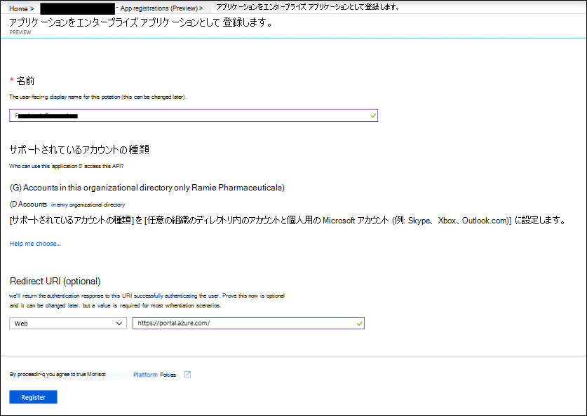
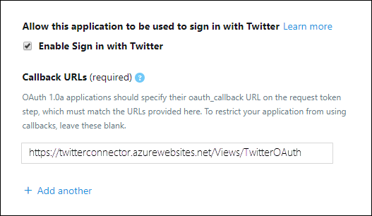

# コネクタをアーカイブ Twitter データに展開する

この記事では、Office 365 インポートサービスを使用して組織の Twitter アカウントから Microsoft 365 にデータをインポートするコネクタを展開するための段階的なプロセスについて説明します。 このプロセスの概要と、Twitter コネクタを展開するために必要な前提条件の一覧については、「 [Set up a connector to Archive Twitter data ](archive-twitter-data-with-sample-connector.md)」を参照してください。 

## 手順 1: Azure Active Directory でアプリを作成する

1. に移動 <https://portal.azure.com> し、グローバル管理者アカウントの資格情報を使用してサインインします。

   

2. 左側のナビゲーションウィンドウで、[ **Azure Active Directory**] をクリックします。

   

3. 左側のナビゲーションウィンドウで、[ **アプリの登録 (プレビュー)** ] をクリックし、[ **新しい登録**] をクリックします。

   

4. アプリケーションを登録します。 [ **リダイレクト URI (オプション)**] で、[アプリケーションの種類] ドロップダウンリストから [ **Web** ] を選択し、 `https://portal.azure.com` URI のボックスに入力します。

   

5. **アプリケーション (クライアント) id**と**ディレクトリ (テナント) id**をコピーし、それをテキストファイルまたは他の安全な場所に保存します。 これらの Id は、後の手順で使用します。

    

6. [ **証明書 & 新しいアプリのシークレット** ] および [ **クライアントシークレット** ] の下で、[ **新しいクライアントシークレット**] をクリックします。

   

7. 新しいシークレットを作成します。 [説明] ボックスに、シークレットを入力し、有効期限を選択します。 

   ![シークレットを入力して、[有効期限の期間] を選択する](../media/TCimage08.png)

8. シークレットの値をコピーして、テキストファイルまたは他の保存場所に保存します。 これは、後の手順で使用する AAD アプリケーションシークレットです。

   

## 手順 2: GitHub から Azure アカウントにコネクタ web サービスを展開する

1. [この GitHub サイト](https://github.com/microsoft/m365-sample-twitter-connector-csharp-aspnet)に移動し、[ **Azure への展開] を**クリックします。

    

2. [ **Azure への展開**] をクリックすると、カスタムテンプレートページを使用して azure portal にリダイレクトされます。 [ **基本** と **設定** ] の詳細を入力し、[ **購入**] をクリックします。

   ![[リソースを作成し、ストレージアカウントを入力してください] をクリックします。](../media/FBCimage12.png)

    - **サブスクリプション:** Twitter connector web サービスを展開する Azure サブスクリプションを選択します。
    
    - **リソースグループ:** 新しいリソースグループを選択または作成します。 リソースグループは、Azure ソリューションの関連リソースを保持するコンテナーです。

    - **場所:** 場所を選択します。

    - **Web アプリ名:** コネクタ web アプリの一意の名前を指定します。 名前の長さは 3 ~ 18 文字でなければなりません。 この名前は、Azure app service の URL を作成するために使用されます。たとえば、 **twitterconnector** の Web アプリ名を指定すると、Azure app SERVICE の URL は **twitterconnector.azurewebsites.net**になります。
    
    - **tenantId:** 手順1で Azure Active Directory に Facebook connector アプリを作成した後にコピーした、Microsoft 365 組織のテナント ID。
    
   - **APISecretKey:** 任意の値をシークレットとして入力できます。 これは、手順5でコネクタ web アプリにアクセスするために使用されます。

3. 展開に成功すると、ページは次のスクリーンショットのようになります。

    ![[記憶域] をクリックし、[ストレージアカウント] をクリックします。](../media/FBCimage13.png)

## 手順 3: Twitter アプリを作成する

1. に移動し https://developer.twitter.com て、組織の開発者アカウントの資格情報を使用してログインし、[ **アプリ**] をクリックします。

   
2. [ **アプリの作成**] をクリックします。
   
   

3. [ **アプリの詳細**] で、アプリケーションに関する情報を追加します。

   

4. Twitter 開発者ダッシュボードで、作成したばかりのアプリを選択し、[ **詳細**] をクリックします。
   
   

5. [ **キーとトークン** ] タブの [ **コンシューマー api キー** ] で、api キーと api シークレットキーの両方をコピーし、テキストファイルまたはその他の保存場所に保存します。 次に、[ **作成** ] をクリックしてアクセストークンとアクセストークンシークレットを生成し、それをテキストファイルまたは他の保存場所にコピーします。
   
   

   次に、[ **作成** ] をクリックしてアクセストークンとアクセストークンシークレットを生成し、それをテキストファイルまたは他の保存場所にコピーします。

6. [ **アクセス許可** ] タブをクリックし、次のスクリーンショットに示されているようにアクセス許可を構成します。

   

7. アクセス許可の設定を保存した後、[ **アプリの詳細** ] タブをクリックし、[編集] をクリックして [ **詳細の編集 >** します。

   

8. 次のタスクを実行します。

   - チェックボックスをオンにして、コネクタアプリが Twitter にサインインできるようにします。
   
   - 次の形式を使用して OAuth リダイレクト Uri を追加します: ** \<connectorserviceuri> /Views/TwitterOAuth**。ここで、*コネクタ*の値は、組織の Azure app service URL です。たとえば、のように https://twitterconnector.azurewebsites.net/Views/TwitterOAuth なります。

    

Twitter 開発者アプリを使用する準備ができました。

## 手順 4: コネクタ web アプリを構成する 

1. Https://に移動 \<AzureAppResourceName> します (ここで、 **AzureAppResourceName** は、手順4で名前を付けた Azure app リソースの名前です)。 たとえば、名前が **twitterconnector**の場合は、に移動 https://twitterconnector.azurewebsites.net します。 アプリのホームページは、次のスクリーンショットのようになります。

   

2. [ **構成** ] をクリックして、サインインページを表示します。

   ![[構成] をクリックしてサインインページを表示する](../media/FBCimage42.png)

3. [テナント Id] ボックスに、テナント Id を入力するか貼り付けます (手順2で取得したもの)。 [パスワード] ボックスに、APISecretKey (手順2で取得した) を入力するか貼り付け、[ **構成設定の設定** ] をクリックして構成の詳細ページを表示します。

   

4. 次の構成設定を入力します。 

   - **Twitter Api キー:** 手順3で作成した Twitter アプリケーションの API キー。
   
   - **Twitter Api の秘密キー:** 手順3で作成した Twitter アプリケーションの API シークレットキー。
   
   - **Twitter アクセストークン:** 手順3で作成したアクセストークン。
   
   - **Twitter アクセストークンシークレット:** 手順3で作成したアクセストークンシークレット。
   
   - **AAD アプリケーション ID:** 手順1で作成した Azure Active Directory アプリのアプリケーション ID
   
   - **AAD アプリケーションシークレット:** 手順1で作成した APISecretKey シークレットの値。

5. [ **保存** ] をクリックしてコネクタの設定を保存します。

## 手順 5: Microsoft 365 コンプライアンスセンターで Twitter connector をセットアップする

1. に移動し [https://compliance.microsoft.com](https://compliance.microsoft.com) 、左側のナビゲーションで [ **データコネクタ** ] をクリックします。

2. [ **データコネクタ** ] ページの [ **Twitter**] で、[ **表示**] をクリックします。

3. **Twitter**ページで、[**コネクタの追加**] をクリックします。

4. [ **サービス利用規約** ] ページで、[ **同意**する] をクリックします。

5. [ **コネクタアプリの資格情報の追加** ] ページで、次の情報を入力し、[ **接続の検証**] をクリックします。

   

    - [ **名前** ] ボックスに、 **Twitter ヘルプハンドル**などのコネクタの名前を入力します。
    
    - [ **コネクタの url** ] ボックスに、Azure app SERVICE の url を入力するか貼り付けます。例を示し `https://twitterconnector.azurewebsites.net` ます。
    
    - [ **パスワード** ] ボックスに、手順2で作成した APISecretKey の値を入力するか貼り付けます。
    
    - [ **Azure APP id** ] ボックスに、手順1で取得した Azure アプリケーションアプリ id ( *クライアント ID*とも呼ばれる) の値を入力するか貼り付けます。

6. 接続が正常に検証されたら、[ **次へ**] をクリックします。

7. [ **Microsoft 365 にデータをインポートするための承認** ] ページで、APISecretKey をもう一度入力するか貼り付けて、[  **Login web app**] をクリックします。

8. [ **Twitter でログイン] を**クリックします。

9. [Twitter サインイン] ページで、組織の Twitter アカウントの資格情報を使用してサインインします。

   

   サインインした後、Twitter ページに次のメッセージが表示されます。 "Twitter Connector ジョブは正常にセットアップされました。"

10. [ **続行** ] をクリックして、Twitter connector の設定を完了します。

11. [ **フィルターの設定** ] ページでは、特定の年齢のアイテムを最初にインポートするためのフィルターを適用できます。 年齢を選択し、[ **次へ**] をクリックします。

12. [ **ストレージの場所の選択** ] ページで、Twitter アイテムがインポートされる Microsoft 365 メールボックスの電子メールアドレスを入力し、[ **次へ**] をクリックします。

13. [ **管理者に同意**する] で、[ **同意を提供** する] をクリックし、手順に従います。 組織内のデータにアクセスするために Office 365 Import service への同意を提供するには、グローバル管理者である必要があります。

14. [ **次** へ] をクリックしてコネクタの設定を確認し、[ **完了** ] をクリックしてコネクタのセットアップを完了します。

15. コンプライアンスセンターで **データコネクタ** ページに移動し、[ **コネクタ** ] タブをクリックしてインポートプロセスの進行状況を表示します。
