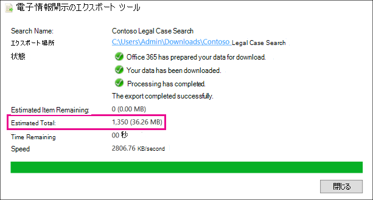

# 予測電子情報開示の検索結果の相違点

このトピックは、次のいずれかの Microsoft eDiscovery ツールを使用して実行できる検索に適用されます。 

- セキュリティ & コンプライアンスセンターでのコンテンツ検索     
- Exchange 管理センター (EAC) のインプレース電子情報開示     
- SharePoint Online の電子情報開示センター    
   
電子情報開示検索を実行すると、使用しているツールは、検索条件を満たすアイテム数 (およびその合計サイズ) の推定値を返します。 たとえば、セキュリティ & コンプライアンスセンターで検索を実行すると、予想される検索結果が、選択した検索の詳細ウィンドウに表示されます。
  

  
これは、結果をローカルコンピューターにエクスポートし、検索結果と共にダウンロードされたエクスポート概要レポートで、電子情報開示エクスポートツールで表示されるアイテムの合計サイズと同じ推定数です。
  
**電子情報開示エクスポートツールの予想結果**

  
**エクスポート概要レポートの予想結果**

  
ただし、エクスポート概要レポートの前のスクリーンショットでわかるように、ダウンロードされる実際の検索結果のサイズと数は、推定される検索結果のサイズと数とは異なります。
  

  
これらの違いのいくつかの理由を次に示します。
  
- **結果の予測方法を示し**ます。 検索結果の推定値は、検索クエリの条件を満たすアイテムの推定値 (実際の数ではありません) です。 Exchange アイテムの推定値をコンパイルするために、検索条件を満たすメッセージ Id のリストが、使用している電子情報開示ツールによって Exchange データベースから要求されます。 しかし、検索結果をエクスポートすると、検索が再実行され、実際のメッセージが Exchange データベースから取得されます。 そのため、アイテムの推定数と実際の数が決定されるため、これらの違いが生じる可能性があります。

- **検索結果の推定およびエクスポート時に発生する変更**。 検索結果をエクスポートすると、検索条件を満たす検索インデックス内の最新のアイテムを収集するために検索が再起動されます。 予想される検索結果が収集されてから、検索結果がエクスポートされてから、検索条件を満たす追加アイテムが作成、送信、または受信された可能性があります。 検索結果がエクスポートされる前にコンテンツの場所から削除されていたために、検索結果が予想されたときに検索インデックスに含まれていたアイテムが存在しなくなった可能性もあります。 この問題を軽減する方法の1つは、電子情報開示検索の日付範囲を指定することです。 もう1つの方法は、アイテムが保持され、削除できないように、コンテンツの場所を保持することです。 

   まれに、ホールドが適用されている場合でも、(ユーザーが編集できないが多くの検索結果が含まれている) 組み込みの予定表アイテムのメンテナンスが行われないことがあります。 予定表アイテムを定期的に削除すると、エクスポートされるアイテムの数が少なくなります。

- **インデックスを持たないアイテム**。 検索用にインデックスが生成されないアイテムは、推定結果と実際の検索結果との間で異なる場合があります。 たとえば、Exchange のインプレース電子情報開示、および SharePoint の電子情報開示センターでは、検索を実行して検索結果を見積もるときに、インデックスが作成されていないアイテム (検索条件を満たしていない) は含まれません。 ただし、検索結果をエクスポートする場合は、インデックスのないアイテムを含めることができます。 検索結果をエクスポートするときにインデックスのないアイテムを含めると、エクスポートされるアイテムの数が多くなることがあります。 これにより、推定およびエクスポートされた検索結果が異なります。

    セキュリティ & コンプライアンスセンターでコンテンツ検索ツールを使用する場合は、検索の推定にインデックスのないアイテムを含めるオプションがあります。 検索によって返されるインデックス付けされていないアイテムの数は、その他の予測される検索結果と共に詳細ウィンドウに表示されます。 インデックスが設定されていないアイテムは、推定検索結果の合計サイズにも含まれます。 検索結果をエクスポートする場合は、インデックスのないアイテムを含めるか非表示にするかを選択できます。 これらのオプションをどのように構成するかによって、予想される結果と実際の検索結果との間で相違が生じることがあります。

- **すべてのコンテンツの場所を含むコンテンツ検索の結果をエクスポート**します。 結果のエクスポート元の検索で、組織内のすべてのコンテンツの場所を検索した場合、検索条件に一致するアイテムが含まれているコンテンツの場所からのインデックスのないアイテムのみがエクスポートされます。 In other words, if no search results are found in a mailbox or site, then any unindexed items in that mailbox or site won't be exported. ただし、すべてのコンテンツの場所 (検索クエリに一致するアイテムが含まれていないものも含む) のインデックスが設定されていないアイテムは、推定検索結果に含まれます。

    または、エクスポートした検索結果に特定のコンテンツの場所が含まれている場合、検索で指定されたすべてのコンテンツの場所からインデックスが設定されていないアイテム (検索条件によって除外されていない) はエクスポートされます。 この場合、インデックスが設定されていないアイテムの推定数とエクスポートされるインデックスのないアイテムの数は同じである必要があります。

    インデックスのないアイテムを組織内のすべての場所からエクスポートしない理由は、エクスポートエラーが発生する可能性が高くなり、検索結果のエクスポートとダウンロードにかかる時間が長くなる可能性があるためです。

- **Raw ファイル形式とエクスポートファイル形式の比較**。 Exchange アイテムの場合、検索結果の推定サイズは、Exchange の生のメッセージサイズを使用して計算されます。 ただし、電子メールメッセージは PST ファイルまたは個別のメッセージ (EML ファイルとして書式設定されている) でエクスポートされます。 どちらのエクスポートオプションも、raw Exchange メッセージとは異なるファイル形式を使用します。エクスポートされるファイルサイズの合計は、推定ファイルサイズとは異なります。

- **ドキュメントのバージョン**。 SharePoint ドキュメントの場合、予想される検索結果に複数のバージョンのドキュメントは含まれていません。 ただし、検索結果をエクスポートするときに、すべてのドキュメントのバージョンを含めるオプションがあります。これにより、エクスポートされたドキュメントの実際の数 (および合計サイズ) が増加します。 

- **重複除外**。 Exchange アイテムの場合、重複除外はエクスポートされるアイテムの数を減らします。 エクスポートするときに、検索結果を重複除外するオプションがあります。 Exchange メッセージでは、メッセージが複数のメールボックス内に存在する場合でも、メッセージの1つのインスタンスのみがエクスポートされることを意味します。 予想される検索結果には、メッセージのすべてのインスタンスが含まれます。 そのため、検索結果をエクスポートするときに重複除外オプションを選択すると、エクスポートされるアイテムの実際の数が、アイテムの推定数よりかなり少ない場合があります。

    重複除外オプションを選択すると、すべての Exchange アイテムが1つの PST ファイルにエクスポートされ、移行元メールボックスからのフォルダー構造は保持されないため、別のことに注意してください。 エクスポートされた PST ファイルには、電子メールアイテムのみが含まれています。 ただし、検索結果レポートには、メッセージが置かれているソースメールボックスを識別する、エクスポートされた各メッセージのエントリが含まれています。 これにより、重複するメッセージを含むすべてのメールボックスを識別できます。 重複除外を有効にしない場合は、検索に含まれる各メールボックスの別の PST ファイルがエクスポートされます。 

## SharePoint Online の電子情報開示センターからインデックスのないアイテムをエクスポートする

SharePoint Online の電子情報開示センターでは、電子情報開示検索の結果をエクスポートするときに、インデックスが設定されていないコンテンツ (Exchange と SharePoint の場合) を含めるオプションがあります。 これを行うには、[**暗号化されたアイテムを含む] または [認識できない形式**] オプションを選択します。 インデックスが設定されていないアイテム (SharePoint では、SharePoint では、「」とも呼ばれません) は、何らかの理由で検索用にインデックスが作成されなかった Exchange や SharePoint のアイテム インデックスが作成されていない Exchange アイテムは、検索結果をエクスポートするときに含まれる**Exchange インデックスエラー**レポートに一覧表示されます。 同様に、インデックスが作成されていない SharePoint アイテムは、 **Sharepoint インデックスエラー**レポートに表示されます。 インデックスが作成されていないアイテムをエクスポートすると、そのアイテムは、" **Rawrawラベル**" という名前のフォルダーにダウンロードされます。 インデックスのない Exchange アイテムは PST ファイルに含まれます。各インデックスのないドキュメントは、SharePoint からもダウンロードされます。 インデックス付けされていないアイテムの数 (存在する場合) は、各インデックスエラーレポートに一覧表示されます。 レポート内のインデックスが作成されていないアイテムの数は、ダウンロードされるインデックスのないアイテムの数と一致する必要があります。
  
 **エクスポートされたインデックスのないアイテムの数がインデックスエラー報告のアイテム数と一致しない場合、いくつかの理由がありますか?** 前述したように、検索結果が実行された時刻と検索結果がエクスポートされた時刻の間に、Microsoft 365 からアイテムが削除されている可能性があります。 インデックスを持たないアイテムにも同様の不一致が発生することがあります。 たとえば、検索結果がエクスポートされると、検索インデックスが期限切れになることがあります。 これは、検索結果のエクスポート時にアイテムにインデックスが作成されなかったために、検索結果と共にエクスポートされたインデックスのないアイテムがインデックスエラーレポートに表示されない可能性があることを意味します。 これにより、インデックスエラーレポートに一覧表示されているよりも多くのインデックスのないアイテムがエクスポートされることになります。 同様に、インデックスエラーレポートに示されているインデックスのないアイテムは、検索インデックスが更新される前に Microsoft 365 から削除されている可能性があります。 これにより、エクスポートされたインデックスのないアイテムの数が、インデックスエラーレポートに表示されている数より少なくなります。
  
> [!NOTE]
> 検索結果をエクスポートするとき、またはレポートをダウンロードするときに、**暗号化されているアイテムまたは認識され**ていない形式のオプションを選択しないと、インデックスエラーレポートがダウンロードされますが、エントリは含まれません。 インデックスエラーが発生していないことを意味します。 これは、インデックスを持たないアイテムがエクスポートに含まれていないことを意味します。 
