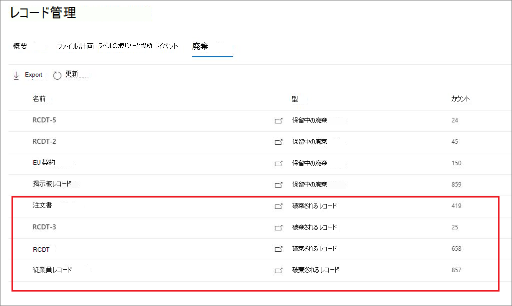

# コンテンツの廃棄

>*[セキュリティとコンプライアンスのための Microsoft 365 ライセンス ガイダンス](https://aka.ms/ComplianceSD)。*

Microsoft 365 コンプライアンスセンターの**レコード管理**の [**廃棄**] タブを使用して、廃棄レビューを管理し、保持期間の最後に自動的に削除された[レコード](records-management.md#records)を表示します。 

## コンテンツの廃棄を表示するための前提条件

廃棄レビューを管理し、レコードが削除されたことを確認するには、十分な権限と監査を有効にする必要があります。

### 廃棄のアクセス許可

Microsoft 365 コンプライアンスセンターの [ **廃棄** ] タブに正常にアクセスするには、ユーザーは **ディスポジション管理の管理** 者ロールを持っている必要があります。 この役割は、既定の管理役割グループ、 **コンプライアンス管理** 者、および **コンプライアンスデータ管理者**に含まれています。

このような廃棄管理役割をユーザーに付与するには、これらの既定の役割グループの1つに追加するか、またはカスタムの役割グループを作成します (たとえば、「廃棄レビュー担当者」という名前を付けます)。  

> [!NOTE]
> グローバル管理者であっても、 **廃棄管理** 役割を付与する必要があります。 

手順については、「[ユーザーに Office 365 セキュリティ/センター コンプライアンス センターへのアクセスを許可する](../security/office-365-security/grant-access-to-the-security-and-compliance-center.md)」を参照してください。

### 監査を有効にする

最初の廃棄アクションの1日以上前に監査が有効になっていることを確認します。 詳細については、「 [Office 365 セキュリティ &amp; コンプライアンスセンターでの監査ログの検索](search-the-audit-log-in-security-and-compliance.md)」を参照してください。 

## 廃棄確認

コンテンツが保存期間の最後に達すると、いくつかの理由から、そのコンテンツを確認して、安全に削除できるかどうかを判断する必要があります (「廃棄済み」)。 たとえば、次のことを行う必要があります。
  
- 訴訟または監査の際に、関連するコンテンツの削除を中断します。
    
- コンテンツにリサーチまたは履歴の値がある場合は、廃棄リストからコンテンツを削除してアーカイブに保存します。
    
- 元の保持設定が一時または暫定ソリューションだったために、コンテンツに異なる保存期間を割り当てます。
    
- クライアントにコンテンツを返すか、または別の組織に転送します。

保持期間の終了時に廃棄レビューがトリガーされた場合:
  
- 選択したユーザーには、閲覧するコンテンツがあることを示す電子メール通知が送信されます。 これらのレビュー担当者は、個別のユーザー、配布グループまたはセキュリティグループ、または Microsoft 365 グループ ([以前の Office 365 グループ](https://techcommunity.microsoft.com/t5/microsoft-365-blog/office-365-groups-will-become-microsoft-365-groups/ba-p/1303601)) を使用できます。 通知は週単位で送信されることに注意してください。
    
- レビュー担当者は、Microsoft 365 コンプライアンスセンターの [ **廃棄** ] タブに移動してコンテンツを確認し、完全に削除するか、保持期間を延長するか、または別の保持ラベルを適用するかを決定します。

廃棄レビューには、Exchange メールボックス、SharePoint サイト、OneDrive アカウント、Microsoft 365 グループのコンテンツを含めることができます。 これらの場所の廃棄レビューを待機しているコンテンツは、レビュー担当者がコンテンツを完全に削除することを選択した場合にのみ削除されます。

> [!NOTE]
> 廃棄レビューをサポートするには、メールボックスに 10 MB 以上のデータが必要です。

[ **概要** ] タブに、保留中のすべての実行の概要が表示されます。例えば：

[ **保留中のすべて**の処理を表示] を選択すると、[ **ディスポジション** ] ページが開きます。 以下に例を示します。

![Microsoft 365 コンプライアンスセンターの [配置] ページ](../media/disposition-tab.png)

### 廃棄レビューのワークフロー

次の図は、保持ラベルを公開し、ユーザーが手動で適用した場合の廃棄確認の基本的なワークフローを示しています。 または、廃棄レビュー用に構成された保持ラベルをコンテンツに自動的に適用することもできます。
  

  
保持期間の最後に廃棄レビューをトリガーすることは、保持ラベルでのみ使用可能な構成オプションです。 このオプションは、アイテム保持ポリシーには使用できません。 これらの2つの保持ソリューションの詳細については、「 [アイテム保持ポリシーと保持ラベルについ](retention.md)て」を参照してください。
  

 
> [!NOTE]
> [レビューの準備が **できたアイテムがあるときにこれらのユーザーに通知**する] オプションを選択した場合は、ユーザーまたはメールが有効なセキュリティグループを指定します。 このオプションでは、Microsoft 365 グループ ([以前の Office 365 グループ](https://techcommunity.microsoft.com/t5/microsoft-365-blog/office-365-groups-will-become-microsoft-365-groups/ba-p/1303601)) はサポートされていません。

### コンテンツの表示と破棄

コンテンツのレビューの準備ができたことをレビュー担当者に電子メールで通知する場合は、Microsoft 365 コンプライアンスセンターの [**レコード管理**] の [**廃棄**] タブに移動します。 レビュー担当者は、廃棄を待機している各保持ラベルのアイテム数を確認し、そのラベルを持つすべてのコンテンツを表示する保持ラベルを選択することができます。

保持ラベルを選択すると、[ **保留中の廃棄** ] タブからそのラベルの保留中のすべての実行が表示されます。1つまたは複数のアイテムを選択して、アクションを選択し、ジャスティフィケーションコメントを入力します。

画像からわかるように、サポートされているアクションは次のとおりです。 
  
- アイテムを完全に削除する
- 保持期間を延長する
- 別の保持ラベルを適用する

場所とコンテンツへのアクセス許可が付与されている場合は、[ **場所** ] 列のリンクを使用して、ドキュメントを元の場所に表示できます。 廃棄レビュー中は、コンテンツは元の場所から移動されません。また、レビュー担当者がそのように選択しない限り、削除されることはありません。

電子メール通知は、1週間ごとにレビュー担当者に自動的に送信されます。 このスケジュールされたプロセスは、コンテンツが保持期間の最後に達すると、レビュー担当者がコンテンツが廃棄を待機しているメール通知を受け取るまでに最大7日かかる可能性があることを意味します。
  
すべての廃棄操作を監査することができ、レビュー担当者によって入力された妥当性テキストが保存され、[**廃棄済みアイテム**] ページの [**コメント**] 列に表示されます。
  
### 破棄されたコンテンツが完全に削除されるまでの時間

廃棄レビューを待機しているコンテンツは、レビュー担当者がコンテンツを完全に削除することを選択した場合にのみ削除されます。 レビュー担当者がこのオプションを選択すると、SharePoint サイトまたは OneDrive アカウントのコンテンツは、「 [コンテンツをインプレースで保持設定する方法](retention.md#how-retention-settings-work-with-content-in-place)」で説明されている標準的なクリーンアッププロセスの対象となります。

## レコードの廃棄

> [!NOTE]
> SharePoint と OneDrive のレコードの廃棄証明のロールアウトは完了しました。 Microsoft 365 コンプライアンスセンターの [レコード管理] ページの [廃棄] セクションに、コンテンツを SharePoint および OneDrive のレコードとしてマークした保持ラベルの一覧が表示されます。 これらのラベルの下に、自動的に、または廃棄の確認後に破棄された SharePoint および OneDrive 内のアイテムのリストが表示されます。
>
> Exchange でのレコードの廃棄の証明はまだアクティブではありません。 このロールアウトが開始して完了すると、このメモが更新されます。

[**レコード管理**] ページの [**廃棄**] タブを使用して、自動的に削除されたレコードを識別します。 これらのアイテムは、[**種類**] 列に破棄された**レコード**を表示します。 以下に例を示します。

レコードラベルの [廃棄済み **アイテム** ] タブに表示されているアイテムは、アイテムが破棄されてから7年後に保持され、その期間のレコードごとに最大で100万アイテムが保持されます。 この制限値である100万に近い **カウント** 数が表示され、レコードの廃棄の証明が必要な場合は、 [Microsoft サポート](https://docs.microsoft.com/office365/admin/contact-support-for-business-products)にお問い合わせください。

> [!NOTE]
> この機能は、 [統合監査ログ](search-the-audit-log-in-security-and-compliance.md) からの情報に基づいているため、監査を [有効にして検索](turn-audit-log-search-on-or-off.md) 可能にする必要があります。これにより、対応するイベントがキャプチャされます。
    
## ビューをフィルター処理してエクスポートする

**ディスポジション**ページから保持ラベルを選択すると、[**保留中の廃棄**] タブ (該当する場合) および [破棄された**アイテム**] タブを使用して、アイテムを見つけやすくするためのビューをフィルター処理することができます。 

保留中の処理の場合、時間の範囲は有効期限に基づきます。 破棄されたアイテムの場合、時間範囲は、削除日に基づいています。
  
どちらのビューのアイテムに関する情報を .csv ファイルとしてエクスポートすると、Excel を使用して並べ替えや管理を行うことができます。

  

