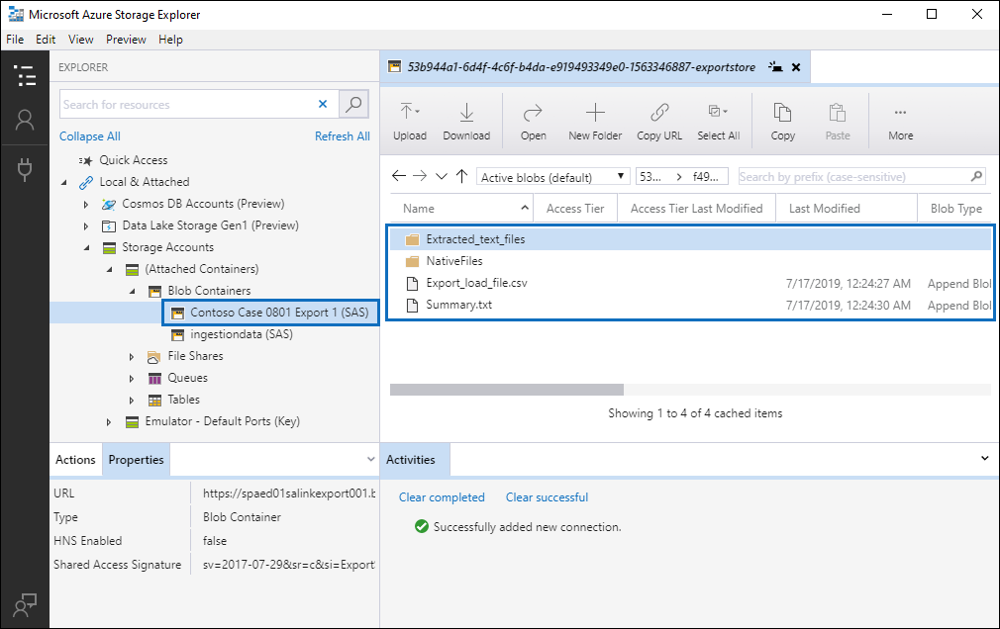

# エクスポート ジョブのダウンロード

高度な電子情報開示ケースのレビューセットからドキュメントをエクスポートすると、Microsoft が提供する Azure ストレージの場所または組織によって管理される Azure ストレージの場所にドキュメントがアップロードされます。 使用される Azure ストレージの場所の種類は、ドキュメントのエクスポート時に選択されたオプションによって異なります。 

この記事では、Microsoft Azure ストレージエクスプローラーを使用して、エクスポートされたドキュメントを参照およびダウンロードするために Azure ストレージの場所に接続する方法について説明します。 Azure ストレージエクスプローラーの詳細については、「[クイックスタート: Azure ストレージエクスプローラーを使用する](https://docs.microsoft.com/azure/storage/blobs/storage-quickstart-blobs-storage-explorer)」を参照してください。

## 手順 1: Azure ストレージエクスプローラーをインストールする

最初の手順として、Azure ストレージエクスプローラーをダウンロードしてインストールします。 手順については、「 [Azure ストレージエクスプローラーツール](https://go.microsoft.com/fwlink/p/?LinkId=544842)」を参照してください。 このツールを使用して、手順3でエクスポートされたドキュメントに接続し、ダウンロードします。

## 手順 2: エクスポートジョブから SAS URL を取得する

次の手順では、[レビューセットからドキュメントをエクスポート](export-documents-from-review-set.md)するエクスポートジョブを作成したときに生成される shared access SIGNATURE (SAS) URL を取得します。 Microsoft が提供する Azure ストレージの場所または組織によって管理される Azure ストレージの場所にアップロードされたドキュメントの SAS URL をコピーできます。 どちらの場合も、手順3で、SAS URL を使用して Azure ストレージの場所に接続します。

1. [**高度な電子情報開示**] ページで、ケースに移動して、[**エクスポート**] タブをクリックします。

2. [**エクスポート**] タブで、ダウンロードするエクスポートジョブをクリックします。

3. ポップアップページの [**場所**] で、表示されている SAS URL をコピーします。 必要に応じて、手順3でアクセスできるようにファイルに保存することができます。
 
   ![[場所] に表示されている SAS URL をコピーする](../media/eDiscoExportJob.png)

## 手順 3: Azure ストレージの場所に接続する

最後の手順として、Azure ストレージエクスプローラーと SAS URL を使用して Azure ストレージの場所に接続し、ローカルコンピューターにエクスポートしたドキュメントをダウンロードします。

1.  手順1でインストールした Azure ストレージエクスプローラーを開きます。

2. [**アカウントの追加**] アイコンをクリックします。 または、[**ストレージアカウント**] を右クリックします。

   ![[アカウントの追加] アイコンをクリックします。](../media/AzureStorageConnect.png)

3.  [ **Azure ストレージへの接続**] ページで、[**共有アクセス署名 (SAS) URI を使用**する] をクリックし、[**次へ**] をクリックします。

    ![[共有アクセス署名 (SAS) URI を使用する] をクリックし、[次へ] をクリックします。](../media/AzureStorageConnect2.png)

4.  [ **SAS uri に接続**する] ページで、[uri] ボックスをクリックし、手順2で取得した SAS URL を貼り付けます。 

    ![[URI] ボックスに SAS URL を貼り付けます。](../media/AzureStorageConnect3.png)

    SAS URL の一部が [**表示名**] ボックスに表示されることに注意してください。 これは、保存場所に接続した後、**ストレージアカウント**の下に作成されるコンテナーの表示名として使用されます。 この名前は、高度な電子情報開示ケースの ID と一意の識別子で構成されます。 既定の表示名をそのまま使用することも、それを変更することもできます。 この設定を変更する場合は、表示名を一意にする必要があります。

5.  **[次へ]** をクリックします。

    [**接続の概要**] ページが表示されます。
   
    ![[接続の概要] ページの [接続] をクリックして、Azure ストレージの場所に接続します。](../media/AzureStorageConnect4.png)

6. [**接続の概要**] ページで、接続情報を確認し、[**接続**] をクリックします。 

    **Blob コンテナ**ノード (**ストレージアカウント** > **(接続されたコンテナー)** \>が開きます。 

    

    これには、手順4の表示名を持つという名前のコンテナーが含まれています。 このコンテナーには、作成した各エクスポートジョブのフォルダーが含まれています。 これらのフォルダーには、エクスポートジョブの ID に対応する ID を使用して名前が付けられます。 これらのエクスポート Id (およびエクスポートの名前) は、[**ジョブ**] タブに表示されている**エクスポートジョブのデータを準備**するためのフライアウトページの [**サポート情報**] にあります。

7. [エクスポートジョブ] フォルダーをダブルクリックして開きます。

   フォルダーの一覧とレポートのエクスポートが表示されます。
   
    

   [エクスポートジョブ] フォルダーには以下のアイテムが含まれています。 エクスポートフォルダー内の実際のアイテムは、エクスポートジョブの作成時に構成されたエクスポートオプションによって決まります。 詳細については、「[レビューセットからドキュメントをエクスポートする](export-documents-from-review-set.md)」を参照してください。

    - Export_load_file csv: この CSV ファイルは、エクスポートされた各ドキュメントに関する情報を含む詳細エクスポートレポートです。 ファイルは、ドキュメントのメタデータプロパティごとに1つの列で構成されます。 このレポートに含まれているメタデータの一覧と説明については、「 [Advanced eDiscovery」の「ドキュメントメタデータフィールド](document-metadata-fields.md)の表」の「エクスポートされた**フィールド名**」列を参照してください。
    
    - Summary.txt: エクスポート統計情報を含むエクスポートの概要を含むテキストファイル。
    
    - Extracted_text_files: このフォルダーには、エクスポートされた各ドキュメントのテキストファイルバージョンが含まれています。
     
    - ファイル: このフォルダーには、エクスポートされた各ドキュメントのネイティブファイルバージョンが格納されます。
    
    - Error_files: エクスポートジョブにエラーファイルが含まれている場合、このフォルダーには以下のアイテムが含まれます。 
        
      - ExtractionError csv: この CSV ファイルには、親アイテムから正しく抽出されなかったファイルに使用可能なメタデータが含まれています。
        
      - ProcessingError: このフォルダーには、処理エラーが発生したドキュメントが含まれています。 このコンテンツはアイテムレベルで設定されています。これは、添付ファイルに処理エラーがあった場合に、添付ファイルを含むドキュメントがこのフォルダーにも含まれることを意味します。
 
8. エクスポートですべてのコンテンツをエクスポートするには、エクスポートフォルダーを選択し、[**ダウンロード**] をクリックします。

9. エクスポートされたファイルをダウンロードする場所を指定して、[フォルダーの選択] をクリックします。

    Azure ストレージエクスプローラーがエクスポートプロセスを開始します。 [**操作**] ウィンドウに、エクスポートされたアイテムのダウンロードの状態が表示されます。 ダウンロードが完了すると、メッセージが表示されます。

    

> [!NOTE]
> エクスポートジョブ全体をダウンロードするのではなく、特定のアイテムを選択してダウンロードすることができます。 アイテムをダウンロードするのではなく、アイテムをダブルクリックして表示することができます。
