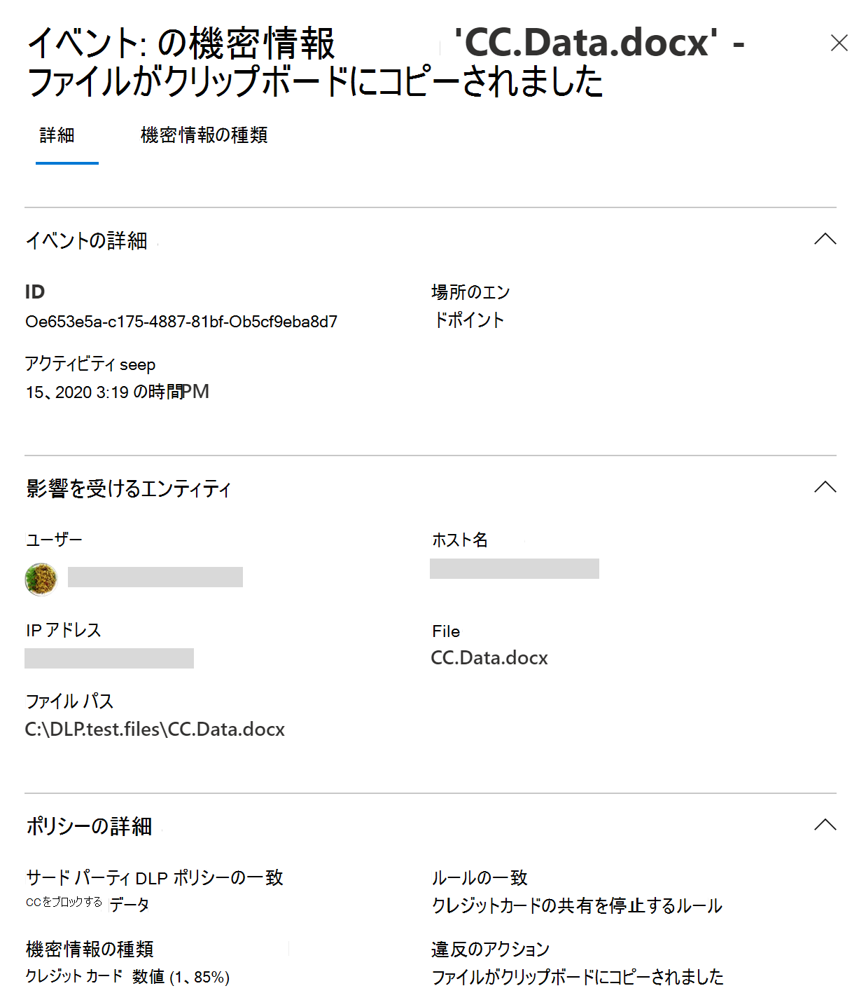

# Microsoft 365 のエンドポイントのデータ損失防止について説明する

Microsoft 365 のデータ損失防止 (DLP) を使用すると、機密があると判断されたアイテムに対して、発生しているアクションを監視し、それらのアイテムの意図しない共有を防ぐことができます。DLPの詳細については、[データ損失防止の概要](data-loss-prevention-policies.md)を参照してください。

**エンドポイントデータ損失防止** (エンドポイント DLP) は、DLP のアクティビティ監視および保護機能を Windows 10 デバイス上にある機密性の高いアイテムに拡張します。デバイスが、 Microsoft 365 コンプライアンス ソリューションに オンボードすると、機密アイテムを使用してユーザーが行っていることに関する情報が [Activity Explorer](data-classification-activity-explorer.md) に表示され、 [DLP ポリシー](create-test-tune-dlp-policy.md)を通して、それらのアイテムに保護アクションを適用できます。

## 監視と対処が必要なエンドポイントのアクティビティ

Microsoft エンドポイント DLP を使用すると、Windows 10 を実行しているデバイスでユーザーが機密アイテムに行っている次のようなアクティビティを監査および管理できます。これには、次のものが含まれます。

|アイテムのアクティビティ |監査可能/制限可能  |
|---------|---------|
|作成済み    | 監査可能      |
|名前の変更    |  監査可能       |
|リムーバブルメディアへのコピーと作成     |     監査可能/制限可能|
|\\my-server\fileshare などのネットワーク共有にコピーされます   |     監査可能/制限可能    |
|印刷済み |    監査可能/制限可能       |
|Chromium Edge 経由でクラウドにコピー    |   監査可能/制限可能        |
|許可されていないアプリによってアクセスされました    |  監査可能/制限可能       |

## エンドポイント DLP との違い

エンドポイント DLP を掘り下げる前に知っておく必要がある追加の概念がいくつかあります。

### デバイス管理を有効にする

デバイス管理は、デバイスからテレメトリを収集できる機能です。これは、エンドポイント DLP や [インサイダー リスク管理](insider-risk-management.md)などの Microsoft 365 のコンプライアンス ソリューションに導入する機能です。DLP ポリシーの場所として使用するすべてのデバイスをオンボードする必要があります。

> [!div class="mx-imgBorder"]
> 

オンボーディングとオフボーディングは、デバイス管理センターからダウンロードしたスクリプトを介して処理されます。 センターには、これらの展開方法ごとに次のようなカスタムスクリプトがあります。

- ローカルスクリプト (最大10台のマシン)
- グループ ポリシー
- System Center Configuration Manager （ バージョン 1610以降 ）
- Mobile Device Management/Microsoft Intune
- 非永続的コンピューター用の VDI オンボード スクリプト

> [!div class="mx-imgBorder"]
> 

 デバイスをオンボードするには、「[Microsoft 365 エンドポイント DLP の使用を開始する](endpoint-dlp-getting-started.md)」の手順を使用します。

[Microsoft Defender for Endpoint](https://docs.microsoft.com/windows/security/threat-protection/) を介してデバイスをオンボードした場合、それらのデバイスは自動的にデバイスの一覧に表示されます。

> [!div class="mx-imgBorder"]
> 

### エンドポイント DLP データの表示

 エンドポイント DLP は、MIME タイプに基づいてアクティビティを監視するため、ファイル拡張子が変更された場合でもアクティビティがキャプチャされます。 公開プレビューでは、以下のすべてを監視します。

- Word ファイル
- PowerPoint ファイル
- Excel ファイル
- PDF ファイル
- .csv ファイル
- .tsv ファイル
- .txt ファイル
- .rtf ファイル
- .c ファイル
- .class ファイル
- .cpp ファイル
- .cs ファイル
- .h ファイル
- .java ファイル

> [!NOTE]
> エンドポイント DLP は、上記すべての種類のファイルを DLP ポリシーに対して評価し、それに応じた保護アクションを適用します。DLP ポリシーに一致するすべてのファイルは、たとえブロックされていなくても、サポートされているすべてのアクションについて監査されます。さらに、Word、PowerPoint、Excel、PDF、.csv ファイルに対して実行されたファイル アクティビティについては、DLP ポリシーの存在やこれらのファイルとの一致に関係なく、既定で監査されます。

[DLP 警告管理ダッシュボード](dlp-configure-view-alerts-policies.md)に移動すると、エンドポイント デバイスに適用されている DLP ポリシーに関連する警告を表示できます。

同じダッシュボードで、リッチ メタデータに関連付けられたイベントの詳細を表示することもできます

デバイスを場所として持つ DLP ポリシーを構成して展開する前であっても、デバイスがオンボードされると、監査済みのアクティビティに関する情報がアクティビティ エクスプローラーに流入します。

> [!div class="mx-imgBorder"]
> 

エンドポイント DLP は、監査済みアクティビティに関する広範な情報を収集します。

たとえば、ファイルがリムーバブル USB メディアにコピーされた場合、アクティビティの詳細に次の属性が表示されます：

- アクティビティの種類
- クライアント IP
- 対象ファイルのパス
- 発生したタイムスタンプ
- ファイル名
- ユーザー
- ファイル拡張子
- ファイル サイズ
- 機密情報の種類（該当する場合）
- sha1 値
- sha256 値
- 以前のファイル名
- 場所
- 親
- FilePath
- ソースの場所の種類
- platform
- デバイス名
- 場所の宛先の種類
- コピーを実行したアプリケーション
- Microsoft Defender for Endpoint デバイス ID (該当する場合)
- リムーバブルメディアデバイスの製造元
- リムーバブルメディアデバイスのモデル
- リムーバブル メディア デバイスのシリアル番号

> [!div class="mx-imgBorder"]
> 

## 次の手順

エンドポイント DLP の概要を説明しました。次のステップは以下のとおりです。

1) [Microsoft エンドポイント データ損失防止を開始する](endpoint-dlp-getting-started.md)
2) [Microsoft エンドポイント データ損失防止を使用する](endpoint-dlp-using.md)

## 関連項目

- [Microsoft エンドポイント データ損失防止を開始する](endpoint-dlp-getting-started.md)
- [Microsoft エンドポイント データ損失防止を使用する](endpoint-dlp-using.md)
- [データ損失防止の概要](data-loss-prevention-policies.md)
- [DLP ポリシーの作成、テスト、調整](create-test-tune-dlp-policy.md)
- [Activity Explorer を使い始める](data-classification-activity-explorer.md)
- [Microsoft Defender for Endpoint](https://docs.microsoft.com/windows/security/threat-protection/)
- [インサイダー リスク管理](insider-risk-management.md)
