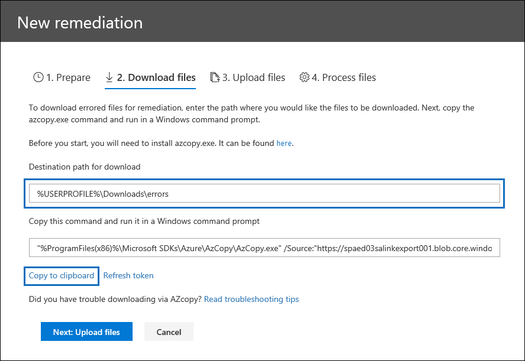
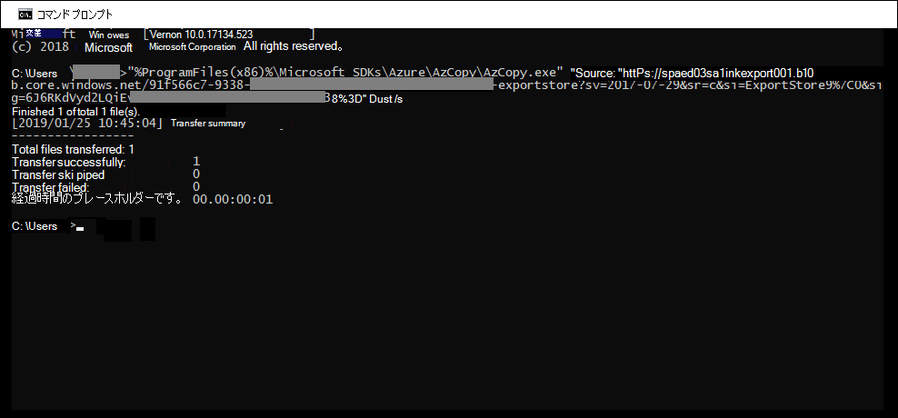

# 調査のためにデータを処理するときのエラー修復Error remediation when processing data for an investigation

エラー修復を使用すると、調査担当はデータ調査 (プレビュー) がコンテンツを適切に処理しないようなデータの問題を修正することができます。Error remediation allows investigators the ability to rectify data issues that prevent Data Investigations (Preview) from properly processing the content. たとえば、ファイルがロックまたは暗号化されているため、パスワードで保護されたファイルを処理することはできません。For example, files that are password protected cannot be processed since the files are locked or encrypted. エラー修復を使用する調査官は、このようなエラーのあるファイルをダウンロードし、パスワード保護を解除して、修復されたファイルをアップロードすることができます。Using error remediation, investigators can download files with such errors, remove the password protection, and upload the remediated files.

データ調査 (プレビュー) ケースでエラーが発生したファイルを修復するには、次のワークフローを使用します。Use the following workflow to remediate files with errors in Data Investigations (Preview) cases.

## 処理エラーが発生したファイルを修復するためのエラー修復セッションを作成するCreating an error remediation session to remediate files with processing errors

>[!NOTE]
>次の手順の途中でエラー修復ウィザードが閉じられた場合は、[**表示**] ドロップダウンメニューから [error **remediations** **] を**選択することにより、エラー修復セッションに戻ることができます。If the the error remediation wizard is closed at any time during the following procedure, you can return to the error remediation session from the **Processing** tab by selecting **Error remediations** in the **View** drop down menu.

1. データ調査の [**処理**] タブで、[**表示**] ドロップダウンメニューから [**エラー** ] を選択します。On the **Processing** tab in a data investigation, select **Errors** in the **View** dropdown menu.

2. エラーの種類またはファイルの種類の横にあるラジオボタンをクリックして、修復するエラーを選択します。Select the errors you want to remediate by clicking the radio button next to either the error type or file type.  次の例では、パスワードで保護されたファイルを修復しています。In the following example, we're remediating a password protected file.

3. [ **+ 新しいエラーの修復**] をクリックします。Click **+ New error remediation**.

    

    エラー修復セッションが開始され、エラーが発生しているファイルが、ダウンロード可能な Azure の安全な場所にコピーされる準備段階から開始されます。The error remediation session begins, starting with a preparation stage where the files with errors are copied to a secure Azure location so that they can be downloaded.

    

4. 準備が完了したら、[**次へ: ファイルのダウンロード**] をクリックして、ダウンロードを続行します。After the preparation is completed, click **Next: Download files** to proceed with download.

    

5. ファイルをダウンロードするには、**ダウンロード先のパス**を指定します。To download files, specify the **Destination path for download**. これは、ファイルをダウンロードするローカルコンピューター上のパスです。This is a path on your local computer where the file should be downloaded.  既定のパス%USERPROFILE%\Downloads\errors は、ログインしているユーザーの [ダウンロード] フォルダーを指します。必要に応じて変更できます。The default path, %USERPROFILE%\Downloads\errors, points to the logged-in user's downloads folder; this can be changed as needed.

    >[!NOTE]
    >最適なパフォーマンスを得るには、リモートネットワークパスの代わりにローカルファイルパスを使用することをお勧めします。We recommend that you use a local file path instead of a remote network path for optimal performance.

    > [!NOTE]
    > AzCopy をインストールしていない場合は、「 [azcopy の使用を開始](https://docs.microsoft.com/azure/storage/common/storage-use-azcopy)する」に移動してインストールします。If you haven't installed AzCopy, go to [Get started with AzCopy](https://docs.microsoft.com/azure/storage/common/storage-use-azcopy) to install it.

6. [**クリップボードにコピー] を**クリックして、定義済みのコマンドをコピーします。Copy the predefined command by clicking **Copy to clipboard**. Windows コマンドプロンプトを起動し、コマンドを貼り付けて、 **enter**キーを押します。Start a windows command prompt, paste the command, and then press **Enter**.  

    ファイルがダウンロードされます。The files will be downloaded.

    

    > [!NOTE]
    > このコマンドの実行に関する問題がある場合は、「 [Advanced eDiscovery での AzCopy のトラブルシューティング](troubleshooting-azcopy.md)」を参照してください。If you have issues running this command, see [Troubleshoot AzCopy in Advanced eDiscovery](troubleshooting-azcopy.md).

7. ファイルをダウンロードした後、適切なツールを使用して修復できます。After downloading the files, you can remediate them with an appropriate tool. パスワードで保護されたファイルでは、いくつかのパスワードクラッキングツールを使用できます。For password protected files, there are several password cracking tools you can use. ファイルのパスワードがわかっている場合は、それらを開いてパスワード保護を解除することができます。If you know the passwords for the files, you can open them and remove the password protection.
    
   > [!NOTE]
    > 修復されたファイルのディレクトリ構造とファイル名を保持することが重要です。It's important that you retain the directory structure and file names of the remediated files. ダウンロードしたファイルとフォルダーのパス名によって、修復済みのファイルを元のファイルに関連付けることができます。The path names of the downloaded files and folders make it possible to associate the remediated files with the original files.  ディレクトリ構造またはファイル名が変更されると、次のエラーが表示されます `Cannot apply Error Remediation to the current Evidenceset` 。If the directory structure or file names are changed, you'll receive the following error: `Cannot apply Error Remediation to the current Evidenceset`.

8. データの調査 (プレビュー) に戻り、[**次へ: ファイルのアップロード**] をクリックします。Now, return to Data Investigations (Preview) and click **Next: Upload files**.  これにより、次の手順に進み、ファイルをアップロードできるようになります。This will move to the next step where you can now upload the files.

    

9. [**ファイルの場所へのパス**] テキストボックスに修復したファイルの場所を指定し、[**クリップボードにコピー] を**クリックします。Specify the location of the remediated files in the **Path to location of files** text box, then click **Copy to clipboard**.

10. コマンドを Windows コマンドプロンプトに貼り付け、 **enter**キーを押してファイルをアップロードします。Paste the command into a Windows Command Prompt and press **Enter** to upload the files.

    

11. 最後に、データ調査 (プレビュー) に戻り、[**次へ: プロセスファイル**] をクリックします。Finally, return to Data Investigations (Preview) and click **Next: Process files**.

12. 処理が完了したとき。When processing is complete.  ワーキングセットに戻り、修復されたファイルを確認することができます。You can return to the working set and see the remediated file.

## ファイルが修復されたときの処理What happens when files are remediated

修復済みのファイルがアップロードされると、元のメタデータは次のフィールドを除いて保持されます。When remediated files are uploaded, the original metadata is preserved except for the following fields: 

- ExtractedTextSizeExtractedTextSize
- HasTextHasText
- IsErrorRemediateIsErrorRemediate
- LoadIdLoadId
- ProcessingErrorMessageProcessingErrorMessage
- ProcessingStatusProcessingStatus
- テキストText
- WordCountWordCount
- WorkingsetIdWorkingsetId

データ調査 (プレビュー) 内のすべてのドキュメントメタデータフィールドの定義については、「[ドキュメントメタデータフィールド](document-metadata-fields.md)」を参照してください。For a definition of all document metadata fields in Data Investigations (Preview), see [Document metadata fields](document-metadata-fields.md).
