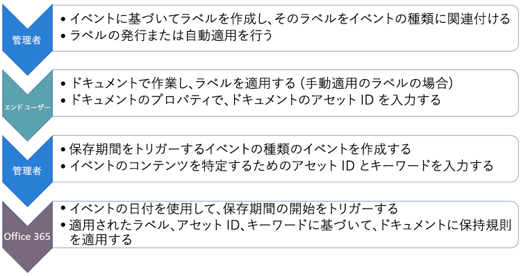

# イベント ベースの保持の概要

>*[セキュリティとコンプライアンスのための Microsoft 365 ライセンス ガイダンス](https://aka.ms/ComplianceSD)。*

When you retain content, the retention period is often based on the age of the content. For example, you might retain documents for seven years after they're created and then delete them. But when you configure [retention labels](labels.md), you can also base a retention period on when a specific type of event occurs. The event triggers the start of the retention period, and all content with a retention label applied for that type of event get the label's retention actions enforced on them.
  
イベントドリブンの保持を使用する場合の例:
  
- **従業員が組織を離れる場合**、従業員が組織を離れてから 10 年間は、その従業員のレコードを保持する必要があるとします。 10 年が経過した後、その従業員の採用、業績、および退職に関するすべてのドキュメントを廃棄する必要があります。 10 年の保持期間をトリガーするイベントは、組織を離れる従業員となります。 
    
- **契約満了の場合**、契約に関連するすべてのレコードは、契約満了後 5 年間は保持する必要があります。 5 年間の保持期間をトリガーするイベントは、契約の満了です。 
    
- **Product lifetime** Your organization might have retention requirements related to the last manufacturing date of products for content such as technical specifications. In this case, the last manufacturing date is the event that triggers the retention period. 
    
Event-driven retention is typically used as part of a records-management process. This means that:
  
- イベントに基づくラベルでは、通常、レコードとしてコンテンツを分類します。 詳細については、「[レコードの詳細](records.md)」を参照してください。
    
- レコードとして分類されているもののイベント トリガーがまだ発生していない文書は、イベントがそのドキュメントの保存期間をトリガーするまで無期限に保持されます (レコードを完全に削除することはできません)。
    
- イベントに基づく保持ラベルは、通常、保持期間の最後に廃棄レビューをトリガーするため、レコード管理者はコンテンツを手動で確認して廃棄できます。 詳細については、「[コンテンツの廃棄](disposition.md)」を参照してください。
    
イベントに基づく保持ラベルには、Microsoft 365 の他の保持ラベルと同じ機能があります。 詳細については、「[保持ラベルの詳細](labels.md)」を参照してください。

## イベントの種類、ラベル、イベント、アセット ID の関係を理解する

イベント ベースの保持を活用するには、図と以下の説明に示すように、イベントの種類、保持ラベル、イベント、アセット ID の関係を理解することが重要です。 
  

  

  
1. さまざまな種類のコンテンツの保持ラベルを作成してから、イベントの種類に関連付けます。 たとえば、さまざまな種類の製品ファイルとレコードの保持ラベルは、製品を使用しなくなった時点からレコードを 10 年間保持する必要があるため、Product Lifetime という名前のイベントの種類に関連付けられます。
    
2. ユーザー (通常はレコード管理者) はコンテンツにこれらの保持ラベルを適用し、(SharePoint と OneDrive のドキュメントの場合) アイテムごとに資産 ID を入力します。 この例では、資産 ID は組織で使用される製品名またはコードです。 したがって、各製品のレコードには保持ラベルが割り当てられ、各レコードには資産 ID を含むプロパティが含まれます。 この図は組織内のすべての製品レコードの**すべてのコンテンツ**を表しており、各アイテムにはそのレコードに該当する製品の資産 ID が含まれます。 
    
3. Product Lifetime is the event type; a specific product reaching end of life is an event. When an event of that event type occurs - in this case, when a product reaches its end of life - you create an event that specifies:
    
  - (SharePoint および OneDrive のドキュメントの) アセット ID。
    
  - Keywords (for Exchange items). In this example, the organization uses a product code in messages containing product records, so the keyword for Exchange items is the same as the asset ID for SharePoint and OneDrive documents.
    
  - The date when the event occurred. This date is used as the start of the retention period. This date can be the current, a past, or a future date.
    
4. イベントの作成後、イベントの日付は、そのイベントの種類の保持ラベルを持ち、指定された資産 ID またはキーワードを含むすべてのコンテンツに同期されます。 その他の保持ラベルと同様に、この同期には最大で 7 日間かかる可能性があります。 前の図では、赤で囲まれているアイテムはすべて、このイベントによって保持期間がトリガーされています。 言い換えれば、この製品の期限が切れたとき、そのイベントがその製品のレコードの保持期間のトリガーとなります。
    
イベントに資産 ID またはキーワードを指定しない場合、そのイベントの種類のラベルの付いた**すべてのコンテンツ**はイベントによってトリガーされる保持期間を持つことを理解することが重要です。 つまり、前の図の場合であれば、すべてのコンテンツの保持が開始されます。 これは、意図したものとは異なる可能性があります。 
  
最後に、それぞれの保持ラベルにはそれぞれの保持設定があることにご注意ください。 この例では、すべて 10 年間に指定されていますが、それぞれのラベルが異なる保持期間を持つ保持ラベルを、1 つのイベントでトリガーすることができます。
  
## イベント ドリブンの保持のセットアップ方法

イベント ドリブンの保持のワークフロー概要:
  

  
> [!TIP]
> SharePont の管理プロパティを使用して保持ラベルを自動適用し、イベント ドリブンの保持を実装する詳細なシナリオについては、「[保持ラベルを使用して SharePoint ドキュメントのライフサイクルを管理する](auto-apply-retention-labels-scenario.md)」を参照してください。

### 手順 1: 保持期間がイベントに基づくラベルを作成する

保持ラベルを作成して構成するには、[[保持ラベルを作成して構成する](create-retention-labels.md#create-and-configure-retention-labels)] の手順で [保持] をオンにして、イベントに基づいてコンテンツを保持または削除するオプションを選択します。 つまり、この設定では、保持設定は手順 5 の [**イベント**] ページでイベントを作成するまで有効になりません。 
  
通常、イベントドリブンの保持は、レコードとして分類されているコンテンツに使用されるので、コンテンツをレコードとしてマークするオプションも選択する必要があるかどうかを確認することをお勧めします。
  
イベントドリブンの保持には、次のような保持の設定が必要になります。
  
- コンテンツを保持する。
    
- 保存期間の終わりに、コンテンツの自動削除または廃棄レビューのトリガーを行う。
    

### 手順 2: そのラベルのイベントの種類を選択する

ラベルの設定で、**イベント**に基づいてラベルを設定するオプションを選ぶと、**[イベントの種類の選択]** というオプションが表示されます。 イベントの種類とは、ラベルを関連付けるイベントの単なる一般的な説明です。
  
たとえば、Product Lifetime という名前のイベントの種類を作成する場合は、"製品開発ファイル" や "製品の経営的意思決定" など、ラベルを適用するコンテンツの種類が分かるような名前でイベント ベースの保持ラベルを作成する必要があります。
  
イベントの種類を選択して保持ラベルを保存すると、イベントの種類の変更はできませんので、ご注意ください。
  

  
### 手順 3: イベント ベースの保持ラベルを発行または自動適用する

他の保持ラベルと同じように、イベント ベースのラベルを[発行または自動適用](create-retention-labels.md)する必要があります。したがって、このラベルはコンテンツに手動または自動で適用されます。

> [!NOTE]
> [**レコード管理**] > [**ファイル計画**] タブまたは [**データ ガバナンス**] > [**ラベル**] タブからイベント駆動型の保持ラベルを選択した場合、[**ラベルの自動適用**] ボタンは使用できません。
> 
> このボタンの代わりに、次のいずれかの場所からのラベルまたはポリシーのリストの上にある [**ラベルを自動適用**] オプションを使用します。
> - [**レコード管理**] > [**ラベル ポリシー**] タブ
> - [**データ ガバナンス**] > [**ラベル**] タブまたは [**ラベル ポリシー**] タブ

### 手順 4: アセット ID を入力する

After an event-driven label is applied to content, you can enter an asset ID for each item. For example, your organization might use:
  
- 特定の製品のみのコンテンツ保持に使用する製品コード。
    
- 特定の製品のみのコンテンツ保持に使用するプロジェクト コード。
    
- 特定の製品のみのコンテンツ保持に使用する従業員 ID。
    
アセット ID は、SharePoint と OneDrive の別のドキュメント プロパティです。 組織では既に別のドキュメント プロパティや ID を使用してコンテンツを分類している可能性があります。 その場合は、イベントの作成時にそれらのプロパティと値を使用することもできます (後述する手順 6 を参照してください)。 重要な点は、組織はドキュメント プロパティで property:value の組み合わせを使用して、そのアイテムをイベントの種類に関連付ける必要があるということです。
  

  
### 手順 5: イベントを作成する

製品の使用を終えるなど、イベントの種類に関する特定のインスタンスが発生するときは、Microsoft 365 コンプライアンス センターで **[レコード管理]** > **[イベント]** ページの順に移動し、イベントを作成します。 イベントを作成し、それを手動でトリガーする必要があります。
  
### 手順 6: 手順 2 でのラベルを使用したイベントの種類と同じものを選択する

イベントを作成するときには、手順 2 の保持ラベルで使用したものと同じイベントの種類 (Product Lifetime など) を選択します。 そのイベントの種類が選択されたイベントに適用されている保持ラベルの付いたコンテンツのみが、トリガーされる保持期間を持ちます。
  

  
### 手順 7: キーワードまたはアセット ID を入力する

Now you narrow the scope of the content by specifying asset IDs for SharePoint and OneDrive content or keywords for Exchange content. For asset IDs, retention will be enforced only on content with the specified property:value pair. If an asset ID is not entered, **all content** with labels of that event type get the same retention date applied to them. 
  
アセット ID は、SharePoint と OneDrive の別のドキュメント プロパティです。 アセット ID プロパティを使用する場合は、下に示されるアセット ID のボックスに 「`ComplianceAssetID:<value>`」 と入力します。
  
組織は、このイベントの種類に関するドキュメントに他のプロパティと ID を適用している場合があります。 たとえば、特定の製品のレコードを検出する必要がある場合、ID はカスタム プロパティ製品 ID とその値 "XYZ" の組み合わせである可能性があります。 この場合は、下に示されるアセット ID のボックスに 「`ProductID:XYZ`」 と入力します。
  
For Exchange items, you can include keywords. You can refine your query by using search operators like AND, OR, and NOT. For more information on operators, see [Keyword queries and search conditions for Content Search](keyword-queries-and-search-conditions.md).
  
最後に、イベントが発生した日付を選択します。この日付が、保持期間の開始日として使用されます。 イベントの作成後、そのイベントの日付は、そのイベントの種類の保持ラベル、資産 ID、キーワードを持つすべてのコンテンツに同期されます。 その他の保持ラベルと同様に、この同期には最大で 7 日間かかる可能性があります。
  
![[イベントの設定] ページ](../media/40d3c9db-f624-49a5-b38a-d16bcce20231.png)

> [!NOTE]
> イベントを作成すると、既にラベル付けされてインデックスが作成されているコンテンツの保持設定が有効になります。 イベントが作成された後に保持ラベルが新しいコンテンツに追加された場合は、同じ詳細を使用して新しいイベントを作成する必要があります。

イベントを削除しても、既にラベル付けされているコンテンツに対して現在有効になっている保持設定は取り消されません。 それを行うには、同じ詳細を使用して新しいイベントを作成しますが、日付は空白のままにします。 

## コンテンツ検索を使用して、特定のラベルまたはアセット ID が適用されたすべてのコンテンツを検索する

保持ラベルをコンテンツに割り当てた後は、特定の保持ラベルで分類されている、または特定のアセット ID を含むすべてのコンテンツをコンテンツ検索を使用して検索することができます。
  
- 特定の保持ラベルを持つすべてのコンテンツを検索するには、**[コンプライアンス ラベル]** の条件を選択した後、完全なラベル名を入力するか、ラベル名の一部を入力してワイルドカードを使用します。 
    
- 特定のアセット ID を持つすべてのコンテンツを検索するには、**ComplianceAssetID** プロパティと `ComplianceAssetID:<value>` のフォーマットを使用した値を入力します。 
    
詳細については、「[コンテンツ検索のキーワード クエリと検索条件](keyword-queries-and-search-conditions.md)」を参照してください。
  
## アクセス許可

To get access to the **Events** page, reviewers must be members of a role group with the **Disposition Management** role and the **View-Only Audit Logs** role. We recommend creating a new role group called Disposition Reviewers, adding these two roles to that role group, and then adding members to the role group. 
  
詳細については、「[ユーザーに Office 365 セキュリティ&amp;コンプライアンス センターへのアクセス権を付与する](../security/office-365-security/grant-access-to-the-security-and-compliance-center.md)」を参照してください。
  
## PowerShell を使用してイベントを自動化する

Microsoft 365 コンプライアンス センターでは、イベントを手動で作成することができますが、イベントが発生した場合、自動的にトリガーすることをサポートしていません。 ただし、Rest API を使用してイベントを自動的にトリガーすることはできます。 詳細については、「[イベント ベースの保持を自動化する](automate-event-driven-retention.md)」を参照してください。

PowerShellスクリプトを使用して、業務用アプリケーションからのイベント ベースの保持を自動化することもできます。 イベント ドリブンの保持で利用可能な PowerShell コマンドレットは、次のとおりです。
  
- [Get-ComplianceRetentionEventType](https://go.microsoft.com/fwlink/?linkid=873002)
    
- [New-ComplianceRetentionEventType](https://go.microsoft.com/fwlink/?linkid=873004)
    
- [Remove-ComplianceRetentionEventType](https://go.microsoft.com/fwlink/?linkid=873005)
    
- [Set-ComplianceRetentionEventType](https://go.microsoft.com/fwlink/?linkid=873006)
    
- [Get-ComplianceRetentionEvent](https://go.microsoft.com/fwlink/?linkid=873001)
    
- [New-ComplianceRetentionEvent](https://go.microsoft.com/fwlink/?linkid=873003)
    

